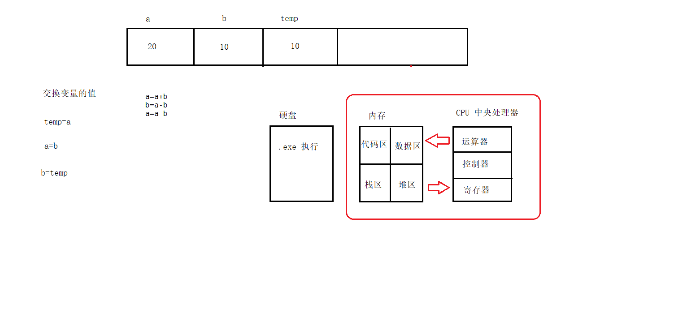
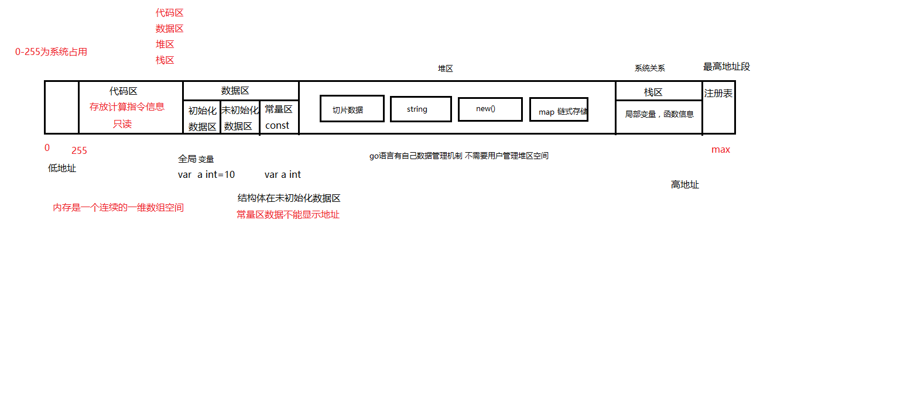
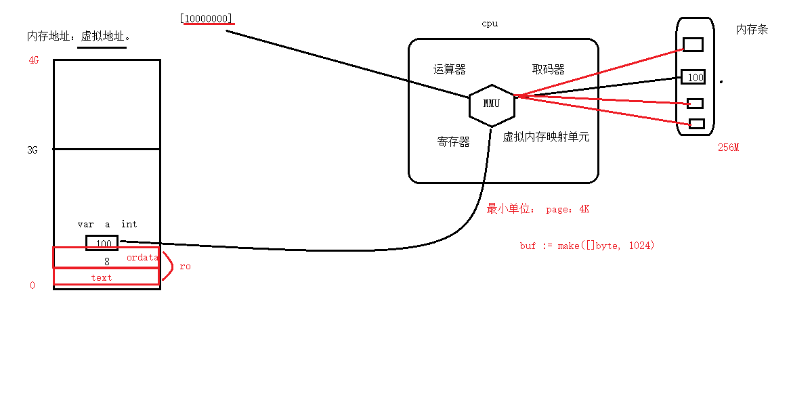
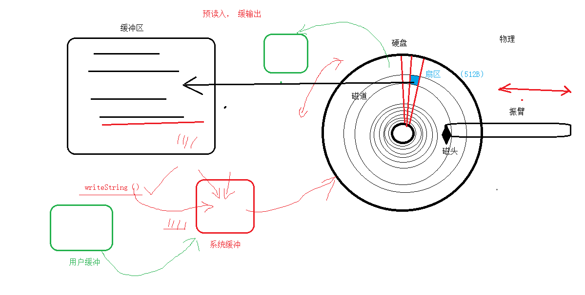
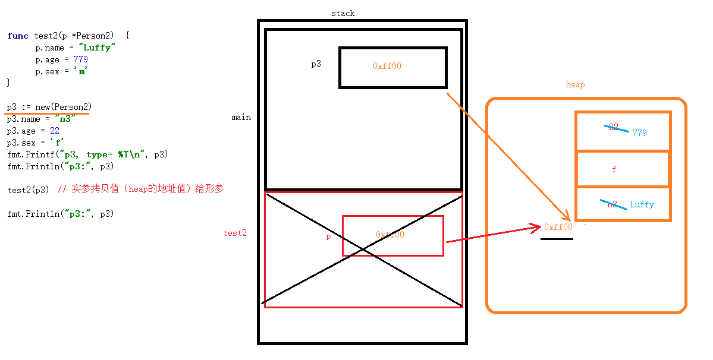
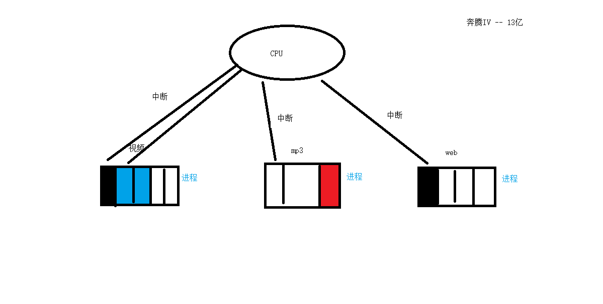
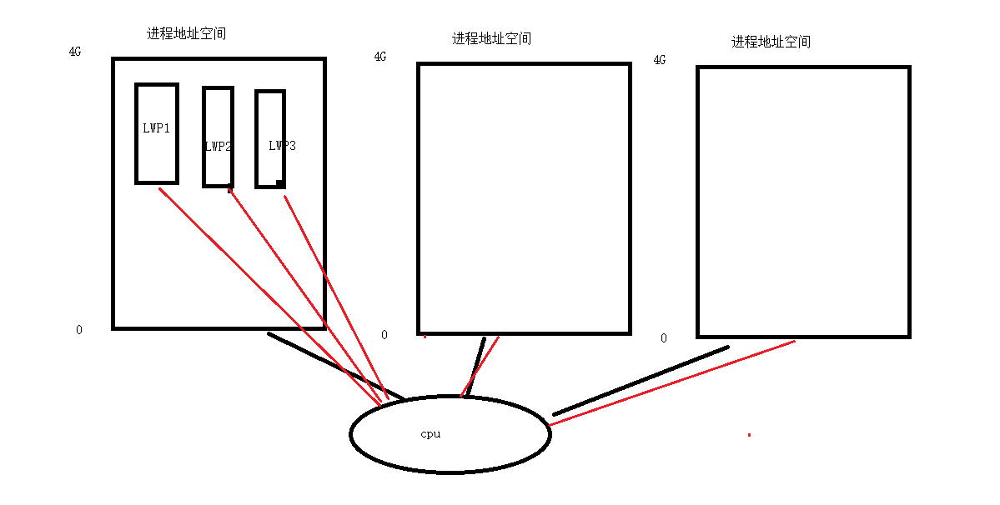
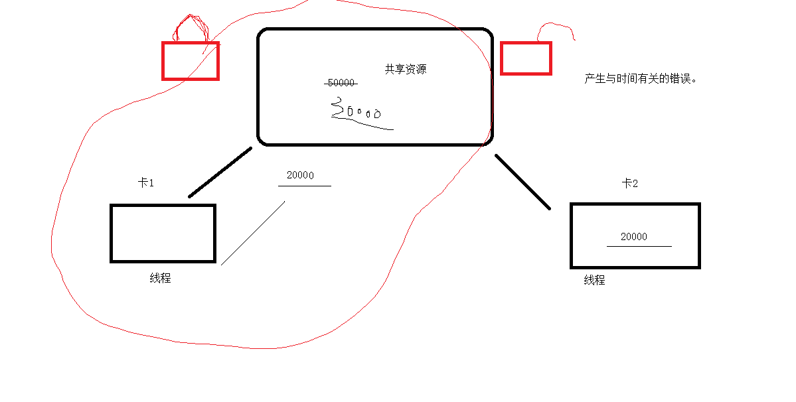
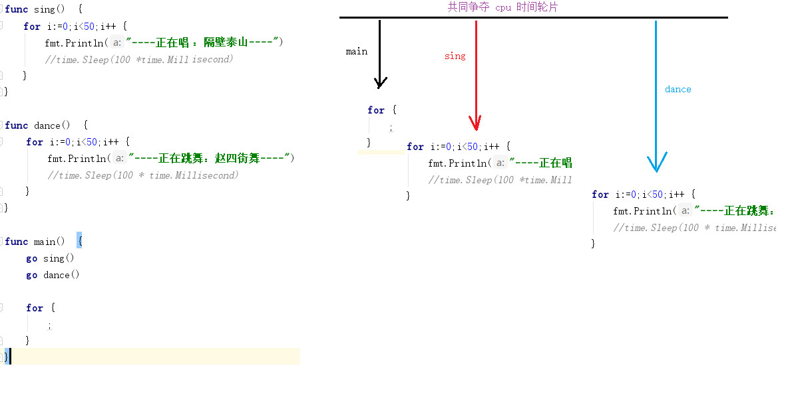

Golang 整理

```go
待查询
1.查询type实例化后的具体值，reflect
```

交换变量



内存模型图



fmt 打印格式

```go
%v 打印数据本身的值，
%+v  可以打印type的值
%c 打印字符类型数据  byte字节类型
%d 打印整型类型数据
%f 打印浮点型数据 fmt.printf("%f") 默认保留六位小数%.2f 保留两位小数 对第三位四舍五入
%s 打印字符串类型  %s 遇到\0停止，例如"hello\077world",只显式hello
%p 打印变量地址（指针类型）
%t 打印布尔类型数据
%T 打印变量的数据类型 a:=3.14 float64 a:=10 int a:='a'int32

%o 打印八进制整型数据
%% 打印一个%
%x %X 占位符 表示输出一个十六进制数据 a-f A-F
%b 占位符 表示输出一个二进制数据
%o 占位符 表示输出一个八进制数据

```

fmt.Scanf

```go
fmt.Scanf()可以按指定的格式输入
输入值，使用空格隔开
fmt.Scanln()的使用： 先声明需要的变量, 回车继续
```

枚举

```go
const(
    a=iota//0//静止
    b=iota//1//移动
    c=iota//2//普通攻击
    d=iota
)
//如果定义枚举是常量写在同一行值相同 换一行值加一
//在定义枚举时可以为其赋初始值 但是换行后不会根据值增长
const(
    a=10
    b,c=iota,iota
    d,e
)

```

变量基本：

```go
不同的数据类型不能进行计算 可以通过类型转换解决

float32默认小数位置保留7位有效数据  会在末尾+1操作
float64默认小数位置保留15位有效数据
var s1, s2 string
fmt.Scan(&s1, &s2) //从控制台获取变量值
回车接收结束
func main0505() {
	var name string
	var age byte
	fmt.Println("Name:")
	fmt.Scanln(&name)
	fmt.Println("Age:")
	fmt.Scanln(&age)
}
fmt.Scanf("%3d", &a)// fmt，3位数字，
fmt.Scanf("%s", &b)// fmt, 字符串
转义字符
'\n' 表示换行
'\\' 表示\
'\0' 表示字符串结束标志 ASCII 值为 0

常量
格式 const 常量名 数据类型=值 一般常量大写字母
常量的值在程序运行过程中其值不能发生改变
常在在内存中的数据区进行存储 变量是在内存中的栈区存储
系统为每一个应用程序分配了 1M 的内存空间存储变量和函数的信息

iota 枚举
枚举一般用作于程序的流程控制
const(
a=iota //0
b,c=iota,iota//1
d=20//2
)

运算符：
1、算数运算符
加【+】 减【-】乘【\*】 除【/】 两个相同类型的数据相除是得到的结果类型也相同 除数不能为 0
取余【%】 取余只能对整型操作 除数不能为 0
自增【++】自减【--】 go 语言中只有后自增后自减 不能参与表达式计算（二义性？？）

//不能将自增自减运用在表达式中
//b=a--//err

类型转换

不同类型转换 如果讲浮点型转成整型 会丢失精度 只会保留整数部分 不会四舍五入
同一类型转换 建议将低类型转成高类型 防止数据丢失 【高位溢出】
格式： 数据类型(变量) 数据类型(表达式)

赋值运算符：
加等于【+=】 减等于【-=】乘等于【\*=】除等于【/=】取余等于【%=】

比较运算符：
【>】【<】【>=】【<=】【==】【!=】
比较运算符返回值为 bool 类型 true false

逻辑运算符：
非【!】非真为假 非假为真
或【||】同假为假 其余为真
与【&&】同真为真 其余为假

其他运算符：
取地址【&】 对变量去地址是指针类型
取值运【\*】 对指针变量取值

运算符优先级：
//括号 （） 结构体成员. 数组下标[]

//单目运算符
//逻辑非! 取地址& 取值\* 自增++ 自减--

//双目运算符
//乘除 _ / %
//加减 + -
//关系 == != > >= < <=
//逻辑 || && 注意 逻辑与高于逻辑或
//赋值 = += -= _= /= %=

//if 可以嵌套 可以判断区间  执行效率比较低
//switch 执行效率高  不能嵌套和区间判断
switch中 fallthrough //让switch执行下一个分支的代码  如果不写 执行到这个分支后就会自动停止
```

运算符和流程控制

```go
在go语言中一个汉字算作3个字符 为了和linux统一处理
a:=123//十进制数据
b:=0123//八进制数据 以0开头的数据是八进制
c:=0xabc//十六进制  以0x开头的数据是十六进制
```

func

```go
不定参函数 函数参数类型为 ...数据类型
func test(args ...int) {}

for 和range 可以遍历 集合中的数据信息  数组  切片 结构体数组  map


返回值为主调函数赋值
func test5() (a int, b int, c int) {
	a, b, c = 1, 2, 3
	return
}
func main1002() {
	a, _, c := test5() //函数的返回值可以为主调函数赋值  可以通过返回值改变实参数据
}


类型
type funcdemo func(int, int) int //此时就是一个指针
var f2 funcdemo //函数名本身就是一个指针类型数据  在内存中代码区进行存储


变量名相同，就近原则使用
全局变量在内存中数据区存储 和const定义的常量存储位置都是数据区
```

```go
func test3(a ...int) {
	//如果函数参数为不定参  传递方式为a[0:]...
	test4(a[0:]...) // 第一个值(index==0)开始传，一直传到最后， ...表示不定参数
	test4(a[2:]...)// 从index==2开始传到最后
	test4(a[:2]...)//从0传到2
	test4(a[1:3]...) //从index==1传到index==3(不包含3)
}
```

```go
函数在调用结束会从内存中销毁
可以通过匿名函数和闭包 实现函数在栈区的本地化

匿名函数
	f:=func (a int , b int){
		fmt.Println(a+b)
	}
	f(20,30)

	2.
	f := func(a int, b int) int {
		return a + b
	}
	v := f(a, b)
```

```go
闭包

//可以通过匿名函数和闭包 实现函数在栈区的本地化
func test2() func() int {//返回func
	var a int
	return func() int {
		a++
		return a
	}
}
func main() {
	f := test2()
	for i := 0; i < 10; i++ {
		fmt.Println(f()) //延长了生命周期
	}
}
```

```go
递归函数
var sum int = 1
func test4(n int) {
	if n == 1 {
		return
	}
	test4(n - 1)
	sum *= n
}
func main() {
	test4(3)
	fmt.Println(sum)
}
```

###数组的定义和使用

```go
计算长度
	len(string) 获取字符串有效长度
	len(...int) 获取不定参函数参数个数
	len([10]int) 计算数组元素个数

	//使用自动类型推导 可以根据元素个数创建数组
	arr := [...]int{1, 2, 3}


	//数组名也可以表示数组的首地址
	fmt.Printf("%p\n", &arr) //0xc00000a360
	fmt.Printf("%p\n", &arr[0]) //0xc00000a360


	//指定数组下标进行初始化操作
	var arr [10]int = [10]int{1, 2, 3, 4, 5, 7: 10} //[1 2 3 4 5 0 0 10 0 0]
	//作为函数参数是值传递的。


```

```go
随机数, 不设置随机种子，每次运行结果都一样
rand.Intn(100)
rand.Int() //例如 8674665223082153551
rand.Float64()

设置基准后：
	rand.Seed(time.Now().UnixNano())
	fmt.Print(rand.Intn(100), ",") //每次都不一样
	fmt.Print(rand.Intn(100))

设置基准方法2：
s1 := rand.NewSource(time.Now().UnixNano())
r1 := rand.New(s1)
	fmt.Print(r1.Intn(100))

//计算时间区间
start := time.Now().Nanosecond()
end := time.Now().Nanosecond()

//随机数切片
fmt.Println(rand.Perm(5)) //[1 2 4 0 3]

```

```go
切片扩容, 切片截取

//不写元素个数叫切片 必须写元素个数的叫数组
//如果整体数据没有超过1024字节 每次扩展为上一次的倍数  超过1024 每次扩展上一次的1/4
//在切片打印时 只能打印有效长度中的数据 cap不能作为数组打印的条件

//切片名  本身就是地址
//一个字节在内存中占8bit（位）
//切片名[:]获取切片中所有元素
s:=[]int{1,2,3,4,5}
// 切片名[起始下标:]
slice:=s[2:]
// 切片名[:结束位置] 不包含结束位置
slice:=s[:2]
// 切片名[起始位置:结束位置]
slice:=s[2:5]
// 切片名[起始位置:结束位置:容量]
slice:=s[0:2:2]//大于等于len  小于等于cap  len <= xxx <= cap

```

```go
	//在使用append添加数据是 切片的地址可能或发生变量 如果容量扩充导致输出存储溢出 切片会自动找寻新的空间存储数据
	//同时也会将之前的数据进行释放
//所以,如果使用append操作切片可能改变切片的地址 需要使用返回值给实参赋值
s=append(s,4,5,6)

	//将s1切片中的数据拷贝到s2中 s2中要有足够的容量
	//使用拷贝操作后s1 s2是两个独立空间 不会相互影响
	//如果想拷贝具体的切片中的片段 需要使用切片中的截取
	s1:=[]int{1,2,3,4,5}
	s2:=make([]int,5)
	copy(s2,s1)

```

```go
重要:

切片作为函数参数是地址传递 形参可以改变实参的值
	s := []int{9, 1, 5, 6, 7, 3, 10, 2, 4, 8}
	BubbleSort(s)
	fmt.Println(s) //[1 2 3 4 5 6 7 8 9 10]
```

```go
Map通过函数传递是地址传递！
slice，map，chanel 三者都和 *T 一样，属于引用传递，虽然是发生了副本创建，但是函数内对参数的值进行修改会影响原来的值。
而数组不同于 slice，函数内对数组参数的值进行修改不会影响原来数组
函数也是一个指针类型，对函数对象的赋值只是又创建了一个对次函数对象的指针。

	m:=map[int]string{101:"刘备",102:"关羽",103:"张飞"}
	delete(m,101)
	_,ok:=m[101] //是否存在
	if ok{
		fmt.Println("key已存在")
	}else{
		m[101]="刘备"
	}

```

```go
结构体
通过结构体名  定义结构体变量

在结构体中使用== != 可以对结构体成员进行比较操作
结构体作为函数参数  值拷贝传递

p=new(int)//new 创建好的空间值为数据类型的指针

```

```go

可以通过直接使用指针[下标]操作数组元素
	var p *[5]int
	// p=&arr
	fmt.Println((*p)[0])
	//直接使用指针[下标]操作数组元素
	fmt.Println(p[0])

	len(指针变量)元素个数

```

```go

指针数组,切片

	//var arr [3]int ->int 普通数组
	//指针数组
	var arr [3]*int  //->*int
	a:=10
	b:=20
	c:=30
	arr[0]=&a
	arr[1]=&b
	arr[2]=&c
	fmt.Println(arr) //[0xc000014088 0xc0000140a0,0xc0000140a8]
	//fmt.Printf("%p\n",&a)//0xc000014088
	//通过指针数组改变变量的值
	*arr[1]=2
	//
	//fmt.Println(b)

	//变量指针数组对应的内存空间的值
	for i := 0; i < len(arr); i++ {
		fmt.Println(*arr[i]) // [ 10 ,2,30]
	}

```

```go
多级指针

a:=10
p:=&a
pp:=&p//二级指针  二级指针存储一级指针的地址
p3:=&pp//三级指针 存储二级指针的地址

//变量a 的值
fmt.Println(a)
fmt.Println(*p)
fmt.Println(**pp)
fmt.Println(***p3)

```

```go
Golang 面向对象
type person struct {
	name string
	age int
	sex string
}
//结构体嵌套结构体
type Student struct { //子类
	//通过匿名字段实现继承操作
	person //结构体名称作为结构体成员
	name  string
	id int
	score int
}

func main() {
	// 同字段采用就进原则 使用子类信息
	var stu Student = Student{person{"Unkown",190,"男"},101,100}//除非指明结构体名，否则不会进到内部。
	stu.name = "JakeZ" //使用的是子类信息
	stu.Person.name = "Person's name" //使用父类信息

}

同名字段，想访问父类元素，必须指明， stu.person.name
访问stu.name是子元素的name


type TestC struct {
	TestC//err 不能直接嵌套自己本身

	*TestC  ok 可以嵌套指针
	TestB
	score int
}


不同字段也是就近原则

	var s DemoC = DemoC{DemoA{"戈洛文", 7}, DemoB{17, "男"}, 6}
	fmt.Println(s.name) //戈洛文
	fmt.Println(s.DemoA.name) //戈洛文


```

```go
方法的定义和使用

//1、定义函数类型
//2、为已存在的数据类型起别名
type Int int //1、预处理 2、编译 3、汇编 4、链接
//func (方法接收者)方法名(参数列表)返回值类型
func (a Int)add(b Int)Int{
	return a+b
}


//1.值传递
func (s Stu) PrintInfo() { //Stu必须大写
	fmt.Println(s)
}

//2.地址传递
func (s *Stu) EditInfo(name string) {
}

子结构体继承父类结构体  允许使用父类结构体成员  允许使用父类的方法
func (p *person3) SayHello() {
}
stu.p.SayHello()
	stu.showScore()
```

```go
方法继承


func (p Person1) SayHello() {}
func (r Rep) SayHi() {r.p.SayHello()}
func (d Dep) SayHi() {d.SayHello()}
func main() {
	var r Rep = Rep{Person1{"A", 4, "male"}, "123"}
	var d Dep = Dep{Person1{"B", 6, "male"}, "456"}
	r.SayHi()
	d.SayHi()

}


方法重写

方法重写  在一个对象中"不能出现"相同的方法名  方法的接收者 带* 和不带* 表示一个相同的对象

如果有相同的名称
默认使用子类的方法  采用就进原则
	s.PrintInfo() //调用子类方法，就近原则
	s.person4.PrintInfo() 	//调用父类方法
```

```go
接口的定义和使用
1.接口定义了规则   方法实现了规则；接口是虚的    方法是实的

//格式 type  接口名  interface{方法列表}
//方法名（参数列表）（返回值列表）
2.方法 函数声明 没有具体实现  具体的实现要根据对象不同  实现方式也不同
接口中的方法必须有具体的实现


type Humaner interface {
	SayHello()
}

func main(){
	var stu student=student{person{"A","Male",18},100}
	var tea teacher=teacher{person{"B","Female",20},"math"}
	var h Humaner
	h=&stu // 给地址，才能操纵stu数据
	h.SayHello()
	h=&tea // 给地址，才能操纵stu数据
	h.SayHello()
}
```

```go
多态  =>多态是将接口类型作为函数参数  多态实现接口的统一处理
type Personer interface {
	SayHello()
	Write()
}
func (s *student1)Write(){}
func (s *student1)SayHello(){}
func (t *teacher1)Write(){}
func (t *teacher1)SayHello(){}
//多态是将接口类型作为函数参数  多态实现接口的统一处理
func SayHello(p Personer){
	p.SayHello()
	p.Write()
}

func main() {
	var p Personer
	p=&student1{person1{"A","1",1},100}
	SayHello(p)
	//===========
	p=&teacher1{person1{"B","1",2},"history"}
	SayHello(p)
}


```

```go
计算器的简单实现


type Father struct {
	num1 int
	num2 int
}
type Child struct {
	Father
}
type MinusClass struct {
	Father
}

type API interface {calculate()int}

func DuoTai(api API)(value int){value=api.calculate() return}
func (plus *Child)calculate() int{	return plus.num1+plus.num2}

func (minus *MinusClass)calculate()int{return minus.num1-minus.num2}

type Factory struct {

}
func (factory *Factory)result(num1 int,num2 int,symbol string)(value int){
	var api API
	switch symbol {
	case "+":
		var plus Child=Child{Father{num1,num2}}
		api=&plus
	case "-":
		var minus MinusClass=MinusClass{Father{num1,num2}}
		api=&minus
	}
	value=DuoTai(api)
	return
}
func main(){
	var factory Factory
	value:=factory.result(10,20,"-")
	fmt.Println(value)
}

```

```go
接口继承 超集

type Humaner interface { //子集
	SayHi()
}
type Personer interface { //超集
	Humaner //一组子集的集合
	Sing(string)
}
func (s *student3)SayHi(){}
func (s *student3)Sing(name string){}
	var h Humaner//子集
	h=&student3{"A",20,"Female"}
	h.SayHi()

	var p Personer//超集
	p=&student3{"B",18,"Female"}
	fmt.Printf("%s\n",p) //&{B %!s(int=18) Female}
	p.SayHi()
	p.Sing("Legends never die")

可以将超级转成子集  反过来不允许
	h=p    //ok
//p=h    //err
```

```go
空接口， 类型断言
//空接口  可以接收任意类型数据

v:=123
	if data,ok:=v.(int); ok{
			fmt.Println("Int value",data)
	}
```

```go
错误处理

errors.New("custom error message")
可以在程序中直接调用panic 调用后程序会终止执行
print 和println 是对错误信息进行处理的  不建议在程序中打印数据时使用，可以用Printf
```

```go
defer 调用
defer调用是在函数结束后，从后向前执行，出栈
	a := 10
	defer func(a int ) {
		fmt.Println(a)//10
	}(a)
	a = 100
	fmt.Println(a) //100


recover使用

recover只能在defer中使用
recover()使用一定要在错误出现之前 进行拦截
通过匿名函数和recover()进行错误拦截


var a *int  //声明一个指针类型， 但指向的地址是nil
*a=100 //错误，因为a是一个类型，没有地址指向
```

```go
recover使用

func demo(i int) {
	defer func() {
		//recover可以从panic 异常中重新获取控制权
		//recover()//返回值为接口类型
		err := recover()
		if err != nil {
			fmt.Println("demo函数异常：19-33行", err)
		}
	}()
	var p *int
	*p = 123 //指针错误 err  //recover作用范围
	fmt.Println(p)
	var arr [10]int
	// arr[i] = 100 //panic 系统处理  导致程序崩溃
	fmt.Println(arr)
}
func demo1() {
	fmt.Println("hello world")
}
func main() {
	demo(11)
	demo1()
}
```

```go
文件操作


1.创建文件

//1、不关闭会占用内存和缓冲区
//2、不关闭时，文件多了会有文件打开上限  65535
func main() {
	fp, err := os.Create("E:/Go practice/Golang Jake/code/a.txt")
	defer fp.Close()//关闭文件
	if err != nil {
		fmt.Println("文件创建失败")
		return //如果return出现在主函数中 表示程序的结束
	}
	fmt.Println("文件创建成功")

2.写入字符串
\n在文件中是换行  window文本文件换行是\r\n , 一个汉字是3个字符

	n, _ := fp.WriteString("Hi Jake\r\n")
	fmt.Println(n) // 文本的长度， length
	fp.WriteString("Happy Holiday.")

3.写入字符切片
	str := "好天气"//字符串和字符切片允许转换
	b := []byte(str)
	fp.Write(b)
}

```

```go
打开文件

	//os.Open(文件名)是以只读方式打开文件
	//openfile不能创建新文件
	//os.openfile(文件名，打开模式，打开权限)
	fp, err := os.OpenFile("E:/Go practice/Golang Jake/code/a.txt", os.O_RDWR, 6)
	if err != nil {
		fmt.Println("Failed to create file")
		return
	}
	defer fp.Close()


	//通过字符串获取字符切片
	//b:=[]byte("你瞅啥")
	//当使用writeat 进行指定位置插入数据时会依次覆盖源内容----危险
	//fp.WriteAt(b,0)
	//获取文件字符个数
	// n, _ := fp.Seek(0, io.SeekEnd) //保存文件大小会有差分，因为windows操作方法和go不一样
	n, _ := fp.Seek(3, io.SeekStart)
	//负数是向左偏移 正数是向右偏移
	// n, _ := fp.Seek(-3, io.SeekEnd)
	//b:=[]byte("abcd")
	//fp.WriteAt(b,n)
	fmt.Println(n)
```

```go
文件拷贝

	//文件拷贝  从一个文件中拷贝数据到新的文件中
	fp1, err1 := os.Open("E:/Go practice/Golang Jake/code/a.txt")
	fp2, err2 := os.Create("E:/Go practice/Golang Jake/code/copy.txt")
	if err1 != nil || err2 != nil {
		fmt.Println("Failed to copy this file")
		return
	}
	defer fp1.Close()
	defer fp2.Close()
	b := make([]byte, 1024*1024) // 1kb * 1024 = 1MB
	for {
		n, err := fp1.Read(b) //块读取    1MB 1MB拷贝
		if err == io.EOF { //结束符
			break
		}
		fp2.Write(b[:n])
	}
	fmt.Println("Complete copy.")

```

```go
读取文件
全部操作见:
https://colobu.com/2016/10/12/go-file-operations/#%E8%AF%BB%E5%8F%96%E5%85%A8%E9%83%A8%E5%AD%97%E8%8A%82

	fp, err := os.Open("E:/Go practice/Golang Jake/code/a.txt")
	if err != nil {
		fmt.Println("文件打开失败")
		return
	}
	defer fp.Close()

	1.只收特定长度的bytes.
	b := make([]byte, 100)
	//换行也会作为字符一部分进行读取,占用bytes
	fp.Read(b)

	2.buffer接收
	//创建切片缓冲区
	r := bufio.NewReader(fp)
	//读取一行内容
	b, _ := r.ReadBytes('\n') //读取到\n结束，windows中是\r\n结束
	//打印切片中字符的ASCII值
	//fmt.Println(b)
	//将切片转成string打印  汉字
	fmt.Print(string(b))
	//如果在文件截取中  没有标志位（分隔符）到文件末尾自动停止  EOF -1 文件结束标志


	3.读取每行
	for {
		b, err := r.ReadBytes('\n')

		fmt.Print(string(b))
		if err == io.EOF {
			break
		}
	}

	3.读取全部数据

	data, err := ioutil.ReadAll(fp)
  if err != nil {
        log.Fatal(err)
  }


	b := make([]byte, 20)
	for {
		//读取文件返回值为 个数和错误信息
		n, err := fp.Read(b)
		//io.EOF 表示文件的结尾 值为-1
		//eof  end of file
		if err == io.EOF {
			break
		}

		fmt.Print(string(b[:n]))
		//最后一次如果只有一个字符，也会按make的长度补充。 所以一般最好直接写到n
	}


```

```go
字符串处理
是否存在：
isExist := strings.Contains(str, "hellworld")

拼接
s := []string{"1234", "3867", "9017", "1859"}
//将一个字符串切片 拼接成一个字符串
str := strings.Join(s, "-")


查找index
	//在一个字符串中查找另外一个字符串是否出现  返回值为整型  如果找到具体下标  找不到是-1
	i := strings.Index(str, "赵香炉")

重复

	//将一个字符串重复n次  n取值范围大于等于0
	s := strings.Repeat(str, 0)

替换
str := "Hello world"
//屏蔽关键字
s := strings.Replace(str, " ", ",entire ", -1) //小于0表示全部替换，

fmt.Println(s)//Hello,entire world


字符串切割
	str := "1234-3867-9017-1859"
	s := strings.Split(str, "-")//[1234 3867 9017 1859]


去掉前后内容

	str := "====hello======world===="
	s := strings.Trim(str, "=") //hello======world

获取有效内容，删除空格
str := "    are  u   ok  ?     "
//去掉字符串中的空格  并返回有效数据切片
s := strings.Fields(str) //[are u ok ?]

字符串按 空格拆分
ret = strings.Fields(str)
	for _, s := range ret {
		fmt.Println(s)
}

判断字符串结束标记
	// flg := strings.HasSuffix("test.abc", ".mp3") //false
	flg := strings.HasSuffix("test.abc", ".abc") //true


判断字符串起始标记
	flg = strings.HasPrefix("test.abc", "tes.") //false
	flg = strings.HasPrefix("test.abc", "test.") //true


其他类型转换成string

s:=strconv.FormatBool(false)
//formatInt(数据，进制) 二进制  八进制  十进制 十六进
s:=strconv.FormatInt(123,10)//10进制
s := strconv.Itoa(123456) //直接转换成十进制，将整型转成字符串
//formatfloat(数据,'f'，保留小数位置（谁四舍五入）,位数（64 32）)
s := strconv.FormatFloat(1.155, 'f', 2, 64)


string转为其他
str:="true"
//只能将"flase" "true" 转成bool类型 有多余的数据 是无效的
b,err:=strconv.ParseBool(str)

str:="1234"
value,_:=strconv.ParseInt(str,10,64)

value,_:=strconv.Atoi(str) //将字符串转成十进制整型

value,_:=strconv.ParseFloat(str,64)
//fmt.Println(value)


往[]byte里添加新值

b := make([]byte, 0, 1024)
//将bool类型放在指定切片中
b = strconv.AppendBool(b, false)
b = strconv.AppendInt(b, 123, 10)
b = strconv.AppendFloat(b, 1.234, 'f', 5, 64)
b = strconv.AppendQuote(b, "hello")
fmt.Println(string(b)) //false1231.23400"hello"
```

```go
语法加强

指针：

指针就是地址。 指针变量就是存储地址的变量。
*p ： 解引用、间接引用。

栈帧：	用来给函数运行提供内存空间。 取内存于 stack 上。
当函数调用时，产生栈帧。函数调用结束，释放栈帧。

栈帧存储：
1. 局部变量。
2. 形参。 （形参与局部变量存储地位等同）
3. 内存字段描述值

指针使用注意：
空指针：未被初始化的指针。	var p *int		*p --> err
野指针：被一片无效的地址空间初始化。


格式化输出：
%q： 以Go语言格式显示字符串。 默认带有""符
%v： 显示对应数据详细信息

变量存储：

等号 左边的变量，代表 变量所指向的内存空间。	（写）
等号 右边的变量，代表 变量内存空间存储的数据值。	（读）

指针的函数传参（传引用）。

传地址（引用）：将形参的地址值作为函数参数传递。
传值（数据据）：将实参的 值 拷贝一份给形参。
传引用：	在A栈帧内部，修改B栈帧中的变量值。


切片：

为什么用切片：
1. 数组的容量固定，不能自动拓展。
2. 值传递。 数组作为函数参数时，将整个数组值拷贝一份给形参。

在Go语言当，我们几乎可以在所有的场景中，使用 切片替换数组使用。

切片的本质：

不是一个数组的指针，是一种数据结构体，用来操作数组内部元素
type slice struct {
*p
len
cap
}
数组和切片定义区别：
	创建数组时 [ ] 指定数组长度。
	创建切片时， [] 为空，或者 ...

切片名称 [ low : high : max ]

low: 起始下标位置
high：结束下标位置	len = high - low
容量：cap = max - low

截取数组，初始化 切片时，没有指定切片容量时， 切片容量跟随原数组（切片）

	s[:high:max] : 从 0 开始，到 high结束。（不包含）
	s[low:] :	从low 开始，到 末尾
	s[: high]:	从 0 开始，到 high结束。容量跟随原先容量。【常用】

arr := [10]int{1, 2, 3, 4, 5, 6, 7, 8, 9, 10}
s := arr[2:5:5]					// {3， 4, 5} cap=5-1=4

切片创建：

1. 自动推导类型创建 切片。slice := []int {1, 2, 4, 6}
2. slice := make([]int, 长度，容量)
3. slice := make([]int, 长度）
//创建切片时，没有指定容量， 容量== 长度。【常用】

切片做函数参数 —— 传引用。（传地址）
append：在切片末尾追加元素
append(切片对象， 待追加元素）
向切片增加元素时，切片的容量会自动增长。1024 以下时，一两倍方式增长。

copy：
copy（目标位置切片， 源切片）
拷贝过程中，直接对应位置拷贝。

map：

字典、映射  	key —— value	key： 唯一、无序。 不能是引用类型数据。
	map 不能使用 cap()
创建方式：
1.  var m1 map[int]string		--- 不能存储数据
2. m2 := map[int]string{}		---能存储数据
3. m3 := make(map[int]string)		---默认len = 0
4. m4 := make(map[int]string, 10)

初始化：
1. var m map[int]string = map[int]string{ 1: "aaa", 2:"bbb"}	保证key彼此不重复。
2. m := map[int]string{ 1: "aaa", 2:"bbb"}

赋值:

赋值过程中，如果新map元素的key与原map元素key 相同 	——> 覆盖（替换）
赋值过程中，如果新map元素的key与原map元素key 不同	——> 添加

map的使用：
遍历map：
	for  key值， value值 := range map {
	}
	for  key值 := range map {
	}

判断map中key是否存在。

		map[下标] 运算：返回两个值， 第一个表 value 的值，如果value不存在。 nil
		第二个表 key是否存在的bool类型。存在 true， 不存在false

删除map：

delete()函数： 	参1： 待删除元素的map	参2： key值
delete（map， key）	删除一个不存在的key ， 不会报错。
map 做函数参数和返回值，传引用。

```

```go
有利于垃圾回收的删除方法
func remove(data []int, idx int) []int {
	copy(data[idx:], data[idx+1:]) //复制删除项后面的所有元素
	return data[:len(data)-1]      //深度克隆，返回
}
```

```go
结构体：
是一种数据 类型。
    type Person struct {		—— 类型定义 （地位等价于 int byte bool string ....） 通常放在全局位置。
    	name string
    	sex  byte
    	age int
    }

普通变量定义和初始化：
    1. 顺序初始化: 依次将结构体内部所欲成员初始化。
    	var man Person = Person{"andy"， 'm',  20}

    2. 指定成员初始化：
    	man := Person{name:"rose", age:18}		---- 未初始化的成员变量，取该数据类型对应的默认值

普通变量的赋值和使用：
    使用“.”索引成员变量。
    	var man3 Person
    	man3.name = "mike"
    	man3.sex = 'm'
    	man3.age = 99

结构体变量的比较：
    1. 比较： 只能使用 == 和 != 	不能 > < >= <=...

    2. 相同结构体类型（成员变量的类型、个数、顺序一致）变量之间可以直接赋值。

结构体地址：
    结构体变量的地址 == 结构体首个元素的地址。

结构体传参：
unSafe.Sizeof(变量名) ——> 此种类型的变量所占用的内存空间大小

将结构体变量的值拷贝一份，传递。 —— 几乎不用。 内存消耗大，效率低。

指针变量定义和初始化：
1. 顺序初始化: 依次将结构体内部所欲成员初始化。
var man *Person = &Person{"andy"， 'm',  20}
2. new(Person)
    	p := new(Person)
    	p.name = "name"
    	p.age = 10


指针索引成员变变量：
    使用“.”索引成员变量。
    	var man3 Person
    	man3.name = "mike"
    	man3.sex = 'm'
    	man3.age = 99

结构体地址：
    结构体指针变量的值 == 结构体首个元素的地址。

结构体指针传参：
unSafe.Sizeof(指针) ： 不管何种类型的指针，在 64 位操作系统下，大小一致。均为 8 字节！！！
将结构体变量地址值，传递（传引用）。 —— 使用频率非常高！！！

练习：
定义一个结构体，包含成员 string、int、bool、[]string.

在main函数中定义结构体 “普通变量”， 不初始化。 封装函数 initFunc， 在该函数内初始化 ， main 函数中打印查看。

结构体指针做函数返回值：

不能返回局部变量的地址。—— 局部变量保存栈帧上，函数调用结束后，栈帧释放。局部变量的地址，不再受系统保护，随时可能分配给其他程序。

可以返回局部变量的值。

字符串处理函数：
1. 字符串按 指定分割符拆分： Split
ret := strings.Split(str, " I")

2. 字符串按 空格拆分： Fields
ret = strings.Fields(str)

3. 判断字符串结束标记 HasSuffix
flg := strings.HasSuffix("test.abc", ".mp3")

4. 判断字符串起始标记 HasPrefix
flg := strings.HasPrefix("test.abc", "tes.")

打开、创建文件：

    1. 创建文件  Create： 	文件不存在创建， 文件存在，将文件内容清空。
    	参数：name， 打开文件的路径： 绝对路径、相对路径		目录分割符：/

	  2. 打开文件 Open：		以只读方式打开文件。文件不存在，打开失败。
    	参数：name， 打开文件的路径： 绝对路径、相对路径

    3. 打开文件 OpenFile：	以只读、只写、读写 方式打开文件。文件不存在，打开失败。
    	参1：name， 打开文件的路径： 绝对路径、相对路径
    	参2：打开文件权限： O_RDONLY、O_WRONLY、O_RDWR
    	参3：一般传 6

写文件：

    按字符串写：WriteString（）	--> n个写入的字符个数

    	n, err := f.WriteString("123")
    	回车换行：	windows： \r\n	Linux: \n

    按位置写:
    	Seek(): 	修改文件的读写指针位置。
    	参1： 偏移量。 正：向文件尾偏， 负：向文件头偏
    	参2： 偏移起始位置：
    		io.SeekStart: 文件起始位置
    		io.SeekCurrent： 文件当前位置
    		io.SeekEnd: 文件结尾位置

    	返回值：表示从文件起始位置，到当前文件读写指针位置的偏移量。
    	off, _ := f.Seek(-5, io.SeekEnd)

	  按字节写：
    	writeAt():  在文件制定偏移位置，写入 []byte ,  通常搭配 Seek()
    	参1： 待写入的数据
    	参2：偏移量
    	返回：实际写出的字节数。
    	n, _ = f.WriteAt([]byte("1111"), off)

读文件：
按行读
1）. 创建一个带有缓冲区的 Reader（读写器）
    		reader : = bufio.NewReader(打开的文件指针)
2）.  从reader的缓冲区中 ，读取指定长度的数据。数据长度取决于 参数 dlime
    		buf, err := reader.ReadBytes( ' \n' )  	按行读。
    		判断到达文件结尾： if err != nil && err == io.EOF  到文件结尾。
    		文件结束标记，是要单独读一次获取到的。

    缓冲区：内存中的一块区域，用来减少物理磁盘访问操作。

按字节读、写文件。
    read([]byte):  按字节读文件
    write([]byte)：按字节字节

目录操作：

    打开目录： OpenFile
    打开目录 OpenFile：	以只读方式打开目录。

    	参1：name， 打开目录的路径： 绝对路径、相对路径
    	参2：打开目录权限： O_RDONLY
    	参3：os.ModeDir
    	返回值： 返回一个可以读目录的 文件指针。

    读目录：Readdir
    	原型：func (f *File) Readdir(n int) ([]FileInfo, error) {
    	参数: 欲打开的目录项个数。 -1 ， 表所有
    	返回值：  FileInfo ：
			type FileInfo interface {
				Name() string       		// base name of the file
				Size() int64        		// length in bytes for regular files; system-dependent for others
				Mode() FileMode     		// file mode bits
				ModTime() time.Time 	// modification time
				IsDir() bool        		// abbreviation for Mode().IsDir()
				Sys() interface{}   		// underlying data source (can return nil)
			}
```

```go
	fmt.Println("请输入待查询的目录：")
	var path string
	fmt.Scan(&path)
	// 打开目录
	f, err := os.OpenFile(path, os.O_WRONLY, os.ModeDir)
	if err != nil {
		fmt.Println("OpenFile err: ", err)
		return
	}
	defer f.Close()
	// 读取目录项
	info, err := f.Readdir(-1) // -1： 读取目录中所有目录项
	if err != nil {
		fmt.Println("Readdir err: ", err)
		return
	}
	// 变量返回的切片
	for _, fileInfo := range info {
		if fileInfo.IsDir() { // 是目录
			fmt.Println(fileInfo.Name(), " 是一个目录")
		} else {
			fmt.Println(fileInfo.Name(), " 是一个文件")
		}
	}
		// 变量返回的切片
	for _, fileInfo := range info {
		if !fileInfo.IsDir() { // 文件
			if strings.HasSuffix(fileInfo.Name(), ".mp3") {
				fmt.Println("mp3 文件有：", fileInfo.Name())
			}
		}
	}
```

MMU



缓冲区



结构体指针传参



##并发编程 与 goroutine

```go


1S = 1000ms
1ms = 1000us
1us = 1000ns

并行： 借助多核 cpu 实现。 （真 并行）
并发：
宏观：用户体验上，程序在并行执行。
    微观：多个计划任务，顺序执行。在飞快的切换。轮换使用 cpu 时间轮片。 		【假 并行】
进程并发：
程序：编译成功得到的二进制文件。 占用 磁盘空间。 死的 1 1

    进程：运行起来程序。 占用系统资源。（内存）		活的	N	1

进程状态：
初始态、就绪态、运行态、挂起（阻塞）态、终止（停止）态。

线程并发：
    线程：LWP 轻量级的 进程。最小的执行单位。 —— cpu分配时间轮片的对象。
    进程： 最小的系统资源分配单位。

同步：
协同步调。规划先后顺序。

    线程同步机制：
    	互斥锁（互斥量）：	建议锁。 拿到锁以后，才能访问数据，没有拿到锁的线程，阻塞等待。等到拿锁的线程释放锁。

    	读写锁：一把锁（读属性、写属性）。 写独占，读共享。 写锁优先级高。
提高程序执行的效率。

总结：
进程、线程、协程 都可以完成并发。
    进程 稳定性强
    线程 节省资源
    协程 效率高。

创建 Goroutine 程
    创建于进程中。 直接使用 go 关键，放置于 函数调用前面，产生一个 go程。 并发。

Goroutine 的特性：【重点】!!!!
主 go 程结束，子 go 程随之退出。

runtime.Gosched()：
    出让当前go程所占用的 cpu时间片。当再次获得cpu时，从出让位置恢复往下执行。
    —— 时间片轮转调度算法。

runtime.Goexit()：
    return：	返回当前函数调用到调用者那里去。 return之前的 defer 注册生效。
    Goexit():   结束调用该函数的当前go程。Goexit():之前注册的 defer都生效。

runtime.GOMAXPROCS():
		设置当前 进程使用的最大cpu核数。

	n = runtime.GOMAXPROCS(2)  //将cpu设置为 双核
n := runtime.GOMAXPROCS(0) //将cpu设置为 单核，肯定就只能顺序执行了，go声明也得按照顺序来执行


返回 上一次调用成功的设置值。 首次调用返回默认值。

【补充知识点】：

    每当有一个进程启动时，系统会自动打开三个文件： 标准输入、标准输出、标准错误。 —— 对应三个文件： stdin、stdout、stderr

stdin 键盘鼠标输入
stdout 屏幕输出
stderr 屏幕错误
当进行运行结束。操作系统自动关闭三个文件。

channel：
是一种数据类型。 对应一个“管道”（通道 FIFO）

    channel的定义：
    	make (chan  在channel中传递的数据类型， 容量)	容量= 0： 无缓冲channel， 容量 > 0 ：有缓冲channel
    	e.g.：无缓冲 make（chan int） 或 make （chan string , 0）

    channel有两个端：
    	一端：写端（传入端）    chan <-
    	另一端： 读端（传出端）<- chan
    	要求：读端和写端必须同时满足条件，才在channel上进行数据流动。否则，则阻塞。
```

并行



进程与线程



线程并发访问共享内存



go 程并发



```go
练习

统计置顶目录中love的个数

// 从一个文件中逐行读取内容，统计该文件共有多少个 love
func readFile(fileName string) int  {
	fp, err := os.Open(fileName)
	if err !=nil{
		fmt.Println("Open err：", err)
		return -1
	}
	defer fp.Close()

	row := bufio.NewReader(fp)	// 创建一个reader
	var total int = 0			// 统计 Love 总数的变量

	for {	// 循环 按行读取文件内容，存入buf中
		buf, err :=row.ReadBytes('\n')
		if err != nil && err == io.EOF {
			break
		}
		// 交给 wordCount 统计每行中 love 出现的次数。累加各行 love 数
		total += wordCount(string(buf[:]))
	}
	return total
}

// 从一行字符串中获取 love 出现的次数。将该次数返回。
func wordCount(s string) int {
	arr := strings.Fields(s)			// 分割字符串,存入字符数组
	m := make(map[string]int)			// 创建map

	// 对arr中的每个单词进行循环，存入map中，统计
	for i:= 0; i<len(arr); i++ {
		m[arr[i]]++
	}
	// 统计 map 中一共有多少个 "Love"
	for k, v := range m {
		if k == "love" {
			fmt.Printf("%s : %d\n", k, v)
			return m[k]			// 返回 Love 出现的次数
		}
	}
	return 0		// 没有Love， 返回 0
}

func main()  {
/*	// 测试从文件读一行
	oneFilenum := readFile("C:/itcast/test2/test.txt")
	fmt.Printf("一个文件中有：%d 个Love\n", oneFilenum)

	writeString
*/

	fmt.Println("请输入要找寻的目录：")
	var path string
	fmt.Scan(&path)						// 获取用户指定的目录名

	dir, _ := os.OpenFile(path, os.O_RDONLY, os.ModeDir)	// 只读打开该目录
	defer dir.Close()

	names, _ := dir.Readdir(-1)		// 读取当前目录下所有的文件名和目录名，存入names切片

	var AllLove int = 0
	for _, name := range names {		// 遍历切片，获取文件/目录名
		if !name.IsDir() {
			s := name.Name()			// 文件名不包含路径。
			if strings.HasSuffix(s,".txt") {
				AllLove += readFile(path + s)		// 拼接有路径的文件名（绝对路径）
			}
		}
	}
	fmt.Printf("目录所有文件中共有 %d 个Love\n", AllLove)
}


```

```go
Gossched, Goexit使用
func test() {
	defer fmt.Println("C") //目的是为了进程结束的时候进行资源回收
	// return//打印出 C B A
	runtime.Goexit() // 退出当前go程。 只会打印出C A
	defer fmt.Println("D")
}

func main() {

	go func() {
		defer fmt.Println("A")
		test()
		fmt.Println("B") // test退出了，所以不会被打印
	}()
	for {

	} //C A
}


```

```go
go程通信与 channel
定义 channel：make（chan 类型，容量）

    ch :=  make （chan string）:

    写端：	 ch <- "hehe"	。写端写数据，读端不在读(不在线)。写端阻塞

    读端：	str := <- ch	。读端读数据， 同时写端不在写(不在线)，读端阻塞。

channel 同步，数据传递：

    写端：	 ch <- "hehe"	。写端写数据，读端不在读。阻塞

    读端：	str := <- ch	。读端读数据， 同时写端不在写，读端阻塞。

    len(ch) ： channel 中剩余未读取数据个数。 cap（ch）： 通道的容量。

无缓冲 channel： —— 同步通信

    创建： ch := make(chan int)  或 make(chan int, 0)

    通道容量为0， len = 0 。 不能存储数据。

    channel 应用于 两个go程中。	一个读，另一个写。  完成数据的单向流动

    具备同步的能力。  读、写同步。（打电话）

有缓冲 channel：—— 异步通信

    创建： ch := make(chan int, 5)

    通道容量为非0。len(ch) ： channel 中剩余未读取数据个数。 cap（ch）： 通道的容量。

    channel 应用于 两个go程中。一个读，另一个写。

    缓冲区可以进行数据存储。存储至 容量上限，阻塞。 具备 异步 能力，不需同时操作channel缓冲区（发短信）

关闭 channel： 无、有缓冲
确定不再相对端发送、接收数据。关闭 channel。 使用 close(ch) 关闭 channel
对端可以判断 channel 是否关闭：

    	if num， ok := <-ch ;  ok == true {

    	如果对端已经关闭， ok --> false . num无数据。

    	如果对端没有关闭， ok --> true . num保存读到的数据。

    可以使用 range 替代 ok：

    	for num := range ch {		// ch 不能替换为 <-ch
    	}

    总结：	1. 数据不发送完，不应该关闭。

    	2. 已经关闭的channel， 不能再向其写数据。 报错：panic: send on closed channel

    	3. 写端已经关闭channel， 可以从中读取数据。

    				读无缓冲channel： 读到0 。 —— 说明：写端关闭。

    				读有缓冲channel： 如果缓冲区内有数据，先读数据。读完数据后，可以继续读。 读到 0时候就可以认定为关闭了

单向 channel：

    默认的channel 是双向的。 var ch chan int		ch = make(chan int)

    单向写channel:	var  sendCh chan <-	 int 或者	sendCh = make(chan <- int)	不能读操作

    单向读channel:	var  readCh  <- chan int	或者 readCh = make(<-chan int)

    转换：
    	1. 双向channel 可以 隐式转换为 任意一种单向channel

    		sendCh  = ch

    	2. 单向 channel 不能转换为 双向 channel

    		ch = sendCh/recvCh   error！！！

    传参： 传【引用】

生产者消费者模型：

    生产者： 发送数据端

    消费者： 接收数据端

    缓冲区： 	1. 解耦 （ 降低生产者 和 消费者之间 耦合度 ）

    	       2. 并发 （生产者消费者数量不对等时，能保持正常通信）

    	       3. 缓存 （生产者和消费者 数据处理速度不一致时， 暂存数据）

    模型代码实现。---- 模拟订单代码实现。 参阅讲义

定时器：

    Timer：创建定时器，指定定时时长，定时到达后。 系统会自动向定时器的成员 C 写 系统当前时间。 （对 chan 的写操作）

    type Timer struct {
    C <-chan Time
    r runtimeTimer
    }
    sleep()
    NewTimer
    After

    读取 Timer.C 得到 定时后的系统时间。并且完成一次  chan 的 读操作。

    time.After() 定时：

    	指定定时时长，定时到达后。 系统会自动向定时器的成员 写入 系统当前时间。

    	返回 可读 chan 。 读取，可获得系统写入时间。

    总结： Sleep、NewTimer、After —— time包

    定时器的 停止、重置：

    	1） 创建定时器 myTimer := time.NewTimer(2 * time.Second)

    	2)   停止： myTimer.Stop	—— 将定时器归零。    <-myTimer.C 会阻塞

    	3） 重置：myTimer.Reset(time.Second)

周期定时：

        type Ticker struct {
    C <-chan Time
    r runtimeTimer
        }
    1） 创建周期定时器 myTicker := time.NewTicker(time.Second)

    	定时时长到达后，系统会自动向 Ticker 的 C 中写入 系统当前时间。

    	并且，每隔一个定时时长后，循环写入 系统当前时间。

    2） 在 子 go 程中循环读取 C。获取系统写入的时间。

select：
作用： 用来监听 channel 上的数据流动方向。 读？写？

    用法： 参考 switch case 语句。 但！case后面必须是IO操作，不可以任意写判别表达式。

    注意事项：
    	1. 监听的case中，没有满足监听条件，阻塞。

    	2. 监听的case中，有多个满足监听条件，任选一个执行。

    	3. 可以使用default来处理所有case都不满足监听条件的状况。 通常不用（会产生忙轮询）

    	4. select 自身不带有循环机制，需借助外层 for 来循环监听

    	5. break 只能跳出 select中的一个case选项 。类似于switch中的用法。但并不会终止外层for循环。

select 实现 fibonacci 数列：

    1  1  2  3  5  8  13  21  34  55   89
    x = y
    y = x+y


```

```go
channel
	ch := make(chan int) //无缓冲
	ch := make(chan int, 5) // 存满5个元素之前，不会阻塞
	go func() {
		for i := 0; i < 5; i++ {
			fmt.Println("子go程， i=", i)
			ch <- i // ch <- 0， 得等有地方读channel后才能继续下一轮循环， 但主go程一直在sleep，sleep完成后main已经可以打印num值了，所以主go程先显示
		}
	}()
	// 争夺cpu时间是随机的。可以用Time.sleep加以控制
	//time.Sleep(time.Second * 2)
	for i := 0; i < 5; i++ {
		num := <-ch
		fmt.Println("主go程读：", num)
	}
/*
不加time.sleep
子go程， i= 0
子go程， i= 1
主go程读： 0
主go程读： 1
子go程， i= 2
子go程， i= 3
主go程读： 2
主go程读： 3
子go程， i= 4
主go程读： 4
*/
因为IO操作是有延迟的，所以打印不一定会按照顺序显示。 IO耗时严重(访问硬件)

```

```go
关闭channel
	close(ch) // 写端，写完数据主动关闭channel


	ch := make(chan int)

	go func() {
		for i := 0; i < 8; i++ {
			ch <- i
		}
		close(ch) // 写端，写完数据主动关闭channel
		//ch <- 790
	}()

	for {
		if num, ok := <-ch; ok == true {
			fmt.Println("读到数据：", num)
		} else {
			n := <-ch
			fmt.Println("关闭后：", n) //已关闭，读出来就是0
			break
		}
	}

```

```go
Go channel详解
https://colobu.com/2016/04/14/Golang-Channels/


双向channel
	ch := make(chan int) // 双向channel
	var sendCh chan<- int = ch //写channel
	sendCh <- 789

	var readCh <-chan int = ch //读channel
	num := <-readCh

```

```go
模拟订单

type OrderInfo struct { // 创建结构体类型OrderInfo，只有一个id 成员
	id int
}

func producer2(out chan<- OrderInfo) { // 生成订单——生产者
	for i := 0; i < 10; i++ { // 循环生成10份订单
		order := OrderInfo{id: i + 1}
		out <- order // 写入channel
	}
	close(out) // 写完，关闭channel
}

func consumer2(in <-chan OrderInfo) { // 处理订单——消费者

	for order := range in { // 从channel 取出订单
		fmt.Println("订单id为：", order.id) // 模拟处理订单
	}
}

func main() {
	ch := make(chan OrderInfo) // 定义一个双向 channel， 指定数据类型为OrderInfo,同步执行
	go producer2(ch)           // 建新协程，传只写channel
	consumer2(ch)              // 主协程，传只读channel
}


```

```go
操作定时器

time.Sleep(time.Second) //sleep一秒


3种定时器方法

// 1 . sleep
time.Sleep(time.Second)

// 2. Timer.C
myTimer := time.NewTimer(time.Second * 2) // 创建定时器， 指定定时时长
nowTime := <-myTimer.C                    // 定时满，系统自动写入系统时间
fmt.Println("更新后时间：", nowTime)//必须读取或打印channel的值，不读的话会一致阻塞

// 3 time.After
fmt.Println("当前时间：", time.Now())
nowTime2 := <-time.After(time.Second * 2) //直接返回一个channel
fmt.Println("更新后时间：", nowTime2)


```

```go
周期定时

func main() {

	quit := make(chan bool) // 创建一个判断是否 终止的channel

	fmt.Println("now:    ", time.Now())
	myTicker := time.NewTicker(time.Second) // 定义一个周期定时器

	i := 0
	go func() {
		for {
			nowTime := <-myTicker.C //每隔一段时间系统会重写值，会被重新调用
			i++
			fmt.Println("nowTime:", nowTime)
			if i == 3 {
				quit <- true // 解除 主go程阻塞。
				break        // break或者 return 或者 runtime.Goexit 都可以退出当前go程
			}
		}
	}()

	<-quit // 子go程 循环获取 <-myTicker.C 期间，一直阻塞
}

/*
now:     2021-07-17 11:42:19.9260293 -0400 EDT m=+0.002109001
nowTime: 2021-07-17 11:42:20.9464828 -0400 EDT m=+1.022562501
nowTime: 2021-07-17 11:42:21.9420892 -0400 EDT m=+2.018168901
nowTime: 2021-07-17 11:42:22.9502165 -0400 EDT m=+3.026296201

*/


```

```go
select 基本使用

//  select有比较多的限制，其中最大的一条限制就是每个case语句里必须是一个IO操作
func main() {
	ch := make(chan int)    // 用来进行数据通信的 channel
	quit := make(chan bool) // 用来判断是否退出的 channel
	//ch2 := make(chan string)
	go func() { // 写数据
		for i := 0; i < 5; i++ {
			ch <- i
			time.Sleep(time.Second)
		}
		close(ch)
		quit <- true     // 通知主go程 退出
		runtime.Goexit() //此处直接exit或者return
	}()
	for { // 主go程 select 监听 chan数据流动
		select {
		case num := <-ch: // 不可读，阻塞。可以读，将数据保存至num
			fmt.Println("读到：", num) // 模拟使用数据

		case <-quit: // 不可读，阻塞。可以读，将主go程结束。
			break // break 不能跳出 select
			//runtime.Goexit()	// 终止 主 go 程		不可用
			//return 				// 终止进程
		}
		fmt.Println("============") // select 自身不带有循环机制，需借助外层 for 来循环监听
	}
}

```

```go
select实现fibonacci数组

func fibonacci(ch <-chan int, quit <-chan bool) {
	for {
		select {
		case num := <-ch:
			fmt.Print(num, " ")
		case <-quit:
			//return
			runtime.Goexit() //等效于 return
		}
	}
}

func main() {
	ch := make(chan int)
	quit := make(chan bool)

	go fibonacci(ch, quit) // 子go 程 打印fibonacci数列

	x, y := 1, 1
	for i := 0; i < 20; i++ {
		ch <- x
		x, y = y, x+y
	}
	quit <- true
}


```
