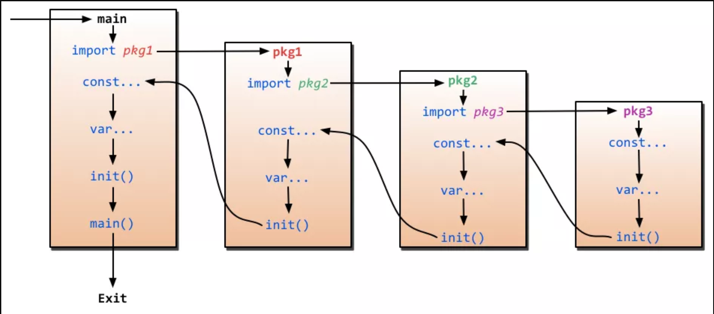

## 1. 下面这段代码输出的内容：

```go
package main

import "fmt"

func main() {
    defer_call()
}

func defer_call()  {
    defer func() {fmt.Println("打印前")}()
    defer func() {fmt.Println("打印中")}()
    defer func() {fmt.Println("打印后")}()

    panic("触发异常")
}
```

**答：输出内容为：**

```shell
打印后
打印中
打印前
panic: 触发异常
```

**解析：**
`defer` 的执行顺序是先进后出。出现panic语句的时候，会先按照 `defer` 的后进先出顺序执行，最后才会执行panic。

## 2. 下面这段代码输出什么，说明原因。

```go
package main

import "fmt"

func main() {
    slice := []int{0, 1, 2, 3}
    m := make(map[int]*int)

    for key, val := range slice {
        m[key] = &val
    }

    for k, v := range m {
    fmt.Println(k, "->", *v)
    }
}
```

**答：输出内容为：**

```shell
// 注：key的顺序无法确定
0 -> 3
1 -> 3
2 -> 3
3 -> 3
```

**解析：**

`for range` 循环的时候会创建每个元素的副本，而不是每个元素的引用，所以 `m[key] = &val` 取的都是变量val的地址，所以最后 `map` 中的所有元素的值都是变量 `val` 的地址，因为最后 `val` 被赋值为3，所有输出的都是3。

## 3. 下面两段代码输出什么？

```go
// 1.
func main() {
    s := make([]int, 5)
    s = append(s, 1, 2, 3)
    fmt.Println(s)
}

// 2.
func main() {
    s := make([]int, 0)
    s = append(s, 1, 2, 3, 4)
    fmt.Println(s)
}
```

**答：输出内容为：**

```shell
// 1.
[0 0 0 0 0 1 2 3]

// 2.
[1 2 3 4]
```

**解析：**

使用 `append` 向 `slice` 中添加元素，第一题中slice容量为5，所以补5个0，第二题为0，所以不需要。

## 4. 下面这段代码有什么缺陷？

```go
func funcMui(x, y int) (sum int, error) {
    return x + y, nil
}
```

**答：第二个返回值没有命名**

**解析：**

在函数有多个返回值时，只要有一个返回值有命名，其他的也必须命名。如果有多个返回值必须加上括号();如果只有一个返回值且命名也需要加上括号()。这里的第一个返回值有命名sum，第二个没有命名，所以错误。

## 5. new() 与 make() 的区别

**解析：**

- `new(T)`  和 `make(T, args)`  是Go语言内建函数，用来分配内存，但适用的类型不用。
- `new(T)` 会为了 `T` 类型的新值分配已置零的内存空间，并返回地址（指针），即类型为 `*T` 的值。换句话说就是，返回一个指针，该指针指向新分配的、类型为 `T` 的零值。适用于值类型，如 `数组` 、 `结构体` 等。
- `make(T, args)` 返回初始化之后的T类型的值，也不是指针 `*T` ，是经过初始化之后的T的引用。 `make()` 只适用于 `slice` 、 `map` 和 `channel` 。

## 6. 下面这段代码能否通过编译，不能的话原因是什么；如果能，输出什么？

```go
func main() {
    list := new([]int)
    list = append(list, 1)
    fmt.Println(list)
}
```

**答：不能通过**

**解析：**

不能通过编译， `new([]int)` 之后的 `list` 是一个 `*int[]` 类型的指针，不能对指针执行 `append` 操作。可以使用 `make()` 初始化之后再用。同样的， `map` 和 `channel` 建议使用 `make()` 或字面量的方式初始化，不要用 `new` 。 

## 7. 下面这段代码能否通过编译，不能的话原因是什么；如果可以，输出什么？

```go
func main() {
    s1 := []int{1, 2, 3}
    s2 := []int{4, 5}
    s1 = append(s1, s2)
    fmt.Println(s1)
}
```

**答：不能通过**

**解析：**

`append()` 的第二个参数不能直接使用 `slice` ，需使用 `...` 操作符，将一个切片追加到另一个切片上： `append(s1, s2...)` 。或者直接跟上元素，形如： `append(s1, 1, 2, 3)`  。

## 8. 下面这段代码能否通过编译，如果可以，输出什么？

```go
var (
    size := 1024
    max_size = size * 2
)

func main() {
    fmt.Println(size, max_size)
}
```

**答：不能通过**

**解析：**

这道题的主要知识点是变量的简短模式，形如：x := 100 。但这种声明方式有限制：

1. 必须使用显示初始化；
1. 不能提供数据类型，编译器会自动推导；
1. 只能在函数内部使用简短模式；

## 9. 下面这段代码能否通过编译？不能的话，原因是什么？如果通过，输出什么？

```go
func main() {
    sn1 := struct {
        age  int
        name string
	}{age: 11, name: "qq"}
	sn2 := struct {
        age  int
        name string
	}{age: 11, name: "11"}

    if sn1 == sn2 {
        fmt.Println("sn1 == sn2")
    }

    sm1 := struct {
        age int
        m   map[string]string
    }{age: 11, m: map[string]string{"a": "1"}}
    sm2 := struct {
        age int
        m   map[string]string
    }{age: 11, m: map[string]string{"a": "1"}}

    if sm1 == sm2 {
        fmt.Println("sm1 == sm2")
    }
}
```

**答：不能通过,invalid operation: sm1 == sm2**

**解析：**

考点是结构体的比较，有几个需要注意的地方：

1. 结构体只能比较是否相等，但是不能比较大小；
1. 想同类型的结构体才能进行比较，结构体是否相同不但与属性类型有关，还与属性顺序相关；
1. 如果struct的所有成员都可以比较，则该struct就可以通过==或!=进行比较是否相同，比较时逐个项进行比较，如果每一项都相等，则两个结构体才相等，否则不相等；

**那有什么是可以比较的呢？**

- 常见的有bool、数值型、字符、指针、数组等

**不能比较的有**

- slice、map、函数

## 10. 通过指针变量p访问其成员变量name,有哪几种方式？

- A. p.name
- B. (&p).name
- C. (*p).name
- D. p->name

**答：A C**

**解析：**

`&` 取址运算符， `*` 指针解引用

## 11. 下面这段代码能否通过编译？如果通过，输出什么？

```go
package main

import "fmt"

type MyInt1 int
type MyInt2 = int

func main() {
    var i int = 0
    var i1 MyInt1 = i
    var i2 MyInt2 = i
    fmt.Println(i1, i2)
}
```

**答：不能通过**

**解析：**

这道题考的是 `类型别名` 与 `类型定义` 的区别
第5行代码是基于类型 `int` 创建了新类型 `MyInt1` ，第6行代码是创建了int的类型别名 `MyInt2` ，注意类型别名的定义是 `=` 。所以，第10行代码相当于是将int类型的变量赋值给MyInt1类型的变量，Go是强类型语言，编译当然不通过；而MyInt2只是int的别名，本质上还是int，可以赋值。
第10行代码的赋值可以使用强制类型转换 `var i1 MyInt1 = MyInt1(i)` 

## 12. 以下代码输出什么？

```go
func main() {
    a := []int{7, 8, 9}
    fmt.Printf("%+v\n", a)
    ap(a)
    fmt.Printf("%+v\n", a)
    app(a)
    fmt.Printf("%+v\n", a)
}

func ap(a []int) {
    a = append(a, 10)
}

func app(a []int) {
    a[0] = 1
}
```

**答：输出内容为：**

```shell
[7 8 9]
[7 8 9]
[1 8 9]
```

**解析：**

因为append导致底层数组重新分配内存了，append中的a这个alice的底层数组和外面不是一个，并没有改变外面的。

## 13. 关于字符串连接，下面语法正确的是？

- A. str := 'abc' + '123'
- B. str := "abc" + "123"
- C. str := '123' + "abc"
- D. fmt.Sprintf("abc%d", 123)

**答：B、D**

**解析：**

在Golang中字符串用双引号，字符用单引号
字符串连接除了以上两种连接方式，还有 `strings.Join()` 、 `buffer.WriteString()` 等

## 14. 下面这段代码能否编译通过？如果可以，输出什么？

```go
const (
    x = iota
    _
    y
    z = "zz"
    k
    p = iota
)

func main() {
    fmt.Println(x, y, z, k, p)
}
```

**答：编译通过，输出：**`**0 2 zz zz 5**` 

**解析：**

iota初始值为0，所以x为0，_表示不赋值，但是iota是从上往下加1的，所以y是2，z是“zz”,k和上面一个同值也是“zz”,p是iota,从上0开始数他是5

## 15. 下面赋值正确的是（）

- A. var x = nil
- B. var x interface{} = nil
- C. var x string = nil
- D. var x error = nil

**答：B、D**

**解析：**

A错在没有写类型，C错在字符串的空值是 `""` 而不是nil。
知识点：nil只能赋值给指针、chan、func、interface、map、或slice、类型的变量。

## 16. 关于init函数，下面说法正确的是（）

- A. 一个包中，可以包含多个init函数；
- B. 程序编译时，先执行依赖包的init函数，再执行main包内的init函数；
- C. main包中，不能有init函数；
- D. init函数可以被其他函数调用；

**答：A、B**

**解析：**

1. init()函数是用于程序执行前做包的初始化的函数，比如初始化包里的变量等；
1. 一个包可以出现多个init()函数，一个源文件也可以包含多个init()函数；
1. 同一个包中多个init()函数的执行顺序没有明确的定义，但是不同包的init函数是根据包导入的依赖关系决定的；
1. init函数在代码中不能被显示调用、不能被引用（赋值给函数变量），否则出现编译失败；
1. 一个包被引用多次，如A import B，C import B，A import C，B被引用多次，但B包只会初始化一次；
1. 引入包，不可出现死循环。即A import B，B import A，这种情况下编译失败；





## 17. 下面这段代码输出什么以及原因？

```go
func hello() []string {
    return nil
}

func main() {
    h := hello
    if h == nil {
        fmt.Println("nil")
    } else {
        fmt.Println("not nil")
    }
}
```

- A. nil
- B. not nil
- C. compilation error

**答：B**

**解析：**

这道题里面，是将 `hello()` 赋值给变量h，而不是函数的返回值，所以输出 `not nil` 

## 18. 下面这段代码能否编译通过？如果可以，输出什么？

```go
func GetValue() int {
    return 1
}

func main() {
    i := GetValue()
    switch i.(type) {
    case int:
        fmt.Println("int")
    case string:
        fmt.Println("string")
    case interface{}:
        fmt.Println("interface")
    default:
        fmt.Println("unknown")
    }
}
```

**答：编译失败**

**解析：**

只有接口类型才能使用类型选择
类型选择的语法形如：i.(type)，其中i是接口，type是固定关键字，需要注意的是，只有接口类型才可以使用类型选择。

## 19. 关于channel，下面语法正确的是（）

- A. var ch chan int
- B. ch := make(chan int)
- C. <-ch
- D. ch<-

**答：A、B、C**

**解析：**

A、B都是申明channel；C读取channel；写channel是必须带上值，所以D错误。

## 20. 下面这段代码输出什么？

- A. 0
- B. 1
- C. Compilation error

```go
type person struct {
    name string
}

func main() {
    var m map[person]int
    p := person{"make"}
    fmt.Println(m[p])
}
```

**答：A**

**解析：**

打印一个map中不存在的值时，返回元素类型的零值。这个例子中，m的类型是map[person]int，因为m中 不存在p，所以打印int类型的零值，即0。

## 21. 下面这段代码输出什么？

- A. 18
- B. 5
- C. Compilation error

```go
func hello(num ...int) {
    num[0] = 18
}

func main() {
    i := []int{5, 6, 7}
    hello(i...)
    fmt.Println(i[0])
}
```

**答：18**

**解析：**

可变参数传递过去，改变了第一个值。

## 22. 下面这段代码输出什么？

```go
func main() {  
    a := 5
    b := 8.1
    fmt.Println(a + b)
}
```

- A. 13.1  
- B. 13
- C. compilation error  

**答：C**

**解析：**

`a` 的类型是`int` ，`b` 的类型是`float` ，两个不同类型的数值不能相加，编译报错。

## 23. 下面这段代码输出什么？

```go
package main

import (  
    "fmt"
)

func main() {  
    a := [5]int{1, 2, 3, 4, 5}
    t := a[3:4:4]
    fmt.Println(t[0])
}
```

- A. 3
- B. 4
- C. compilation error  

**答：B**

**解析：**

- 知识点：操作符 `[i, j]`。基于数组（切片）可以使用操作符 `[i, j]`创建新的切片，从索引 `i` ，到索引 `i` ，到索引 `j` 结束，截取已有数组（切片）的任意部分，返回新的切片，新切片的值包含原数组（切片）的 `i` 索引的值，但是不包含 `j` 索引的值。`i` 、`j` 都是可选的，`i` 如果省略，默认是0，`j` 如果省略，默认是原数组（切片）的长度。`i` 、`j` 都不能超过这个长度值。

- 假如底层数组的大小为 k，截取之后获得的切片的长度和容量的计算方法：**长度：j-i，容量：k-i**。

  截取操作符还可以有第三个参数，形如 [i,j,k]，第三个参数 k 用来限制新切片的容量，但不能超过原数组（切片）的底层数组大小。截取获得的切片的长度和容量分别是：**j-i、k-i**。

  所以例子中，切片 t 为 [4]，长度和容量都是 1。

## 24. 下面这段代码输出什么？

```go
func main() {
    a := [2]int{5, 6}
    b := [3]int{5, 6}
    if a == b {
        fmt.Println("equal")
    } else {
        fmt.Println("not equal")
    }
}
```

- A. compilation error  
- B. equal  
- C. not equal 

**答：A**

**解析：**

Go中的数组是值类型，可比较，另外一方面，数组的长度也是数组类型的组成部分，所以 `a` 和 `b` 是不同的类型，是不能比较的，所以编译错误。

## 25. 关于 cap() 函数的适用类型，下面说法正确的是()

- A. array
- B. slice
- C. map
- D. channel

**答：A、B、D**

**解析：**

cap()，cap() 函数不适用 map

## 26. 下面这段代码输出什么？

```go
func main() {  
    var i interface{}
    if i == nil {
        fmt.Println("nil")
        return
    }
    fmt.Println("not nil")
}
```

- A. nil
- B. not nil
- C. compilation error  

**答：A**

**解析：**

当且仅当接口的动态值和动态类型都为 nil 时，接口类型值才为 nil

## 27. 下面这段代码输出什么？

```go
func main() {  
    s := make(map[string]int)
    delete(s, "h")
    fmt.Println(s["h"])
}
```

- A. runtime panic
- B. 0
- C. compilation error 

**答：B**

**解析：**

删除 map 不存在的键值对时，不会报错，相当于没有任何作用；获取不存在的减值对时，返回值类型对应的零值，所以返回 0。

## 28. 下面属于关键字的是（）

- A. func
- B. struct
- C. class
- D. defer

**答：A、B、D**

## 29. 下面这段代码输出什么？

```go
func main() {  
    i := -5
    j := +5
    fmt.Printf("%+d %+d", i, j)
}
```

- A. -5 +5
- B. +5 +5
- C. 0  0

**答：A**

**解析：**

`%d`表示输出十进制数字，`+`表示输出数值的符号。这里不表示取反。

## 30. 下面这段代码输出什么？

```go
type People struct{}

func (p *People) ShowA() {
    fmt.Println("showA")
    p.ShowB()
}
func (p *People) ShowB() {
    fmt.Println("showB")
}

type Teacher struct {
    People
}

func (t *Teacher) ShowB() {
    fmt.Println("teacher showB")
}

func main() {
    t := Teacher{}
    t.ShowB()
}
```

**答：teacher showB**

**解析：**

知识点：结构体嵌套。

在嵌套结构体中，People 称为内部类型，Teacher 称为外部类型；通过嵌套，内部类型的属性、方法，可以为外部类型所有，就好像是外部类型自己的一样。此外，外部类型还可以定义自己的属性和方法，甚至可以定义与内部相同的方法，这样内部类型的方法就会被“屏蔽”。这个例子中的 ShowB() 就是同名方法。


## 31. 定义一个包内全局字符串变量，下面语法正确的是（）

- A. var str string
- B. str := ""
- C. str = ""
- D. var str = ""

**答：A、D**

**解析：**

B 只支持局部变量声明；C 是赋值，str 必须在这之前已经声明

## 32. 下面这段代码输出什么?

```go
func hello(i int) {  
    fmt.Println(i)
}
func main() {  
    i := 5
    defer hello(i)
    i = i + 10
}
```

**答：5**

**解析：**

这个例子中，hello() 函数的参数在执行 defer 语句的时候会保存一份副本，在实际调用 hello() 函数时用，所以是 5.

## 33. 下面这段代码输出什么？

```go
type People struct{}

func (p *People) ShowA() {
    fmt.Println("showA")
    p.ShowB()
}
func (p *People) ShowB() {
    fmt.Println("showB")
}

type Teacher struct {
    People
}

func (t *Teacher) ShowB() {
    fmt.Println("teacher showB")
}

func main() {
    t := Teacher{}
    t.ShowA()
}
```

**答：**

```shell
showA
showB
```

**解析：**

知识点：结构体嵌套。这道题可以结合第 12 天的第三题一起看，Teacher 没有自己 ShowA()，所以调用内部类型 People 的同名方法，需要注意的是第 5 行代码调用的是 People 自己的 ShowB 方法。

## 34. 下面代码输出什么？

```go
func main() {
    str := "hello"
    str[0] = 'x'
    fmt.Println(str)
}
```

- A. hello
- B. xello
- C. compilation error

**答：C**

**解析：**

知识点：常量

Go 语言中的字符串是只读的。

## 35. 下面代码输出什么？

```go
func incr(p *int) int {
    *p++
    return *p
}

func main() {
    p :=1
    incr(&p)
    fmt.Println(p)
}
```

- A. 1
- B. 2
- C. 3

**答：B**

**解析：**

知识点：指针

incr() 函数里的 p 是 `*int` 类型的指针，指向的是 main() 函数的变量 p 的地址。第 2 行代码是将该地址的值执行一个自增操作，incr() 返回自增后的结果。

## 36. 对 add() 函数调用正确的是（）

```go
func add(args ...int) int {

    sum := 0
    for _, arg := range args {
        sum += arg
    }
    return sum
}
```

- A. add(1, 2)
- B. add(1, 3, 7)
- C. add([]int{1, 2})
- D. add([]int{1, 3, 7}…)

**答：ABD**

**解析：**

知识点：`可变函数`。

## 37. 下面代码下划线处可以填入哪个选项以输出yes nil？

```go
func main() {
    var s1 []int
    var s2 = []int{}
    if __ == nil {
        fmt.Println("yes nil")
    }else{
        fmt.Println("no nil")
    }
}
```

- A. s1
- B. s2
- C. s1、s2 都可以

**答：A**

**解析：**

[讨论 #6](https://github.com/yqchilde/Golang-Interview/issues/6)

知识点：nil 切片和空切片。

nil 切片和 nil 相等，一般用来表示一个不存在的切片；空切片和 nil 不相等，表示一个空的集合。

## 38. 下面这段代码输出什么？

```go
func main() {  
    i := 65
    fmt.Println(string(i))
}
```

- A. A
- B. 65
- C. compilation error

**答：A**

**解析：**

UTF-8 编码中，十进制数字 65 对应的符号是 A。但是在Goland中会有警告 `Conversion from int to string interprets an integer value as a code point`，
推荐使用 `var i byte = 65` 或 `var i uint8 = 65` 替代

## 39. 下面这段代码输出什么？

```go
type A interface {
    ShowA() int
}

type B interface {
    ShowB() int
}

type Work struct {
    i int
}

func (w Work) ShowA() int {
    return w.i + 10
}

func (w Work) ShowB() int {
    return w.i + 20
}

func main() {
    c := Work{3}
    var a A = c
    var b B = c
    fmt.Println(a.ShowA())
    fmt.Println(b.ShowB())
}
```

**答：13 23**

**解析：**

知识点：接口。

一种类型实现多个接口，结构体 Work 分别实现了接口 A、B，所以接口变量 a、b 调用各自的方法 ShowA() 和 ShowB()，输出 13、23。

## 40. 切片 a、b、c 的长度和容量分别是多少？

```go
func main() {

    s := [3]int{1, 2, 3}
    a := s[:0]
    b := s[:2]
    c := s[1:2:cap(s)]
}
```

**答：0  3、2  3、1  2**

**解析：**

知识点：数组或切片的截取操作。

截取操作有带 2 个或者 3 个参数，形如：[i:j] 和 [i:j:k]，假设截取对象的底层数组长度为 l。在操作符 [i:j] 中，如果 i 省略，默认 0，如果 j 省略，默认底层数组的长度，截取得到的**切片长度和容量计算方法是 j-i、l-i**。操作符 [i:j:k]，k 主要是用来限制切片的容量，但是不能大于数组的长度 l，截取得到的**切片长度和容量计算方法是 j-i、k-i**。

## 41. 下面代码中 A B 两处应该怎么修改才能顺利编译？

```go
func main() {
    var m map[string]int        //A
    m["a"] = 1
    if v := m["b"]; v != nil {  //B
        fmt.Println(v)
    }
}
```

**解析：**

在 A 处只声明了map m ,并没有分配内存空间，不能直接赋值，需要使用 make()，都提倡使用 make() 或者字面量的方式直接初始化 map。

B 处，`v,k := m["b"]` 当 key 为 b 的元素不存在的时候，v 会返回值类型对应的零值，k 返回 false。

## 42. 下面代码输出什么？

```go
type A interface {
    ShowA() int
}

type B interface {
    ShowB() int
}

type Work struct {
    i int
}

func (w Work) ShowA() int {
    return w.i + 10
}

func (w Work) ShowB() int {
    return w.i + 20
}

func main() {
    c := Work{3}
    var a A = c
    var b B = c
    fmt.Println(a.ShowB())
    fmt.Println(b.ShowA())
}
```

- A. 23 13
- B. compilation error

**答：B**

**解析：**

知识点：接口的静态类型。

a、b 具有相同的动态类型和动态值，分别是结构体 work 和 {3}；a 的静态类型是 A，b 的静态类型是 B，接口 A 不包括方法 ShowB()，接口 B 也不包括方法 ShowA()，编译报错。看下编译错误：

```shell
a.ShowB undefined (type A has no field or method ShowB)
b.ShowA undefined (type B has no field or method ShowA)
```

## 43. 下面代码中，x 已声明，y 没有声明，判断每条语句的对错。

```go
1. x, _ := f()
2. x, _ = f()
3. x, y := f()
4. x, y = f()
```

**答：错、对、对、错**

**解析：**

知识点：变量的声明。

1.错，x 已经声明，不能使用 :=；2.对；3.对，当多值赋值时，:= 左边的变量无论声明与否都可以；4.错，y 没有声明。

## 44. 下面代码输出什么？

```go
func increaseA() int {
    var i int
    defer func() {
        i++
    }()
    return i
}

func increaseB() (r int) {
    defer func() {
        r++
    }()
    return r
}

func main() {
    fmt.Println(increaseA())
    fmt.Println(increaseB())
}
```

- A. 1 1
- B. 0 1
- C. 1 0
- D. 0 0

**答：B**

**解析：**

知识点：defer、返回值。

注意一下，increaseA() 的返回参数是匿名，increaseB() 是具名。关于 defer 与返回值的知识点，后面我会写篇文章详细分析，到时候可以看下文章的讲解。

## 45. 下面代码输出什么？

```go
type A interface {
    ShowA() int
}

type B interface {
    ShowB() int
}

type Work struct {
    i int
}

func (w Work) ShowA() int {
    return w.i + 10
}

func (w Work) ShowB() int {
    return w.i + 20
}

func main() {
    var a A = Work{3}
    s := a.(Work)
    fmt.Println(s.ShowA())
    fmt.Println(s.ShowB())
}
```

- A. 13 23
- B. compilation error

**答：A**

**解析：**

知识点：类型断言。

## 46. f1()、f2()、f3() 函数分别返回什么？

```go
func f1() (r int) {
    defer func() {
        r++
    }()
    return 0
}

func f2() (r int) {
    t := 5
    defer func() {
        t = t + 5
    }()
    return t
}

func f3() (r int) {
    defer func(r int) {
        r = r + 5
    }(r)
    return 1
}
```

**答：1 5 1**

**解析：**

知识点：`defer`函数的执行顺序。

## 47. 下面代码段输出什么？

```go
type Person struct {
    age int
}

func main() {
    person := &Person{28}

    // 1. 
    defer fmt.Println(person.age)

    // 2.
    defer func(p *Person) {
        fmt.Println(p.age)
    }(person)  

    // 3.
    defer func() {
        fmt.Println(person.age)
    }()

    person.age = 29
}
```

**答：29 29 28**

**解析：**

知识点：`defer`函数的执行顺序。

变量 person 是一个指针变量 。

1.person.age 此时是将 28 当做 defer 函数的参数，会把 28 缓存在栈中，等到最后执行该 defer 语句的时候取出，即输出 28；

2.defer 缓存的是结构体 Person{28} 的地址，最终 Person{28} 的 age 被重新赋值为 29，所以 defer 语句最后执行的时候，依靠缓存的地址取出的 age 便是 29，即输出 29；

3.闭包引用，输出 29；

又由于 defer 的执行顺序为先进后出，即 3 2 1，所以输出 29 29 28。

## 48. 下面这段代码正确的输出是什么？

```go
func f() {
    defer fmt.Println("D")
    fmt.Println("F")
}

func main() {
    f()
    fmt.Println("M")
}
```

- A. F M D
- B. D F M
- C. F D M

**答：C**

**解析：**

被调用函数里的 defer 语句在返回之前就会被执行，所以输出顺序是 F D M。

## 49. 下面代码输出什么？

```go
type Person struct {
    age int
}

func main() {
    person := &Person{28}

    // 1.
    defer fmt.Println(person.age)

    // 2.
    defer func(p *Person) {
        fmt.Println(p.age)
    }(person)

    // 3.
    defer func() {
        fmt.Println(person.age)
    }()

    person = &Person{29}
}
```

**答：29 28 28**

**解析：**

知识点：`defer`函数的执行顺序。

这道题在第 `47` 题目的基础上做了一点点小改动，前一题最后一行代码 `person.age = 29` 是修改引用对象的成员 age，这题最后一行代码 `person = &Person{29}` 是修改引用对象本身，来看看有什么区别。

1处.person.age 这一行代码跟之前含义是一样的，此时是将 28 当做 defer 函数的参数，会把 28 缓存在栈中，等到最后执行该 defer 语句的时候取出，即输出 28；

2处.defer 缓存的是结构体 Person{28} 的地址，这个地址指向的结构体没有被改变，最后 defer 语句后面的函数执行的时候取出仍是 28；

3处.闭包引用，person 的值已经被改变，指向结构体 `Person{29}`，所以输出 29.

由于 defer 的执行顺序为先进后出，即 3 2 1，所以输出 29 28 28。

## 50. 下面的两个切片声明中有什么区别？哪个更可取？

```go
A. var a []int
B. a := []int{}
```

**答：29 28 28**

**解析：**

A 声明的是 nil 切片；B 声明的是长度和容量都为 0 的空切片。第一种切片声明不会分配内存，优先选择。

## 51. A、B、C、D 哪些选项有语法错误？

```go
type S struct {
}

func f(x interface{}) {
}

func g(x *interface{}) {
}

func main() {
    s := S{}
    p := &s
    f(s) //A
    g(s) //B
    f(p) //C
    g(p) //D
}
```

**答：BD**

**解析：**

函数参数为 interface{} 时可以接收任何类型的参数，包括用户自定义类型等，即使是接收指针类型也用 interface{}，而不是使用 *interface{}。

## 52. 下面 A、B 两处应该填入什么代码，才能确保顺利打印出结果？

```go
type S struct {
    m string
}

func f() *S {
    return __  //A
}

func main() {
    p := __    //B
    fmt.Println(p.m) //print "foo"
}
```

**答：**

```go
A. &S{"foo"} 
B. *f() 或者 f()
```

**解析：**

f() 函数返回参数是指针类型，所以可以用 & 取结构体的指针；B 处，如果填`*f()`，则 p 是 S 类型；如果填 `f()`，则 p 是 *S 类型，不过都可以使用 `p.m`取得结构体的成员。

## 53. 下面的代码有几处语法问题，各是什么？

```go
package main
import (
    "fmt"
)
func main() {
    var x string = nil
    if x == nil {
        x = "default"
    }
    fmt.Println(x)
}
```

**解析：**

两个地方有语法问题。golang 的字符串类型是不能赋值 nil 的，也不能跟 nil 比较。

## 54. return 之后的 defer 语句会执行吗，下面这段代码输出什么？

```go
var a bool = true
func main() {
    defer func(){
        fmt.Println("1")
    }()
    if a == true {
        fmt.Println("2")
        return
    }
    defer func(){
        fmt.Println("3")
    }()
}
```

**答：2 1**

**解析：**

defer 关键字后面的函数或者方法想要执行必须先注册，return 之后的 defer 是不能注册的， 也就不能执行后面的函数或方法。

## 55. 下面这段代码输出什么？为什么？

```go
func main() {

    s1 := []int{1, 2, 3}
    s2 := s1[1:]
    s2[1] = 4
    fmt.Println(s1)
    s2 = append(s2, 5, 6, 7)
    fmt.Println(s1)
}
```

**答：**

```shell
[1 2 4]
[1 2 4]
```

**解析：**

我们知道，golang 中切片底层的数据结构是数组。当使用 s1[1:] 获得切片 s2，和 s1 共享同一个底层数组，这会导致 s2[1] = 4 语句影响 s1。

而 append 操作会导致底层数组扩容，生成新的数组，因此追加数据后的 s2 不会影响 s1。

但是为什么对 s2 赋值后影响的却是 s1 的第三个元素呢？这是因为切片 s2 是从数组的第二个元素开始，s2 索引为 1 的元素对应的是 s1 索引为 2 的元素。


## 56. 下面选项正确的是？

```go
func main() {
    if a := 1; false {
    } else if b := 2; false {
    } else {
        println(a, b)
    }
}
```

- A. 1 2
- B. compilation error

**答：A**

**解析：**

知识点：代码块和变量作用域。

## 57. 下面这段代码输出什么？

```go
func main() {
    m := map[int]string{0:"zero",1:"one"}
    for k,v := range m {
        fmt.Println(k,v)
    }
}
```

**答：**

```shell
0 zero
1 one
// 或者
1 one
0 zero
```

**解析：**

map 的输出是无序的。

## 58. 下面这段代码输出什么？

```go
func main() {
    a := 1
    b := 2
    defer calc("1", a, calc("10", a, b))
    a = 0
    defer calc("2", a, calc("20", a, b))
    b = 1
}

func calc(index string, a, b int) int {
    ret := a + b
    fmt.Println(index, a, b, ret)
    return ret
}
```

**答：**

```shell
10 1 2 3
20 0 2 2
2 0 2 2
1 1 3 4
```

**解析：**

程序执行到 main() 函数三行代码的时候，会先执行 calc() 函数的 b 参数，即：`calc("10",a,b)`，输出：10 1 2 3，得到值 3，因为
defer 定义的函数是延迟函数，故 calc("1",1,3) 会被延迟执行；

程序执行到第五行的时候，同样先执行 calc("20",a,b) 输出：20 0 2 2 得到值 2，同样将 calc("2",0,2) 延迟执行；

程序执行到末尾的时候，按照栈先进后出的方式依次执行：calc("2",0,2)，calc("1",1,3)，则就依次输出：2 0 2 2，1 1 3 4。

## 59. 下面这段代码输出什么？为什么？

```go
func (i int) PrintInt ()  {
    fmt.Println(i)
}

func main() {
    var i int = 1
    i.PrintInt()
}
```

- A. 1
- B. compilation error

**答：B**

**解析：**

**基于类型创建的方法必须定义在同一个包内**，上面的代码基于 int 类型创建了 PrintInt() 方法，由于 int 类型和方法 PrintInt() 定义在不同的包内，所以编译出错。

解决的办法可以定义一种新的类型：

```go
type Myint int

func (i Myint) PrintInt ()  {
    fmt.Println(i)
}

func main() {
    var i Myint = 1
    i.PrintInt()
}
```

## 60. 下面这段代码输出什么？为什么？

```go
type People interface {
    Speak(string) string
}

type Student struct{}

func (stu *Student) Speak(think string) (talk string) {
    if think == "speak" {
        talk = "speak"
    } else {
        talk = "hi"
    }
    return
}

func main() {
    var peo People = Student{}
    think := "speak"
    fmt.Println(peo.Speak(think))
}
```

- A. speak
- B. compilation error

**答：B**

**解析：**

编译错误 `Student does not implement People (Speak method has pointer receiver)`，值类型 `Student` 没有实现接口的 `Speak()` 方法，而是指针类型 `*Student` 实现该方法。


## 61. 下面这段代码输出什么？

```go
const (
    a = iota
    b = iota
)
const (
    name = "name"
    c    = iota
    d    = iota
)
func main() {
    fmt.Println(a)
    fmt.Println(b)
    fmt.Println(c)
    fmt.Println(d)
}
```

**答：0 1 1 2**

**解析：**

知识点：iota 的用法。

iota 是 golang 语言的常量计数器，只能在常量的表达式中使用。

iota 在 const 关键字出现时将被重置为0，const中每新增一行常量声明将使 iota 计数一次。

## 62. 下面这段代码输出什么？为什么？

```go
type People interface {
    Show()
}

type Student struct{}

func (stu *Student) Show() {

}

func main() {

    var s *Student
    if s == nil {
        fmt.Println("s is nil")
    } else {
        fmt.Println("s is not nil")
    }
    var p People = s
    if p == nil {
        fmt.Println("p is nil")
    } else {
        fmt.Println("p is not nil")
    }
}
```

**答：`s is nil` 和 `p is not nil`**

**解析：**

这道题会不会有点诧异，我们分配给变量 p 的值明明是 nil，然而 p 却不是 nil。记住一点，**当且仅当动态值和动态类型都为 nil 时，接口类型值才为 nil**。上面的代码，给变量 p 赋值之后，p 的动态值是 nil，但是动态类型却是 *Student，是一个 nil 指针，所以相等条件不成立。

## 63. 下面这段代码输出什么？

```go
type Direction int

const (
    North Direction = iota
    East
    South
    West
)

func (d Direction) String() string {
    return [...]string{"North", "East", "South", "West"}[d]
}

func main() {
    fmt.Println(South)
}
```

**答：South**

**解析：**

知识点：iota 的用法、类型的 String() 方法。

## 64. 下面代码输出什么？

```go
type Math struct {
    x, y int
}

var m = map[string]Math{
    "foo": Math{2, 3},
}

func main() {
    m["foo"].x = 4
    fmt.Println(m["foo"].x)
}
```

- A. 4
- B. compilation error

**答：B**

**解析：**

编译报错 `cannot assign to struct field m["foo"].x in map`。错误原因：对于类似 `X = Y`的赋值操作，必须知道 `X` 的地址，才能够将 `Y` 的值赋给 `X`，但 go 中的 map 的 value 本身是不可寻址的。

有两个解决办法：

1. **使用临时变量**

   ```go
   type Math struct {
       x, y int
   }
   
   var m = map[string]Math{
       "foo": Math{2, 3},
   }
   
   func main() {
       tmp := m["foo"]
       tmp.x = 4
       m["foo"] = tmp
       fmt.Println(m["foo"].x)
   }
   ```

2. **修改数据结构**

   ```go
   type Math struct {
       x, y int
   }
   
   var m = map[string]*Math{
       "foo": &Math{2, 3},
   }
   
   func main() {
       m["foo"].x = 4
       fmt.Println(m["foo"].x)
       fmt.Printf("%#v", m["foo"])   // %#v 格式化输出详细信息
   }
   ```

## 65. 下面的代码有什么问题？

```go
func main() {
    fmt.Println([...]int{1} == [2]int{1})
    fmt.Println([]int{1} == []int{1})
}
```

**答：有两处错误**

**解析：**

- go 中不同类型是不能比较的，而数组长度是数组类型的一部分，所以 `[…]int{1}` 和 `[2]int{1}` 是两种不同的类型，不能比较；
- 切片是不能比较的；

## 66. 下面这段代码输出什么？如果编译错误的话，为什么？

```go
var p *int

func foo() (*int, error) {
    var i int = 5
    return &i, nil
}

func bar() {
    //use p
    fmt.Println(*p)
}

func main() {
    p, err := foo()
    if err != nil {
        fmt.Println(err)
        return
    }
    bar()
    fmt.Println(*p)
}
```

- A. 5 5
- B. runtime error

**答：B**

**解析：**

知识点：变量作用域。

问题出在操作符`:=`，对于使用`:=`定义的变量，如果新变量与同名已定义的变量不在同一个作用域中，那么 Go 会新定义这个变量。对于本例来说，main() 函数里的 p 是新定义的变量，会遮住全局变量 p，导致执行到`bar()`时程序，全局变量 p 依然还是 nil，程序随即 Crash。

正确的做法是将 main() 函数修改为：

```go
func main() {
    var err error
    p, err = foo()
    if err != nil {
        fmt.Println(err)
        return
    }
    bar()
    fmt.Println(*p)
}
```

## 67. 下面这段代码能否正常结束？

```go
func main() {
    v := []int{1, 2, 3}
    for i := range v {
        v = append(v, i)
    }
}
```

**答：不会出现死循环，能正常结束**

**解析：**

循环次数在循环开始前就已经确定，循环内改变切片的长度，不影响循环次数。

## 68. 下面这段代码输出什么？为什么？

```go
func main() {

    var m = [...]int{1, 2, 3}

    for i, v := range m {
        go func() {
            fmt.Println(i, v)
        }()
    }

    time.Sleep(time.Second * 3)
}
```

**答：**

```shell
2 3
2 3
2 3
```

**解析：**

for range 使用短变量声明(:=)的形式迭代变量，需要注意的是，变量 i、v 在每次循环体中都会被重用，而不是重新声明。

各个 goroutine 中输出的 i、v 值都是 for range 循环结束后的 i、v 最终值，而不是各个goroutine启动时的i, v值。可以理解为闭包引用，使用的是上下文环境的值。

两种可行的 fix 方法:

1. **使用函数传递**

   ```go
   for i, v := range m {
       go func(i,v int) {
           fmt.Println(i, v)
       }(i,v)
   }
   ```

   

2. **使用临时变量保留当前值**

   ```go
   for i, v := range m {
       i := i           // 这里的 := 会重新声明变量，而不是重用
       v := v
       go func() {
           fmt.Println(i, v)
       }()
   }
   ```

   

## 69. 下面这段代码输出什么？

```go
func f(n int) (r int) {
    defer func() {
        r += n
        recover()
    }()

    var f func()

    defer f()
    f = func() {
        r += 2
    }
    return n + 1
}

func main() {
    fmt.Println(f(3))
}
```

**答：7**

**解析：**

第一步执行`r = n +1`，接着执行第二个 defer，由于此时 f() 未定义，引发异常，随即执行第一个 defer，异常被 recover()，程序正常执行，最后 return。

## 70. 下面这段代码输出什么？

```go
func main() {
    var a = [5]int{1, 2, 3, 4, 5}
    var r [5]int

    for i, v := range a {
        if i == 0 {
            a[1] = 12
            a[2] = 13
        }
        r[i] = v
    }
    fmt.Println("r = ", r)
    fmt.Println("a = ", a)
}
```

**答：**

```shell
r =  [1 2 3 4 5]
a =  [1 12 13 4 5]
```

**解析：**

range 表达式是副本参与循环，就是说例子中参与循环的是 a 的副本，而不是真正的 a。就这个例子来说，假设 b 是 a 的副本，则 range 循环代码是这样的：

```go
for i, v := range b {
    if i == 0 {
        a[1] = 12
        a[2] = 13
    }
    r[i] = v
}
```

因此无论 a 被如何修改，其副本 b 依旧保持原值，并且参与循环的是 b，因此 v 从 b 中取出的仍旧是 a 的原值，而非修改后的值。

如果想要 r 和 a 一样输出，修复办法：

```go
func main() {
    var a = [5]int{1, 2, 3, 4, 5}
    var r [5]int

    for i, v := range &a {
        if i == 0 {
            a[1] = 12
            a[2] = 13
        }
        r[i] = v
    }
    fmt.Println("r = ", r)
    fmt.Println("a = ", a)
}
```

输出：

```shell
r =  [1 12 13 4 5]
a =  [1 12 13 4 5]
```

修复代码中，使用 *[5]int 作为 range 表达式，其副本依旧是一个指向原数组 a 的指针，因此后续所有循环中均是 &a 指向的原数组亲自参与的，因此 v 能从 &a 指向的原数组中取出 a 修改后的值。

## 71. 下面这段代码输出什么？

```go
func change(s ...int) {
    s = append(s,3)
}

func main() {
    slice := make([]int,5,5)
    slice[0] = 1
    slice[1] = 2
    change(slice...)
    fmt.Println(slice)
    change(slice[0:2]...)
    fmt.Println(slice)
}
```

**答：**

```shell
[1 2 0 0 0]
[1 2 3 0 0]
```

**解析：**

知识点：可变函数、append()操作。

Go 提供的语法糖`...`，可以将 slice 传进可变函数，不会创建新的切片。第一次调用 change() 时，append() 操作使切片底层数组发生了扩容，原 slice 的底层数组不会改变；第二次调用change() 函数时，使用了操作符`[i,j]`获得一个新的切片，假定为 slice1，它的底层数组和原切片底层数组是重合的，不过 slice1 的长度、容量分别是 2、5，所以在 change() 函数中对 slice1 底层数组的修改会影响到原切片。


## 72. 下面这段代码输出什么？

```go
func main() {
    var a = []int{1, 2, 3, 4, 5}
    var r [5]int

    for i, v := range a {
        if i == 0 {
            a[1] = 12
            a[2] = 13
        }
        r[i] = v
    }
    fmt.Println("r = ", r)
    fmt.Println("a = ", a)
}
```

**答：**

```shell
r =  [1 12 13 4 5]
a =  [1 12 13 4 5]
```


**解析：**

切片在 go 的内部结构有一个指向底层数组的指针，当 range 表达式发生复制时，副本的指针依旧指向原底层数组，所以对切片的修改都会反应到底层数组上，所以通过 v 可以获得修改后的数组元素。

## 73. 下面这段代码输出结果正确正确吗？

```go
type Foo struct {
    bar string
}
func main() {
    s1 := []Foo{
        {"A"},
        {"B"},
        {"C"},
    }
    s2 := make([]*Foo, len(s1))
    for i, value := range s1 {
        s2[i] = &value
    }
    fmt.Println(s1[0], s1[1], s1[2])
    fmt.Println(s2[0], s2[1], s2[2])
}
输出：
{A} {B} {C}
&{A} &{B} &{C}
```

**答：s2 的输出结果错误**

**解析：**

s2 的输出是 `&{C} &{C} &{C}`，for range 使用短变量声明(:=)的形式迭代变量时，变量 i、value 在每次循环体中都会被重用，而不是重新声明。所以 s2 每次填充的都是临时变量 value 的地址，而在最后一次循环中，value 被赋值为{c}。因此，s2 输出的时候显示出了三个 &{c}。

可行的解决办法如下：

```go
for i := range s1 {
    s2[i] = &s1[i]
}
```


## 74. 下面代码里的 counter 的输出值？

```go
func main() {

    var m = map[string]int{
        "A": 21,
        "B": 22,
        "C": 23,
    }
    counter := 0
    for k, v := range m {
        if counter == 0 {
            delete(m, "A")
        }
        counter++
        fmt.Println(k, v)
    }
    fmt.Println("counter is ", counter)
}
```

- A. 2
- B. 3
- C. 2 或 3

**答：C**

**解析：**

for range map 是无序的，如果第一次循环到 A，则输出 3；否则输出 2。

## 75. 关于协程，下面说法正确是（）

- A. 协程和线程都可以实现程序的并发执行；
- B. 线程比协程更轻量级；
- C. 协程不存在死锁问题；
- D. 通过 channel 来进行协程间的通信；

**答：A D**

## 76. 关于循环语句，下面说法正确的有（）

- A. 循环语句既支持 for 关键字，也支持 while 和 do-while；
- B. 关键字 for 的基本使用方法与 C/C++ 中没有任何差异；
- C. for 循环支持 continue 和 break 来控制循环，但是它提供了一个更高级的 break，可以选择中断哪一个循环；
- D. for 循环不支持以逗号为间隔的多个赋值语句，必须使用平行赋值的方式来初始化多个变量；

**答：C D**

## 77. 下面代码输出正确的是？

```go
func main() {
    i := 1
    s := []string{"A", "B", "C"}
    i, s[i-1] = 2, "Z"
    fmt.Printf("s: %v \n", s)
}
```

- A. s: [Z,B,C]
- B. s: [A,Z,C]

**答：A**

**解析：**

知识点：多重赋值。

多重赋值分为两个步骤，有先后顺序：

- 计算等号左边的索引表达式和取址表达式，接着计算等号右边的表达式；
- 赋值；

所以本例，会先计算 s[i-1]，等号右边是两个表达式是常量，所以赋值运算等同于 `i, s[0] = 2, "Z"`。

## 78. 关于类型转化，下面选项正确的是？

```go
A.
type MyInt int
var i int = 1
var j MyInt = i

B.
type MyInt int
var i int = 1
var j MyInt = (MyInt)i

C.
type MyInt int
var i int = 1
var j MyInt = MyInt(i)

D.
type MyInt int
var i int = 1
var j MyInt = i.(MyInt)
```

**答：C**

**解析：**

知识点：强制类型转化

## 79. 关于switch语句，下面说法正确的有?

- A. 条件表达式必须为常量或者整数；
- B. 单个case中，可以出现多个结果选项；
- C. 需要用break来明确退出一个case；
- D. 只有在case中明确添加fallthrough关键字，才会继续执行紧跟的下一个case；

**答：B D**

## 80. 如果 Add() 函数的调用代码为：

```go
func main() {
    var a Integer = 1
    var b Integer = 2
    var i interface{} = &a
    sum := i.(*Integer).Add(b)
    fmt.Println(sum)
}
```

则Add函数定义正确的是()

```go
A.
type Integer int
func (a Integer) Add(b Integer) Integer {
        return a + b
}

B.
type Integer int
func (a Integer) Add(b *Integer) Integer {
        return a + *b
}

C.
type Integer int
func (a *Integer) Add(b Integer) Integer {
        return *a + b
}

D.
type Integer int
func (a *Integer) Add(b *Integer) Integer {
        return *a + *b
}
```

**答：A C**

**解析：**

知识点：类型断言、方法集。

## 81. 关于 bool 变量 b 的赋值，下面错误的用法是？

- A. b = true
- B. b = 1
- C. b = bool(1)
- D. b = (1 == 2)

**答：B C**

## 82. 关于变量的自增和自减操作，下面语句正确的是？

```go
A.
i := 1
i++

B.
i := 1
j = i++

C.
i := 1
++i

D.
i := 1
i--
```

**答：A D**

**解析：**

知识点：自增自减操作。

i++ 和 i-- 在 Go 语言中是语句，不是表达式，因此不能赋值给另外的变量。此外没有 ++i 和 --i。

## 83. 关于GetPodAction定义，下面赋值正确的是

```go
type Fragment interface {
        Exec(transInfo *TransInfo) error
}
type GetPodAction struct {
}
func (g GetPodAction) Exec(transInfo *TransInfo) error {
        ...
        return nil
}
```

- A. var fragment Fragment = new(GetPodAction)
- B. var fragment Fragment = GetPodAction
- C. var fragment Fragment = &GetPodAction{}
- D. var fragment Fragment = GetPodAction{}

**答：A C D**

## 84. 关于函数声明，下面语法正确的是？

- A. func f(a, b int) (value int, err error)
- B. func f(a int, b int) (value int, err error)
- C. func f(a, b int) (value int, error)
- D. func f(a int, b int) (int, int, error)

**答：A B D**

## 85. 关于整型切片的初始化，下面正确的是？

- A. s := make([]int)
- B. s := make([]int, 0)
- C. s := make([]int, 5, 10)
- D. s := []int{1, 2, 3, 4, 5}

**答：B C D**

## 86. 下面代码会触发异常吗？请说明。

```go
func main() {
    runtime.GOMAXPROCS(1)
    int_chan := make(chan int, 1)
    string_chan := make(chan string, 1)
    int_chan <- 1
    string_chan <- "hello"
    select {
    case value := <-int_chan:
        fmt.Println(value)
    case value := <-string_chan:
        panic(value)
    }
}
```

**解析：**

`select` 会随机选择一个可用通道做收发操作，所以可能触发异常，也可能不会。

## 87. 关于channel的特性，下面说法正确的是？

- A. 给一个 nil channel 发送数据，造成永远阻塞
- B. 从一个 nil channel 接收数据，造成永远阻塞
- C. 给一个已经关闭的 channel 发送数据，引起 panic
- D. 从一个已经关闭的 channel 接收数据，如果缓冲区中为空，则返回一个零值

**答：A B C D**

## 88. 下面代码有什么问题？

```go
const i = 100
var j = 123

func main() {
    fmt.Println(&j, j)
    fmt.Println(&i, i)
}
```

**答：编译报错**

**解析：**

编译报错`cannot take the address of i`。知识点：常量。常量不同于变量的在运行期分配内存，常量通常会被编译器在预处理阶段直接展开，作为指令数据使用，所以常量无法寻址。

## 89. 下面代码能否编译通过？如果通过，输出什么？

```go
func GetValue(m map[int]string, id int) (string, bool) {

    if _, exist := m[id]; exist {
        return "exist", true
    }
    return nil, false
}
func main() {
    intmap := map[int]string{
        1: "a",
        2: "b",
        3: "c",
    }

    v, err := GetValue(intmap, 3)
    fmt.Println(v, err)
}
```

**答：不能通过编译**

**解析：**

知识点：函数返回值类型。nil 可以用作 interface、function、pointer、map、slice 和 channel 的“空值”。但是如果不特别指定的话，Go 语言不能识别类型，所以会报错:`cannot use nil as type string in return argument`

## 90. 关于异常的触发，下面说法正确的是？

- A. 空指针解析；
- B. 下标越界；
- C. 除数为0；
- D. 调用panic函数；

**答：A B C D**


## 91. 下面代码输出什么？

```go
func main() {
    x := []string{"a", "b", "c"}
    for v := range x {
        fmt.Print(v)
    }
}
```

**答：012**

**解析：**

注意区别下面代码段：

```go
func main() {
    x := []string{"a", "b", "c"}
    for _, v := range x {
        fmt.Print(v)     //输出 abc
    }
}
```


## 92. 下面这段代码能否编译通过？如果通过，输出什么？

```go
type User struct{}
type User1 User
type User2 = User

func (i User) m1() {
    fmt.Println("m1")
}
func (i User) m2() {
    fmt.Println("m2")
}

func main() {
    var i1 User1
    var i2 User2
    i1.m1()
    i2.m2()
}
```

**答：不能，报错`i1.m1 undefined (type User1 has no field or method m1)`**

**解析：**

第 2 行代码基于类型 User 创建了新类型 User1，第 3 行代码是创建了 User 的类型别名 User2，注意使用 = 定义类型别名。因为 User2 是别名，完全等价于 User，所以 User2 具有 User 所有的方法。但是 i1.m1() 是不能执行的，因为 User1 没有定义该方法。

## 93. 关于无缓冲和有冲突的channel，下面说法正确的是？

- A. 无缓冲的channel是默认的缓冲为1的channel；
- B. 无缓冲的channel和有缓冲的channel都是同步的；
- C. 无缓冲的channel和有缓冲的channel都是非同步的；
- D. 无缓冲的channel是同步的，而有缓冲的channel是非同步的；

**答：D**

## 94. 下面代码是否能编译通过？如果通过，输出什么？

```go
func Foo(x interface{}) {
     if x == nil {
         fmt.Println("empty interface")
         return
     }
     fmt.Println("non-empty interface")
 }
 func main() {
     var x *int = nil
    Foo(x)
}
```

**答：non-empty interface**

**解析：**

考点：interface 的内部结构，我们知道接口除了有静态类型，还有动态类型和动态值，当且仅当动态值和动态类型都为 nil 时，接口类型值才为 nil。这里的 x 的动态类型是 `*int`，所以 x 不为 nil。

## 95. 下面代码输出什么？

```go
func main() {
     ch := make(chan int, 100)
     // A
     go func() {              
         for i := 0; i < 10; i++ {
             ch <- i
         }
     }()
     // B
    go func() {
        for {
            a, ok := <-ch
            if !ok {
                fmt.Println("close")
                return
            }
            fmt.Println("a: ", a)
        }
    }()
    close(ch)
    fmt.Println("ok")
    time.Sleep(time.Second * 10)
}
```

**答：程序抛异常**

**解析：**

先定义下，第一个协程为 A 协程，第二个协程为 B 协程；当 A 协程还没起时，主协程已经将 channel 关闭了，当 A 协程往关闭的 channel 发送数据时会 panic，`panic: send on closed channel`。

## 96. 关于select机制，下面说法正确的是?

- A. select机制用来处理异步IO问题；
- B. select机制最大的一条限制就是每个case语句里必须是一个IO操作；
- C. golang在语言级别支持select关键字；
- D. select关键字的用法与switch语句非常类似，后面要带判断条件；

**答：A B C**

## 97. 下面的代码有什么问题？

```go
func Stop(stop <-chan bool) {
    close(stop)
}
```

**答：有方向的 channel 不可以被关闭。**

## 98. 下面这段代码存在什么问题？

```go
type Param map[string]interface{}
 
type Show struct {
    *Param
}

func main() {
    s := new(Show)
    s.Param["day"] = 2
}
```

**答：存在两个问题**

**解析：**

1. map 需要初始化才能使用；

2. 指针不支持索引。修复代码如下：

   ```go
   func main() {
       s := new(Show)
       // 修复代码
       p := make(Param)
       p["day"] = 2
       s.Param = &p
       tmp := *s.Param
       fmt.Println(tmp["day"])
   }
   ```

## 99. 下面代码编译能通过吗？

```go
func main()  
{ 
    fmt.Println("hello world")
}
```

**答：编译错误**

```shell
syntax error: unexpected semicolon or newline before {
```

**解析：**

Go 语言中，大括号不能放在单独的一行。

正确的代码如下：

```go
func main() {
    fmt.Println("works")
}
```

## 100.下面这段代码输出什么？

```go
var x = []int{2: 2, 3, 0: 1}

func main() {
    fmt.Println(x)
}
```

**答：[1 0 2 3]**

**解析：**

字面量初始化切片时候，可以指定索引，没有指定索引的元素会在前一个索引基础之上加一，所以输出`[1 0 2 3]`，而不是`[1 3 2]`。


## 101. 下面这段代码输出什么？

```go
func incr(p *int) int {
    *p++
    return *p
}
func main() {
    v := 1
    incr(&v)
    fmt.Println(v)
}
```

**答：2**

**解析：**

知识点：指针。

p 是指针变量，指向变量 v，`*p++`操作的意思是取出变量 v 的值并执行加一操作，所以 v 的最终值是 2。

## 102. 请指出下面代码的错误？

```go
package main

var gvar int 

func main() {  
    var one int   
    two := 2      
    var three int 
    three = 3

    func(unused string) {
        fmt.Println("Unused arg. No compile error")
    }("what?")
}
```

**答：变量 one、two 和 three 声明未使用**

**解析：**

知识点：**未使用变量**。

如果有未使用的变量代码将编译失败。但也有例外，函数中声明的变量必须要使用，但可以有未使用的全局变量。函数的参数未使用也是可以的。

如果你给未使用的变量分配了一个新值，代码也还是会编译失败。你需要在某个地方使用这个变量，才能让编译器愉快的编译。

修复代码：

```go
func main() {
    var one int
    _ = one

    two := 2
    fmt.Println(two)

    var three int
    three = 3
    one = three

    var four int
    four = four
}
```

另一个选择是注释掉或者移除未使用的变量 。

## 103. 下面代码输出什么？

```go
type ConfigOne struct {
    Daemon string
}

func (c *ConfigOne) String() string {
    return fmt.Sprintf("print: %v", c)
}

func main() {
    c := &ConfigOne{}
    c.String()
}
```

**答：运行时错误**

**解析：**

如果类型实现 String() 方法，当格式化输出时会自动使用 String() 方法。上面这段代码是在该类型的 String() 方法内使用格式化输出，导致递归调用，最后抛错。

```shell
runtime: goroutine stack exceeds 1000000000-byte limit
fatal error: stack overflow
```


## 104. 下面代码输出什么？

```go
func main() {
    var a = []int{1, 2, 3, 4, 5}
    var r = make([]int, 0)

    for i, v := range a {
        if i == 0 {
            a = append(a, 6, 7)
        }

        r = append(r, v)
    }

    fmt.Println(r)
}
```

**答：[1 2 3 4 5]**

**解析：**

a 在 for range 过程中增加了两个元素，len 由 5 增加到 7，但 for range 时会使用 a 的副本 a' 参与循环，副本的 len 依旧是 5，因此 for range 只会循环 5 次，也就只获取 a 对应的底层数组的前 5 个元素。

## 105. 下面的代码有什么问题？

```go
import (  
    "fmt"
    "log"
    "time"
)
func main() {  
}
```

**答：导入的包没有被使用**

**解析：**

如果引入一个包，但是未使用其中如何函数、接口、结构体或变量的话，代码将编译失败。

如果你真的需要引入包，可以使用下划线操作符，`_`，来作为这个包的名字，从而避免失败。下划线操作符用于引入，但不使用。

我们还可以注释或者移除未使用的包。

修复代码：

```go
import (  
    _ "fmt"
    "log"
    "time"
)
var _ = log.Println
func main() {  
    _ = time.Now
}
```

## 106. 下面代码输出什么？

```go
func main() {
    x := interface{}(nil)
    y := (*int)(nil)
    a := y == x
    b := y == nil
    _, c := x.(interface{})
    println(a, b, c)
}
```

- A. true true true
- B. false true true
- C. true true true
- D. false true false

**答：D**

**解析：**

知识点：类型断言。

类型断言语法：i.(Type)，其中 i 是接口，Type 是类型或接口。编译时会自动检测 i 的动态类型与 Type 是否一致。但是，如果动态类型不存在，则断言总是失败。

## 107. 下面代码有几处错误的地方？请说明原因。

```go
func main() {
    var s []int
    s = append(s,1)

    var m map[string]int
    m["one"] = 1 
}
```

**答：有 1 处错误**

**解析：**

有 1 处错误，不能对 nil 的 map 直接赋值，需要使用 make() 初始化。但可以使用 append() 函数对为 nil 的 slice 增加元素。

修复代码：

```go
func main() {
    var m map[string]int
    m = make(map[string]int)
    m["one"] = 1
}
```

## 108. 下面代码有什么问题？

```go
func main() {
    m := make(map[string]int,2)
    cap(m) 
}
```

**答：使用 cap() 获取 map 的容量**

**解析：**

1. 使用 make 创建 map 变量时可以指定第二个参数，不过会被忽略。

2. cap() 函数适用于数组、数组指针、slice 和 channel，不适用于 map，可以使用 len() 返回 map 的元素个数。

## 109. 下面的代码有什么问题？

```go
func main() {  
    var x = nil 
    _ = x
}
```

**解析：**

nil 用于表示 interface、函数、maps、slices 和 channels 的“零值”。如果不指定变量的类型，编译器猜不出变量的具体类型，导致编译错误。

修复代码：

```go
func main() {
    var x interface{} = nil
    _ = x
}
```

## 110. 下面代码能编译通过吗？

```go
type info struct {
    result int
}

func work() (int,error) {
    return 13,nil
}

func main() {
    var data info

    data.result, err := work() 
    fmt.Printf("info: %+v\n",data)
}
```

**答：编译失败**

```shell
non-name data.result on left side of :=
```

**解析：**

不能使用短变量声明设置结构体字段值，修复代码：

```go
func main() {
    var data info

    var err error
    data.result, err = work() //ok
    if err != nil {
        fmt.Println(err)
        return
    }

    fmt.Println(data)   
}
```

## 111. 下面代码有什么错误？

```go
func main() {
    one := 0
    one := 1 
}
```

**答：变量重复声明**

**解析：**

不能在单独的声明中重复声明一个变量，但在多变量声明的时候是可以的，但必须保证至少有一个变量是新声明的。

修复代码：

```go
func main() {  
    one := 0
    one, two := 1,2
    one,two = two,one
}
```

## 112. 下面代码有什么问题？

```go
func main() {
    x := []int{
        1,
        2
    }
    _ = x
}
```

**答：编译错误**

**解析：**

第四行代码没有逗号。用字面量初始化数组、slice 和 map 时，最好是在每个元素后面加上逗号，即使是声明在一行或者多行都不会出错。

修复代码：

```go
func main() {
    x := []int{    // 多行
        1,
        2,
    }
    x = x

    y := []int{3,4,} // 一行 no error
    y = y
}
```


## 113. 下面代码输出什么？

```go
func test(x byte)  {
    fmt.Println(x)
}

func main() {
    var a byte = 0x11 
    var b uint8 = a
    var c uint8 = a + b
    test(c)
}
```

**答：34**

**解析：**

与 rune 是 int32 的别名一样，byte 是 uint8 的别名，别名类型无序转换，可直接转换。

## 114. 下面的代码有什么问题？

```go
func main() {
    const x = 123
    const y = 1.23
    fmt.Println(x)
}
```

**答：编译可以通过**

**解析：**

知识点：常量。

常量是一个简单值的标识符，在程序运行时，不会被修改的量。不像变量，常量未使用是能编译通过的。

## 115. 下面代码输出什么？

```go
const (
    x uint16 = 120
    y
    s = "abc"
    z
)

func main() {
    fmt.Printf("%T %v\n", y, y)
    fmt.Printf("%T %v\n", z, z)
}
```

**答：**

```shell
uint16 120
string abc
```

**解析：**

常量组中如不指定类型和初始化值，则与上一行非空常量右值相同

## 116. 下面代码有什么问题？

```go
func main() {  
    var x string = nil 

    if x == nil { 
        x = "default"
    }
}
```

**答：将 nil 分配给 string 类型的变量**

**解析：**

修复代码：

```go
func main() {  
    var x string //defaults to "" (zero value)

    if x == "" {
        x = "default"
    }
}
```

## 117. 下面的代码有什么问题？

```go
func main() {
    data := []int{1,2,3}
    i := 0
    ++i
    fmt.Println(data[i++])
}
```

**解析：**

对于自增、自减，需要注意：

- 自增、自减不在是运算符，只能作为独立语句，而不是表达式；
- 不像其他语言，Go 语言中不支持 ++i 和 --i 操作；

表达式通常是求值代码，可作为右值或参数使用。而语句表示完成一个任务，比如 if、for 语句等。表达式可作为语句使用，但语句不能当做表达式。

修复代码：

```go
func main() {  
    data := []int{1,2,3}
    i := 0
    i++
    fmt.Println(data[i])
}
```

## 118. 下面代码最后一行输出什么？请说明原因。

```go
func main() {
    x := 1
    fmt.Println(x)
    {
        fmt.Println(x)
        i,x := 2,2
        fmt.Println(i,x)
    }
    fmt.Println(x)  // print ?
}
```

**答：输出`1`**

**解析：**

知识点：变量隐藏。

使用变量简短声明符号 := 时，如果符号左边有多个变量，只需要保证至少有一个变量是新声明的，并对已定义的变量尽进行赋值操作。但如果出现作用域之后，就会导致变量隐藏的问题，就像这个例子一样。

这个坑很容易挖，但又很难发现。即使对于经验丰富的 Go 开发者而言，这也是一个非常常见的陷阱。

## 119. 下面代码有什么问题？

```go
type foo struct {
    bar int
}

func main() {
    var f foo
    f.bar, tmp := 1, 2
}
```

**答：编译错误**

```shell
non-name f.bar on left side of :=
```

**解析：**

`:=` 操作符不能用于结构体字段赋值。

## 120. 下面的代码输出什么？

```go
func main() {  
    fmt.Println(~2) 
}
```

**答：编译错误**

```shell
invalid character U+007E '~'
```

**解析：**

很多语言都是采用 `~` 作为按位取反运算符，Go 里面采用的是` ^` 。按位取反之后返回一个每个 bit 位都取反的数，对于有符号的整数来说，是按照补码进行取反操作的（快速计算方法：对数 a 取反，结果为 -(a+1) ），对于无符号整数来说就是按位取反。例如：

```go
func main() {
    var a int8 = 3
    var b uint8 = 3
    var c int8 = -3

    fmt.Printf("^%b=%b %d\n", a, ^a, ^a) // ^11=-100 -4
    fmt.Printf("^%b=%b %d\n", b, ^b, ^b) // ^11=11111100 252
    fmt.Printf("^%b=%b %d\n", c, ^c, ^c) // ^-11=10 2
}
```

另外需要注意的是，如果作为二元运算符，^ 表示按位异或，即：对应位相同为 0，相异为 1。例如：

```go
func main() {
    var a int8 = 3
    var c int8 = 5

    fmt.Printf("a: %08b\n",a)
    fmt.Printf("c: %08b\n",c)
    fmt.Printf("a^c: %08b\n",a ^ c)
}
```

给大家重点介绍下这个操作符 &^，按位置零，例如：z = x &^ y，表示如果 y 中的 bit 位为 1，则 z 对应 bit 位为 0，否则 z 对应 bit 位等于 x 中相应的 bit 位的值。

不知道大家发现没有，我们还可以这样理解或操作符 | ，表达式 z = x | y，如果 y 中的 bit 位为 1，则 z 对应 bit 位为 1，否则 z 对应 bit 位等于 x 中相应的 bit 位的值，与 &^ 完全相反。

```go
var x uint8 = 214
var y uint8 = 92
fmt.Printf("x: %08b\n",x)     
fmt.Printf("y: %08b\n",y)       
fmt.Printf("x | y: %08b\n",x | y)     
fmt.Printf("x &^ y: %08b\n",x &^ y)
```

输出：

```shell
x: 11010110
y: 01011100
x | y: 11011110
x &^ y: 10000010
```


## 121. 下面代码输出什么？

```go
func main() {
    var ch chan int
    select {
    case v, ok := <-ch:
        println(v, ok)
    default:
        println("default") 
    }
}
```

**答：default**

**解析：**

ch 为 nil，读写都会阻塞。

## 122. 下面这段代码输出什么？

```go
type People struct {
    name string `json:"name"`
}

func main() {
    js := `{
        "name":"seekload"
    }`
    var p People
    err := json.Unmarshal([]byte(js), &p)
    if err != nil {
        fmt.Println("err: ", err)
        return
    }
    fmt.Println(p)
}
```

**答：输出 {}**

**解析：**

知识点：结构体访问控制，因为 name 首字母是小写，导致其他包不能访问，所以输出为空结构体。

修复代码：

```go
type People struct {
    Name string `json:"name"`
}
```

## 123. 下面这段代码输出什么？

```GO
type T struct {
    ls []int
}

func foo(t T) {
    t.ls[0] = 100
}

func main() {
    var t = T{
        ls: []int{1, 2, 3},
    }

    foo(t)
    fmt.Println(t.ls[0])
}
```

- A. 1
- B. 100
- C. compilation error

**答：输出 B**

**解析：**

调用 foo() 函数时虽然是传值，但 foo() 函数中，字段 ls 依旧可以看成是指向底层数组的指针。

## 124. 下面代码输出什么？

```go
func main() {
    isMatch := func(i int) bool {
        switch(i) {
        case 1:
        case 2:
            return true
        }
        return false
    }

    fmt.Println(isMatch(1))
    fmt.Println(isMatch(2))
}
```

**答：false true**

**解析：**

Go 语言的 switch 语句虽然没有"break"，但如果 case 完成程序会默认 break，可以在 case 语句后面加上关键字 fallthrough，这样就会接着走下一个 case 语句（不用匹配后续条件表达式）。或者，利用 case 可以匹配多个值的特性。

修复代码：

```go
func main() {
    isMatch := func(i int) bool {
        switch(i) {
        case 1:
            fallthrough
        case 2:
            return true
        }
        return false
    }

    fmt.Println(isMatch(1))     // true
    fmt.Println(isMatch(2))     // true

    match := func(i int) bool {
        switch(i) {
        case 1,2:
            return true
        }
        return false
    }

    fmt.Println(match(1))       // true
    fmt.Println(match(2))       // true
}
```

## 125. 下面的代码能否正确输出？

```go
func main() {
    var fn1 = func() {}
    var fn2 = func() {}

    if fn1 != fn2 {
        println("fn1 not equal fn2")
    }
}
```

**答：编译错误**

```shell
invalid operation: fn1 != fn2 (func can only be compared to nil)
```

**解析：**

函数只能与 nil 比较。

## 126. 下面代码输出什么？

```go
type T struct {
    n int
}

func main() {
    m := make(map[int]T)
    m[0].n = 1
    fmt.Println(m[0].n)
}
```

- A. 1
- B. compilation error

**答：B**

```shell
cannot assign to struct field m[0].n in map
```

**解析：**

map[key]struct 中 struct 是不可寻址的，所以无法直接赋值。

修复代码：

```go
type T struct {
    n int
}

func main() {
    m := make(map[int]T)

    t := T{1}
    m[0] = t
    fmt.Println(m[0].n)
}
```

## 127. 下面的代码有什么问题？

```go
type X struct {}

func (x *X) test()  {
    println(x)
}

func main() {

    var a *X
    a.test()

    X{}.test()
}
```

**答：X{} 是不可寻址的，不能直接调用方法**

**解析：**

知识点：在方法中，指针类型的接收者必须是合法指针（包括 nil）,或能获取实例地址。

修复代码：

```go
func main() {

    var a *X
    a.test()    // 相当于 test(nil)

    var x = X{}
    x.test()
}
```

## 128. 下面代码有什么不规范的地方吗？

```go
func main() {
    x := map[string]string{"one":"a","two":"","three":"c"}

    if v := x["two"]; v == "" { 
        fmt.Println("no entry")
    }
}
```

**解析：**

检查 map 是否含有某一元素，直接判断元素的值并不是一种合适的方式。最可靠的操作是使用访问 map 时返回的第二个值。

修复代码如下：

```go
func main() {  
    x := map[string]string{"one":"a","two":"","three":"c"}

    if _,ok := x["two"]; !ok {
        fmt.Println("no entry")
    }
}
```

## 129. 关于 channel 下面描述正确的是？

- A. 向已关闭的通道发送数据会引发 panic；
- B. 从已关闭的缓冲通道接收数据，返回已缓冲数据或者零值；
- C. 无论接收还是接收，nil 通道都会阻塞；

**答：A B C**

## 130. 下面的代码有几处问题？请详细说明。

```go
type T struct {
    n int
}

func (t *T) Set(n int) {
    t.n = n
}

func getT() T {
    return T{}
}

func main() {
    getT().Set(1)
}
```

**答：有两处问题**

**解析：**

- 1.直接返回的 T{} 不可寻址；
- 2.不可寻址的结构体不能调用带结构体指针接收者的方法；

修复代码：

```go
type T struct {
    n int
}

func (t *T) Set(n int) {
    t.n = n
}

func getT() T {
    return T{}
}

func main() {
    t := getT()
    t.Set(2)
    fmt.Println(t.n)
}
```

## 131. 下面的代码有什么问题？

```go
type N int

func (n N) value(){
    n++
    fmt.Printf("v:%p,%v\n",&n,n)
}

func (n *N) pointer(){
    *n++
    fmt.Printf("v:%p,%v\n",n,*n)
}


func main() {

    var a N = 25

    p := &a
    p1 := &p

    p1.value()
    p1.pointer()
}
```

**答：编译错误**

```shell
calling method value with receiver p1 (type **N) requires explicit dereference
calling method pointer with receiver p1 (type **N) requires explicit dereference
```

**解析：**

不能使用多级指针调用方法。

## 132. 下面的代码输出什么？

```go
type N int

func (n N) test(){
    fmt.Println(n)
}

func main()  {
    var n N = 10
    fmt.Println(n)

    n++
    f1 := N.test
    f1(n)

    n++
    f2 := (*N).test
    f2(&n)
}
```

**答：10 11 12**

**解析：**

知识点：方法表达式。

通过类型引用的方法表达式会被还原成普通函数样式，接收者是第一个参数，调用时显示传参。类型可以是 T 或 *T，只要目标方法存在于该类型的方法集中就可以。

还可以直接使用方法表达式调用：

```go
func main()  {
    var n N = 10

    fmt.Println(n)

    n++
    N.test(n)

    n++
    (*N).test(&n)
}
```

## 133. 关于 channel 下面描述正确的是？

- A. close() 可以用于只接收通道；
- B. 单向通道可以转换为双向通道；
- C. 不能在单向通道上做逆向操作（例如：只发送通道用于接收）；

**答：C**

## 134. 下面的代码有什么问题？

```go
type T struct {
    n int
}

func getT() T {
    return T{}
}

func main() {
    getT().n = 1
}
```

**答：编译错误**

```shell
cannot assign to getT().n
```

**解析：**

直接返回的 T{} 无法寻址，不可直接赋值。

修复代码：

```go
type T struct {
    n int
}

func getT() T {
    return T{}
}

func main() {
    t := getT()
    p := &t.n    // <=> p = &(t.n)
    *p = 1
    fmt.Println(t.n)
}
```

## 135. 下面的代码有什么问题？

```go
package main

import "fmt"

func main() {
    s := make([]int, 3, 9)
    fmt.Println(len(s)) 
    s2 := s[4:8]
    fmt.Println(len(s2)) 
}
```

**答：代码没问题，输出 3 4**

**解析：**

**从一个基础切片派生出的子切片的长度可能大于基础切片的长度**。假设基础切片是 baseSlice，使用操作符 [low,high]，有如下规则：0 <= low <= high <= cap(baseSlice)，只要上述满足这个关系，下标 low 和 high 都可以大于 len(baseSlice)。

## 136. 下面代码输出什么？

```go
type N int

func (n N) test(){
    fmt.Println(n)
}

func main()  {
    var n N = 10
    p := &n

    n++
    f1 := n.test

    n++
    f2 := p.test

    n++
    fmt.Println(n)

    f1()
    f2()
}
```

**答：13 11 12**

**解析：**

知识点：方法值。

当指针值赋值给变量或者作为函数参数传递时，会立即计算并复制该方法执行所需的接收者对象，与其绑定，以便在稍后执行时，能隐式第传入接收者参数。

## 137. 下面哪一行代码会 panic，请说明原因？

```go
package main

func main() {
  var x interface{}
  var y interface{} = []int{3, 5}
  _ = x == x
  _ = x == y
  _ = y == y
}
```

**答：第 8 行**

**解析：**

因为两个比较值的动态类型为同一个不可比较类型。

## 138. 下面的代码输出什么？

```go
var o = fmt.Print

func main() {
    c := make(chan int, 1)
    for range [3]struct{}{} {
        select {
        default:
            o(1)
        case <-c:
            o(2)
            c = nil
        case c <- 1:
            o(3)
        }
    }
}
```

**答：321**

**解析：**

第一次循环，写操作已经准备好，执行 o(3)，输出 3；

第二次，读操作准备好，执行 o(2)，输出 2 并将 c 赋值为 nil；

第三次，由于 c 为 nil，走的是 default 分支，输出 1。

## 139. 下面的代码输出什么？

```go
type T struct {
    x int
    y *int
}

func main() {

    i := 20
    t := T{10,&i}

    p := &t.x

    *p++
    *p--

    t.y = p

    fmt.Println(*t.y)
}
```

**答：10**

**解析：**

知识点：运算符优先级。

如下规则：递增运算符 ++ 和递减运算符 -- 的优先级低于解引用运算符 * 和取址运算符 &，解引用运算符和取址运算符的优先级低于选择器 . 中的属性选择操作符。

## 140. 下面哪一行代码会 panic，请说明原因？

```go
package main

func main() {
    x := make([]int, 2, 10)
    _ = x[6:10]
    _ = x[6:]
    _ = x[2:]
}
```

**答：第 6 行**

**解析：**

第 6 行，截取符号 [i:j]，如果 j 省略，默认是原切片或者数组的长度，x 的长度是 2，小于起始下标 6 ，所以 panic。

## 141. 下面的代码输出什么？

```go
type N int

func (n *N) test(){
    fmt.Println(*n)
}

func main()  {
    var n N = 10
    p := &n

    n++
    f1 := n.test

    n++
    f2 := p.test

    n++
    fmt.Println(n)

    f1()
    f2()
}
```

**答：13 13 13**

**解析：**

知识点：方法值。

当目标方法的接收者是指针类型时，那么被复制的就是指针。

## 142. 下面哪一行代码会 panic，请说明原因？

```go
package main

func main() {
  var m map[int]bool // nil
  _ = m[123]
  var p *[5]string // nil
  for range p {
    _ = len(p)
  }
  var s []int // nil
  _ = s[:]
  s, s[0] = []int{1, 2}, 9
}
```

**答：第 12 行**

**解析：**

因为左侧的 s[0] 中的 s 为 nil。

## 143. 下面哪一行代码会 panic，请说明原因？

```go
package main

type T struct{}

func (*T) foo() {
}

func (T) bar() {
}

type S struct {
  *T
}

func main() {
  s := S{}
  _ = s.foo
  s.foo()
  _ = s.bar
}
```

**答：第 19 行**

**解析：**

因为 s.bar 将被展开为 (*s.T).bar，而 s.T 是个空指针，解引用会 panic。

可以使用下面代码输出 s：

```go
func main() {
    s := S{}
    fmt.Printf("%#v",s)   // 输出：main.S{T:(*main.T)(nil)}
}
```

## 144. 下面的代码有什么问题？

```go
type data struct {
    sync.Mutex
}

func (d data) test(s string)  {
    d.Lock()
    defer d.Unlock()

    for i:=0;i<5 ;i++  {
        fmt.Println(s,i)
        time.Sleep(time.Second)
    }
}


func main() {

    var wg sync.WaitGroup
    wg.Add(2)
    var d data

    go func() {
        defer wg.Done()
        d.test("read")
    }()

    go func() {
        defer wg.Done()
        d.test("write")
    }()

    wg.Wait()
}
```

**答：锁失效**

**解析：**

将 Mutex 作为匿名字段时，相关的方法必须使用指针接收者，否则会导致锁机制失效。

修复代码：

```go
func (d *data) test(s string)  {     // 指针接收者
    d.Lock()
    defer d.Unlock()

    for i:=0;i<5 ;i++  {
        fmt.Println(s,i)
        time.Sleep(time.Second)
    }
}
```

或者可以通过嵌入 `*Mutex` 来避免复制的问题，但需要初始化。

```go
type data struct {
    *sync.Mutex     // *Mutex
}

func (d data) test(s string) {    // 值方法
    d.Lock()
    defer d.Unlock()

    for i := 0; i < 5; i++ {
        fmt.Println(s, i)
        time.Sleep(time.Second)
    }
}

func main() {

    var wg sync.WaitGroup
    wg.Add(2)

    d := data{new(sync.Mutex)}   // 初始化

    go func() {
        defer wg.Done()
        d.test("read")
    }()

    go func() {
        defer wg.Done()
        d.test("write")
    }()

    wg.Wait()
}
```

## 145. 下面这段代码输出什么？

```go
func main() {
    var k = 1
    var s = []int{1, 2}
    k, s[k] = 0, 3
    fmt.Println(s[0] + s[1])
}
```

**答：4**

**解析：**

知识点：多重赋值。

多重赋值分为两个步骤，有先后顺序：

- 计算等号左边的索引表达式和取址表达式，接着计算等号右边的表达式；
- 赋值；

所以本例，会先计算 s[k]，等号右边是两个表达式是常量，所以赋值运算等同于 `k, s[1] = 0, 3`。

## 146. 下面代码输出什么？

```go
func main() {
    var k = 9
    for k = range []int{} {}
    fmt.Println(k)

    for k = 0; k < 3; k++ {
    }
    fmt.Println(k)


    for k = range (*[3]int)(nil) {
    }
    fmt.Println(k)
}
```

**答：932**

## 147. 下面哪一行代码会 panic，请说明。

```go
func main() {
    nil := 123
    fmt.Println(nil)
    var _ map[string]int = nil
}
```

**答：第 4 行**

**解析：**

当前作用域中，预定义的 nil 被覆盖，此时 nil 是 int 类型值，不能赋值给 map 类型。

## 148. 下面代码输出什么？

```go
func main() {
    var x int8 = -128
    var y = x/-1
    fmt.Println(y)
}
```

**答：-128**

**解析：**

溢出

## 149. 下面选项正确的是？

- A. 类型可以声明的函数体内；
- B. Go 语言支持 ++i 或者 --i 操作；
- C. nil 是关键字；
- D. 匿名函数可以直接赋值给一个变量或者直接执行；

**答：A D**

## 150. 下面的代码输出什么？

```go
func F(n int) func() int {
    return func() int {
        n++
        return n
    }
}

func main() {
    f := F(5)
    defer func() {
        fmt.Println(f())
    }()
    defer fmt.Println(f())
    i := f()
    fmt.Println(i)
}
```

**答：768**

**解析：**

知识点：`匿名函数`、`defer()`。

defer() 后面的函数如果带参数，会优先计算参数，并将结果存储在栈中，到真正执行 defer() 的时候取出。


## 151. 下面列举的是 recover() 的几种调用方式，哪些是正确的？

* A

  ```go
  func main() {
      recover()
      panic(1)
  }
  ```

* B

  ```go
  func main() {
      defer recover()
      panic(1)
  }
  ```

* C

  ```go
  func main() {
      defer func() {
          recover()
      }()
      panic(1)
  }
  ```

* D

  ```go
  func main() {
      defer func() {
          defer func() {
              recover()
          }()
      }()
      panic(1)
  }
  ```

**答：C**

**解析：**

recover() 必须在 defer() 函数中直接调用才有效。上面其他几种情况调用都是无效的：直接调用 recover()、在 defer() 中直接调用 recover() 和 defer() 调用时多层嵌套。

## 152. 下面代码输出什么，请说明？

```go
func main() {
    defer func() {
        fmt.Print(recover())
    }()
    defer func() {
        defer fmt.Print(recover())
        panic(1)
    }()
    defer recover() 
    panic(2)
}
```

**答：21**

**解析：**

recover() 必须在 defer() 函数中调用才有效，所以第 9 行代码捕获是无效的。在调用 defer() 时，便会计算函数的参数并压入栈中，所以执行第 6 行代码时，此时便会捕获 panic(2)；此后的 panic(1)，会被上一层的 recover() 捕获。所以输出 21。

## 153. flag 是 bool 型变量，下面 if 表达式符合编码规范的是？

- A. if flag == 1
- B. if flag
- C. if flag == false
- D. if !flag

**答：B C D**

## 154. 下面的代码输出什么，请说明？

```go
func main() {
    defer func() {
        fmt.Print(recover())
    }()
    defer func() {
        defer func() {
            fmt.Print(recover())
        }()
        panic(1)
    }()
    defer recover()
    panic(2)
}
```

**答：12**

**解析：**

152题与之类似

## 155. 下面的代码输出什么？

```go
type T struct {
    n int
}

func main() {
    ts := [2]T{}
    for i, t := range ts {
        switch i {
        case 0:
            t.n = 3
            ts[1].n = 9
        case 1:
            fmt.Print(t.n, " ")
        }
    }
    fmt.Print(ts)
}
```

**答：0 [{0} {9}]**

**解析：**

知识点：for-range 循环数组。

此时使用的是数组 ts 的副本，所以 t.n = 3 的赋值操作不会影响原数组。

## 156. 下面的代码输出什么？

```go
type T struct {
    n int
}

func main() {
    ts := [2]T{}
    for i, t := range &ts {
        switch i {
        case 0:
            t.n = 3
            ts[1].n = 9
        case 1:
            fmt.Print(t.n, " ")
        }
    }
    fmt.Print(ts)
}
```

**答：9 [{0} {9}]**

**解析：**

知识点：for-range 数组指针。

for-range 循环中的循环变量 t 是原数组元素的副本。如果数组元素是结构体值，则副本的字段和原数组字段是两个不同的值。

## 157. 下面的代码输出什么？

```go
type T struct {
    n int
}

func main() {
    ts := [2]T{}
    for i := range ts[:] {
        switch i {
        case 0:
            ts[1].n = 9
        case 1:
            fmt.Print(ts[i].n, " ")
        }
    }
    fmt.Print(ts)
}
```

**答：9 [{0} {9}]**

**解析：**

知识点：for-range 切片。

for-range 切片时使用的是切片的副本，但不会复制底层数组，换句话说，此副本切片与原数组共享底层数组。

## 158. 下面的代码输出什么？

```go
type T struct {
    n int
}

func main() {
    ts := [2]T{}
    for i := range ts[:] {
        switch t := &ts[i]; i {
        case 0:
            t.n = 3;
            ts[1].n = 9
        case 1:
            fmt.Print(t.n, " ")
        }
    }
    fmt.Print(ts)
}
```

**答：9 [{3} {9}]**

**解析：**

知识点：for-range 切片。参考前几道题的解析，这道题的答案应该很明显。

## 159. 下面代码有什么问题吗？

```go
func main()  {

    for i:=0;i<10 ;i++  {
    loop:
        println(i)
    }
    goto loop
}
```

**解析：**

goto 不能跳转到其他函数或者内层代码。编译报错：

```shell
goto loop jumps into block starting at
```

## 160. 下面代码输出什么，请说明。

```go
func main() {
    x := []int{0, 1, 2}
    y := [3]*int{}
    for i, v := range x {
        defer func() {
            print(v)
        }()
        y[i] = &v
    }
    print(*y[0], *y[1], *y[2])
}
```

**答：22222**

**解析：**

知识点：defer()、for-range。

for-range 虽然使用的是 :=，但是 v 不会重新声明，可以打印 v 的地址验证下。

## 161. 关于 slice 或 map 操作，下面正确的是？

* A

  ```go
  var s []int
  s = append(s,1)
  ```

* B

  ```go
  var m map[string]int
  m["one"] = 1 
  ```

* C

  ```go
  var s []int
  s = make([]int, 0)
  s = append(s,1)
  ```

* D

  ```go
  var m map[string]int
  m = make(map[string]int)
  m["one"] = 1 
  ```

**答：A C D**

## 162. 下面代码输出什么？

```go
func test(x int) (func(), func()) {
    return func() {
        println(x)
        x += 10
    }, func() {
        println(x)
    }
}

func main() {
    a, b := test(100)
    a()
    b()
}
```

**答：100 110**

**解析：**

知识点：闭包引用相同变量。

## 163. 关于字符串连接，下面语法正确的是？

- A. str := 'abc' + '123'
- B. str := "abc" + "123"
- C. str ：= '123' + "abc"
- D. fmt.Sprintf("abc%d", 123)

**答：B D**

**解析：**

知识点：单引号、双引号和字符串连接。

在 Go 语言中，双引号用来表示字符串 string，其实质是一个 byte 类型的数组，单引号表示 rune 类型。

## 164. 下面代码能编译通过吗？可以的话，输出什么？

```go
func main() {

    println(DeferTest1(1))
    println(DeferTest2(1))
}

func DeferTest1(i int) (r int) {
    r = i
    defer func() {
        r += 3
    }()
    return r
}

func DeferTest2(i int) (r int) {
    defer func() {
        r += i
    }()
    return 2
}
```

**答：43**

## 165. 判断题：对变量x的取反操作是 ~x？

**答：错**

**解析：**

Go 语言的取反操作是 `^`，它返回一个每个 bit 位都取反的数。作用类似在 C、C#、Java 语言中中符号 ~，对于有符号的整数来说，是按照补码进行取反操作的（快速计算方法：对数 a 取反，结果为 -(a+1) ），对于无符号整数来说就是按位取反。

## 166. 下面代码输出什么，请说明原因。

```go
type Slice []int

func NewSlice() Slice {
    return make(Slice, 0)
}
func (s *Slice) Add(elem int) *Slice {
    *s = append(*s, elem)
    fmt.Print(elem)
    return s
}
func main() {
    s := NewSlice()
    defer s.Add(1).Add(2)
    s.Add(3)
}
```

**答：132**

**解析：**

这一题有两点需要注意：

1. Add() 方法的返回值依然是指针类型 *Slice，所以可以循环调用方法 Add()；
2. defer 函数的参数（包括接收者）是在 defer 语句出现的位置做计算的，而不是在函数执行的时候计算的，所以 s.Add(1) 会先于 s.Add(3) 执行。

## 167. 下面的代码输出什么，请说明。

```go
type Slice []int

func NewSlice() Slice {
    return make(Slice, 0)
}
func (s *Slice) Add(elem int) *Slice {
    *s = append(*s, elem)
    fmt.Print(elem)
    return s
}
func main() {
    s := NewSlice()
    defer func() {
        s.Add(1).Add(2)
    }()
    s.Add(3)
}
```

**答：312**

**解析：**

对比昨天的第`166`题，本题的 s.Add(1).Add(2) 作为一个整体包在一个匿名函数中，会延迟执行。

## 168. 下面的代码输出什么，请说明？

```go
type Orange struct {
    Quantity int
}

func (o *Orange) Increase(n int) {
    o.Quantity += n
}

func (o *Orange) Decrease(n int) {
    o.Quantity -= n
}

func (o *Orange) String() string {
    return fmt.Sprintf("%#v", o.Quantity)
}

func main() {
    var orange Orange
    orange.Increase(10)
    orange.Decrease(5)
    fmt.Println(orange)
}
```

**答：{5}**

**解析：**

这道题容易忽视的点是，String() 是指针方法，而不是值方法，所以使用 Println() 输出时不会调用到 String() 方法。

可以这样修复：

```go
func main() {
    orange := &Orange{}
    orange.Increase(10)
    orange.Decrease(5)
    fmt.Println(orange)
}
```

## 169. 下面代码输出什么？

```go
func test() []func() {
    var funs []func()
    for i := 0; i < 2; i++ {
        funs = append(funs, func() {
            println(&i, i)
        })
    }
    return funs
}

func main() {
    funs := test()
    for _, f := range funs {
        f()
    }
}
```

**答：**

```shell
10xc000018058 2
20xc000018058 2
```

**解析：**

知识点：闭包延迟求值。for 循环局部变量 i，匿名函数每一次使用的都是同一个变量。（说明：i 的地址，输出可能与上面的不一样）。

## 170. 下面的代码能编译通过吗？可以的话输出什么，请说明？

```go
var f = func(i int) {
    print("x")
}

func main() {
    f := func(i int) {
        print(i)
        if i > 0 {
            f(i - 1)
        }
    }
    f(10)
}
```

**答：10x**

**解析：**

这道题一眼看上去会输出 109876543210，其实这是错误的答案，这里不是递归。假设 main() 函数里为 f2()，外面的为 f1()，当声明 f2() 时，调用的是已经完成声明的 f1()。

看下面这段代码你应该会更容易理解一点：

```go
var x = 23

func main() {
    x := 2*x - 4
    println(x)    // 输出:42
}
```

## 171. 下面代码有什么问题，请说明？

```go
func main() {
    runtime.GOMAXPROCS(1)

    go func() {
        for i:=0;i<10 ;i++  {
            fmt.Println(i)
        }
    }()

    for {}
}
```

**答：** [讨论 #11](https://github.com/yqchilde/Golang-Interview/issues/11)

以上代码在go1.14版本之前(不含1.14版本): for {} 独占 CPU 资源导致其他 Goroutine 饿死，

在go1.14版本之后(包含go1.14): 会打印0123456789, 并且主程会进入死循环

**解析：**

可以通过阻塞的方式避免 CPU 占用，修复代码：

```go
func main() {
    runtime.GOMAXPROCS(1)

    go func() {
        for i:=0;i<10 ;i++  {
            fmt.Println(i)
        }
        os.Exit(0)
    }()

    select {}
}
```

## 172. 假设 x 已声明，y 未声明，下面 4 行代码哪些是正确的。错误的请说明原因？

```go
x, _ := f()  // 1
x, _ = f()  // 2
x, y := f()  // 3
x, y = f()  // 4
```

**答：2、3正确**

**解析：**

知识点：简短变量声明。使用简短变量声明有几个需要注意的地方：

- 只能用于函数内部；
- 短变量声明语句中至少要声明一个新的变量；

## 173. 下面的代码有什么问题，请说明？

```go
func main() {
    f, err := os.Open("file")
    defer f.Close()
    if err != nil {
        return
    }

    b, err := ioutil.ReadAll(f)
    println(string(b))
}
```

**答：defer 语句应该放在 if() 语句后面，先判断 err，再 defer 关闭文件句柄。**

**解析：**

修复代码：

```go
func main() {
    f, err := os.Open("file")
    if err != nil {
        return
    }
    defer f.Close()

    b, err := ioutil.ReadAll(f)
    println(string(b))
}
```

## 174. 下面代码输出什么，为什么？

```go
func f() {
    defer func() {
        if r := recover(); r != nil {
            fmt.Printf("recover:%#v", r)
        }
    }()
    panic(1)
    panic(2)
}

func main() {
    f()
}
```

**答：recover:1**

**解析：**

知识点：`panic`、`recover()`。

当程序 panic 时就不会往下执行，可以使用 recover() 捕获 panic 的内容。

## 175. 下面这段代码输出什么？

```go
type S1 struct{}

func (s1 S1) f() {
    fmt.Println("S1.f()")
}
func (s1 S1) g() {
    fmt.Println("S1.g()")
}

type S2 struct {
    S1
}

func (s2 S2) f() {
    fmt.Println("S2.f()")
}

type I interface {
    f()
}

func printType(i I) {

    fmt.Printf("%T\n", i)
    if s1, ok := i.(S1); ok {
        s1.f()
        s1.g()
    }
    if s2, ok := i.(S2); ok {
        s2.f()
        s2.g()
    }
}

func main() {
    printType(S1{})
    printType(S2{})
}
```

**答：**

```shell
main.S1
S1.f()
S1.g()
main.S2
S2.f()
S1.g()
```

**解析：**

知识点：类型断言，结构体嵌套。

结构体 S2 嵌套了结构体 S1，S2 自己没有实现 g() ，调用的是 S1 的 g()。

## 176. 下面的代码有什么问题？

```go
func main() {
    var wg sync.WaitGroup
    wg.Add(1)
    go func() {
        fmt.Println("1")
        wg.Done()
        wg.Add(1)
    }()
    wg.Wait()
}
```

**解析：**

协程里面，使用 wg.Add(1) 但是没有 wg.Done()，导致 panic()。

## 177. 关于 cap 函数适用下面哪些类型？

- A. 数组；
- B. channel;
- C. map；
- D. slice；

**答：A B D**

**解析：**

`cap()`函数的作用是：

* array 返回数组的元素个数
* slice 返回slice的最大容量
* channel 返回 channel的容量

## 178. 下面代码输出什么？

```go
func hello(num ...int) {
    num[0] = 18
}

func Test13(t *testing.T) {
    i := []int{5, 6, 7}
    hello(i...)
    fmt.Println(i[0])
}

func main() {
    t := &testing.T{}
    Test13(t)
}
```

- A. 18
- B. 5
- C. Compilation error

**答：A**

**解析：**

可变函数是指针传递

## 179. 关于 switch 语句，下面说法正确的是？

- A. 单个 case 中，可以出现多个结果选项；
- B. 需要使用 break 来明确退出一个 case;
- C. 只有在 case 中明确添加 fallthrought 关键字，才会继续执行紧跟的下一个 case;
- D. 条件表达式必须为常量或者整数；

**答：A C**

## 180. 下面代码能编译通过吗？可以的话，输出什么？

```go
func alwaysFalse() bool {
    return false
}

func main() {
    switch alwaysFalse()
    {
    case true:
        println(true)
    case false:
        println(false)
    }
}
```

**答：可以编译通过，输出：true**

**解析：**

Go 代码断行规则。


## 181. interface{} 是可以指向任意对象的 Any 类型，是否正确？

- A. false
- B. true

**答：B**

## 182. 下面的代码有什么问题？

```go
type ConfigOne struct {
    Daemon string
}

func (c *ConfigOne) String() string {
    return fmt.Sprintf("print: %v", c)
}

func main() {
    c := &ConfigOne{}
    c.String()
}
```

**答：无限递归循环，栈溢出。**

**解析：**

知识点：类型的 String() 方法。如果类型定义了 String() 方法，使用 Printf()、Print() 、 Println() 、 Sprintf() 等格式化输出时会自动使用 String() 方法。

## 183. 定义一个包内全局字符串变量，下面语法正确的是？

- A. var str string
- B. str := ""
- C. str = ""
- D. var str = ""

**答：A D**

**解析：**

全局变量要定义在函数之外，而在函数之外定义的变量只能用 var 定义。短变量声明 := 只能用于函数之内。

## 184. 下面的代码有什么问题？

```go
func main() {

    wg := sync.WaitGroup{}

    for i := 0; i < 5; i++ {
        go func(wg sync.WaitGroup, i int) {
            wg.Add(1)
            fmt.Printf("i:%d\n", i)
            wg.Done()
        }(wg, i)
    }

    wg.Wait()

    fmt.Println("exit")
}
```

**解析：**

知识点：WaitGroup 的使用。存在两个问题：

- 在协程中使用 wg.Add()；
- 使用了 sync.WaitGroup 副本；

修复代码：

```go
func main() {

    wg := sync.WaitGroup{}

    for i := 0; i < 5; i++ {
        wg.Add(1)
        go func(i int) {
            fmt.Printf("i:%d\n", i)
            wg.Done()
        }(i)
    }

    wg.Wait()

    fmt.Println("exit")
}
```

或者：

```go
func main() {

    wg := &sync.WaitGroup{}

    for i := 0; i < 5; i++ {
        wg.Add(1)
        go func(wg *sync.WaitGroup,i int) {
            fmt.Printf("i:%d\n", i)
            wg.Done()
        }(wg,i)
    }

    wg.Wait()

    fmt.Println("exit")
}
```

## 185. 下面的代码输出什么？

```go
func main() {
    var a []int = nil
    a, a[0] = []int{1, 2}, 9
    fmt.Println(a)
}
```

**答：运行时错误**

**解析：**

知识点：多重赋值。

多重赋值分为两个步骤，有先后顺序：

- 计算等号左边的索引表达式和取址表达式，接着计算等号右边的表达式；
- 赋值；

## 186. 下面代码中的指针 p 为野指针，因为返回的栈内存在函数结束时会被释放？

```go
type TimesMatcher struct {
    base int
}

func NewTimesMatcher(base int) *TimesMatcher  {
    return &TimesMatcher{base:base}
}

func main() {
    p := NewTimesMatcher(3)
    fmt.Println(p)
}
```

- A. false
- B. true

**答：A**

**解析：**

Go语言的内存回收机制规定，只要有一个指针指向引用一个变量，那么这个变量就不会被释放（内存逃逸），因此在 Go 语言中返回函数参数或临时变量是安全的。

## 187. 下面这段代码输出什么？

```go
func main() {
    count := 0
    for i := range [256]struct{}{} {
        m, n := byte(i), int8(i)
        if n == -n {
            count++
        }
        if m == -m {
            count++
        }
    }
    fmt.Println(count)
}
```

**解析：**

[讨论 #8](https://github.com/yqchilde/Golang-Interview/issues/8)

知识点：数值溢出。当 i 的值为 0、128 是会发生相等情况，注意 byte 是 uint8 的别名。

## 188. 下面代码输出什么？

```go
const (
    azero = iota
    aone  = iota
)

const (
    info  = "msg"
    bzero = iota
    bone  = iota
)

func main() {
    fmt.Println(azero, aone)
    fmt.Println(bzero, bone)
}
```

**答：0 1 1 2**

**解析：**

知识点：iota 的使用。这道题易错点在 bzero、bone 的值，在一个常量声明代码块中，如果 iota 没出现在第一行，则常量的初始值就是非 0 值。

## 189. 同级文件的包名不允许有多个，是否正确？

- A. true
- B. false

**答：A**

**解析：**

一个文件夹下只能有一个包，可以多个.go文件，但这些文件必须属于同一个包。

## 190. 下面的代码有什么问题，请说明。

```go
type data struct {
    name string
}

func (p *data) print() {
    fmt.Println("name:", p.name)
}

type printer interface {
    print()
}

func main() {
    d1 := data{"one"}
    d1.print()

    var in printer = data{"two"}
    in.print()
}
```

**答：编译报错**

```shell
cannot use data literal (type data) as type printer in assignment:
data does not implement printer (print method has pointer receiver)
```

**解析：**

结构体类型 data 没有实现接口 printer。知识点：接口。

## 191. 函数执行时，如果由于 panic 导致了异常，则延迟函数不会执行。这一说法是否正确？

- A. true
- B. false

**答：B**

**解析：**

由 panic 引发异常以后，程序停止执行，然后调用延迟函数（defer），就像程序正常退出一样。

## 192. 下面代码输出什么？

```go
func main() {
    a := [3]int{0, 1, 2}
    s := a[1:2]

    s[0] = 11
    s = append(s, 12)
    s = append(s, 13)
    s[0] = 21

    fmt.Println(a)
    fmt.Println(s)
}
```

**答：**

```go
[0 11 12]
[21 12 13]
```

## 193. 下面这段代码输出什么？请简要说明。

```go
func main() {
    fmt.Println(strings.TrimRight("ABBA", "BA"))
}
```

**答：输出结果为""**

**解析：**

[题解 #4](https://github.com/yqchilde/Golang-Interview/issues/4)

strings.TrimRight的作用是把有包含第二个参数的组合项的对应字母都替换掉，比如"BA"的组合集合为{"BA", "AB", "A", "B"}；
但是它有一个中止条件，如果从右到左有一个字母或字母组合不为"BA"的排列组合集合中的元素，便会停止cut，把当前已cut完的字符串返回

## 194. 下面代码输出什么？

```go
func main() {
    var src, dst []int
    src = []int{1, 2, 3}
    copy(dst, src) 
    fmt.Println(dst)
}
```

**答：输出结果为[]**

**解析：**

[题解 #5](https://github.com/yqchilde/Golang-Interview/issues/5)

copy函数实际上会返回一个int值，这个int是一个size，计算逻辑为size = min(len(dst), len(src))，这个size的大小，
决定了src要copy几个元素给dst，由于题目中，dst声明了，但是没有进行初始化，所以dst的len是0，因此实际没有从src上copy到任何元素给dst