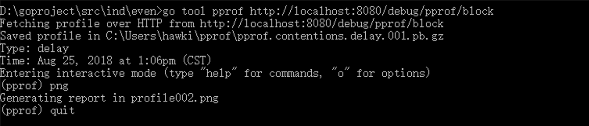
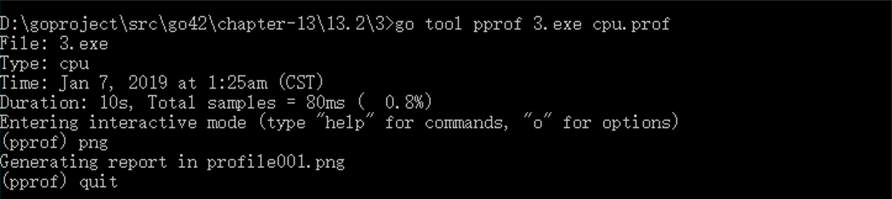

## 第二十一章 协程(goroutine)

> Concurrency is about dealing with lots of things at once. <br>
> Parallelism is about doing lots of things at once.<br>

并发： 指的是程序的逻辑结构。如果程序代码结构中的某些函数逻辑上可以同时运行，但物理上未必会同时运行。<br>
并行： 并行是指程序的运行状态。并行则指的就是在物理层面也就是使用了不同 CPU 在执行不同或者相同的任务。

### 并发

```go
并发是在同一时间处理多件事情。
并发的目的在于把单个 CPU 的利用率使用到最高。

并行是在同一时间做多件事情。
并行则需要多核 CPU 的支持。

协程,也称轻量线程，它不由系统而由应用程序创建和管理，因此使用开销较低（一般为4K）
我们可以创建很多的协程，并且它们跑在同一个内核线程之上的时候，就需要一个调度器来维护这些协程，确保所有的协程都能使用CPU，并且是尽可能公平地使用CPU资源。


调度器的主要有4个重要部分，分别是M、G、P、Sched。

M (work thread)  代表了系统线程内核线程，由操作系统管理。

P (processor)    衔接M和G的调度上下文，它负责将等待执行的G与M对接。P的数量可以通过GOMAXPROCS()来设置，它其实也就代表了真正的并发度，即有多少个goroutine可以同时运行。

G (goroutine)    协程的实体，包括了调用栈，重要的调度信息，例如channel等。


在操作系统的内核线程和编程语言的用户线程之间，实际上存在3种线程对应模型，也就是：1:1，1:N，M:N。

N:1 多个（N）用户线程始终在一个内核线程上跑，context上下文切换很快，但是无法真正的利用多核。
1:1 一个用户线程就只在一个内核线程上跑，这时可以利用多核，但是上下文切换很慢，切换效率很低。
M:N 多个协程在多个内核线程上跑，这个可以集齐上面两者的优势，但是无疑增加了调度的难度。


M:N 综合两种方式（N:1，1:1）的优势。多个协程可以在多个内核线程上处理。既能快速切换上下文，也能利用多核的优势，而Go正是选择这种实现方式。

Go 语言中的协程是运行在多核CPU中的(通过runtime.GOMAXPROCS(1)设定CPU核数)。 实际中运行的CPU核数未必会和实际物理CPU数相吻合。

每个协程都会被一个特定的P(某个CPU)选定维护，而M(物理计算资源)每次挑选一个有效P，然后执行P中的协程。

每个P会将自己所维护的协程放到一个G队列中，其中就包括了协程堆栈信息，是否可执行信息等等。

默认情况下，P的数量与实际物理CPU的数量相等。当我们通过循环来创建协程时，协程会被分配到不同的G队列中。 而M的数量又不是唯一的，当M随机挑选P时，也就等同随机挑选了协程。

所以，当我们碰到多个协程的执行顺序不是我们想象的顺序时就可以理解了，因为协程进入P管理的队列G是带有随机性的。

P维护着这个队列（称之为runqueue），Go语言里，启动一个协程很容易：go function 就行，所以每有一个go语句被执行，runqueue队列就在其末尾加入一个协程，在下一个调度点，就从runqueue中取出一个协程执行。

```


假如有两个 M，即两个内核线程，分别对应一个 P，每一个 P 调度一个 G 队列。如此一来，就组成的协程运行时的基本结构：

-   当有一个 M 返回时，它必须尝试取得一个 P 来运行协程，一般情况下，它会从其他的 OS Thread 线程那里窃取一个 P 过来，如果没有拿到，它就把协程放在一个 global runqueue 里，然后自己进入线程缓存里。

-   如果某个 P 所分配的任务 G 很快就执行完了，这会导致多个队列存在不平衡，会从其他队列中截取一部分协程到 P 上进行调度。一般来说，如果 P 从其他的 P 那里要取任务的话，一般就取 run queue 的一半，这就确保了每个内核线程都能充分的使用。

-   当一个内核线程被阻塞时，P 可以转而投奔另一个内核线程。

```go

结构
        			M ... M, M  (n cores)
          	/    \
        	 P       P
         /   		    \
      [G,G,G,G] [G,G,G,G,G] ....

在实际中运行速度延缓可能不一定仅仅是由于CPU的竞争，可能还有内存或者I/O的原因导致的，我们需要根据情况仔细分析。

最后，runtime.Gosched()用于让出CPU时间片，让出当前协程的执行权限，调度器安排其他等待的任务运行，并在下次某个时候从该位置恢复执行。


```

### goroutine

```go
func main() {
	for i := 1; i < 10; i++ {
		go func(i int) {
			fmt.Println(i)
		}(i)
	}
	// 暂停一会，保证打印全部结束
	time.Sleep(1e9)
}

有关于协程之间的通信以及协程与主线程的控制以及多个协程的管理和控制，我们后续通过channel、context以及锁来进一步说明。
```

## 第二十二章 通道(channel)

### 通道(channel)

**channel 是协程之间互相通信的通道**，协程之间可以通过它发送消息和接收消息。
也可以传递指针

```go
通道消息传递与消息类型也有关系，一个通道只能传递（发送send或接收receive）类型的值，这需要在声明通道时指定。
默认情况下，通道是阻塞的 (叫做无缓冲的通道)。


创建channel的两种方式

var channel chan int = make(chan int)
// 或
channel := make(chan int)


Go中通道可以是发送（send）、接收（receive）、同时发送（send）和接收（receive）


// 定义接收的通道
receive_only := make (<-chan int)

// 定义发送的通道
send_only := make (chan<- int)

// 可同时发送接收
send_receive := make (chan int)
```

定义只发送或只接收的通道意义不大，一般用于在参数传递中：

```go

func main() {
	c := make(chan int) // 不使用带缓冲区的通道
	go send(c)
	go recv(c)
	time.Sleep(3 * time.Second)
close(c)
}

// 只能向chan里send数据
func send(c chan<- int) {
	for i := 0; i < 10; i++ {

		fmt.Println("send readey ", i)
		c <- i
		fmt.Println("send ", i)
	}
}

// 只能接收通道中的数据
func recv(c <-chan int) {
	for i := range c {
		fmt.Println("received ", i)
	}
}

缺点是:往通道发送数据后，这个数据如果没有被取走，通道是阻塞的，也就是不能继续向通道里面发送数据。

上面代码中，我们没有指定通道缓冲区的大小，默认情况下是阻塞的。

应该用带缓冲区的channel
```

```go
我们可以建立带缓冲区的通道：

c := make(chan int, 1024)//示例


func main() {
	c := make(chan int, 10) // 使用带缓冲区的通道
	go send(c)
	go recv(c)
	time.Sleep(3 * time.Second)
	close(c)
}

// 只能向chan里send发送数据
func send(c chan<- int) {
	for i := 0; i < 10; i++ {

		fmt.Println("send readey ", i)
		c <- i
		fmt.Println("send ", i)
	}
}

// 只能接收通道中的数据
func recv(c <-chan int) {
	for i := range c {
		fmt.Println("received ", i)
	}
}

// 程序输出：

// send readey  0
// send  0
// send readey  1
// send  1
// send readey  2
// send  2
// send readey  3
// send  3
// send readey  4
// send  4
// send readey  5
// received  0
// received  1
// received  2
// received  3
// received  4
// received  5
// send  5
// send readey  6
// send  6
// send readey  7
// send  7
// send readey  8
// send  8
// send readey  9
// send  9
// received  6
// received  7
// received  8
// received  9


从运行结果我们可以看到（每次执行顺序不一定相同，协程运行导致的原因），带有缓冲区的通道，在缓冲区有数据而未填满前，读取不会出现阻塞的情况。
```

```go
1.无缓冲的通道（unbuffered channel）
		是指在接收前没有能力保存任何值的通道。
		这种类型的通道要求发送协程和接收协程同时准备好，才能完成发送和接收操作。如果两个协程没有同时准备好，通道会导致先执行发送或接收操作的协程阻塞等待。
		这种对通道进行发送和接收的交互行为本身就是同步的。

2.有缓冲的通道（buffered channel）
    是一种在被接收前能存储一个或者多个值的通道。
    这种类型的通道并不强制要求协程之间必须同时完成发送和接收。通道会阻塞发送和接收动作的条件也会不同。只有在通道中没有要接收的值时，接收动作才会阻塞。只有在通道没有可用缓冲区容纳被发送的值时，发送动作才会阻塞。
```

==无缓冲的通道保证进行发送和接收的协程会在同一时间进行数据交换；有缓冲的通道没有这种保证。==

==如果给定了一个缓冲区容量，通道就是异步的。只要缓冲区有未使用空间用于发送数据，或还包含可以接收的数据，那么其通信就会无阻塞地进行。==

### 关闭 channel

```go
可以通过内置的close函数来关闭通道实现。

* 通道不需要经常去关闭，只有当没有任何可发送数据时才去关闭通道；

* 关闭通道后，无法向通道再发送数据(引发panic 错误后导致接收立即返回零值)；

* 关闭通道后，可以继续向通道接收数据，不能继续发送数据；

* 对于nil 通道，无论收发都会被阻塞。

```

##　第二十三章 同步与锁

### 同步锁

1.sync.Mutex 互斥锁(也叫全局锁)

```go
调用Lock（）获得锁，调用unlock（）释放锁。
1.Lock
	- 使用Lock()加锁后，不能再继续对其加锁（同一个goroutine中，即：同步调用），否则会panic。
	- 只有在unlock()之后才能再次Lock()。
	- 异步调用Lock()，是正当的锁竞争，当然不会有panic了。

	- 适用于读写不确定场景，即读写次数没有明显的区别，并且只允许只有一个读或者写的场景.

2.Unlock
	- 如果在使用Unlock()前未加锁，就会引起一个运行错误
	- 已经锁定的Mutex并不与特定的goroutine相关联，这样可以利用一个goroutine对其加锁，再利用其他goroutine对其解锁。
```

```go
建议：同一个互斥锁的成对锁定和解锁操作放在同一层次的代码块中。
使用锁的经典模式：

var lck sync.Mutex
func foo() {
    lck.Lock()
    defer lck.Unlock() // 释放锁
    // ...
}


lck.Lock()会阻塞直到获取锁，然后利用defer语句在函数返回时自动释放锁。

```

Example

```go

func main() {
	wg := sync.WaitGroup{}

	var mutex sync.Mutex
	fmt.Println("Locking  (G0)")
	mutex.Lock()
	fmt.Println("locked (G0)")
	wg.Add(3)

	for i := 1; i < 4; i++ {
		go func(i int) {
			fmt.Printf("Locking (G%d)\n", i)
			mutex.Lock() // 只有锁释放了才能往后执行。
			fmt.Printf("locked (G%d)\n", i)

			time.Sleep(time.Second * 2)
			mutex.Unlock()
			fmt.Printf("unlocked (G%d)\n", i)
			wg.Done()
		}(i)
	}

	time.Sleep(time.Second * 5)
	fmt.Println("ready unlock (G0)")
	mutex.Unlock()
	fmt.Println("unlocked (G0)")

	wg.Wait()
}

/*
程序输出：
Locking  (G0)
locked (G0)
Locking (G1)
Locking (G3)
Locking (G2)
ready unlock (G0)
unlocked (G0)
locked (G1)
unlocked (G1)
locked (G3)
locked (G2)
unlocked (G3)
unlocked (G2)
*/

```

```go
Mutex也可以作为struct的一部分，这样这个struct就会防止被多线程更改数据。

type Book struct {
	BookName string
	L        *sync.Mutex
}

func (bk *Book) SetName(wg *sync.WaitGroup, name string) {
	defer func() {
		fmt.Println("Unlock set name:", name)
		bk.L.Unlock()
		wg.Done()
	}()

	bk.L.Lock()
	fmt.Println("Lock set name:", name)
	time.Sleep(1 * time.Second)
	bk.BookName = name
}

func main() {
	bk := Book{}
	bk.L = new(sync.Mutex)
	wg := &sync.WaitGroup{}
	books := []string{"《三国演义》", "《道德经》", "《西游记》"}
	for _, book := range books {
		wg.Add(1)
		go bk.SetName(wg, book)
	}

	wg.Wait()
}

```

2.sync.RWMutex 读写锁。

读写锁是分别针对读操作和写操作进行锁定和解锁操作的互斥锁。在 Go 语言中，读写锁由结构体类型 sync.RWMutex 代表。

基本遵循原则：

-   写锁定情况下，对读写锁进行读锁定或者写锁定，都将阻塞；而且读锁与写锁之间是互斥的；

-   读锁定情况下，对读写锁进行写锁定，将阻塞；加读锁时不会阻塞；

-   对未被写锁定的读写锁进行写解锁，会引发 panic；

-   对未被读锁定的读写锁进行读解锁的时候也会引发 panic；

-   写解锁在进行的同时会试图唤醒所有因进行读锁定而被阻塞的协程；

-   读解锁在进行的时候则会试图唤醒一个因进行写锁定而被阻塞的协程。

```go
RWMutex提供四个方法：

func (*RWMutex) Lock // 写锁定
func (*RWMutex) Unlock // 写解锁

func (*RWMutex) RLock // 读锁定
func (*RWMutex) RUnlock // 读解锁

```

```go

var m *sync.RWMutex

func main() {
	wg := sync.WaitGroup{}
	wg.Add(20)
	var rwMutex sync.RWMutex
	Data := 0
	for i := 0; i < 10; i++ {
		go func(t int) {
			rwMutex.RLock()
			defer rwMutex.RUnlock()
			fmt.Printf("Read data: %v\n", Data)
			wg.Done()
			time.Sleep(2 * time.Second)
			// 这句代码第一次运行后，读解锁。
			// 循环到第二个时，读锁定后，这个协程就没有阻塞，同时读成功。
		}(i)

		go func(t int) {
			rwMutex.Lock()
			defer rwMutex.Unlock()
			Data += t
			fmt.Printf("Write Data: %v %d \n", Data, t)
			wg.Done()

			// 这句代码让写锁的效果显示出来，写锁定下是需要解锁后才能写的。
			time.Sleep(2 * time.Second)
		}(i)
	}
	time.Sleep(5 * time.Second)
	wg.Wait()
}

/*
Read data: 0
Write Data: 0 0
Read data: 0
Read data: 0
Read data: 0
Read data: 0
Read data: 0
Read data: 0
Read data: 0
Read data: 0
Read data: 0
Write Data: 1 1
Write Data: 3 2
Write Data: 6 3
Write Data: 10 4
Write Data: 15 5
Write Data: 21 6
Write Data: 29 8
Write Data: 38 9
Write Data: 45 7
*/

```

### sync.WaitGroup

WaitGroup，它用于线程同步

-   WaitGroup 等待一组线程集合完成，才会继续向下执行。
-   主线程(goroutine)调用 Add 来设置等待的线程(goroutine)数量。
-   然后每个线程(goroutine)运行，并在完成后调用 Done。
-   同时，Wait 用来阻塞，直到所有线程(goroutine)完成才会向下执行。
-   Add(-1)和 Done()效果一致。

```go

func main() {
	var wg sync.WaitGroup
	for i := 0; i < 10; i++ {
		wg.Add(1)
		go func(t int) {
			defer wg.Done()
			fmt.Println(t)
		}(i)
	}
	wg.Wait()
}
/*
9
3
2
0
6
4
7
5
8
1
*/
```

### sync.Once

sync.Once.Do(f func())能保证 once 只执行一次,这个 sync.Once 块只会执行一次。

```go

var once sync.Once

func main() {

	for i, v := range make([]string,5) {
		once.Do(onces)
		fmt.Println("v:", v, "---i:", i)
	}

	for i := 0; i <5; i++ {

		go func(i int) {
			once.Do(onced)
			fmt.Println(i)
		}(i)
	}
	time.Sleep(4000)
}
func onces() {
	fmt.Println("onces")
}
func onced() {
	fmt.Println("onced")
}

/*
onces
v:  ---i: 0
v:  ---i: 1
v:  ---i: 2
v:  ---i: 3
v:  ---i: 4
0
4
3
1
2
*/
```

### sync.Map

sync.map，它是原生支持并发安全的 map。虽然说普通 map 并不是线程安全（或者说并发安全），但一般情况下我们还是使用它，因为这足够了；

==只有在涉及到线程安全，再考虑 sync.map==
==但由于 sync.Map 的读取并不是类型安全的，所以我们在使用 Load 读取数据的时候我们需要做类型转换。==

sync.Map 的使用上和 map 有较大差异，

```go

func main() {
	var m sync.Map

	//Store
	m.Store("name", "Joe")
	m.Store("gender", "Male")

	//LoadOrStore
	//若key不存在，则存入key和value，返回false和输入的value
	v, ok := m.LoadOrStore("name1", "Jim")
	fmt.Println(ok, v) //false Jim

	//若key已存在，则返回true和key对应的value，不会修改原来的value
	v, ok = m.LoadOrStore("name", "aaa")
	fmt.Println(ok, v) //true Joe

	//Load
	v, ok = m.Load("name")
	if ok {
		fmt.Println("key存在，值是： ", v)
	} else {
		fmt.Println("key不存在")
	}

	//Range
	//遍历sync.Map
	f := func(k, v interface{}) bool {
		fmt.Println(k, v)
		return true
	}
	m.Range(f)// 内部写函数进行map

	//Delete
	m.Delete("name1")
	fmt.Println(m.Load("name1"))

}


/*

程序运行输出：

false Jim
true Joe
key存在，值是：  Joe
name Joe
gender Male
name1 Jim
<nil> false
*/
```

## 第二十四章 指针和内存

指针变量在 32 位计算机上占用 4B 内存，在 64 位计算机占用 8B 内存，并且与它所指向的值的大小无关，因为指针变量只是地址的值而已。

```go
在 Go 语言中，指针类型表示指向给定类型（称为指针的基础类型）的变量的所有指针的集合。 符号 \* 可以放在一个类型前，如 \*T，那么它将以类型 T 为基础，生成指针类型\*T。未初始化指针的值为 nil。例如：


type Point3D struct{ x, y, z float64 }
var pointer *Point3D
var i *[4]int

//定义了两个指针类型变量。它们的值为nil，这时对它们的反向引用是不合法的，并且会使程序崩溃。
xx := (*pointer).x //error

符号 \* 可以放在一个指针前，如 (\*pointer)，那么它将得到这个指针指向地址上所存储的值，这称为反向引用。不过在Go语言中，(\*pointer).x可以简写为pointer.x。


对于任何一个变量 var， 表达式var == \*(&var)都是正确的。

注意：不能得到一个数字或常量的地址，下面的写法是错误的：
const i = 5
ptr := &i // error: cannot take the address of i
ptr2 := &10 // error: cannot take the address of 10


Go中指针只能进行引用

```

### 内存

内存管理中的内存区域一般包括堆内存（heap）和栈内存（stack），
Stack:
栈内存主要用来存储当前调用栈用到的简单类型数据，如 string，bool，int，float 等。
这些类型基本上较少占用内存，容易回收，因此可以直接复制，进行垃圾回收时也比较容易做针对性的优化。

Heap
复杂的复合类型占用的内存往往相对较大，存储在堆内存中，垃圾回收频率相对较低，代价也较大，因此传引用或指针可以避免进行成本较高的复制操作，并且节省内存，提高程序运行效率。

因此，在需要改变参数的值或者避免复制大批量数据而节省内存时（也会提高运行效率，毕竟大批量复制也耗费时间）都会选择使用指针。
另一方面，指针的频繁使用也会导致性能下降。指针也可以指向另一个指针，并且可以进行任意深度的嵌套，形成多级的间接引用，但会使代码结构不清晰。

在大多数情况下，Go 语言可以使程序员轻松创建指针，并且隐藏间接引用，如：自动反向引用。

==指针的使用方法==

-   定义指针变量；

-   为指针变量赋值；

-   访问指针变量中指向地址的值；

-   在指针类型前面加上\*号来获取指针所指向的内容。

```go

package main

import "fmt"

func main() {
	var a, b int = 20, 30 // 声明实际变量
	var ptra *int         // 声明指针变量
	var ptrb *int = &b

	ptra = &a // 指针变量的存储地址

	fmt.Printf("a  变量的地址是: %x\n", &a)
	fmt.Printf("b  变量的地址是: %x\n", &b)

	// 指针变量的存储地址
	fmt.Printf("ptra  变量的存储地址: %x\n", ptra)
	fmt.Printf("ptrb  变量的存储地址: %x\n", ptrb)

	// 使用指针访问值
	fmt.Printf("*ptra  变量的值: %d\n", *ptra)
	fmt.Printf("*ptrb  变量的值: %d\n", *ptrb)
}

```

### new() 和 make() 的区别

new() 和 make() 都在堆上分配内存，但是它们的行为不同，适用于不同的类型。

new() 用于值类型的内存分配，并且置为零值。
make() 只用于切片、字典以及通道这三种引用数据类型的内存分配和初始化。

new(T) 分配类型 T 的零值并返回其地址，也就是指向类型 T 的指针。
make(T) 返回类型 T 的值（不是\* T）。

然而在 Go 语言中，并不能准确判断变量是分配到栈还是堆上。
在 Go 中变量的位置是由编译器决定的。
编译器根据变量的大小和泄露（逃逸）分析的结果来决定其位置。

如果想确切知道变量分配的位置，可在执行 go build 或 go run 时加上-m gc 标志（即 go run -gcflags -m app.go）。

```go
go run -gcflags -m main.go
# command-line-arguments
.\main.go:12:31: m.Alloc / 1024 escapes to heap
.\main.go:11:23: main &m does not escape
.\main.go:12:12: main ... argument does not escape

```

### 垃圾回收和 SetFinalizer

通过调用 runtime.GC() 函数可以显式的触发 GC，这在某些的场景下非常有用，比如当内存资源不足时调用 runtime.GC()，它会在此函数执行的点上立即释放一大片内存，但此时程序可能会有短时的性能下降（因为 GC 进程在执行）。

下面代码中的 func (p \*Person) NewOpen()在某些情况下非常有必要这样处理!
比如某些资源占用申请，开发人员可能忘记使用 defer Close()来销毁处理，但通过 SetFinalizer，如果 GC 自动运行或者手动运行 GC，则都能及时销毁这些资源，释放占用的内存而避免内存泄漏。

GC 过程中重要的函数 func SetFinalizer(obj interface{}, finalizer interface{})有两个参数，
参数一：obj 必须是指针类型。
参数二：finalizer 是一个函数，其参数类型是 obj 的类型，其没有返回值。

```go
type Person struct {
	Name string
	Age  int
}

func (p *Person) Close() {
	p.Name = "NewName"
	log.Println(p)
	log.Println("Close")
}

func (p *Person) NewOpen() {
	log.Println("Init")
	runtime.SetFinalizer(p, (*Person).Close)
}

func Tt(p *Person) {
	p.Name = "NewName"
	log.Println(p)
	log.Println("Tt")
}

// 查看内存情况
func Mem(m *runtime.MemStats) {
	runtime.ReadMemStats(m)
	log.Printf("%d Kb\n", m.Alloc/1024)
}

func main() {
	var m runtime.MemStats
	Mem(&m)

	var p *Person = &Person{Name: "lee", Age: 4}
	p.NewOpen()
	log.Println("Gc完成第一次")
	log.Println("p:", p)
	runtime.GC()// 主动调用
	time.Sleep(time.Second * 5)
	Mem(&m)

	var p1 *Person = &Person{Name: "Goo", Age: 9}
	runtime.SetFinalizer(p1, Tt)//标记，可GC及时销毁
	log.Println("Gc完成第二次")
	time.Sleep(time.Second * 2)
	runtime.GC()
	time.Sleep(time.Second * 2)
	Mem(&m)

}


```

## 第二十五章 面向对象

### Go 中的面向对象

Go 没有类，而是松耦合的类型、方法对接口的实现。

OOP 最重要的三个方面分别是：封装，继承和多态，在 Go 中它们是怎样表现的呢？

Go 实现面向对象的两个关键是 struct 和 interface，结构代替类，因为 Go 语言不提供类，但提供了结构体或自定义类型，方法可以被添加到结构体或自定义类型中。结构体之间可以嵌套，类似继承。而 interface 定义接口，实现多态性。

**封装（数据隐藏）：**

和别的 OOP 语言有 4 个或更多的访问层次相比，Go 把它简化为了 2 层：
1）包范围内的：通过标识符首字母小写，对象 只在它所在的包内可见
2）可导出的：通过标识符首字母大写，对象 对所在包以外也可见类型只拥有自己所在包中定义的方法。

**继承：**

Go 没有显式的继承，而是通过组合实现继承，内嵌一个（或多个）包含想要的行为（字段和方法）的结构体；多重继承可以通过内嵌多个结构体实现。

**多态：**

多态是运行时特性，而继承则是编译时特征，也就是说，继承关系在编译时就已经确定了，而多态则可以实现运行时的动态绑定。Go 用接口实现多态，某个类型的实例可以赋给它所实现的任意接口类型的变量。
类型和接口是松耦合的，并且多重继承可以通过实现多个接口实现。
Go 接口不是 Java 和 C# 接口的变体，而且：接口间是不相关的，并且是大规模编程和可适应的演进型设计的关键。

另外 Go 没有构造函数，如果一定要在初始化对象的时候进行一些工作的话，可以自行封装产生实例的方法。
实例化的时候可以初始化属性值，如果没有指明则默认为系统默认值。
加&符号和 new 的是指针对象，没有的则是值对象，在传递对象的时候要根据实际情况来决定是要传递指针还是值。

### 多重继承

多重继承指的是类型获得多个父类型行为的能力，它在传统的面向对象语言中通常是不被实现的（C++ 和 Python 例外）。
因为在类继承层次中，多重继承会给编译器引入额外的复杂度。
但是在 Go 语言中，通过在类型中嵌入所有必要的父类型，可以很简单的实现多重继承。

有关方法重载就是一个类中可以有相同的函数名称，但是它们的参数是不一致的，在 java、C++中这种做法普遍存在。Go 中如果尝试这么做会报重新声明（redeclared）错误，但是 Go 的函数可以声明不定参数，这个非常强大。

```Go
func Println(a ...interface{}) (n int, err error) {
	return Fprintln(os.Stdout, a...)
}
```

其中 a ...interface{}表示参数不定的意思。如果要根据不同的参数实现不同的功能，要在方法内检测传递的参数。

## 第二十六章 测试

### 单元测试

首先测试程序是独立的文件，他必须属于被测试的包，和这个包的其他程序放在一起，并且文件名满足这种形式 \*\_test.go。由于是独立的测试文件，所以测试代码和包中的业务代码是分开的。
\_test 程序不会被普通的 Go 编译器编译，所以当放应用部署到生产环境时它们不会被部署；只有 Gotest 会编译所有的程序：普通程序和测试程序。

测试函数

```go
func TestAbcde(t *testing.T)

*testing.T是传给测试函数的结构类型，用来管理测试状态，支持格式化测试日志，如 t.Log，t.Error，t.ErrorF 等。t.Log函数就像我们常常使用的fmt.Println一样，可以接受多个参数，方便输出调试结果。

用下面这些函数来通知测试失败：
1）func (t *T) Fail()
    标记测试函数为失败，然后继续执行剩下的测试。

2）func (t *T) FailNow()
    标记测试函数为失败并中止执行；文件中别的测试也被略过，继续执行下一个文件。

3）func (t *T) Log(args ...interface{})
    args 被用默认的格式格式化并打印到错误日志中。

4）func (t *T) Fatal(args ...interface{})
    结合 先执行 3），然后执行 2）的效果。

运行 go test 来编译测试程序，并执行程序中所有的 TestXxx 函数。如果所有的测试都通过会打印出 PASS。


```

```go
gotest 可以接收一个或多个函数程序作为参数，并指定一些选项。

go test 常用参数
-cpu: 指定测试的GOMAXPROCS值，默认是GOMAXPROCS当前值
-count: 运行单元测试和基准测试n次（默认1）。如设置了-cpu，则为每个GOMAXPROCS运行n次，示例函数总运行一次。
-cover: 启用覆盖率分析
-run: 执行功能测试函数，支持正则匹配，可以选择测试函数或者测试文件来仅测试单个函数或者单个文件
-bench: 执行基准测试函数，支持正则匹配
-benchtime: 基准测试最大时间上限
-parallel: 允许并行执行的最大测试数，默认情况下设置为GOMAXPROCS的值
-v: 展示测试过程信息

```

### 基准测试

testing 包中有一些类型和函数可以用来做简单的基准测试；测试代码中必须包含以 BenchmarkZzz 打头的函数并接收一个 \*testing.B 类型的参数，比如：

```Go
func BenchmarkReverse(b *testing.B) {
    ...
}
```

命令 go test –test.bench=.\* 会运行所有的基准测试函数；代码中的函数会被调用 N 次（N 是非常大的数，如 N = 1000000），可以根据情况指定 b.N 的值，并展示 N 的值和函数执行的平均时间，单位为 ns（纳秒，ns/op）。如果是用 testing.Benchmark 调用这些函数，直接运行程序即可。

下面我们看一个测试的具体例子：

```Go
package even

func Loop(n uint64) (result uint64) {
	result = 1
	var i uint64 = 1
	for ; i <= n; i++ {
		result *= i
	}
	return result
}

func Factorial(n uint64) (result uint64) {
	if n > 0 {
		result = n * Factorial(n-1)
		return result
	}
	return 1
}
```

在 even 包的路径下，我们创建一个名为 even_test.go 的测试程序：

```Go
package even

import (
	"testing"
)

func TestLoop(t *testing.T) {
	t.Log("Loop:", Loop(uint64(32)))
}

func TestFactorial(t *testing.T) {
	t.Log("Factorial:", Factorial(uint64(32)))
}

func BenchmarkLoop(b *testing.B) {

	for i := 0; i < b.N; i++ {
		Loop(uint64(40))
	}
}

func BenchmarkFactorial(b *testing.B) {

	for i := 0; i < b.N; i++ {
		Factorial(uint64(40))
	}
}
```

现在我们可以在这个包的目录下使用命令：go test -test.bench=.\* 来测试 even 包。

输出：

```Go
输出：

goos: windows
goarch: amd64
pkg: go42/chapter-13/13.1/1
BenchmarkLoop-4        	50000000	        27.2 ns/op
BenchmarkFactorial-4   	10000000	       163 ns/op
PASS
ok  	go42/chapter-13/13.1/1	3.628s
```

递归函数的确是很耗费系统资源，而且运行也慢，不建议使用。

### 分析并优化 Go 程序

如果代码使用了 Go 中 testing 包的基准测试功能，我们可以用 gotest 标准的 -cpuprofile 和 -memprofile 标志向指定文件写入 CPU 或 内存使用情况报告。

使用方式：

```Go
go test -x -v -test.cpuprofile=pprof.out
```

运行上面代码，将会基于基准测试把执行结果中的 cpu 性能分析信息写到 pprof.out 文件中。我们可以根据这个文件做分析来详细了解性能情况。

### 用 pprof 调试(监控堆栈)

要监控 Go 程序的堆栈，cpu 的耗时等性能信息，我们可以通过使用 pprof 包来实现。在代码中，pprof 包有两种方式导入：

```Go
"net/http/pprof"
"runtime/prof"
```

其实 net/http/pprof 中只是使用 runtime/pprof 包来进行封装了一下，并在 http 端口上暴露出来，让我们可以在浏览器查看程序的性能分析。我们可以自行查看 net/http/pprof 中代码，只有一个文件 pprof.go。

下面我们具体说说怎么使用 pprof，首先我们讲讲在开发中取得 pprof 信息的三种方式：

一：web 服务器程序

如果我们的 Go 程序是 web 服务器，你想查看自己的 web 服务器的状态。这个时候就可以选择 net/http/pprof。你只需要引入包\_"net/http/pprof"，然后就可以在浏览器中使用 http://localhost:port/debug/pprof/直接看到当前 web 服务的状态，包括 CPU 占用情况和内存使用情况等。

这里 port 是 8080，也就是我们 web 服务器监听的端口。

```Go
package main

import (
	"fmt"
	"net/http"
	_ "net/http/pprof"  // 为什么用_ , 在讲解http包时有解释。
)

func myfunc(w http.ResponseWriter, r *http.Request) {
	fmt.Fprintf(w, "hi")
}

func main() {
	http.HandleFunc("/", myfunc)
	http.ListenAndServe(":8080", nil)
}
```

访问 http://localhost:8080/debug/pprof/

二：服务进程

如果你的 Go 程序不是 web 服务器，而是一个服务进程，可以选择使用 net/http/pprof 包，然后开启一个 goroutine 来监听相应端口。

```Go
package main

import (
	"fmt"
	"log"
	"net/http"
	_ "net/http/pprof"

	"time"
)

func main() {
	// 开启pprof
	go func() {
		log.Println(http.ListenAndServe("localhost:8080", nil))
	}()
	go hello()
	select {}
}
func hello() {
	for {
		go func() {
			fmt.Println("hello word")
		}()
		time.Sleep(time.Millisecond * 1)
	}
}
```

访问 http://localhost:8080/debug/pprof/
在前面这两种方式中，我们还可以在命令行分别运行以下命令：

利用这个命令查看堆栈信息：
go tool pprof http://localhost:8080/debug/pprof/heap
利用这个命令可以查看程序 CPU 使用情况信息：
go tool pprof http://localhost:8080/debug/pprof/profile
使用这个命令可以查看 block 信息：
go tool pprof http://localhost:8080/debug/pprof/block



这里需要先安装 graphviz，http://www.graphviz.org/download/ ，windows 平台直接下载 zip 包，解压缩后把 bin 目录放到$path 中。我们可以通过执行命令 png 产生图片，还有 svg，gif，pdf 等命令，生成的图片自动命名存放在当前目录下，我们这里生成了 png。其他命令使用可通过 help 查看。

三：应用程序

如果你的 Go 程序只是一个应用程序，那么你就不能使用 net/http/pprof 包了，你就需要使用到 runtime/pprof。比如下面的例子：

```Go
package main

import (
	"flag"
	"fmt"
	"log"

	"os"
	"runtime/pprof"
	"time"
)

var cpuprofile = flag.String("cpuprofile", "", "write cpu profile to file")

func Factorial(n uint64) (result uint64) {
	if n > 0 {
		result = n * Factorial(n-1)
		return result
	}
	return 1
}

func main() {
	flag.Parse()
	if *cpuprofile != "" {
		f, err := os.Create(*cpuprofile)
		if err != nil {
			log.Fatal(err)
		}
		pprof.StartCPUProfile(f)
		defer pprof.StopCPUProfile()
	}

	go compute()
	time.Sleep(10 * time.Second)
}
func compute() {
	for i := 0; i < 100; i++ {
		go func() {
			fmt.Println(Factorial(uint64(40)))
		}()
		time.Sleep(time.Millisecond * 1)
	}
}
```

编译后生成 3.exe 文件并运行：

```Go
3.exe --cpuprofile=cpu.prof
```

这里我们编译后可执行程序是 3.exe , 程序运行完后的 cpu 信息就会记录到 cpu.prof 中。

现在有了 cpu.prof 文件，我们就可以通过 go tool pprof 来看相应的信息了。在命令行运行：

```Go
go tool pprof 3.exe cpu.prof
```

这里要注意的是需要带上可执行的程序名以及 prof 信息文件。

命令执行后会进入到：



命令界面和前面两种使用 net/http/pprof 包 一样。我们可以通过 go tool pprof 生 svg，png 或者是 pdf 文件。

这是生成的 png 文件，和前面生成的 png 类似，前面我们生成的是 block 信息：


通过上面这三种情况的分析，我们可以知道，其实就是两种情况：
go tool pprof http://localhost:8080/debug/pprof/profile 这种 url 方式，或者
go tool pprof 3.exe cpu.prof 这种文件方式来进行分析。

我们可以根据项目情况灵活使用。有关 pprof，我们就讲这么多，在实际项目中，我们多使用就会发现这个工具还是蛮有用处的。

## 第二十七章 反射(reflect)

反射机制就是在运行时动态调用对象的方法和属性，即可从运行时态的示例对象反求其编码阶段的定义，

value 是实际变量值，type 是实际变量的类型。两个简单的函数，reflect.TypeOf 和 reflect.ValueOf，返回被检查对象的类型和值。

x 被定义为：var x float64 = 3.4，
那么 reflect.TypeOf(x) 返回 float64
reflect.ValueOf(x) 返回 3.4。
实际上，反射是通过检查一个接口的值，变量首先被转换成空接口。

```go
func TypeOf(i interface{}) Type
func ValueOf(i interface{}) Value
```

reflect.Type 和 reflect.Value 都有许多方法用于检查和操作它们。

Type 主要有：
Kind() 将返回一个常量，表示具体类型的底层类型
Elem()方法返回指针、数组、切片、字典、通道的基类型，这个方法要慎用，如果用在其他类型上面会出现 panic

Value 主要有：
Type() 将返回具体类型所对应的 reflect.Type（静态类型）
Kind() 将返回一个常量，表示具体类型的底层类型

反射可以在运行时检查类型和变量，例如它的大小、方法和 动态 的调用这些方法。这对于没有源代码的包尤其有用。

==由于反射是一个强大的工具，但反射对性能有一定的影响，除非有必要，否则应当避免使用或小心使用。==

```go
type Student struct {
	name string
}

func main() {

	var a int = 50
	v := reflect.ValueOf(a) // 返回Value类型对象，值为50
	t := reflect.TypeOf(a)  // 返回Type类型对象，值为int
	fmt.Println(v, t, v.Type(), t.Kind())

	var b [5]int = [5]int{5, 6, 7, 8}
	fmt.Println(reflect.TypeOf(b), reflect.TypeOf(b).Kind(),reflect.TypeOf(b).Elem()) // [5]int array int

	var Pupil Student
	p := reflect.ValueOf(Pupil) // 使用ValueOf()获取到结构体的Value对象

	fmt.Println(p.Type()) // 输出:Student
	fmt.Println(p.Kind()) // 输出:struct

}
```

在 Go 语言中，类型包括 static type 和 concrete type.
简单说 static type 是你在编码是看见的类型(如 int、string)，concrete type 是实际具体的类型，runtime 系统看见的类型。

Type()返回的是静态类型，而 kind()返回的是具体类型。上面代码中，在 int，数组以及结构体三种类型情况中，可以看到 kind()，type()返回值的差异。

==**通过反射可以修改原对象**==

d.CanAddr()方法：判断它是否可被取地址
d.CanSet()方法：判断它是否可被取地址并可被修改

通过一个 settable 的 Value 反射对象来访问、修改其对应的变量值：

```go

type Student struct {
	name string //未导出
	Age  int //导出
}

func main() {

	var a int = 50
	v := reflect.ValueOf(a) // 返回Value类型对象，值为50
	t := reflect.TypeOf(a)  // 返回Type类型对象，值为int
	fmt.Println(v, t, v.Type(), t.Kind(), reflect.ValueOf(&a).Elem())
	seta := reflect.ValueOf(&a).Elem() // 这样才能让seta保存a的值
	fmt.Println(seta, seta.CanSet())
	seta.SetInt(1000)
	fmt.Println(seta)

	var Pupil Student = Student{"joke", 18}
	p := reflect.ValueOf(Pupil) // 使用ValueOf()获取到结构体的Value对象

	fmt.Println(p.Type()) // 输出:Student
	fmt.Println(p.Kind()) // 输出:struct

	setStudent := reflect.ValueOf(&Pupil).Elem()
	//setStudent.Field(0).SetString("Mike") // name是未导出字段，不能修改，panic会发生
	setStudent.Field(1).SetInt(19)
	fmt.Println(setStudent)

}
```

虽然反射可以越过 Go 语言的导出规则的限制读取结构体中未导出的成员，但不能修改这些未导出的成员。
因为一个结构体中只有被导出的字段才是可修改的。

在结构体中有 tag 标签，通过反射可获取结构体成员变量的 tag 信息。

```go

type Student struct {
	name string
	Age  int `json:"years"`
}

func main() {
	var Pupil Student = Student{"joke", 18}
	setStudent := reflect.ValueOf(&Pupil).Elem()

	sSAge, _ := setStudent.Type().FieldByName("Age")
	fmt.Println(sSAge.Tag.Get("json")) // years
}


```

### 反射结构体

```go

// 结构体
type ss struct {
	int
	string
	bool
	float64
}

func (s ss) Method1(i int) string  { return "结构体方法1" }
func (s *ss) Method2(i int) string { return "结构体方法2" }

var (
	structValue = ss{ // 结构体
		20,
		"结构体",
		false,
		64.0,
	}
)

// 复杂类型
var complexTypes = []interface{}{
	structValue, &structValue, // 结构体
	structValue.Method1, structValue.Method2, // 方法
}

func main() {
	// 测试复杂类型
	for i := 0; i < len(complexTypes); i++ {
		PrintInfo(complexTypes[i])
	}
}

func PrintInfo(i interface{}) {
	if i == nil {
		fmt.Println("--------------------")
		fmt.Printf("无效接口值：%v\n", i)
		fmt.Println("--------------------")
		return
	}
	v := reflect.ValueOf(i)
	PrintValue(v)
}

func PrintValue(v reflect.Value) {
	fmt.Println("--------------------")
	// ----- 通用方法 -----
	fmt.Println("String             :", v.String())  // 反射值的字符串形式
	fmt.Println("Type               :", v.Type())    // 反射值的类型
	fmt.Println("Kind               :", v.Kind())    // 反射值的类别
	fmt.Println("CanAddr            :", v.CanAddr()) // 是否可以获取地址
	fmt.Println("CanSet             :", v.CanSet())  // 是否可以修改
	if v.CanAddr() {
		fmt.Println("Addr               :", v.Addr())       // 获取地址
		fmt.Println("UnsafeAddr         :", v.UnsafeAddr()) // 获取自由地址
	}
	// 获取方法数量
	fmt.Println("NumMethod          :", v.NumMethod())
	if v.NumMethod() > 0 {
		// 遍历方法
		i := 0
		for ; i < v.NumMethod()-1; i++ {
			fmt.Printf("    ┣ %v\n", v.Method(i).String())
			//			if i >= 4 { // 只列举 5 个
			//				fmt.Println("    ┗ ...")
			//				break
			//			}
		}
		fmt.Printf("    ┗ %v\n", v.Method(i).String())
		// 通过名称获取方法
		fmt.Println("MethodByName       :", v.MethodByName("String").String())
	}

	switch v.Kind() {
	// 结构体：
	case reflect.Struct:
		fmt.Println("=== 结构体 ===")
		// 获取字段个数
		fmt.Println("NumField           :", v.NumField())
		if v.NumField() > 0 {
			var i int
			// 遍历结构体字段
			for i = 0; i < v.NumField()-1; i++ {
				field := v.Field(i) // 获取结构体字段
				fmt.Printf("    ├ %-8v %v\n", field.Type(), field.String())
			}
			field := v.Field(i) // 获取结构体字段
			fmt.Printf("    └ %-8v %v\n", field.Type(), field.String())
			// 通过名称查找字段
			if v := v.FieldByName("ptr"); v.IsValid() {
				fmt.Println("FieldByName(ptr)   :", v.Type().Name())
			}
			// 通过函数查找字段
			v := v.FieldByNameFunc(func(s string) bool { return len(s) > 3 })
			if v.IsValid() {
				fmt.Println("FieldByNameFunc    :", v.Type().Name())
			}
		}
	}
}

```

```go
// 结果

程序输出：
String             : <main.ss Value>
Type               : main.ss
Kind               : struct
CanAddr            : false
CanSet             : false
NumMethod          : 1
    ┗ <func(int) string Value>
MethodByName       : <invalid Value>
=== 结构体 ===
NumField           : 4
    ├ int      <int Value>
    ├ string   结构体
    ├ bool     <bool Value>
    └ float64  <float64 Value>
--------------------
String             : <*main.ss Value>
Type               : *main.ss
Kind               : ptr
CanAddr            : false
CanSet             : false
NumMethod          : 2
    ┣ <func(int) string Value>
    ┗ <func(int) string Value>
MethodByName       : <invalid Value>
--------------------
String             : <func(int) string Value>
Type               : func(int) string
Kind               : func
CanAddr            : false
CanSet             : false
NumMethod          : 0
--------------------
String             : <func(int) string Value>
Type               : func(int) string
Kind               : func
CanAddr            : false
CanSet             : false
NumMethod          : 0


structValue, &structValue的反射结果是不一样的，指针对象在这里有两个方法，而值对象只有一个方法，这是因为Method2()方法是指针方法，在值对象中是不能被反射到的。

```

## 第二十八章 unsafe 包

### unsafe 包

```Go
func Alignof(x ArbitraryType) uintptr
func Offsetof(x ArbitraryType) uintptr
func Sizeof(x ArbitraryType) uintptr
type ArbitraryType int
type Pointer *ArbitraryType
```

在 unsafe 包中，只提供了 3 个函数，两个类型。就这么少的量，却有着超级强悍的功能。一般我们在 C 语言中通过指针，在知道变量在内存中占用的字节数情况下，就可以通过指针加偏移量的操作，直接在地址中，修改，访问变量的值。在 Go 语言中不支持指针运算，那怎么办呢？其实通过 unsafe 包，我们可以完成类似的操作。

ArbitraryType 是以 int 为基础定义的一个新类型，但是 Go 语言 unsafe 包中，对 ArbitraryType 赋予了特殊的意义，通常，我们把 interface{}看作是任意类型，那么 ArbitraryType 这个类型，在 Go 语言系统中，比 interface{}还要随意。

Pointer 是 ArbitraryType 指针类型为基础的新类型，在 Go 语言系统中，可以把 Pointer 类型，理解成任何指针的亲爹。

Go 语言的指针类型长度与 int 类型长度，在内存中占用的字节数是一样的。ArbitraryType 类型的变量也可以是指针。

```Go
func Alignof(x ArbitraryType) uintptr
func Offsetof(x ArbitraryType) uintptr
func Sizeof(x ArbitraryType) uintptr
```

通过分析发现，这三个函数的参数均是 ArbitraryType 类型。

1. Alignof 返回变量对齐字节数量
2. Offsetof 返回变量指定属性的偏移量，所以如果变量是一个 struct 类型，不能直接将这个 struct 类型的变量当作参数，只能将这个 struct 类型变量的属性当作参数。
3. Sizeof 返回变量在内存中占用的字节数，切记，如果是 slice，则不会返回这个 slice 在内存中的实际占用长度。

unsafe 中，通过 ArbitraryType 、Pointer 这两个类型，可以将其他类型都转换过来，然后通过这三个函数，分别能取长度，偏移量，对齐字节数，就可以在内存地址映射中，来回游走。

### 指针运算

uintptr 这个基础类型，在 Go 语言中，字节长度是与 int 一致。通常 Pointer 不能参与指针运算，比如你要在某个指针地址上加上一个偏移量，Pointer 是不能做这个运算的，那么谁可以呢？这里要靠 uintptr 类型了。

==只有将 Pointer 类型先转换成 uintptr 类型，做完地址加减法运算后，再转换成 Pointer 类型，通过\*操作达到取值、修改值的目的。==

unsafe.Pointer 其实就是类似 C 的 void \*，在 Go 语言中是用于各种指针相互转换的桥梁，也即是通用指针。它可以让任意类型的指针实现相互转换，也可以将任意类型的指针转换为 uintptr 进行指针运算。

uintptr 是 Go 语言的内置类型，是能存储指针的整型， uintptr 的底层类型是 int，它和 unsafe.Pointer 可相互转换。

==uintptr 和 unsafe.Pointer 的区别就是：==

-   unsafe.Pointer 只是单纯的通用指针类型，用于转换不同类型指针，它不可以参与指针运算；

-   而 uintptr 是用于指针运算的，GC 不把 uintptr 当指针，也就是说 uintptr 无法持有对象， uintptr 类型的目标会被回收；

-   unsafe.Pointer 可以和 普通指针 进行相互转换；

-   unsafe.Pointer 可以和 uintptr 进行相互转换。

Go 语言的 unsafe 包很强大，基本上很少会去用它。它可以像 C 一样去操作内存，但由于 Go 语言不支持直接进行指针运算，所以用起来稍显麻烦。

uintptr 和 intptr 是无符号和有符号的指针类型，并且确保在 64 位平台上是 8 个字节，在 32 位平台上是 4 个字节，uintptr 主要用于 Go 语言中的指针运算。

通过 unsafe 包来实现对 V 的成员 i 和 j 赋值，然后通过 GetI()和 GetJ()来打印观察输出结果。

以下是 main.go 源代码：

```Go
package main

import (
	"fmt"
	"unsafe"
)

type V struct {
	i int32
	j int64
}

func (v V) GetI() {
	fmt.Printf("i=%d\n", v.i)
}
func (v V) GetJ() {
	fmt.Printf("j=%d\n", v.j)
}

func main() {
	// 定义指针类型变量
	var v *V = &V{199, 299}

	// 取得v的指针并转为*int32的值，对应结构体的i。
	var i *int32 = (*int32)(unsafe.Pointer(v))

	fmt.Println("指针地址：", i)
	fmt.Println("指针uintptr值:", uintptr(unsafe.Pointer(i)))
	*i = int32(98)

	// 根据v的基准地址加上偏移量进行指针运算，运算后的值为j的地址，使用unsafe.Pointer转为指针
	var j *int64 = (*int64)(unsafe.Pointer(uintptr(unsafe.Pointer(v)) + uintptr(unsafe.Sizeof(int64(0)))))

	*j = int64(763)

	v.GetI()
	v.GetJ()
}
```

```Go
指针地址： 0xc00000c180
指针uintptr值: 824633770368
i=98
j=763
```

要修改 struct 字段的值，需要提前知道结构体 V 的成员布局，然后根据字段计算偏移量，以及考虑对齐值，最后通过指针运算得到成员指针，利用指针达到修改成员值得目的。由于结构体的成员在内存中的分配是一段连续的内存，因此结构体中第一个成员的地址就是这个结构体的地址，我们也可以认为是相对于这个结构体偏移了 0。相同的，这个结构体中的任一成员都可以相对于这个结构体的偏移来计算出它在内存中的绝对地址。

具体来讲解下 main 方法的实现：

```Go
var v *V = &V{199, 299}
```

==通过&来分配一段内存(并按类型初始化)，返回一个指针。所以 v 就是类型为 V 的一个指针。和 new 函数的作用类似。==

```Go
var i *int32 = (*int32)(unsafe.Pointer(v))
```

将指针 v 转成通用指针，再转成 int32 指针类型。这里就看到了 unsafe.Pointer 的作用了，不能直接将 v 转成 int32 类型的指针，那样将会 panic，但是 unsafe.Pointer 是可以转为任何指针。刚才说了 v 的地址其实就是它的第一个成员的地址，所以这个 i 就很显然指向了 v 的成员 i，通过给 i 赋值就相当于给 v.i 赋值了，但是别忘了 i 只是个指针，要赋值得解引用。

```Go
*i = int32(98)
```

现在已经成功的改变了 v 的私有成员 i 的值。

但是对于 v.j 来说，怎么来得到它在内存中的地址呢？其实我们可以获取它相对于 v 的偏移量(unsafe.Sizeof 可以为我们做这个事)，但上面的代码并没有这样去实现。各位别急，一步步来。

```Go
var j *int64 = (*int64)(unsafe.Pointer(uintptr(unsafe.Pointer(v)) + uintptr(unsafe.Sizeof(int64(0)))))
```

其实我们已经知道 v 是有两个成员的，包括 i 和 j，并且在定义中，i 位于 j 的前面，而 i 是 int32 类型，也就是说 i 占 4 个字节。所以 j 是相对于 v 偏移了 4 个字节。您可以用 uintptr(4)或 uintptr(unsafe.Sizeof(int64(0)))来做这个事。unsafe.Sizeof 方法用来得到一个值应该占用多少个字节空间。注意这里跟 C 的用法不一样，C 是直接传入类型，而 Go 语言是传入值。

之所以转成 uintptr 类型是因为需要做指针运算。v 的地址加上 j 相对于 v 的偏移地址，也就得到了 v.j 在内存中的绝对地址，然后通过 unsafe.Pointer 转为指针，别忘了 j 的类型是 int64，所以现在的 j 就是一个指向 v.j 的指针，接下来给它赋值：

```Go
*j = int64(763)
```

另外，我们可以看到两种地址表示上的差异：

```Go
指针地址： 0xc00000c180
指针uintptr值: 824633770368
```

上面结构体 V 中，定义了 2 个成员属性，如果我们定义一个 byte 类型的成员属性。我们来看下它的输出：

```Go
package main

import (
	"fmt"
	"unsafe"
)

type V struct {
	b byte
	i int32
	j int64
}

func (v V) GetI() {
	fmt.Printf("i=%d\n", v.i)
}
func (v V) GetJ() {
	fmt.Printf("j=%d\n", v.j)
}

func main() {
	// 定义指针类型变量
	var v *V = new(V)

	// v的长度
	fmt.Printf("size=%d\n", unsafe.Sizeof(*v))
	// 取得v的指针考虑对齐值计算偏移量，然后转为*int32的值，对应结构体的i。
	var i *int32 = (*int32)(unsafe.Pointer(uintptr(unsafe.Pointer(v)) + uintptr(4*unsafe.Sizeof(byte(0)))))

	fmt.Println("指针地址：", i)
	fmt.Println("指针uintptr值:", uintptr(unsafe.Pointer(i)))
	*i = int32(98)

	// 根据v的基准地址加上偏移量进行指针运算，运算后的值为j的地址，使用unsafe.Pointer转为指针
	var j *int64 = (*int64)(unsafe.Pointer(uintptr(unsafe.Pointer(v)) + uintptr(unsafe.Sizeof(int64(0)))))

	*j = int64(763)
	fmt.Println("指针uintptr值:", uintptr(unsafe.Pointer(&v.b)))
	fmt.Println("指针uintptr值:", uintptr(unsafe.Pointer(&v.i)))
	fmt.Println("指针uintptr值:", uintptr(unsafe.Pointer(&v.j)))
	v.GetI()
	v.GetJ()
}

```

```Go
程序输出：
size=16
指针地址： 0xc000050084
指针uintptr值: 824634048644
指针uintptr值: 824634048640
指针uintptr值: 824634048644
指针uintptr值: 824634048648
i=98
j=763
```

新结构体的长度为 size=16，好像跟我们想像的不一致。我们计算一下：b 是 byte 类型，占 1 个字节；i 是 int32 类型，占 4 个字节；j 是 int64 类型，占 8 个字节，1+4+8=13。这是怎么回事呢？

这是因为发生了对齐。在 struct 中，它的对齐值是它的成员中的最大对齐值。

每个成员类型都有它的对齐值，可以用 unsafe.Alignof 方法来计算，比如 unsafe.Alignof(v.b)就可以得到 b 的对齐值为 1 。但这个对齐值是其值类型的长度或引用的地址长度（32 位或者 64 位），和其在结构体中的 size 不是简单相加的问题。经过在 64 位机器上测试，发现地址（uintptr）如下：

```Go
unsafe.Pointer(b): %s 824634048640
unsafe.Pointer(i): %s 824634048644
unsafe.Pointer(j): %s 824634048648
```

可以初步推断，也经过测试验证，取 i 值使用 uintptr(4\*unsafe.Sizeof(byte(0)))是准确的。至于 size 其实也和对齐值有关，也不是简单相加每个字段的长度。

unsafe.Offsetof 可以在实际中使用，如果改变私有的字段，需要程序员认真考虑后，按照上面的方法仔细确认好对齐值再进行操作。

## 第二十九章 排序(sort)


### sort包介绍

Go语言标准库sort包中实现了几种基本的排序算法：插入排序、快排和堆排序，但在使用sort包进行排序时无需具体考虑使用那种排序方式。

```Go
func insertionSort(data Interface, a, b int) 
func heapSort(data Interface, a, b int)
func quickSort(data Interface, a, b, maxDepth int) 
```

sort.Interface接口定义了三个方法，注意sort包中接口Interface这个名字，是大写字母I开头，不要和interface关键字混淆，这里就是一个接口名而已。

```Go
type Interface interface {
	// Len 为集合内元素的总数  
	Len() int
	// 如果index为i的元素小于index为j的元素，则返回true，否则false
	Less(i, j int) bool
	// Swap 交换索引为 i 和 j 的元素
	Swap(i, j int)
}

```

这三个方法分别是：获取数据集合长度的Len()方法、比较两个元素大小的Less()方法和交换两个元素位置的Swap()方法。只要实现了这三个方法，就可以对数据集合进行排序，sort包会根据实际数据自动选择高效的排序算法。

sort包原生支持[]int、[]float64和[]string三种内建数据类型切片的排序操作，即不必我们自己实现相关的Len()、Less()和Swap()方法。

以[]int为例，我们看看在sort包中的是怎么定义排序操作的:

type IntSlice []int

先通过 []int 来定义新类型IntSlice，然后在IntSlice上定义三个方法，Len()，Less(i, j int)，Swap(i, j int)，实现了这三个方法也就意味着实现了sort.Interface。

方法 func (p IntSlice) Sort() 通过调用 sort.Sort(p) 函数来实现排序。而p因为是sort.Interface类型，但IntSlice实现了这三个接口方法，也是sort.Interface类型，因此可以直接调用得到排序结果。其他[]float64和[]string的排序也基本上按照这种方式来实现。

其他类型并没有在标准包中给出实现方法，需要我们自己来定义实现。下面第二节 自定义sort.Interface排序 就是专门来讲怎么实现的，但有了这三个实现的实例，自定义实现排序也就很容易了。

```Go
func (p IntSlice) Len() int           { return len(p) }
func (p IntSlice) Less(i, j int) bool { return p[i] < p[j] }
func (p IntSlice) Swap(i, j int)      { p[i], p[j] = p[j], p[i] }
func (p IntSlice) Sort() { Sort(p) }

```

来看看[]int，[]string排序的实例：

```Go
package main

import (
	"fmt"
	"sort"
)

func main() {
	a := []int{3, 5, 4, -1, 9, 11, -14}
	sort.Ints(a)
	fmt.Println(a)
	ss := []string{"surface", "ipad", "mac pro", "mac air", "think pad", "idea pad"}
	sort.Strings(ss)
	fmt.Println(ss)
	sort.Sort(sort.Reverse(sort.StringSlice(ss)))
	fmt.Printf("After reverse: %v\n", ss)
}
```

```Go
程序输出：
[-14 -1 3 4 5 9 11]
[idea pad ipad mac air mac pro surface think pad]
After reverse: [think pad surface mac pro mac air ipad idea pad]
```

默认结果都是升序排列，如果我们想对一个 sortable object 进行逆序排序，可以自定义一个type。但 sort.Reverse 帮你省掉了这些代码。

```Go
package main

import (
	"fmt"
	"sort"
)

func main() {
	a := []int{4, 3, 2, 1, 5, 9, 8, 7, 6}
	sort.Sort(sort.Reverse(sort.IntSlice(a)))
	fmt.Println("After reversed: ", a)
}
```

```Go
程序输出：
After reversed:  [9 8 7 6 5 4 3 2 1]
```

相关方法：

```Go
// 将类型为float64的slice以升序方式排序
func Float64s(a []float64)   

// 判定是否已经进行排序func Ints(a []int)
func Float64sAreSorted(a []float64) bool　

// Ints 以升序排列 int 切片。
func Ints(a []int)                  

// 判断 int 切片是否已经按升序排列。
func IntsAreSorted(a []int) bool　

//IsSorted 判断数据是否已经排序。包括各种可sort的数据类型的判断．
func IsSorted(data Interface) bool    


//Strings 以升序排列 string 切片。
func Strings(a []string)

//判断 string 切片是否按升序排列
func StringsAreSorted(a []string) bool

// search使用二分法进行查找，Search()方法回使用“二分查找”算法来搜索某指定切片[0:n]，
// 并返回能够使f(i)=true的最小的i（0<=i<n）值，并且会假定，如果f(i)=true，则f(i+1)=true，
// 即对于切片[0:n]，i之前的切片元素会使f()函数返回false，i及i之后的元素会使f()
// 函数返回true。但是，当在切片中无法找到时f(i)=true的i时（此时切片元素都不能使f()
// 函数返回true），Search()方法会返回n（而不是返回-1）。
//
// Search 常用于在一个已排序的，可索引的数据结构中寻找索引为 i 的值 x，例如数组或切片。
// 这种情况下实参 f一般是一个闭包，会捕获所要搜索的值，以及索引并排序该数据结构的方式。
func Search(n int, f func(int) bool) int   

// SearchFloat64s 在float64s切片中搜索x并返回索引如Search函数所述. 
// 返回可以插入x值的索引位置，如果x不存在，返回数组a的长度切片必须以升序排列
func SearchFloat64s(a []float64, x float64) int　　

// SearchInts 在ints切片中搜索x并返回索引如Search函数所述. 返回可以插入x值的
// 索引位置，如果x不存在，返回数组a的长度切片必须以升序排列
func SearchInts(a []int, x int) int 

// SearchFloat64s 在strings切片中搜索x并返回索引如Search函数所述. 返回可以
// 插入x值的索引位置，如果x不存在，返回数组a的长度切片必须以升序排列
func SearchStrings(a []string, x string) int

// 其中需要注意的是，以上三种search查找方法，其对应的slice必须按照升序进行排序，
// 否则会出现奇怪的结果．

// Sort 对 data 进行排序。它调用一次 data.Len 来决定排序的长度 n，调用 data.Less 
// 和 data.Swap 的开销为O(n*log(n))。此排序为不稳定排序。他根据不同形式决定使用
// 不同的排序方式（插入排序，堆排序，快排）。
func Sort(data Interface)

// Stable对data进行排序，不过排序过程中，如果data中存在相等的元素，则他们原来的
// 顺序不会改变，即如果有两个相等元素num, 他们的初始index分别为i和j，并且i<j，
// 则利用Stable对data进行排序后，i依然小于ｊ．直接利用sort进行排序则不能够保证这一点。
func Stable(data Interface)
```


### 自定义sort.Interface排序

如果是具体的某个结构体的排序，就需要自己实现Interface了。数据集合（包括自定义数据类型的集合）排序需要实现sort.Interface接口的三个方法，即：Len()，Swap(i, j int)，Less(i, j int)，数据集合实现了这三个方法后，即可调用该包的Sort()方法进行排序。Sort(data Interface) 方法内部会使用quickSort()来进行集合的排序。quickSort()会根据实际情况来选择排序方法。

任何实现了 sort.Interface 的类型（一般为集合），均可使用该包中的方法进行排序。这些方法要求集合内列出元素的索引为整数。


```Go
package main

import (
	"fmt"
	"sort"
)

type person struct {
	Name string
	Age  int
}

type personSlice []person

func (s personSlice) Len() int           { return len(s) }
func (s personSlice) Swap(i, j int)      { s[i], s[j] = s[j], s[i] }
func (s personSlice) Less(i, j int) bool { return s[i].Age < s[j].Age }

func main() {
	a := personSlice{
		{
			Name: "AAA", 
			Age:  55, 
		}, 
		{
			Name: "BBB", 
			Age:  22, 
		}, 
		{
			Name: "CCC", 
			Age:  0, 
		}, 
		{
			Name: "DDD", 
			Age:  22, 
		}, 
		{
			Name: "EEE", 
			Age:  11, 
		}, 
	}
	sort.Sort(a)
	fmt.Println("Sort:", a)

	sort.Stable(a)
	fmt.Println("Stable:", a)

}
```

该示例程序的自定义类型personSlice实现了sort.Interface接口，所以可以将其对象作为sort.Sort()和sort.Stable()的参数传入。运行结果：

```Go
程序输出：

Sort: [{CCC 0} {EEE 11} {BBB 22} {DDD 22} {AAA 55}]
Stable: [{CCC 0} {EEE 11} {BBB 22} {DDD 22} {AAA 55}]
```

### sort.Slice(不建议使用，慢)

> But, 经过测试，好像也没慢多少，尤其是数据量到1万的时候，也没慢多少

利用sort.Slice 函数，而不用提供一个特定的 sort.Interface 的实现，而是 Less(i，j int) 作为一个比较回调函数，可以简单地传递给 sort.Slice 进行排序。这种方法一般不建议使用，因为在sort.Slice中使用了reflect。

```Go
package main

import (
	"fmt"
	"sort"
)

type Peak struct {
	Name      string
	Elevation int // in feet
}

func main() {
	peaks := []Peak{
		{"Aconcagua", 22838}, 
		{"Denali", 20322}, 
		{"Kilimanjaro", 19341}, 
		{"Mount Elbrus", 18510}, 
		{"Mount Everest", 29029}, 
		{"Mount Kosciuszko", 7310}, 
		{"Mount Vinson", 16050}, 
		{"Puncak Jaya", 16024}, 
	}

	// does an in-place sort on the peaks slice, with tallest peak first
	sort.Slice(peaks, func(i, j int) bool {
		return peaks[i].Elevation >= peaks[j].Elevation
	})
	fmt.Println(peaks)

}
```

```Go
程序输出：
[{Mount Everest 29029} {Aconcagua 22838} {Denali 20322} {Kilimanjaro 19341} {Mount Elbrus 18510} {Mount Vinson 16050} {Puncak Jaya 16024} {Mount Kosciuszko 7310}]

```


## 第三十章 os包


### 启动外部命令和程序

os标准包，是一个比较重要的包，顾名思义，主要是在服务器上进行系统的基本操作，如文件操作，目录操作，执行命令，信号与中断，进程，系统状态等等。在os包下，有
exec，signal，user三个子包。

在os包中，有很多有趣的功能，比如可以通过变量Args来获取命令参数，os.Args返回一个字符串数组。

```Go
fmt.Println(os.Args)
```

在os包中，相关函数名字和作用有较重的UNIX风格，比如：

```
func Chdir(dir string) error   //chdir将当前工作目录更改为dir目录
func Getwd() (dir string, err error)    //获取当前目录
func Chmod(name string, mode FileMode) error     //更改文件的权限
func Chown(name string, uid, gid int) error  //更改文件拥有者owner
func Chtimes(name string, atime time.Time, mtime time.Time) error 
func Clearenv()    //清除所有环境变量（慎用）
func Environ() []string  //返回所有环境变量
func Exit(code int)     //系统退出，并返回code，其中０表示执行成功并退出，非０表示错误并退出
```

在os包中，有关文件的处理也有很多方法，如：

```go
// Create采用模式0666创建一个名为name的文件，如果文件已存在会截断它（为空文件）
func Create(name string) (file *File, err error) 

// Open打开一个文件用于读取。
func Open(name string) (file *File, err error) 

// Stat返回描述文件f的FileInfo类型值
func (f *File) Stat() (fi FileInfo, err error) 

// Readdir读取目录f的内容，返回一个有n个成员的[]FileInfo
func (f *File) Readdir(n int) (fi []FileInfo, err error) 

 // Read方法从f中读取最多len(b)字节数据并写入b
func (f *File) Read(b []byte) (n int, err error)

// 向文件中写入字符串
func (f *File) WriteString(s string) (ret int, err error) 

// Sync递交文件的当前内容进行稳定的存储。
func (f *File) Sync() (err error) 

// Close关闭文件f
func (f *File) Close() error 
```

有关文件的处理，将在下一章中详细说明。

在os 包中有一个 StartProcess 函数可以调用或启动外部系统命令和二进制可执行文件；它的第一个参数是要运行的进程，第二个参数用来传递选项或参数，第三个参数是含有系统环境基本信息的结构体。

这个函数返回被启动进程的 id（pid），或者启动失败返回错误。

```Go
package main

import (
	"fmt"
	"os"
)

func main() {
	// os.StartProcess 
	env := os.Environ()
	procAttr := &os.ProcAttr{
		Env: env, 
		Files: []*os.File{
			os.Stdin, 
			os.Stdout, 
			os.Stderr, 
		}, 
	}
	// example:
	Pid, err := os.StartProcess("/bin/ls", []string{"ls", "-l"}, procAttr)
	if err != nil {
		fmt.Printf("Error %v starting process!", err) //
		os.Exit(1)
	}
	fmt.Printf("The process id is %v", Pid)
}
```

### os/signal 信号处理

一个运行良好的程序在退出（正常退出或者强制退出，如ctrl+c，kill等）时是可以执行一段清理代码，将收尾工作做完后再真正退出。一般采用系统Signal来通知系统退出，如kill pid。在程序中针对一些系统信号设置了处理函数，当收到信号后，会执行相关清理程序或通知各个子进程做自清理。

Go的系统信号处理主要涉及os包、os.signal包以及syscall包。其中最主要的函数是signal包中的Notify函数：

func Notify(c chan<- os.Signal, sig …os.Signal)

该函数会将进程收到的系统Signal转发给channel c。如果没有传入sig参数，那么Notify会将系统收到的所有信号转发给channel c。

Notify会根据传入的os.Signal，监听对应Signal信号，Notify()方法会将接收到对应os.Signal往一个channel c中发送。 

下面代码以 syscall.SIGUSR2 信息为例，说明了具体实现：

```Go
package main

import (
	"fmt"
	"os"
	"os/signal"
	"syscall"
	"time"
)

func main() {
	go signalListen()
	for {
		time.Sleep(10 * time.Second)
	}
}

func signalListen() {
	c := make(chan os.Signal)
	signal.Notify(c, syscall.SIGUSR2)
	for {
		s := <-c
		//收到信号后的处理，这里只是输出信号内容，可以做一些更有意思的事
		fmt.Println("get signal:", s)
	}
}
```

关于信号有关信息，有兴趣建议可以参考《UNIX高级编程》。其他更多Signal信号类型，请参看相关手册。

os包中其他的功能还有很多，这里就不一一介绍了。


## 第三十一章 文件操作与I/O


### 文件系统

对于文件和目录的操作，Go主要在os包中提供了的相应方法：

```Go
func Mkdir(name string, perm FileMode) error 
func Chdir(dir string) error
func TempDir() string
func Rename(oldpath, newpath string) error
func Chmod(name string, mode FileMode) error
func Open(name string) (*File, error) {
	return OpenFile(name, O_RDONLY, 0)
}
func Create(name string) (*File, error) {
	return OpenFile(name, O_RDWR|O_CREATE|O_TRUNC, 0666)
}
func OpenFile(name string, flag int, perm FileMode) (*File, error) {
	testlog.Open(name)
	return openFileNolog(name, flag, perm)
}
```

从上面函数定义中我们可以发现一个情况：那就是os包中不同函数打开（创建）文件的操作，最终还是通过函数OpenFile()来实现，而OpenFile()由编译器根据系统的情况来选择不同的底层功能来实现，对这个实现细节有兴趣可以根据标准包来仔细了解，这里就不展开讲了。

```Go
os.Open(name string) 使用只读模式打开文件；
os.Create(name string) 创建新文件，如文件存在则原文件内容会丢失；
os.OpenFile(name string, flag int, perm FileMode) 这个函数可以指定flag和FileMode 。这三个函数都会返回一个文件对象。
```

预定义的Flag值：

```Go
O_RDONLY int = syscall.O_RDONLY // 只读打开文件和os.Open()同义
O_WRONLY int = syscall.O_WRONLY // 只写打开文件	
O_RDWR   int = syscall.O_RDWR   // 读写方式打开文件	
O_APPEND int = syscall.O_APPEND // 当写的时候使用追加模式到文件末尾	
O_CREATE int = syscall.O_CREAT  // 如果文件不存在，此案创建	
O_EXCL   int = syscall.O_EXCL   // 和O_CREATE一起使用，只有当文件不存在时才创建
O_SYNC   int = syscall.O_SYNC   // 以同步I/O方式打开文件，直接写入硬盘
O_TRUNC  int = syscall.O_TRUNC  // 如果可以的话，当打开文件时先清空文件
```

在ioutil包中，也可以对文件操作，主要有下面三个函数：

```Go
func ReadFile(filename string) ([]byte, error) // f, err := os.Open(filename)
func WriteFile(filename string, data []byte, perm os.FileMode) error  //os.OpenFile
func ReadDir(dirname string) ([]os.FileInfo, error) //	f, err := os.Open(dirname)
```

这三个函数涉及到了文件I/O ，而对文件的操作我们除了打开（创建），关闭外，更主要的是对内容的读写操作上，也即是文件I/O处理上。在Go语言中，对于I/O的操作在Go 语言很多标准库中存在，很难完整地讲清楚。下面我就尝试结合io, ioutil, bufio这三个标准库，讲一讲这几个标准库在文件I/O操作中的具体使用方法。

### I/O读写

Go 语言中，为了方便开发者使用，将 I/O 操作封装在了大概如下几个包中：

- io 为 I/O 原语（I/O primitives）提供基本的接口
- io/ioutil 封装一些实用的 I/O 函数
- fmt 实现格式化 I/O，类似 C 语言中的 printf 和 scanf ，后面会详细讲解
- bufio 实现带缓冲I/O

在 io 包中最重要的是两个接口：Reader 和 Writer 接口。

这两个接口是我们了解整个I/O的关键，我们只要记住：**实现了这两个接口，就有了 I/O 的功能**。

==有关缓冲：==

* 内核中的缓冲：无论进程是否提供缓冲，内核都是提供缓冲的，系统对磁盘的读写都会提供一个缓冲（内核高速缓冲），将数据写入到块缓冲进行排队，当块缓冲达到一定的量时，才把数据写入磁盘。

* 进程中的缓冲：是指对输入输出流进行了改进，提供了一个流缓冲，当调用一个函数向磁盘写数据时，先把数据写入缓冲区，当达到某个条件，如流缓冲满了，或刷新流缓冲，这时候才会把数据一次送往内核提供的块缓冲中，再经块缓冲写入磁盘。


Go 语言提供了很多读写文件的方式，一般来说常用的有三种。
一：os.File 实现了Reader 和 Writer 接口，所以在文件对象上，我们可以直接读写文件。

```Go
func (f *File) Read(b []byte) (n int, err error)
func (f *File) Write(b []byte) (n int, err error)
```

在使用File.Read读文件时，可考虑使用buffer：

```Go
package main

import (
	"fmt"
	"os"
)

func main() {
	b := make([]byte, 1024) // buffer
	f, err := os.Open("./tt.txt")
	_, err = f.Read(b)
	f.Close()

	if err != nil {
		fmt.Println(err)
	}
	fmt.Println(string(b))

}
```

二：ioutil库，没有直接实现Reader 和 Writer 接口，但是通过内部调用，也可读写文件内容：

```Go
func ReadAll(r io.Reader) ([]byte, error) 
func ReadFile(filename string) ([]byte, error)  //os.Open
func WriteFile(filename string, data []byte, perm os.FileMode) error  //os.OpenFile
func ReadDir(dirname string) ([]os.FileInfo, error)  // os.Open
```

三：使用bufio库，这个库实现了I/O的缓冲操作，通过内嵌io.Reader、io.Writer接口，新建了Reader ，Writer 结构体。同时也实现了Reader 和 Writer 接口。

```Go
type Reader struct {
	buf          []byte
	rd           io.Reader // reader provided by the client
	r, w         int       // buf read and write positions
	err          error
	lastByte     int
	lastRuneSize int
}

type Writer struct {
	err error
	buf []byte
	n   int
	wr  io.Writer
}


func (b *Reader) Read(p []byte) (n int, err error) 
func (b *Writer) Write(p []byte) (nn int, err error) 
```

这三种读方式的效率怎么样呢，我们可以看看：

```Go
package main

import (
	"bufio"
	"fmt"
	"io"
	"io/ioutil"
	"os"
	"time"
)

func read1(path string) {
	fi, err := os.Open(path)
	if err != nil {
		panic(err)
	}
	defer fi.Close()
	buf := make([]byte, 1024)// buffer
	for {
		n, err := fi.Read(buf)
		if err != nil && err != io.EOF {
			panic(err)
		}
		if 0 == n {
			break
		}
	}
}

func read2(path string) {
	fi, err := os.Open(path)
	if err != nil {
		panic(err)
	}
	defer fi.Close()
	r := bufio.NewReader(fi) // bufio
	buf := make([]byte, 1024)
	for {
		n, err := r.Read(buf)
		if err != nil && err != io.EOF {
			panic(err)
		}
		if 0 == n {
			break
		}
	}
}

func read3(path string) {
	fi, err := os.Open(path)
	if err != nil {
		panic(err)
	}
	defer fi.Close()
	_, err = ioutil.ReadAll(fi)// ioutil
}

func main() {

	file := "" //找一个大的文件，如日志文件
	start := time.Now()
	read1(file)
	t1 := time.Now()
	fmt.Printf("Cost time %v\n", t1.Sub(start))
	read2(file)
	t2 := time.Now()
	fmt.Printf("Cost time %v\n", t2.Sub(t1))
	read3(file)
	t3 := time.Now()
	fmt.Printf("Cost time %v\n", t3.Sub(t2))
}
```

经过多次测试，基本上保持 file.Read > ioutil >bufio 这样的成绩， bufio读同一文件耗费时间最少，效果稳稳地保持在最佳。

### ioutil包

下面代码使用ioutil包实现2种读文件，1种写文件的方法，其中 ioutil.ReadAll 可以读取所有io.Reader流。所以在网络连接中，也经常使用ioutil.ReadAll来读取流，后面章节我们会讲到这块内容。

```Go
package main

import (
	"fmt"
	"io/ioutil"
	"os"
)

func main() {
	fileObj, err := os.Open("./tt.txt")
	defer fileObj.Close()

	Contents, _ := ioutil.ReadAll(fileObj)
	fmt.Println(string(contents))

	if contents, _ := ioutil.ReadFile("./tt.txt"); err == nil {
		fmt.Println(string(contents))
	}

	ioutil.WriteFile("./t3.txt", contents, 0666)

}
```

### bufio包

bufio 包通过 bufio.NewReader 和bufio.NewWriter 来创建I/O方法集，利用缓冲来处理流，后面章节我们也会讲到这块内容。

```Go
package main

import (
	"bufio"
	"fmt"
	"os"
)

func main() {
	fileObj, _ := os.OpenFile("./tt.txt", os.O_RDWR|os.O_CREATE, 0666)
	defer fileObj.Close()

	Rd := bufio.NewReader(fileObj)
	cont, _ := Rd.ReadSlice('#')
	fmt.Println(string(cont))

	Wr := bufio.NewWriter(fileObj)
	Wr.WriteString("WriteString writes a ## string.")
	Wr.Flush()
}
```

```Go
程序输出：
WriteString writes a #
```

bufio包中，主要方法如下：

```Go
// NewReaderSize 将 rd 封装成一个带缓存的 bufio.Reader 对象，缓存大小由 size 指定（如果小于 16 则会被设置为 16）。
func NewReaderSize(rd io.Reader, size int) *Reader

// NewReader 相当于 NewReaderSize(rd, 4096)
func NewReader(rd io.Reader) *Reader

// Peek 返回缓存的一个切片，该切片引用缓存中前 n 个字节的数据。 
// 如果 n 大于缓存的总大小，则返回 当前缓存中能读到的字节的数据。
func (b *Reader) Peek(n int) ([]byte, error)


// Read 从 b 中读出数据到 p 中，返回读出的字节数和遇到的错误。
// 如果缓存不为空，则只能读出缓存中的数据，不会从底层 io.Reader 
// 中提取数据，如果缓存为空，则：
// 1、len(p) >= 缓存大小，则跳过缓存，直接从底层 io.Reader 中读出到 p 中。
// 2、len(p) < 缓存大小，则先将数据从底层 io.Reader 中读取到缓存中，
// 再从缓存读取到 p 中。
func (b *Reader) Read(p []byte) (n int, err error)

// Buffered 该方法返回从当前缓存中能被读到的字节数。
func (b *Reader) Buffered() int

// Discard 方法跳过后续的 n 个字节的数据，返回跳过的字节数。
func (b *Reader) Discard(n int) (discarded int, err error)

// ReadSlice 在 b 中查找 delim 并返回 delim 及其之前的所有数据。
// 该操作会读出数据，返回的切片是已读出的数据的引用，切片中的数据在下一次
// 读取操作之前是有效的。
// 如果找到 delim，则返回查找结果，err 返回 nil。
// 如果未找到 delim，则：
// 1、缓存不满，则将缓存填满后再次查找。
// 2、缓存是满的，则返回整个缓存，err 返回 ErrBufferFull。
// 如果未找到 delim 且遇到错误（通常是 io.EOF），则返回缓存中的所有数据
// 和遇到的错误。
// 因为返回的数据有可能被下一次的读写操作修改，所以大多数操作应该使用 
// ReadBytes 或 ReadString，它们返回的是数据的拷贝。
func (b *Reader) ReadSlice(delim byte) (line []byte, err error)

// ReadLine 是一个低水平的行读取原语，大多数情况下，应该使用ReadBytes('\n')
//  或 ReadString('\n')，或者使用一个 Scanner。
// ReadLine 通过调用 ReadSlice 方法实现，返回的也是缓存的切片。
// 用于读取一行数据，不包括行尾标记（\n 或 \r\n）。
// 只要能读出数据，err 就为 nil。如果没有数据可读，则 isPrefix 
// 返回 false，err 返回 io.EOF。
// 如果找到行尾标记，则返回查找结果，isPrefix 返回 false。
// 如果未找到行尾标记，则：
// 1、缓存不满，则将缓存填满后再次查找。
// 2、缓存是满的，则返回整个缓存，isPrefix 返回 true。
// 整个数据尾部“有一个换行标记”和“没有换行标记”的读取结果是一样。
// 如果 ReadLine 读取到换行标记，则调用 UnreadByte 撤销的是换行标记，
// 而不是返回的数据。
func (b *Reader) ReadLine() (line []byte, isPrefix bool, err error)

// ReadBytes 功能同 ReadSlice，只不过返回的是缓存的拷贝。
func (b *Reader) ReadBytes(delim byte) (line []byte, err error)

// ReadString 功能同 ReadBytes，只不过返回的是字符串。
func (b *Reader) ReadString(delim byte) (line string, err error)

// Reset 将 b 的底层 Reader 重新指定为 r，同时丢弃缓存中的所有数据，
// 复位所有标记和错误信息。 bufio.Reader。
func (b *Reader) Reset(r io.Reader)
```

下面一段代码是，里面有用到peek，Discard 等方法，可以修改方法参数值，仔细体会：

```Go
package main

import (
	"bufio"
	"fmt"
	"strings"
)

func main() {
	sr := strings.NewReader("ABCDEFGHIJKLMNOPQRSTUVWXYZ1234567890")
	buf := bufio.NewReaderSize(sr, 0) //默认16
	b := make([]byte, 10)

	fmt.Println("==", buf.Buffered()) // 0
	S, _ := buf.Peek(5)
	fmt.Printf("%d ==  %q\n", buf.Buffered(), s) // 
	nn, er := buf.Discard(3)
	fmt.Println(nn, er)

	for n, err := 0, error(nil); err == nil; {
		fmt.Printf("Buffered:%d ==Size:%d== n:%d==  b[:n] %q ==  err:%v\n", buf.Buffered(), buf.Size(), n, b[:n], err)
		n, err = buf.Read(b)
		fmt.Printf("Buffered:%d ==Size:%d== n:%d==  b[:n] %q ==  err: %v == s: %s\n", buf.Buffered(), buf.Size(), n, b[:n], err, s)
	}

	fmt.Printf("%d ==  %q\n", buf.Buffered(), s)
}
```

有关I/O 的处理，这里主要讲了针对文件的处理。后面在网络I/O读写处理中，我们将会接触到更多的方式和方法。


## 第三十二章 fmt包与日志log包

### fmt包格式化I/O

上一章我们有提到fmt格式化I/O，这一章我们就详细来说说。在fmt包，有关格式化输入输出的方法就两大类：Scan 和 Print ，分别在scan.go 和 print.go 文件中。

print.go文件中定义了如下函数：

```Go
func Printf(format string,  a ...interface{}) (n int,  err error)
func Fprintf(w io.Writer,  format string,  a ...interface{}) (n int,  err error)
func Sprintf(format string,  a ...interface{}) string

func Print(a ...interface{}) (n int,  err error)
func Fprint(w io.Writer,  a ...interface{}) (n int,  err error)
func Sprint(a ...interface{}) string

func Println(a ...interface{}) (n int,  err error)
func Fprintln(w io.Writer,  a ...interface{}) (n int,  err error)
func Sprintln(a ...interface{}) string
```

这9个函数，按照两个维度来说明，基本上可以说明白了。当然这两个维度是我个人为了记忆而分，并不是官方的说法。

一：如果把"Print"理解为核心关键字，那么后面跟的后缀有"f"和"ln"以及""，着重的是输出内容的最终结果；

如果后缀是"f", 则指定了format
如果后缀是"ln", 则有换行符

```Go
Println、Fprintln、Sprintln  输出内容时会加上换行符；
Print、Fprint、Sprint        输出内容时不加上换行符；
Printf、Fprintf、Sprintf     按照指定格式化文本输出内容。
```

二：如果把"Print"理解为核心关键字，那么前面的前缀有"F"和"S"以及""，着重的是输出内容的目标（终端）；

如果前缀是"F", 则指定了io.Writer
如果前缀是"S", 则是输出到字符串

```Go
Print、Printf、Println      输出内容到标准输出os.Stdout；
Fprint、Fprintf、Fprintln   输出内容到指定的io.Writer；
Sprint、Sprintf、Sprintln   输出内容到字符串。
```

scan.go文件中定义了如下函数：

```Go
func Scanf(format string,  a ...interface{}) (n int,  err error)
func Fscanf(r io.Reader,  format string,  a ...interface{}) (n int,  err error)
func Sscanf(str string,  format string,  a ...interface{}) (n int,  err error)

func Scan(a ...interface{}) (n int,  err error)
func Fscan(r io.Reader,  a ...interface{}) (n int,  err error)
func Sscan(str string,  a ...interface{}) (n int,  err error)

func Scanln(a ...interface{}) (n int,  err error)
func Fscanln(r io.Reader,  a ...interface{}) (n int,  err error)
func Sscanln(str string,  a ...interface{}) (n int,  err error) 
```

这9个函数可以扫描格式化文本以生成值。同样也可以按照两个维度来说明。

一：如果把"Scan"理解为核心关键字，那么后面跟的后缀有"f"和"ln"以及""，着重的是输入内容的结果；

如果后缀是"f", 则指定了format
如果后缀是"ln", 则有换行符

```Go
Scanln、Fscanln、Sscanln    读取到换行时停止，并要求一次提供一行所有条目；
Scan、Fscan、Sscan          读取内容时不关注换行；
Scanf、Fscanf、Sscanf       根据格式化文本读取。
```

二：如果把"Scan"理解为核心关键字，那么前面的前缀有"F"和"S"以及""，着重的是输入内容的来源（终端）；

如果前缀是"F", 则指定了io.Reader
如果前缀是"S", 则是从字符串读取

```
Scan、Scanf、Scanln     从标准输入os.Stdin读取文本；
Fscan、Fscanf、Fscanln  从指定的io.Reader接口读取文本；
Sscan、Sscanf、Sscanln  从一个参数字符串读取文本。
```

### 格式化verb应用

在应用上，我们主要讲讲格式化verb ，fmt包中格式化的主要功能函数都在format.go文件中。

我们先来了解下有哪些verb：

| 符号   | 含义                                                         |
| :----- | :----------------------------------------------------------- |
| 通用： |                                                              |
| %v     | 值的默认格式表示。当输出结构体时，扩展标志（%+v）会添加字段名 |
| %#v    | 值的Go语法表示                                               |
| %T     | 值的类型的Go语法表示                                         |
| %%     | 百分号                                                       |


| 符号     | 含义            |
| :------- | :-------------- |
| 布尔值： |                 |
| %t       | 单词true或false |

| 符号   | 含义                                                         |
| :----- | :----------------------------------------------------------- |
| 整数： |                                                              |
| %b     | 表示为二进制                                                 |
| %c     | 该值对应的unicode码值                                        |
| %d     | 表示为十进制                                                 |
| %o     | 表示为八进制                                                 |
| %q     | 该值对应的单引号括起来的go语法字符字面值，必要时会采用安全的转义表示 |
| %x     | 表示为十六进制，使用a-f                                      |
| %X     | 表示为十六进制，使用A-F                                      |
| %U     | 表示为Unicode格式：U+1234，等价于"U+%04X"                    |

| 符号                     | 含义                                                         |
| :----------------------- | :----------------------------------------------------------- |
| 浮点数、复数的两个组分： |                                                              |
| %b                       | 无小数部分、二进制指数的科学计数法，如-123456p-78；参见strconv.FormatFloat |
| %e                       | 科学计数法，如-1234.456e+78                                  |
| %E                       | 科学计数法，如-1234.456E+78                                  |
| %f                       | 有小数部分但无指数部分，如123.456                            |
| %F                       | 等价于%f                                                     |
| %g                       | 根据实际情况采用%e或%f格式（以获得更简洁、准确的输出）       |
| %G                       | 根据实际情况采用%E或%F格式（以获得更简洁、准确的输出）       |

| 符号             | 含义                                                         |
| :--------------- | :----------------------------------------------------------- |
| 字符串和[]byte： |                                                              |
| %s               | 直接输出字符串或者[]byte                                     |
| %q               | 该值对应的双引号括起来的Go语法字符串字面值，必要时会采用安全的转义表示 |
| %x               | 每个字节用两字符十六进制数表示（使用a-f）                    |
| %X               | 每个字节用两字符十六进制数表示（使用A-F）                    |

| 符号   | 含义                           |
| :----- | :----------------------------- |
| 指针： |                                |
| %p     | 表示为十六进制，并加上前导的0x |


宽度通过一个紧跟在百分号后面的十进制数指定，如果未指定宽度，则表示值时除必需之外不作填充。精度通过（可能有的）宽度后跟点号后跟的十进制数指定。如果未指定精度，会使用默认精度；如果点号后没有跟数字，表示精度为0。举例如下：

| 符号  | 含义               |
| :---- | :----------------- |
| %f    | 默认宽度，默认精度 |
| %9f   | 宽度9，默认精度    |
| %.2f  | 默认宽度，精度2    |
| %9.2f | 宽度9，精度2       |
| %9.f  | 宽度9，精度0       |


对于整数，宽度和精度都设置输出总长度。采用精度时表示右对齐并用0填充，而宽度默认表示用空格填充。

对于浮点数，宽度设置输出总长度；精度设置小数部分长度（如果有的话），除了%g/%G，此时精度设置总的数字个数。例如，对数字123.45，格式%6.2f 输出123.45；格式%.4g输出123.5。%e和%f的默认精度是6，%g的默认精度是可以将该值区分出来需要的最小数字个数。

对复数，宽度和精度会分别用于实部和虚部，结果用小括号包裹。因此%f用于1.2+3.4i输出(1.200000+3.400000i)。


其它flag：

| 符号 | 含义                                                         |
| :--- | :----------------------------------------------------------- |
| +    | 总是输出数值的正负号；对%q（%+q）会生成全部是ASCII字符的输出（通过转义）； |
| -    | 在输出右边填充空白而不是默认的左边（即从默认的右对齐切换为左对齐）； |
| #    | 切换格式：八进制数前加0（%#o），十六进制数前加0x（%#x）或0X（%#X），指针去掉前面的0x（%#p）； 	对%q（%#q），如果strconv.CanBackquote返回真会输出反引号括起来的未转义字符串；	对%U（%#U），如果字符是可打印的，会在输出Unicode格式、空格、单引号括起来的Go字面值； |
| ' '  | 对数值，正数前加空格而负数前加负号；对字符串采用%x或%X时（% x或% X）会给各打印的字节之间加空格； |
| 0    | 使用0而不是空格填充，对于数值类型会把填充的0放在正负号后面； |


verb会忽略不支持的旗标（flag）。

下面我们用一个程序来演示下：

```Go
package main

import (
	"fmt"
	"os"
)

type User struct {
	name string
	age  int
}

var valF float64 = 32.9983
var valI int = 89
var valS string = "Go is an open source programming language that makes it easy to build simple,  reliable,  and efficient software."
var valB bool = true

func main() {

	p := User{"John",  28}

	fmt.Printf("Printf struct %%v : %v\n",  p)
	fmt.Printf("Printf struct %%+v : %+v\n",  p)
	fmt.Printf("Printf struct %%#v : %#v\n",  p)
	fmt.Printf("Printf struct %%T : %T\n",  p)

	fmt.Printf("Printf struct %%p : %p\n",  &p)

	fmt.Printf("Printf float64 %%v : %v\n",  valF)
	fmt.Printf("Printf float64 %%+v : %+v\n",  valF)
	fmt.Printf("Printf float64 %%#v : %#v\n",  valF)
	fmt.Printf("Printf float64 %%T : %T\n",  valF)
	fmt.Printf("Printf float64 %%f : %f\n",  valF)
	fmt.Printf("Printf float64 %%4.3f : %4.3f\n",  valF)
	fmt.Printf("Printf float64 %%8.3f : %8.3f\n",  valF)
	fmt.Printf("Printf float64 %%-8.3f : %-8.3f\n",  valF)
	fmt.Printf("Printf float64 %%e : %e\n",  valF)
	fmt.Printf("Printf float64 %%E : %E\n",  valF)

	fmt.Printf("Printf int %%v : %v\n",  valI)
	fmt.Printf("Printf int %%+v : %+v\n",  valI)
	fmt.Printf("Printf int %%#v : %#v\n",  valI)
	fmt.Printf("Printf int %%T : %T\n",  valI)
	fmt.Printf("Printf int %%d : %d\n",  valI)
	fmt.Printf("Printf int %%8d : %8d\n",  valI)
	fmt.Printf("Printf int %%-8d : %-8d\n",  valI)
	fmt.Printf("Printf int %%b : %b\n",  valI)
	fmt.Printf("Printf int %%c : %c\n",  valI)
	fmt.Printf("Printf int %%o : %o\n",  valI)
	fmt.Printf("Printf int %%U : %U\n",  valI)
	fmt.Printf("Printf int %%q : %q\n",  valI)
	fmt.Printf("Printf int %%x : %x\n",  valI)

	fmt.Printf("Printf string %%v : %v\n",  valS)
	fmt.Printf("Printf string %%+v : %+v\n",  valS)
	fmt.Printf("Printf string %%#v : %#v\n",  valS)
	fmt.Printf("Printf string %%T : %T\n",  valS)
	fmt.Printf("Printf string %%x : %x\n",  valS)
	fmt.Printf("Printf string %%X : %X\n",  valS)
	fmt.Printf("Printf string %%s : %s\n",  valS)
	fmt.Printf("Printf string %%200s : %200s\n",  valS)
	fmt.Printf("Printf string %%-200s : %-200s\n",  valS)
	fmt.Printf("Printf string %%q : %q\n",  valS)

	fmt.Printf("Printf bool %%v : %v\n",  valB)
	fmt.Printf("Printf bool %%+v : %+v\n",  valB)
	fmt.Printf("Printf bool %%#v : %#v\n",  valB)
	fmt.Printf("Printf bool %%T : %T\n",  valB)
	fmt.Printf("Printf bool %%t : %t\n",  valB)

	s := fmt.Sprintf("a %s",  "string")
	fmt.Println(s)

	fmt.Fprintf(os.Stderr,  "an %s\n",  "error")
}
```

```Go
程序输出：

Printf struct %v : {John 28}
Printf struct %+v : {name:John age:28}
Printf struct %#v : main.User{name:"John", age:28}
Printf struct %T : main.User
Printf struct %p : 0xc000048400
Printf float64 %v : 32.9983
Printf float64 %+v : 32.9983
Printf float64 %#v : 32.9983
Printf float64 %T : float64
Printf float64 %f : 32.998300
Printf float64 %4.3f : 32.998
Printf float64 %8.3f :   32.998
Printf float64 %-8.3f : 32.998  
Printf float64 %e : 3.299830e+01
Printf float64 %E : 3.299830E+01
Printf int %v : 89
Printf int %+v : 89
Printf int %#v : 89
Printf int %T : int
Printf int %d : 89
Printf int %8d :       89
Printf int %-8d : 89      
Printf int %b : 1011001
Printf int %c : Y
Printf int %o : 131
Printf int %U : U+0059
Printf int %q : 'Y'
Printf int %x : 59
Printf string %v : Go is an open source programming language that makes it easy to build simple,  reliable,  and efficient software.
Printf string %+v : Go is an open source programming language that makes it easy to build simple,  reliable,  and efficient software.
Printf string %#v : "Go is an open source programming language that makes it easy to build simple,  reliable,  and efficient software."
Printf string %T : string
Printf string %x : 476f20697320616e206f70656e20736f757263652070726f6772616d6d696e67206c616e67756167652074686174206d616b6573206974206561737920746f206275696c642073696d706c652c202072656c6961626c652c2020616e6420656666696369656e7420736f6674776172652e
Printf string %X : 476F20697320616E206F70656E20736F757263652070726F6772616D6D696E67206C616E67756167652074686174206D616B6573206974206561737920746F206275696C642073696D706C652C202072656C6961626C652C2020616E6420656666696369656E7420736F6674776172652E
Printf string %s : Go is an open source programming language that makes it easy to build simple,  reliable,  and efficient software.
Printf string %200s :                                                                                        Go is an open source programming language that makes it easy to build simple,  reliable,  and efficient software.
Printf string %-200s : Go is an open source programming language that makes it easy to build simple,  reliable,  and efficient software.                                                                                       
Printf string %q : "Go is an open source programming language that makes it easy to build simple,  reliable,  and efficient software."
Printf bool %v : true
Printf bool %+v : true
Printf bool %#v : true
Printf bool %T : bool
Printf bool %t : true
a string
an error

```

我们主要通过fmt.Printf来理解这些flag 的含义，这对我们今后的开发有较强的实际作用。至于其他函数，我就不一一举例，有兴趣可以进一步研究。


### 日志log包

Go语言标准包中有日志功能，对应在log包中。主要结构体是：

```Go
type Logger struct {
	mu     sync.Mutex // ensures atomic writes; protects the following fields
	prefix string     // prefix to write at beginning of each line
	flag   int        // properties
	out    io.Writer  // destination for output
	buf    []byte     // for accumulating text to write
}


func New(out io.Writer, prefix string, flag int) *Logger {
	return &Logger{out: out, prefix: prefix, flag: flag}
}
```

在log包中通过New函数得到一个Logger结构体指针，这个函数的三个参数分别是out，prefix，flag。

pfefix可以指定日志信息的前缀，比如“[Debug]”等，一般根据实际需要定义，可根据情况随时通过SetPrefix()函数修改。

flag是日志的前缀信息（在prefix之后），包括可配置的时间格式等，一般默认为LstdFlags就可以了。

在写入日志信息时都有加入并发锁，这是mu  sync.Mutex的作用。

out是日志输出的目标，只要实现了io.Writer接口就可以作为out，log包中默认指定stderr为out，所以log包默认都是输出到标准设备。

```Go
var std = New(os.Stderr, "", LstdFlags)

func Println(v ...interface{}) {
	std.Output(2, fmt.Sprintln(v...))
}
```

也可以按照上面的思路，把日志信息写入到文件。

```Go
logfile, err := os.OpenFile("my.log", os.O_RDWR|os.O_CREATE|os.O_APPEND, 0644)
if err != nil {
	log.Fatalln("fail to create log file!")
}
defer logfile.Close()

l:=log.New(logfile, "", log.LstdFlags)
l.Println("test")
num:=5
l.Println("test %d",num)
```

因为logfile已经实现了io.Writer，所以这里用做out，日志信息被写入到文件。log的方法Printf()可以把信息按照一定格式来写入。另外，在写入日志信息时都有加入并发锁，这是mu  sync.Mutex的作用。

最后，log包的日志功能基本上能满足一般的开发需要，但相对还是比较简单，缺少日志分层控制，缺少对json格式的支持等，所以如果有需要灵活定制或大并发、大吞吐量的日志开发需求，建议考虑使用其他方法或途径来实现。
