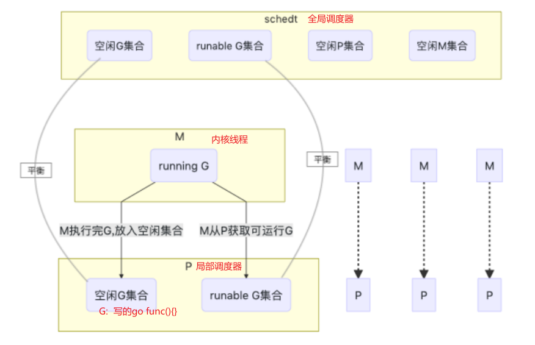

## 第二十一章 协程(goroutine)

> Concurrency is about dealing with lots of things at once. <br>
> Parallelism is about doing lots of things at once.<br>

并发： 指的是程序的逻辑结构。如果程序代码结构中的某些函数逻辑上可以同时运行，但物理上未必会同时运行。<br>
并行： 并行是指程序的运行状态。并行则指的就是在物理层面也就是使用了不同 CPU 在执行不同或者相同的任务。

### 并发

```go
并发是在同一时间处理多件事情。
并发的目的在于把单个 CPU 的利用率使用到最高。

并行是在同一时间做多件事情。
并行则需要多核 CPU 的支持。

协程,也称轻量线程，它不由系统而由应用程序创建和管理，因此使用开销较低（一般为4K）
我们可以创建很多的协程，并且它们跑在同一个内核线程之上的时候，就需要一个调度器来维护这些协程，确保所有的协程都能使用CPU，并且是尽可能公平地使用CPU资源。


调度器的主要有4个重要部分，分别是M、G、P、Sched。

M (work thread)  代表了系统线程内核线程，由操作系统管理。

P (processor)    衔接M和G的调度上下文，它负责将等待执行的G与M对接。P的数量可以通过GOMAXPROCS()来设置，它其实也就代表了真正的并发度，即有多少个goroutine可以同时运行。

G (goroutine)    协程的实体，包括了调用栈，重要的调度信息，例如channel等。


在操作系统的内核线程和编程语言的用户线程之间，实际上存在3种线程对应模型，也就是：1:1，1:N，M:N。

N:1 多个（N）用户线程始终在一个内核线程上跑，context上下文切换很快，但是无法真正的利用多核。
1:1 一个用户线程就只在一个内核线程上跑，这时可以利用多核，但是上下文切换很慢，切换效率很低。
M:N 多个协程在多个内核线程上跑，这个可以集齐上面两者的优势，但是无疑增加了调度的难度。


M:N 综合两种方式（N:1，1:1）的优势。多个协程可以在多个内核线程上处理。既能快速切换上下文，也能利用多核的优势，而Go正是选择这种实现方式。

Go 语言中的协程是运行在多核CPU中的(通过runtime.GOMAXPROCS(1)设定CPU核数)。 实际中运行的CPU核数未必会和实际物理CPU数相吻合。

每个协程都会被一个特定的P(某个CPU)选定维护，而M(物理计算资源)每次挑选一个有效P，然后执行P中的协程。

每个P会将自己所维护的协程放到一个G队列中，其中就包括了协程堆栈信息，是否可执行信息等等。

默认情况下，P的数量与实际物理CPU的数量相等。当我们通过循环来创建协程时，协程会被分配到不同的G队列中。 而M的数量又不是唯一的，当M随机挑选P时，也就等同随机挑选了协程。

所以，当我们碰到多个协程的执行顺序不是我们想象的顺序时就可以理解了，因为协程进入P管理的队列G是带有随机性的。

P维护着这个队列（称之为runqueue），Go语言里，启动一个协程很容易：go function 就行，所以每有一个go语句被执行，runqueue队列就在其末尾加入一个协程，在下一个调度点，就从runqueue中取出一个协程执行。

```




假如有两个 M，即两个内核线程，分别对应一个 P，每一个 P 调度一个 G 队列。如此一来，就组成的协程运行时的基本结构：

-   当有一个 M 返回时，它必须尝试取得一个 P 来运行协程，一般情况下，它会从其他的 OS Thread 线程那里窃取一个 P 过来，如果没有拿到，它就把协程放在一个 global runqueue 里，然后自己进入线程缓存里。

-   如果某个 P 所分配的任务 G 很快就执行完了，这会导致多个队列存在不平衡，会从其他队列中截取一部分协程到 P 上进行调度。一般来说，如果 P 从其他的 P 那里要取任务的话，一般就取 run queue 的一半，这就确保了每个内核线程都能充分的使用。

-   当一个内核线程被阻塞时，P 可以转而投奔另一个内核线程。

```go

结构
        			M ... M, M  (n cores)
          	/    \
        	 P       P
         /   		    \
      [G,G,G,G] [G,G,G,G,G] ....

在实际中运行速度延缓可能不一定仅仅是由于CPU的竞争，可能还有内存或者I/O的原因导致的，我们需要根据情况仔细分析。

最后，runtime.Gosched()用于让出CPU时间片，让出当前协程的执行权限，调度器安排其他等待的任务运行，并在下次某个时候从该位置恢复执行。


```

### goroutine

```go
func main() {
	for i := 1; i < 10; i++ {
		go func(i int) {
			fmt.Println(i)
		}(i)
	}
	// 暂停一会，保证打印全部结束
	time.Sleep(1e9)
}

有关于协程之间的通信以及协程与主线程的控制以及多个协程的管理和控制，我们后续通过channel、context以及锁来进一步说明。
```

## 第二十二章 通道(channel)

### 通道(channel)

**channel 是协程之间互相通信的通道**，协程之间可以通过它发送消息和接收消息。
也可以传递指针

```go
通道消息传递与消息类型也有关系，一个通道只能传递（发送send或接收receive）类型的值，这需要在声明通道时指定。
默认情况下，通道是阻塞的 (叫做无缓冲的通道)。


创建channel的两种方式

var channel chan int = make(chan int)
// 或
channel := make(chan int)


Go中通道可以是发送（send）、接收（receive）、同时发送（send）和接收（receive）


// 定义接收的通道
receive_only := make (<-chan int)

// 定义发送的通道
send_only := make (chan<- int)

// 可同时发送接收
send_receive := make (chan int)
```

定义只发送或只接收的通道意义不大，一般用于在参数传递中：

```go

func main() {
	c := make(chan int) // 不使用带缓冲区的通道
	go send(c)
	go recv(c)
	time.Sleep(3 * time.Second)
close(c)
}

// 只能向chan里send数据
func send(c chan<- int) {
	for i := 0; i < 10; i++ {

		fmt.Println("send readey ", i)
		c <- i
		fmt.Println("send ", i)
	}
}

// 只能接收通道中的数据
func recv(c <-chan int) {
	for i := range c {
		fmt.Println("received ", i)
	}
}

缺点是:往通道发送数据后，这个数据如果没有被取走，通道是阻塞的，也就是不能继续向通道里面发送数据。

上面代码中，我们没有指定通道缓冲区的大小，默认情况下是阻塞的。

应该用带缓冲区的channel
```

```go
我们可以建立带缓冲区的通道：

c := make(chan int, 1024)//示例


func main() {
	c := make(chan int, 10) // 使用带缓冲区的通道
	go send(c)
	go recv(c)
	time.Sleep(3 * time.Second)
	close(c)
}

// 只能向chan里send发送数据
func send(c chan<- int) {
	for i := 0; i < 10; i++ {

		fmt.Println("send readey ", i)
		c <- i
		fmt.Println("send ", i)
	}
}

// 只能接收通道中的数据
func recv(c <-chan int) {
	for i := range c {
		fmt.Println("received ", i)
	}
}

// 程序输出：

// send readey  0
// send  0
// send readey  1
// send  1
// send readey  2
// send  2
// send readey  3
// send  3
// send readey  4
// send  4
// send readey  5
// received  0
// received  1
// received  2
// received  3
// received  4
// received  5
// send  5
// send readey  6
// send  6
// send readey  7
// send  7
// send readey  8
// send  8
// send readey  9
// send  9
// received  6
// received  7
// received  8
// received  9


从运行结果我们可以看到（每次执行顺序不一定相同，协程运行导致的原因），带有缓冲区的通道，在缓冲区有数据而未填满前，读取不会出现阻塞的情况。
```

```go
1.无缓冲的通道（unbuffered channel）
		是指在接收前没有能力保存任何值的通道。
		这种类型的通道要求发送协程和接收协程同时准备好，才能完成发送和接收操作。如果两个协程没有同时准备好，通道会导致先执行发送或接收操作的协程阻塞等待。
		这种对通道进行发送和接收的交互行为本身就是同步的。

2.有缓冲的通道（buffered channel）
    是一种在被接收前能存储一个或者多个值的通道。
    这种类型的通道并不强制要求协程之间必须同时完成发送和接收。通道会阻塞发送和接收动作的条件也会不同。只有在通道中没有要接收的值时，接收动作才会阻塞。只有在通道没有可用缓冲区容纳被发送的值时，发送动作才会阻塞。
```

==无缓冲的通道保证进行发送和接收的协程会在同一时间进行数据交换；有缓冲的通道没有这种保证。==

==如果给定了一个缓冲区容量，通道就是异步的。只要缓冲区有未使用空间用于发送数据，或还包含可以接收的数据，那么其通信就会无阻塞地进行。==

### 关闭 channel

```go
可以通过内置的close函数来关闭通道实现。

* 通道不需要经常去关闭，只有当没有任何可发送数据时才去关闭通道；

* 关闭通道后，无法向通道再发送数据(引发panic 错误后导致接收立即返回零值)；

* 关闭通道后，可以继续向通道接收数据，不能继续发送数据；

* 对于nil 通道，无论收发都会被阻塞。

```

##　第二十三章 同步与锁

### 同步锁

1.sync.Mutex 互斥锁(也叫全局锁)

```go
调用Lock（）获得锁，调用unlock（）释放锁。
1.Lock
	- 使用Lock()加锁后，不能再继续对其加锁（同一个goroutine中，即：同步调用），否则会panic。
	- 只有在unlock()之后才能再次Lock()。
	- 异步调用Lock()，是正当的锁竞争，当然不会有panic了。

	- 适用于读写不确定场景，即读写次数没有明显的区别，并且只允许只有一个读或者写的场景.

2.Unlock
	- 如果在使用Unlock()前未加锁，就会引起一个运行错误
	- 已经锁定的Mutex并不与特定的goroutine相关联，这样可以利用一个goroutine对其加锁，再利用其他goroutine对其解锁。
```

```go
建议：同一个互斥锁的成对锁定和解锁操作放在同一层次的代码块中。
使用锁的经典模式：

var lck sync.Mutex
func foo() {
    lck.Lock()
    defer lck.Unlock() // 释放锁
    // ...
}


lck.Lock()会阻塞直到获取锁，然后利用defer语句在函数返回时自动释放锁。

```

Example

```go

func main() {
	wg := sync.WaitGroup{}

	var mutex sync.Mutex
	fmt.Println("Locking  (G0)")
	mutex.Lock()
	fmt.Println("locked (G0)")
	wg.Add(3)

	for i := 1; i < 4; i++ {
		go func(i int) {
			fmt.Printf("Locking (G%d)\n", i)
			mutex.Lock() // 只有锁释放了才能往后执行。
			fmt.Printf("locked (G%d)\n", i)

			time.Sleep(time.Second * 2)
			mutex.Unlock()
			fmt.Printf("unlocked (G%d)\n", i)
			wg.Done()
		}(i)
	}

	time.Sleep(time.Second * 5)
	fmt.Println("ready unlock (G0)")
	mutex.Unlock()
	fmt.Println("unlocked (G0)")

	wg.Wait()
}

/*
程序输出：
Locking  (G0)
locked (G0)
Locking (G1)
Locking (G3)
Locking (G2)
ready unlock (G0)
unlocked (G0)
locked (G1)
unlocked (G1)
locked (G3)
locked (G2)
unlocked (G3)
unlocked (G2)
*/

```

```go
Mutex也可以作为struct的一部分，这样这个struct就会防止被多线程更改数据。

type Book struct {
	BookName string
	L        *sync.Mutex
}

func (bk *Book) SetName(wg *sync.WaitGroup, name string) {
	defer func() {
		fmt.Println("Unlock set name:", name)
		bk.L.Unlock()
		wg.Done()
	}()

	bk.L.Lock()
	fmt.Println("Lock set name:", name)
	time.Sleep(1 * time.Second)
	bk.BookName = name
}

func main() {
	bk := Book{}
	bk.L = new(sync.Mutex)
	wg := &sync.WaitGroup{}
	books := []string{"《三国演义》", "《道德经》", "《西游记》"}
	for _, book := range books {
		wg.Add(1)
		go bk.SetName(wg, book)
	}

	wg.Wait()
}

```

2.sync.RWMutex 读写锁。

读写锁是分别针对读操作和写操作进行锁定和解锁操作的互斥锁。在 Go 语言中，读写锁由结构体类型 sync.RWMutex 代表。

基本遵循原则：

-   写锁定情况下，对读写锁进行读锁定或者写锁定，都将阻塞；而且读锁与写锁之间是互斥的；

-   读锁定情况下，对读写锁进行写锁定，将阻塞；加读锁时不会阻塞；

-   对未被写锁定的读写锁进行写解锁，会引发 panic；

-   对未被读锁定的读写锁进行读解锁的时候也会引发 panic；

-   写解锁在进行的同时会试图唤醒所有因进行读锁定而被阻塞的协程；

-   读解锁在进行的时候则会试图唤醒一个因进行写锁定而被阻塞的协程。

```go
RWMutex提供四个方法：

func (*RWMutex) Lock // 写锁定
func (*RWMutex) Unlock // 写解锁

func (*RWMutex) RLock // 读锁定
func (*RWMutex) RUnlock // 读解锁

```

```go

var m *sync.RWMutex

func main() {
	wg := sync.WaitGroup{}
	wg.Add(20)
	var rwMutex sync.RWMutex
	Data := 0
	for i := 0; i < 10; i++ {
		go func(t int) {
			rwMutex.RLock()
			defer rwMutex.RUnlock()
			fmt.Printf("Read data: %v\n", Data)
			wg.Done()
			time.Sleep(2 * time.Second)
			// 这句代码第一次运行后，读解锁。
			// 循环到第二个时，读锁定后，这个协程就没有阻塞，同时读成功。
		}(i)

		go func(t int) {
			rwMutex.Lock()
			defer rwMutex.Unlock()
			Data += t
			fmt.Printf("Write Data: %v %d \n", Data, t)
			wg.Done()

			// 这句代码让写锁的效果显示出来，写锁定下是需要解锁后才能写的。
			time.Sleep(2 * time.Second)
		}(i)
	}
	time.Sleep(5 * time.Second)
	wg.Wait()
}

/*
Read data: 0
Write Data: 0 0
Read data: 0
Read data: 0
Read data: 0
Read data: 0
Read data: 0
Read data: 0
Read data: 0
Read data: 0
Read data: 0
Write Data: 1 1
Write Data: 3 2
Write Data: 6 3
Write Data: 10 4
Write Data: 15 5
Write Data: 21 6
Write Data: 29 8
Write Data: 38 9
Write Data: 45 7
*/

```

### sync.WaitGroup

WaitGroup，它用于线程同步

-   WaitGroup 等待一组线程集合完成，才会继续向下执行。
-   主线程(goroutine)调用 Add 来设置等待的线程(goroutine)数量。
-   然后每个线程(goroutine)运行，并在完成后调用 Done。
-   同时，Wait 用来阻塞，直到所有线程(goroutine)完成才会向下执行。
-   Add(-1)和 Done()效果一致。

```go

func main() {
	var wg sync.WaitGroup
	for i := 0; i < 10; i++ {
		wg.Add(1)
		go func(t int) {
			defer wg.Done()
			fmt.Println(t)
		}(i)
	}
	wg.Wait()
}
/*
9
3
2
0
6
4
7
5
8
1
*/
```

### sync.Once

sync.Once.Do(f func())能保证 once 只执行一次,这个 sync.Once 块只会执行一次。

```go

var once sync.Once

func main() {

	for i, v := range make([]string,5) {
		once.Do(onces)
		fmt.Println("v:", v, "---i:", i)
	}

	for i := 0; i <5; i++ {

		go func(i int) {
			once.Do(onced)
			fmt.Println(i)
		}(i)
	}
	time.Sleep(4000)
}
func onces() {
	fmt.Println("onces")
}
func onced() {
	fmt.Println("onced")
}

/*
onces
v:  ---i: 0
v:  ---i: 1
v:  ---i: 2
v:  ---i: 3
v:  ---i: 4
0
4
3
1
2
*/
```

### sync.Map

sync.map，它是原生支持并发安全的 map。虽然说普通 map 并不是线程安全（或者说并发安全），但一般情况下我们还是使用它，因为这足够了；

==只有在涉及到线程安全，再考虑 sync.map==
==但由于 sync.Map 的读取并不是类型安全的，所以我们在使用 Load 读取数据的时候我们需要做类型转换。==

sync.Map 的使用上和 map 有较大差异，

```go

func main() {
	var m sync.Map

	//Store
	m.Store("name", "Joe")
	m.Store("gender", "Male")

	//LoadOrStore
	//若key不存在，则存入key和value，返回false和输入的value
	v, ok := m.LoadOrStore("name1", "Jim")
	fmt.Println(ok, v) //false Jim

	//若key已存在，则返回true和key对应的value，不会修改原来的value
	v, ok = m.LoadOrStore("name", "aaa")
	fmt.Println(ok, v) //true Joe

	//Load
	v, ok = m.Load("name")
	if ok {
		fmt.Println("key存在，值是： ", v)
	} else {
		fmt.Println("key不存在")
	}

	//Range
	//遍历sync.Map
	f := func(k, v interface{}) bool {
		fmt.Println(k, v)
		return true
	}
	m.Range(f)// 内部写函数进行map

	//Delete
	m.Delete("name1")
	fmt.Println(m.Load("name1"))

}


/*

程序运行输出：

false Jim
true Joe
key存在，值是：  Joe
name Joe
gender Male
name1 Jim
<nil> false
*/
```
