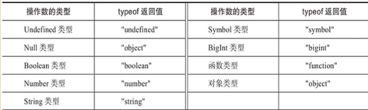
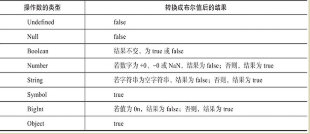
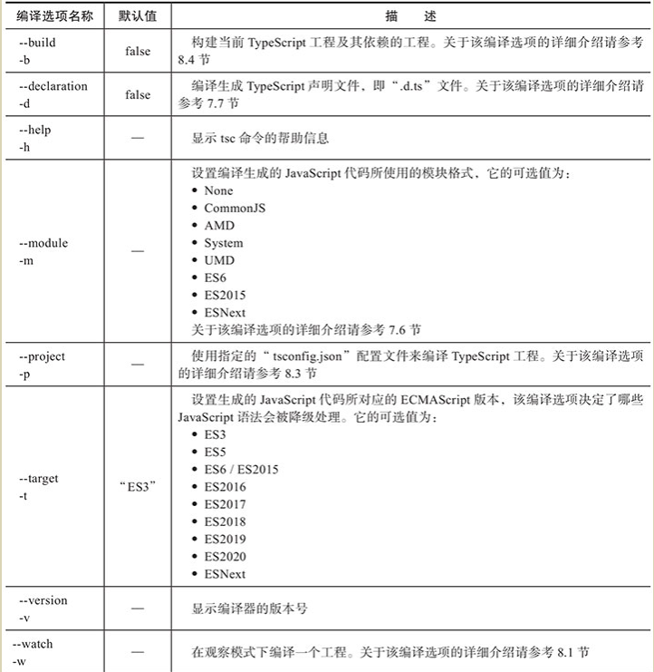

```tsx
Array中有 ReadonlyArray<T>,
const red:readonly number[]=[255,0,0]
enum有enum和const enum Direactions{}
const enum Direactions{}
Object 与object不同

Object类型的用途是描述“Object.prototype”对象的类型，即所有
对象共享的属性和方法。在描述自定义对象类型时用object即可
在object类型上仅允许访问对象的公共属性和方法，也就是Object类型中定义的属性和方法。
const obj: object = {};
obj.toString();
obj.valueOf();


readonly ? 默认的any
元组中的元素可选 [T0, T1?, T2?, T3?]
```

```tsx
全局的Object类型用于描述对象公共的属性和方法，它相当于一种专用类型，因此程序中不应该将自定义变量、参数等类型直接声明为Object类型。空对象类型字面量“{}”强调的是不包含属性的对象类型，同时也可以作为Object类型的代理来使用
```

```tsx
弱类型
对象类型中至少包含一个属性。
对象类型中所有属性都是可选属性。
对象类型中不包含字符串索引签名、数值索引签名、调用签名和构造签名
let config: {
    url?: string;
    async?: boolean;
    timeout?: number;
};


索引签名
const point: {
    x: number;
    [prop: string]: number; // 索引签名
} = { x: 0, y: 0 };

```

```tsx
函数
可选参数?
默认参数类型
在调用定义了剩余参数的函数时，剩余参数可以接受零个或多个实际参数
function f(...args: number[]) {} //剩余参数的类型也可以定义为元组类型
function f(...args: [boolean, string?]) {} //可选元素的元组类型
function f0(...args: [boolean, ...string[]]) {} //带有剩余元素的元组类型


参数解构
function f0([x, y]) {}
f0([0, 1]);

function f0([x, y]: [number, number]) {}
f0([0, 1]);
function f1({ x, y }: { x: number; y: number }) {}
f1({ x: 0, y: 1 });


void使用，返回undefined或者根本不调用return语句
let f: () => void;
f = function () { /* no-op */ };
参数名称可以不一致
let f: (x: number) => number;
f = function (y: number): number {
   return y;
};
调用带有调用签名的对象类型字面量对f进行描述，
function f(x: number) {
     console.log(x);
 }
f.version = '1.0';

let foo: { (x: number): void; version: string } = f;
const version = foo.version;  // string类型


```

```tsx
Error类型
const a = new Error()
const b = new Error('Error message.')
构造函数的类型
let ErrorConstructor: new (message?: string) => Error

构造签名与调用签名
declare const F: {
	new (x: number): Number // <- 构造签名
	(x: number): number // <- 调用签名
}
// 作为普通函数调用
const a: number = F(1)
// 作为构造函数调用
const b: Number = new F(1)
```

```tsx
函数重载

function add(x: number, y: number): number;
function add(x: any[], y: any[]): any[];
//在各个函数重载语句之间以及函数重载语句与函数实现语句之间不允许出现任何其他语句
// 函数实现必须位于最后
function add(x: number | any[], y: number | any[]): any {
    // 省略了实现代码
}
函数实现需要兼容每个函数重载中的函数签名，函数实现的函数签名类型必须能够赋值给函数重载的函数签名类型。

开发者在编写函数重载代码时一定要将最精确的函数重载定义放在最前面，因为它们定义的顺序将影响函数调用签名的选择


***
可以使用如下对象类型字面量来表示重载函数f的类型
{
    (x: string): 0 | 1;
    (x: any): number;
}

函数实现的函数签名不属于重载函数的调用签名之一。
调用签名的书写顺序是有意义的，它决定了函数重载的解析顺序，一定要确保更精确的调用签名位于更靠前的位置。
```

```tsx
this值的类型

function foo(this: { name: string } | void) {
	this.name = 'Patrick'
	this.name = 0
	//  编译错误！类型 0 不能赋值给类型 'string'
}
```

```tsx
Interface
类似于对象类型字面量，接口类型也能够表示任意的对象类型。
不同的是，接口类型能够给对象类型命名以及定义类型参数.
接口类型无法表示原始类型，如boolean类型等。
```

```tsx
Interface五类

属性签名
interface Point {
    x: number;
    y: number;
 }
调用签名
interface ErrorConstructor {
    (message?: string): Error;
}
构造签名
interface ErrorConstructor {
    new (message?: string): Error;
}
方法签名
    interface Document {
       getElementById(elementId: string): HTMLElement | null;
    }
    A==B==C
    interface A {
        f(x: boolean): string;       // 方法签名
    }
    interface B {
        f: { (x: boolean): string }; // 属性签名和对象类型字面量
     }
    interface C {
        f: (x: boolean) => string;   // 属性签名和函数类型字面量
     }
     可计算属性名
    const f = 'f';
    interface A {
        [f](x: boolean): string;
    }

     重载方法
     interface A {
         f(): number;
         f(x: boolean): boolean;
         f(x: string, y: string): string;
     }


索引签名  -通过下标访问
	一个接口中最多只能定义一个数值索引签名(最终也会被转成字符串进行访问)
    一个接口中最多只能定义一个字符串索引签名
interface A {
     [prop: string]: number;
}
interface B {
     [prop: number]: number;
}

这样也是可以的，因为值都是Number,
interface A {
     [prop: string]: number;
     [prop: number]: 0 | 1;
}
```

```tsx
Interface 可选属性与方法

如果接口中定义了重载方法，那么所有重载方法签名必须同时为必选的或者可选的
// 正确
interface Foo {
    a(): void;
    a(x: boolean): boolean;
    b?(): void;
    b?(x: boolean): boolean;
}

interface A {
    readonly a: string;
    x:string;
    readonly [prop: string]: string;
    readonly [prop: number]: string;
}
x可以被修改，其他都是只读
```

```tsx
Interface继承  extends关键字
    接口
    类
    对象类型的类型别名
    对象类型的交叉类型


interface Style {
       name:string
       draw(): { color: string };
}
interface Shape {
   draw(): { x: number; y: number };
}
子接口中的同名成员必须兼容所有父接口中的类型
interface Circle extends Style, Shape {
   draw(): { color: string; x: number; y: number };//权重高，但必须与所有父接口中方法类型兼容
}

```

```tsx
Type 类型别名

type Numeric = number | bigint;
// string | number | bigint
type StringOrNumber = string | Numeric;

1.以下场景中可以使用递归的类型别名
	1)若类型别名引用的类型为接口类型、对象类型字面量、函数类型字面量和构造函数类型字面量，
     则允许递归引用类型别名
     type T0 = { name: T0 };
	 type T1 = () => T1;
	 type T2 = new () => T2;


    2)若类型别名引用的是数组类型或元组类型，则允许在元素类型中递归地引用类型别名。
    type T0 = Array<T0>;
    type T1 = T1[];
    type T3 = [number, T3];

    3)若类型别名引用的是泛型类或泛型接口，则允许在类型参数中递归的引用类型别名
    interface A<T> {
      name: T;
    }
    type T0 = A<T0>;
    class B<T> {
        name: T | undefined;
    }
    type T1 = B<T1>;


```

```tsx
Interface与Type区别
1.Type能够表示非对象类型，而interface则只能表示对象类型。
	type NumericType = number | bigint;
2.interface可以继承其他的interface、class等对象类型，而type则不支持继承。
  但能继承object类型的type,
  如果类型别名表示非对象类型，则无法使用该方法。
    type Shape = { name: string };
    type Circle = Shape & { radius: number };
    function foo(circle: Circle) {
      const name = circle.name;
      const radius = circle.radius;
    }
3.Interface总是会显示在编译器的诊断信息（例如，错误提示和警告）和代码编辑器的智能提示信息中，而Type只在特定情况下才会显示出来
4.Interface有声明合并的行为，而类型别名则不会进行声明合并

    interface A {
        x: number;
    }
    interface A {
        y: number;
    }

    //合并为
    interface A {
        x: number;
        y: number;
    }


```

## Class

```tsx
类名大写
与函数声明不同的是，类声明不会被提升，因此必须先声明后使用。
不允许声明同名的类

匿名类
const Circle = class {
     radius: number;
};
const Circle1 = class Child {
     radius: number;
};
const a = new Circle();
const b=new Child() // 错误，不能这么用，只能 new Circle1()
类表达式中定义了类名，则该类名只能够在类内部使用，在类外不允许引用该类名
TypeScript提供了“--strictPropertyInitialization”编译选项来帮助严格检查未经初始化的成员变量
class Circle {
    radius: number = 1;
    readonly b:number=2;
    a!:number  //断言，避免无初始值的检查
    area(): number {
        return Math.PI * this.radius * this.radius;
    }
}

如果一个类属性同时定义了get方法和set方法
那么get方法的返回值类型必须与set方法的参数类型一致
必须具有相同的可访问性


```

-   readonly
-   static 只允许通过类名来访问。const v=Circle.version //通过 class 访问。
-   public 默认值， 可以在当前类的内部、外部以及派生类的内部访问
-   protected 类的受保护成员允许在当前类的内部和派生类的内部访问，但是不允许在当前类的外部访问。例如 const base=new Base() base.s //错误
-   private 仅当前内部使用，在当前类的外部以及派生类的内部都不允许访问
-   ES 支持使用 #myVal 设置和访问私有字段。

```tsx
Class 寄存器 get set

class Circle {
    private _radius: number = 0;
    get radius(): number {
        return this._radius;
     }
    set radius(value: number) {
        if (value >= 0) {
            this._radius = value;
        }
    }
}

const circle = new Circle();
circle.radius; // 0
circle.radius = -1;
circle.radius; // 0
circle.radius = 10;
circle.radius; // 10
```

```tsx
构造函数 constructor
可以定义可选参数、默认值参数和剩余参数。不允许定义返回值类型
因为构造函数的返回值类型永远为类的实例类型。
可设置为private constructor(){},只能内部构件

可以重载

class A {
    constructor(x: number, y: number);
    constructor(s: string);
    constructor(xs: number | string, y?: number) {}
}
const a = new A(0, 0);
const b = new A('foo');


在构造函数参数列表中，为形式参数添加任何一个可访问性修饰符或者readonly修饰符，该形式参数就成了参数成员，进而会被声明为类的成员变量
class A {
   constructor(
      public x: number,
      protected y: number,
      private z: number,
      readonly t: number
   ) {}
}
const a=new A(0,1,2,3)
a.x // 值为0

class B {
    constructor(readonly x: number) {}
}
```

```tsx
继承， 只能继承一个类,
但一个类可以继承多个interface，但必须实现interface里的所有成员。
interface Color {
   color: string;
}

interface Shape {
    area(): number;
}

class Circle implements Shape, Color {
   radius: number = 1;

   color: string = 'black';

   area(): number {
        return Math.PI * this.radius * this.radius;
     }
}


super是为了继承BaseClass的内部非私有成员，外部构造后访问是可以直接访问BaseClass的成员的。
class Shape {
    color: string = 'black';

    switchColor() {
          this.color =
          this.color === 'black' ? 'white' : 'black';
    }
}

class Circle extends Shape {
    switchColor() {
        super.switchColor();
        console.log(`Color is ${this.color}.`);
    }
}

const circle = new Circle();

circle.switchColor();
circle.switchColor();

// 打印：
// Color is white.
// Color is black.

在实例化派生类时的初始化顺序如下：
1）初始化基类的属性。
2）调用基类的构造函数。
3）初始化派生类的属性。
4）调用派生类的构造函数。


Interface继承一个Class，会继承基类中所有成员的类型
class A {
    x: string = '';
    y(): boolean {
        return true;
   }
}

interface B extends A {}
declare const b: B;

b.x;   // 类型为string
b.y(); // 类型为boolean

Interface不但会继承Class的公有成员类型，还会继承class的受保护成员类型和私有成员类型。
如果interface从class继承了非公有成员，那么该接口只能由class或class的子类来实现.

// 正确，A 可以实现接口 I，因为私有属性和受保护属性源自同一个类 A
class A implements I {
    private x: string = '';
    protected y: string = '';
}
// 接口 I 能够继承 A 的私有属性和受保护属性
interface I extends A {}
// 正确，B 可以实现接口 I，因为私有属性和受保护属性源自同一个类 A
class B extends A implements I {}
// 错误！C 不是 A 的子类，无法实现 A 的有属性和受保护属性
class C implements I {}


```

抽象类和抽象成员

```tsx
抽象类和抽象成员 抽象类不能被实例化,作用是作为基类使用
抽象类可以继承其他抽象类
如果一个具体类继承了抽象类，那么在具体的派生类中必须实现抽象类基类中的所有抽象成员
 abstract class Base {
    abstract a: string;

   abstract get accessor(): string;
   abstract set accessor(value: string);

   abstract method(): boolean;
}

class Derived extends Base {
   // 实现抽象属性 a
   a: string = '';
   // 实现抽象存取器accessor
    private _accessor: string = '';
    get accessor(): string {
       return this._accessor;
   }
   set accessor(value: string) {
      this._accessor = value;
   }
   // 实现抽象方法 method
   method(): boolean {
       return true;
    }
}


```

```tsx
Class中的This类型
this可以链式调用，它们返回的是当前实例对象

this类型不允许应用于类的静态成员。

class Counter {
   private count: number = 0;
   public add(): this {
        this.count++;
      return this;
  }
   public subtract(): this {
        this.count--;
       return this;
   }

    public getResult(): number {
      return this.count;
  }
}
const counter = new Counter();
counter.add().add().subtract().getResult(); // 结果为1


B extends A, B中的this跨class使用后this会变成A
class A {
    foo(): this {
        return this;
    }
}

class B extends A {
    bar(): this {
        return this;
   }
}
const b = new B();
const x = b.bar().foo(); //类型为B


class Circle {
    radius: number;
   area(): number {
        return Math.PI * this.radius * this.radius;
    }
}
 interface CircleType {
    radius: number;
   area(): number;
}
13 // 正确
const a: Circle = new Circle();
16 // 正确
const b: CircleType = new Circle();


```

类型进阶

-   带有类型参数的泛型

    具有块级作用域的局部类型

    常用的联合类型和交叉类型

    实用的索引类型、映射对象类型以及条件类型

    TypeScript 内置的实用工具类型

    能够获取表达式类型的类型查询

    类型断言与类型细化。

```tsx
泛型
function identity<T>(arg: T): T {
   return arg;
}


//<T = U, U = boolean> // 错误
//<T = boolean, U = T> // 正确

类型约束，至少为约束的类型
interface Point {
    x: number;
    y: number;
}

function identity<T extends Point>(x: T): T {
    return x;
}

// 正确
identity({ x: 0, y: 0 });
identity({ x: 0, y: 0, z: 0 });

identity({ x: 0 });
//       ~~~~~~~~
//       编译错误！类型 '{ x: number; }' 不能赋值给类型 Point


泛型约束引用类型参数
//<T, U extends T>
//<T extends U, U>
//<T extends U>    // 类型参数T的基约束为类型参数U


function f3<T, U>(a: T[], f: (x: T) => U): U[] {
    return a.map(f);
}

const a: boolean[] = f3<number, boolean>([0, 1, 2], n => !!n);

如果没有必要用泛型的时候，最好不要用泛型。


泛型接口
interface MyArray<T> extends Array<T> {
    first: T | undefined;
    last: T | undefined;
}

泛型类型别名

type Container<T> = { value: T };
const a: Container<number> = { value: 0 };
const b: Container<string> = { value: 'b' };


泛型类
class Container<T> {
    constructor(private readonly data: T) {}
}
const a = new Container<boolean>(true);
const b = new Container<number>(0);


静态参数static不能使用 class的泛型T
interface A<T> {
    a: T;
}
class Base<T> {
   b?: T;
}
class Derived<T> extends Base<T> implements A<T> {
   constructor(public readonly a: T) {
      super();
    }
}

```

局部类型

-   局部枚举类型
    局部类类型
    局部接口类型
    局部类型别名

```tsx
function f(x: boolean) {
	if (x) {
		interface T {
			x: number
		}

		const v: T = { x: 0 }
	} else {
		interface T {
			x: string
		}
		const v: T = { x: 'foo' }
	}
}
```

联合类型 |, 交叉类型 &

​ 交叉类型的顺序会影响重载签名的解析顺序

```tsx
interface T0 {
	new (name: string): Date
}
interface T1 {
	new (name: string): Error
}
type T = T0 | T1
interface T0T1 {
	new (name: string): Date | Error
}
interface Circle {
	area: bigint
}
interface Rectangle {
	area?: number
}
declare const s: Circle | Rectangle
s.area // bigint | number | undefined

交叉类型
interface Clickable {
	click(): void
}
interface Focusable {
	focus(): void
}
interface Scrollable {
	scroll(): void
}
type T0 = (Clickable & Focusable) & Scrollable
type T1 = Clickable & (Focusable & Scrollable)
```

```tsx
交叉类型属性

interface A {
     x: boolean;
     y?: string;
}
interface B {
    x?: boolean;
    y?: string;
}
//结果为
{
    x: boolean; //在“A & B”交叉类型中，属性x是必选属性，属性y是可选属性。
    y?: string;
}

索引签名

interface A {
     [prop: string]: string;
}
interface B {
    [prop: number]: string;
}
{
    [prop: string]: string;
    [prop: number]: string;
}

调用签名与构造签名
若交叉类型的成员类型中含有调用签名或构造签名，那么这些调用签名和构造签名将以成员类型的先后顺序合并到交叉类型中
```

Keyof

```tsx
索引类型  keyof是关键字
索引类型查询的结果是由字符串字面量类型构成的联合类型

interface Point {
    x: number;
    y: number;
}

type T = keyof Point; // 'x' | 'y'

索引类型查询的结果类型是联合类型“string | number |symbol”的子类型
interface T {
    [prop: string]: number;
}

// string | number
type KeyofT = keyof T;


interface T {
    0: boolean;
    a: string;
    b(): void;
}
// 0 | 'a' | 'b'
type KeyofT = keyof T;
它们的属性名分别为数字0、字符串“'a'”和字符串“'b'”。因此，KeyofT类型为联合类型“0 | 'a' | 'b'”


interface Boolean {
    valueOf(): boolean;
}
type KeyofT = keyof boolean; // 'valueOf'

联合类型
type A = { a: string; z: boolean };
type B = { b: string; z: boolean };
type KeyofT = keyof (A | B);  // 'z'

交叉类型
type A = { a: string; x: boolean };
type B = { b: string; y: number };
type KeyofT = keyof (A & B); // 'a' | 'x' | 'b' | 'y'


```

```tsx
索引访问类型

const s: unique symbol = Symbol()
enum E {
	A = 10,
}
type T = {
	a: true
	0: string // 数字字面量属性名
	x: boolean // 字符串字面量属性名
	[E.A]: number // 枚举成员字面量属性名

	[s]: bigint // unique symbol
}
type TypeOfNumberLikeName = T[a] //boolean
type TypeOfNumberLikeName = T[0] // string
type TypeOfStringLikeName = T['x'] // boolean
type TypeOfEnumName = T[E.A] // number
type TypeOfSymbolName = T[typeof s] // bigint

同名属性的类型拥有更高的优先级

索引类型的使用
function getProperty<T, K extends keyof T>(obj: T, key: K): T[K] {
	return obj[key]
}

interface Circle {
	kind: 'circle'
	radius: number
}

function f(circle: Circle) {
	// 正确，能够推断出 radius 的类型为 'circle' 类型
	const kind = getProperty(circle, 'kind')

	// 正确，能够推断出 radius 的类型为 number 类型
	const radius = getProperty(circle, 'radius')

	// 错误
	const unknown = getProperty(circle, 'unknown')
	//                                   ~~~~~~~~~
	// 编译错误：'unknown'类型不能赋值给'kind' |'radius'
}
```

## 映射对象类型 Keyof

```tsx
映射对象类型
symbol”，因为只有这些类型的值才能作为对象的键；P是类型变量，代表每次遍历出来的成员类型；T是任意类型，表示对象属性的类型，并且在类型T中允许使用类型变量P。

type K = 'x' | 'y';
type T = number;
type MappedObjectType = { readonly [P in K]?: T };


若当前遍历出来的类型成员P为数字字面量类型，则在结果对象类型中创建一个新的属性成员，属性名类型为该数字字面量类型且属性值类型为T
// { [x: number]: boolean }
type MappedObjectType = { [P in number]: boolean };

```

## Keyof 应用

```tsx
将映射对象类型、索引类型查询以及索引访问类型三者结合才能够最大限度地体现映射对象类型的威力。

type T = { a: string; b: number };
// { a: string; b: number; } 复制了一份类型给M
type M = { [P in keyof T]: T[P] };


实例
type T = { a: string; b: number };
// { a?: string; b?: number; }
type OptionalT = { [P in keyof T]?: T[P] };


```

同态映射对象类型==>

​ 映射后的对象类型结构与源对象类型 T 的结构完全一致

​ 同态映射对象类型与源对象类型之间有着相同的属性集合。

```tsx
HMOT是同态映射对象类型，它将源对象类型T的所有属性映射到新的对象类型HMOT，同时保留了每个属性的修饰符
// 同态映射对象类型
type T = { a?: string; readonly b: number };
type HMOT = { [P in keyof T]: T[P] }; // { a?: string; readonly b: number; }

同态映射对象类型的一个重要性质是，新的对象类型会默认拷贝源对象类型中所有属性的readonly修饰符和“?”修饰符
非同态映射对象类型，那么新的对象类型不会拷贝源对象类型T中属性的readonly修饰符和“?”修饰符。


// 非同态映射对象类型
type T = { a?: string; readonly b: number };
type K = keyof T;
type MOT = { [P in K]: T[P] }; // { a: string | undefined; b: number; }
```

添加和移除修饰符

```tsx
“+”修饰符，为映射属性添加“?”修饰符或readonly修饰符
“–”修饰符，为映射属性移除“?”修饰符或readonly修饰符
“+”修饰符和“–”修饰符应用在“?”修饰符和readonly修饰符之前

-? 移除可选   -readonly 移除readonly
{ -readonly [P in keyof T]-?: T[P] }
{ +readonly [P in keyof T]+?: T[P] }

若转换所有属性
type Required<T> = { [P in keyof T]-?: T[P] };


编译器在移除属性a的“?”修饰符时，同时会移除属性类型中的undefined类型，但是不会移除null类型，因此RequiredT类型中属性a的类型为“string | null”类型。


若T为原始类型，则不进行任何映射，同态映射对象类型“HMOT<T, X>”等于类型T。

type HMOT<T, X> = { [P in keyof T]: X };
type T = string;
type R = HMOT<T, boolean>  // <- 与boolean类型无关
       = string


//=========================================================

type HMOT<T, X> = { [P in keyof T]: X };

type T = readonly [string, number];

type R = HMOT<T, boolean>;
       = readonly [boolean, boolean];

//=========================================================

type HMOT<T> = { -readonly [P in keyof T]: T[P] };

type T0 = readonly number[];

type R0 = HMOT<T0>;
        = number[];

type T1 = readonly [string];

type R1 = HMOT<T1>;
        = [string];
```

条件类型(三元表达式)

```ts
条件类型
在实际应用中，条件类型通常与类型参数结合使用
T extends U ? X : Y


```

分布式条件类型

过滤联合类型

```tsx
分布式条件类型
T extends U ? X : Y;
如果T=A | B, 则分布式条件类型会被展开

type T0<T> = T extends string ? true : false;
//           ~
//           裸类型参数

type T1<T> = [T] extends [string] ? true : false;
//            ~
//            非裸类型参数,因为它是元组类型的组成部分


过滤联合类型
下例中的“Exclude<T, U>”类型能够从联合类型T中删除符合条件的类型：
type Exclude<T, U> = T extends U ? never : T;


***
有时候需要避免分布式行为
type CT<T> = T extends string ? true : false;
type T = CT<string | number>; // boolean


(使用元祖类型避免)
避免分布式行为=>
type CT<T> = [T] extends [string] ? true : false;
type T = CT<string | number>; // false


```

infer 关键字

```tsx
infer关键字
T extends U ? X : Y
在extends语句中类型U的位置上允许使用infer关键字来"定义"可推断的类型变量，
可推断的类型变量只允许在条件类型的true分支中引用，即类型X的位置上使用
T extends infer U ? U : Y;

使用infer声明"定义"了可推断的类型变量U。
当编译器解析该条件类型时，会根据T的实际类型来推断类型变量U的实际类型
type CT<T> = T extends Array<infer U> ? U : never;
type T = CT<Array<number>>;    // number


type ReturnType<
T extends (...args: any) => any
> = T extends (...args: any) => infer R ? R : any;
//使用 “ReturnType<T>”类型接受函数类型的类型参数，并返回函数的返回值类型
type F = (x: number) => string;
type T = ReturnType<F>;    // string


//允许定义多个infer
type CT<T> =T extends { a: infer U; b: infer U } ? U : never;
type T = CT<{ a: string; b: number }>; // string | number

同时，在多个infer声明中也可以定义不同的推断类型变量。
例如，下例中的两个infer声明分别定义了两个推断类型变量M和N：
type CT<T> = T extends { a: infer M; b: infer N } ? [M, N] : never;
type T = CT<{ a: string; b: number }>; // [string, number]

```

内置工具类型

▪Partial<T> 所有属性可选

-   ```tsx
    interface A {
    	x: number
    	y: number
    }

    type T = Partial<A> // { x?: number; y?: number; }
    const a: T = { x: 0, y: 0 }
    const b: T = { x: 0 }
    const c: T = { y: 0 }
    const d: T = {}
    ```

▪Required<T> 所有属性必选

-   ```tsx
    interface A {
    	x?: number
    	y: number
    }
    type T0 = Required<A> // { x: number; y: number; }
    ```

▪Readonly<T> 所有属性只读

-   ```tsx
    interface A {
    	x: number
    	y: number
    }

    // { readonly x: number; readonly y: number; }
    type T = Readonly<A>
    const a: T = { x: 0, y: 0 }
    a.x = 1 // 编译错误！不允许修改
    a.y = 1 // 编译错误！不允许修改
    ```

▪Record<K, T> K 为对象属性名联合类型， T 为属性的类型，返回一个新建的对象类型。

-   创建一个新的对象类型
-   K 必须能够赋值给“string | number | symbol”类型，因为是对象属性名

-   ```tsx
    type K = 'x' | 'y'
    type T = number
    type R = Record<K, T> // { x: number; y: number; }
    const a: R = { x: 0, y: 0 }
    ```

▪Pick<T, K> T 为对象类型，K 为待选参数， 返回一个新建的类型

-   ```tsx
    interface A {
    	x: number
    	y: number
    }
    type T0 = Pick<A, 'x'> // { x: number }
    type T1 = Pick<A, 'y'> // { y: number }
    type T2 = Pick<A, 'x' | 'y'> // { x: number; y: number }
    type T3 = Pick<A, 'z'>
    //                ~~~
    //                编译错误：类型'A'中不存在属性'z'
    ```

▪Omit<T, K> T 中删除 K ，返回一个新类型

-   ```tsx
    interface A {
    	x: number
    	y: number
    }
    type T0 = Omit<A, 'x'> // { y: number }
    type T1 = Omit<A, 'y'> // { x: number }
    type T2 = Omit<A, 'x' | 'y'> // { }
    type T3 = Omit<A, 'z'> // { x: number; y: number }
    ```

▪Exclude<T, U> 从 T 中删除所有可以赋值给类型 U 的类型

-   ```tsx
    type T0 = Exclude<'a' | 'b' | 'c', 'a'> // "b" | "c"
    type T1 = Exclude<'a' | 'b' | 'c', 'a' | 'b'> // "c"
    type T2 = Exclude<string | (() => void), Function> // string
    ```

▪Extract<T,U> 从 T 中获取所有可以赋值给类型 U 的类型

-   ```tsx
    type T0 = Extract<'a' | 'b' | 'c', 'a' | 'f'> // 'a'
    type T1 = Extract<string | (() => void), Function> // () => void
    type T2 = Extract<string | number, boolean> // never
    ```

▪NonNullable<T> 从 T 中剔除 null 类型和 undefined 类型并构造一个新类型，返回非空

-   ```tsx
    type T0 = NonNullable<string | number | undefined> // string | number
    type T1 = NonNullable<string[] | null | undefined> // string[]
    ```

▪Parameters<T> 获取 T 参数类型，构造一个新的元组类型

-   ```tsx
    type T0 = Parameters<() => string> // []
    type T1 = Parameters<(s: string) => void> // [string]
    type T2 = Parameters<<T>(arg: T) => T> // [unknown]
    type T4 = Parameters<(x: { a: number; b: string }) => void> // [{ a: number, b: string }]
    type T5 = Parameters<any> // unknown[]
    type T6 = Parameters<never> // never
    type T7 = Parameters<string>
    //                   ~~~~~~~
    //                   编译错误！string类型不符合约束'(...args: any) => any'
    type T8 = Parameters<Function>
    //                   ~~~~~~~~
    //                   编译错误！Function类型不符合约束'(...args: any) => any'
    ```

▪ConstructorParameters<T>

-   用 T 的参数类型，构造一个元组类型。若类型 T 不是函数类型，则返回 never 类型。

-   ```tsx
    // [string, number]
    type T0 = ConstructorParameters<new (x: string, y: number) => object>
    // [(string | undefined)?]
    type T1 = ConstructorParameters<new (x?: string) => object>
    type T2 = ConstructorParameters<string> // 编译错误
    type T3 = ConstructorParameters<Function> // 编译错误
    ```

▪ReturnType<T> 获取函数类型 T 的返回值类型

-   ```tsx
    type T0 = ReturnType<() => string> // string
    type T1 = ReturnType<() => { a: string; b: number }> // { a: string; b: number }
    // voidtype T2 = ReturnType<(s: string) => void>;
    type T3 = ReturnType<<T>() => T> // {}
    type T4 = ReturnType<<T extends U, U extends number[]>() => T> // number[]
    type T5 = ReturnType<never> // any
    type T6 = ReturnType<boolean> // 编译错误
    type T7 = ReturnType<Function> // 编译错误
    ```

▪InstanceType<T> 获取构造函数的返回值类型， 即实例类型

-   ```tsx
    class C {
    	x = 0
    }
    type T0 = InstanceType<typeof C> // C
    type T1 = InstanceType<new () => object> // object
    type T2 = InstanceType<any> // any
    type T3 = InstanceType<never> // any
    type T4 = InstanceType<string> // 编译错误
    type T5 = InstanceType<Function> // 编译错误
    ```

▪ThisParameterType<T> 获取 this 形参的类型，没有返回 unknown

-   ```tsx
    /* --strictFunctionTypes=true  */  需要启用“--strict-FunctionTypes”
    function f0(this: object, x: number) {}
    function f1(x: number) {}
    type T0 = ThisParameterType<typeof f0>;  // object
    type T1 = ThisParameterType<typeof f1>;  // unknown
    type T2 = ThisParameterType<string>;     // unknown
    ```

▪OmitThisParameter<T> 剔除 this 参数类型，并构造一个新类型

-   ```tsx
    /* --strictFunctionTypes=true  */  需要启用“--strict-FunctionTypes”
    function f0(this: object, x: number) {}
    function f1(x: number) {}// 没有this则创建一个同样的返回
    type T0 = OmitThisParameter<typeof f0>; // (x: number) => void
    type T1 = OmitThisParameter<typeof f1>; // (x: number) => void
    type T2 = OmitThisParameter<string>; // string
    ```

▪ThisType<T>

-   ```tsx
    /* --noImplicitThis=true */
    let obj: ThisType<{ x: number }> & { getX: () => number }
    obj = {
    	getX() {
    		this // { x: number;}
    		return this.x
    	},
    }
    ```

## 类型查询 typeof

```tsx
const a = { x: 0 };
function b(x: string, y: number): boolean {
    return true;
}
type T0 = typeof a;   // { x: number }
type T1 = typeof a.x; // number
type T2 = typeof b;   // (x: string, y: number) => boolean

只能用const 和readonly 定义unique symbol
查询unique symbol只能用 typeof
```

## 类型断言

-   <T>expr 注意优先级， 加括号
-   expr as unknown as T 强制类型断言 谨慎使用
-   expr as T 主流！
-   ! 类型断言 用于剔除 undefined 类型和 null 类型

-   expr as const 或者 <const>expr 转变为字面量类型
    -   expr 必须是 boolean / string /number / bigint /object /enum / array

> expr as T 必须满足
>
> -   expr 表达式的类型能够赋值给 T 类型。
> -   T 类型能够赋值给 expr 表达式的类型。
>
> 当在 TypeScript 中使用 JSX 时，仅支持 as T 类型断言语法。

```tsx
//<T>expr
const username = document.getElementById('username')
if (username) {
	;(<HTMLInputElement>username).value // 断言,之后就不再提示value不存在了
	;(username as HTMLInputElement).value //正确
}
```

```tsx
let a1 = true // boolean
let a2 = true as const // true
let b1 = 'hello' // string
let b2 = 'hello' as const // 'hello'
let c1 = 0 // number
let c2 = 0 as const // number
let d1 = 1n // number
let d2 = 1n as const // 1n
enum Foo {
	X,
	Y,
}
let e1 = Foo.X // Foo
let e2 = Foo.X as const // Foo.X

let a1 = [0, 0] // number[]
let a2 = [0, 0] as const // readonly [0, 0]

let a1 = { x: 0, y: 0 } // { x: number; y: number;
let a2 = { x: 0, y: 0 } as const // { readonly x: 0; readonly y: 0; }

function add(x: number, y: number) {
	return x + y
}
const nums = [1, 2] as const
//    ~~~~
//    推断出的类型为'readonly [1, 2]'
const total = add(...nums) // 正确
```

```tsx
/* --strictNullChecks=true  */

function getLength(v: string | undefined) {
	if (!isDefined(v)) {
		return 0
	}
	return v!.length
}
function isDefined(value: any) {
	return value !== undefined && value !== null
}
```

## 类型细化

-   类型守卫
    -   typeof
    -   instanceof
    -   in
    -   x is T 配合 if 语句使用
    -   this is T 配合 if 语句使用
    -   等式类型守卫 “===”“!==”“==”“!=”
    -   逻辑与、或、非类型守卫
    -   判别式属性
        -   x.p !x.p x.p == v x.p === v x.p != v x.p !== v
        -   x 代表可辨识联合对象；p 为判别式属性名；v 若存在，则整体为一个表达式
-   可辨识联合类型
-   赋值语句
-   控制流语句
-   断言函数

typeof 类型守卫

-   undefined , object(Null 类型也是 object) , boolean, number , string , bigint, symbol, function , object(数组和 object 都属于 object 类型)



```tsx
function f(x: number[] | undefined | null) {
	if (typeof x === 'object') {
		x // number[] | null
	} else {
		x // undefined
	}
}
```

instanceof 检测实例对象与构造函数之间的关系

-   若构造函数的 prototype 属性值存在于实例对象的原型链上，则返回 true；否则，返回 false。
-   instanceof 类型守卫同样适用于自定义构造函数，并对其实例对象进行类型细化

```tsx
function f(x: Date | RegExp) {
	if (x instanceof Date) {
		x // Date
	}
	if (x instanceof RegExp) {
		x // RegExp
	}
}

class A {}
class B {}
function f(x: A | B) {
	if (x instanceof A) {
		x // A
	}
	if (x instanceof B) {
		x // B
	}
}
```

in 类型守卫 属性名 in 对象

-   用来判断对象自身或其原型链中是否存在给定的属性

```tsx
interface A {
	x: number
}
interface B {
	y: string
}
function f(x: A | B) {
	if ('x' in x) {
		x // A
	} else {
		x // B
	}
}
```

逻辑与、或、非类型守卫

-   布尔值转换



```tsx
function f(x: true | false | 0 | 0n | '' | undefined | null) {
	if (!x) {
		x // false | 0 | 0n | '' | undefined | null
	} else {
		x // true
	}
}

interface Options {
	location?: {
		x?: number
		y?: number
	}
}
//如果在对象属性上使用了逻辑与、或、非类型守卫，而后又对该对象属性进行了赋值操作，
//那么类型守卫将失效，不会进行类型细化
function f(options?: Options) {
	if (options && options.location && options.location.x) {
		const x = options.location.x // number
	}

	const y = options.location.x
	//        ~~~~~~~~~~~~~~~~
	//        编译错误：对象可能为 'undefined'

	if (options && options.location && options.location.x) {
		options.location = { x: 1, y: 1 } // 重新赋值
		// 无效
		const x = options.location.x // number | undefined
	}
	if (options && options.location && options.location.x) {
		options = { location: { x: 1, y: 1 } } // 重新赋值
		// 无效
		const x = options.location.x // 编译错误
	}
}
```

等式类型守卫 “===”“!==”“==”“!=”

```tsx
function f0(x: string | number, y: string | boolean) {
	if (x === y) {
		x // string
		y // string
	} else {
		x // string | number
		y // string | boolean
	}
}
function f1(x: number, y: 1 | 2) {
	if (x === y) {
		x // 1 | 2
		y // 1 | 2
	} else {
		x // number
		y // 1 | 2
	}
}
```

x is T 配合 if 使用

```tsx
type A = { a: string }
type B = { b: string }
function isTypeA(x: A | B): x is A {
	return (x as A).a !== undefined
}
function isTypeB(x: A | B): x is B {
	return (x as B).b !== undefined
}
function f(x: A | B) {
	if (isTypeA(x)) {
		//在if分支中编译器能够将参数x的类型细化为A类型，
		x // A
	} else {
		//同时在else分支中编译器能够将参数x的类型细化为B类型
		x // B
	}
	if (isTypeB(x)) {
		x // B
	} else {
		x // A
	}
}
```

this is T 配合 if 语句使用

-   this 类型守卫主要用于类和接口中，它能够将方法调用对象的类型细化为 T 类型。

-   请注意，类型谓词“this is T”只能作为函数和方法的返回值类型，而不能用作属性或存取器的类型。

```tsx
class Teacher {
    isStudent(): this is Student {
        return false;
     }
}
class Student {
    grade: string;

    isStudent(): this is Student {
         return true;
    }
}
function f(person: Teacher | Student) {
    if (person.isStudent()) {
         person.grade; // Student
    }
}

isStudent方法是this类型守卫，能够判定this对象是否为Student类的实例对象。第16行，在if语句中使用了this类型守卫后，编译器能够将if分支中person对象的类型细化为Student类型。
```

## 可辨识联合类型

由以下组成

-   必须有判别式属性， 例如一个对象类型中包含判别式属性

-   由可辨识对象类型组成的联合类型即可辨识联合，通常我们会使用类型别名为可辨识联合类型命名。

-   判别式属性类型守卫。
-

```tsx
interface Square {
	kind: 'square'
	size: number
}
//包含了共同的判别式属性kind
interface Circle {
	kind: 'circle'
	radius: number
}
type Shape = Square | Circle
function f(shape: Shape) {
	if (shape.kind === 'square') {
		shape // Square
	}
	if (shape.kind === 'circle') {
		shape // Circle
	}
}
```

```tsx
interface Square {
	kind: 'square'
	size: number
}
interface Rectangle {
	kind: 'rectangle'
	width: number
	height: number
}
interface Circle {
	kind: 'circle'
	radius: number
}
type Shape = Square | Rectangle | Circle
function f(shape: Shape) {
	if (shape.kind === 'square') {
		shape // Square
	} else {
		shape // Circle
	}

	if (shape.kind !== 'square') {
		shape // Rectangle | Circle
	} else {
		shape // Square
	}
	if (shape.kind === 'square' || shape.kind === 'rectangle') {
		shape // Square | Rectangle
	} else {
		shape // Circle
	}
}
```

利用 switch 进行完整性检查

```tsx
interface Circle {
	kind: 'circle'
	radius: number
}
interface Square {
	kind: 'square'
	size: number
}
type Shape = Circle | Square
function area(s: Shape) {
	switch (s.kind) {
		case 'square':
			return s.size * s.size
		default:
			assertNever(s)
		//  ~
		//   编译错误！类型'Circle'不能赋值给类型'never'
	}
}

function assertNever(x: never): never {
	throw new Error('Unexpected object: ' + x)
}
```

基于控制流的类型分析

```tsx
function f0(x: string | number | boolean) {
	if (typeof x === 'string') {
		x // string
	}
	x // number | boolean
}

function f1(x: string | number) {
	if (typeof x === 'number') {
		x // number
		return
	}

	x // string
}

function f(check: boolean) {
	let x: number
	x // 编译错误！变量 'x' 在赋值之前使用

	if (check) {
		x = 1
		x // number
	}
	x // 编译错误！变量 'x' 在赋值之前使用
	x = 2
	x // number
}
```

断言函数

1. asserts x is T

-   断言表示一种判定。如果对断言求值后的结果为 false，则意味着程序出错

```tsx
断言函数两种形式
function assert(x: unknown): asserts x is T {}
function assert(x: unknown): asserts x {}
```

-   对于“asserts x is T”形式的断言函数，它只有在实际参数 x 的类型为 T 时才会正常返回，否则将抛出异常。

```tsx
function assertIsBoolean(x: unknown): asserts x is boolean {
	if (typeof x !== 'boolean') {
		throw new TypeError('Boolean type expected.')
	}
}
```

2. asserts x

-   对于“asserts x”形式的断言函数，它只有在实际参数 x 的值为真时才会正常返回，否则将抛出异常。

```tsx
function assertTruthy(x: unknown): asserts x {
	if (!x) {
		throw new TypeError(`${x} should be a truthy value.`)
	}
}
```

在 assertTruthy 断言函数的函数体中，开发者需要按照约定的断言函数语义去实现断言函数。第 2 行使用了类型守卫，当参数 x 是假值时，函数抛出一个异常。

断言函数的返回值

-   断言函数的返回值类型是 void 及其兼容类型。

```tsx
function f0(x: unknown): asserts x {
	if (!x) {
		// 相当于返回 never 类型，与 void 类型兼容
		throw new TypeError(`${x} should be a truthy value.`)
	}

	// 正确，隐式地返回 undefined 类型，与 void 类型兼容
}

function f1(x: unknown): asserts x {
	if (!x) {
		throw new TypeError(`${x} should be a truthy value.`)
	}

	// 正确
	return undefined // 返回 undefined 类型，与 void 类型兼容
}

function f2(x: unknown): asserts x {
	if (!x) {
		throw new TypeError(`${x} should be a truthy value.`)
	}

	return false // 编译错误！类型 false 不能赋值给类型 void
}

function f3(x: unknown): asserts x {
	if (!x) {
		throw new TypeError(`${x} should be a truthy value.`)
	}

	return null // 编译错误！类型 null 不能赋值给类型 void
}
```

断言函数的应用

-   当程序中调用了断言函数后，其结果一定为以下两种情况之一：
    -   断言判定失败，程序抛出异常并停止继续向后执行代码。
    -   断言判定成功，程序继续向后执行代码

```tsx
function assertIsNumber(x: unknown): asserts x is number {
     if (typeof x !== 'number') {
        throw new TypeError(`${x} should be a number.`);
     }
 }

function f(x: any, y: any) {
     x; // any
     y; // any

     assertIsNumber(x);
     assertIsNumber(y);

     x; // number
     y; // number
}
此例中，assertIsNumber断言函数用于确保传入的参数是number类型。f函数的两个参数x和y都是any类型。第8、9行还没有执行断言函数，这时参数x和y都是any类型。第14、15行，在执行了assertIsNumber断言函数后，编译器能够分析出当前位置上参数x和y的类型一定是number类型。因为如果不是number类型，那么意味着断言函数已经抛出异常并退出了f函数，不可能执行到第14和15行位置。


function neverReturns(): never {
    throw new Error();
}
function f(x: string | undefined) {
    if (x === undefined) {
        neverReturns();  如果x的类型为undefined类型，那么函数将“终止”
    }
    x; // string
}


```

## Impletements VS extends

**implements**
实现，一个新的类，从父类或者接口实现所有的属性和方法，同时可以重写属性和方法，包含一些新的功能

**extends**
继承，一个新的接口或者类，从父类或者接口继承所有的属性和方法，不可以重写属性，但可以重写方法

**interface:接口只声明成员方法，不做实现。**

**class:类声明并实现方法。**

# TypeScript 类型深入

-   TypeScript 中的两种兼容性，即子类型兼容性和赋值兼容性。
-   TypeScript 中的类型推断功能以及类型放宽行为。
-   能够帮助组织代码的命名空间与模块。
-   TypeScript 声明文件的书写与应用。
-   TypeScript 模块解析流程。
-   TypeScript 特有的声明合并功能

着重阅读命名空间、模块、模块解析、外部声明和使用声明文件这几部分的内容。

子系统可靠性

```tsx
const a: string = 1 as unknown as string
```

顶端类型与尾端类型

-   两种顶端，即 any 类型和 unknown 类型

-   尾端类型，即 never 类型，never 类型是所有类型的子类型

```tsx
never <: boolean
never <: string
never <: number
never <: {}
never <: () => void
```

原始类型

-   number、bigint、boolean、string、symbol、void、null、unde-fined、枚举类型以及字面量类型

```tsx
enum E {
     A = 0,
     B = 1,
}
E <: number   //即子类型
```

函数类型

```tsx
type S = (a: number, b: number) => void
type T = (...x: number[]) => void

//
type S = (a: boolean, ...b: boolean[]) => void
type T = (x: boolean) => void
```

B 是 A 的子类型，意味着 A 的类型包含 B，

赋值兼容性

```tsx
type T = { x: number };
type S = { x: number; y: number };
let t: T = { x: 0 };
let s: S = { x: 0, y: 0 };
t = s;
function f(t: T) {}
f(t);
f(s);
//S是T的子类型，那么S可以赋值给T，同时可以使用S来调用接收T类型参数的函数


在绝大多数情况下，如果类型S能够赋值给类型T，那么也意味着类型S是类型T的子类型。
针对这个规律只有以下几种例外情况。
▪any类型。在赋值兼容性中，any类型能够赋值给任何其他类型，但any类型不是其他类型的子类型，因为any类型是顶端类型。
▪数值型枚举与number类型。number类型可以赋值给数值型枚举类型，但number类型不是数值型枚举的子类型，反而数值型枚举是number类型的子类型。

enum E {
     A,
     B,
}
const s: number = 0;
const t: E = s;


▪带有可选属性的对象类型。如果对象类型T中有可选属性M，那么对象类型S也可以赋值给对象类型T，即使S中没有属性M。

type T = { x: number; y?: number };
type S = { x: number };
const s: S = { x: 0 };
const t: T = s;
//类型S能够赋值给类型T，但是类型S不是类型T的子类型，因为类型T中的属性y不能够在类型S中找到对应的属性定义。


```

Namespace

```tsx
namespace Utils {
	//namespace可以嵌套
	namespace Inner {
		const a = 0
		type Nullable<T> = T | undefined | null

		interface Point {
			x: number
			y: number
		}
		class Cat {
			name: string
		}
		//导出
		export function isString(value: any) {
			return typeof value === 'string'
		}

		function f(p: Point) {
			console.log(p.x)
		}
	}
}

// 正确  外部访问
Utils.isString('yes')
```

不同 namespace 导入，重命名和使用

interface ,type 也可以导入

```tsx
namespace Utils {
	export function isString(value: any) {
		return typeof value === 'string'
	}
	export interface Point {
		x: number
		y: number
	}
}

namespace App {
	//导入和使用
	import isString = Utils.isString
	import Point = Utils.Point
	const p: Point = { x: 0, y: 0 }
	isString('yes') //直接用
	Utils.isString('yes') //就不用这样写了
}
```

不同文件的 namespace 会自动合并，但使用时需要注意加载顺序，因为有些可能定义和使用是分开的。 需要指定顺序

▪ 使用 tsconfig.json 文件。

▪ 使用三斜线指令。

▪ 使用 tsconfig.json 文件。

```tsx
{
    "compilerOptions": {
       "strict": true,
       "target": "ESNext",
       "outFile": "main.js"
  },
  "files": ["a.ts", "b.ts"]
 }


outFile选项指定了编译后输出的文件名。在指定了该选项后，编译后的“a.ts”和“b.ts”文件将被合并成一个“main.js”文件。
其次，files选项指定了工程中包含的所有源文件。files文件列表是有序列表，我们正是通过它来保证“a.ts”先于“b.ts”被加载。最终编译后输出的“main.js”
```

▪ 使用三斜线指令 常用！

a.ts

```tsx
namespace App {
	export function isString(value: any) {
		return typeof value === 'string'
	}
}
```

b.ts 依赖 a.ts，

```tsx
/// <reference path="a.ts" />
namespace App {
	const a = isString('foo')
}
```

-   就算在 tsconfig.json 配置文件的 files 选项中将“b.ts”放在了“a.ts”之前，编译器也能够识别出正确的依赖顺序

推荐使用 module 代替 namespace

模块

-   ▪CommonJS 模块 ▪AMD 模块 ▪UMD 模块

模块导出

```tsx
export var a = 0
export let b = 0
export const c = 0
export function f() {}
export class C {}
export interface I {}
export type Numeric = number | bigint
命名模块导出
function f0() {}
function f1() {}
export { f0, f1 }

//文件中
function f() {}
export { f as default }
等同于
export default function f() {}
```

聚合模块

```tsx
//从模块mod中选择部分模块导出作为当前模块的模块导出
export { a, b, c } from 'mod'

//从模块mod中选择默认模块导出作为当前模块的默认模块导出。默认模块导出相当于名为“default”的命名模块导出
export { default } from 'mod'
//▪从模块mod中选择某个非默认模块导出作为当前模块的默认模块导出。默认模块导出相当于名为“default”的命名模块导出
export { a as default } from 'mod'
export * from 'mod'
export * as ns from 'mod'
//从模块mod中选择所有非默认模块导出，并以ns为名作为当前模块的模块导出

//需要注意的是，在聚合模块时不会引入任何本地声明。例如，下例从模块mod中重新导出了声明a，但是在当前模块中是不允许使用声明a的，因为没有导入声明a。

export { a } from 'mod'
console.log(a)
//          ~
//          编译错误！找不到名字 "a"
```

模块引入

```tsx
import { a, b, c } from 'mod';
将整个模块一次性地导入
import * as ns from 'mod';

导入默认模块导出
import modDefault from 'mod';

空导入,它只是执行模块内的代码
import 'mod';

//例如，有文件设定了全局的值
//utils.ts
globalThis.mode = 'dev';

// index.ts
import './utils';
console.log(globalThis.mode);//可以直接使用了

此例中，使用空导入语句导入了“utils.ts”模块，这会执行“utils.ts”文件中的代码并设置全局作用域中mode属性的值。因此，在“index.ts”模块中能够读取并打印全局作用域中mode属性的值。

```

重命名模块导入和导出

```tsx
export { oldName as newName } //重命名模块导出
export { oldName as newName } from 'mod' //重命名聚合模块
```

-   如果想保留未使用的变量
    -   “--importsNot-UsedAsValues”编译选项来帮助缓解上述问题

导入与导出 type

```tsx
export default type BBB {}
export type { Type }
export type { Type } from 'mod';

//默认导入
import type AAA from 'mod';//随意命名，比如AAA
//导入命名类型的type
import type { Type } from 'mod';
import type * as TypeNS from 'mod';//从模块中导入所有导出的命名类型
```

```tsx
//导出
import type { Point } from './utils'
const p = new Point()
//            ~~~~~
//            编译错误：'Point' 不能作为值来使用，
//            因为它使用了'import type'导入语句
//使用
import { Point } from './utils'
const p = new Point()
//            ~~~~~
//            编译错误：'Point' 不能作为值来使用，
//            因为它是由'export type'语句导出的
```

有些 import 和 export type 会被编译器删除，可以调整 config 使用

对于常规的 import 语句，编译器提供了“--importsNotUsedAsValues”编译选项来精确控制

-   "remove"（默认值）。该选项是编译器的默认行为，它自动删除只和类型相关的 import 语句。
-   "preserve"。该选项会保留所有 import 语句。
-   "error"。该选项会保留所有 import 语句，发现可以改写为“import type”的 import 语句时会报错。

动态模块导入

-   动态模块导入通过调用特殊的“import()”函数来实现。该函数接受一个模块路径作为参数，并返回 Promise 对象。如果能够成功加载模块，那么 Promise 对象的完成值为模块对象。动态模块导入语句不必出现在模块的顶层代码中，它可以被用在任意位置，甚至可以在非模块中使用

```tsx
//utils.ts中
export function add(x: number, y: number) {
	return x + y
}

//index.ts使用
setTimeout(() => {
	import('./utils')
		.then((utils) => {
			console.log(utils.add(1, 2))
		})
		.catch((error) => {
			console.log(error)
		})
}, 1000)
```

--module Config 的一个选项

-   ▪None（非模块代码）▪CommonJS▪AMD▪System▪UMD▪ES6▪ES2015▪ES2020▪ESNext

```tsx
tsc index.ts --module CommonJS  //以 commonJS格式输出
```

外部声明 declare .d.ts

TypeScript 语言主要有两种类型的源文件：

▪ 文件扩展名为“.ts”或“.tsx”的文件。

▪ 文件扩展名为“.d.ts”的文件。

```tsx
“.d.ts”文件是类型声明文件，其中字母“d”表示“declaration”，即声明的意思。“.d.ts”文件只提供类型声明，不提供任何值，如字符串和函数实现等。因此，在编译TypeScript程序的过程中，“.d.ts”文件不会生成对应的“.js”文件。


我们可以将“.d.ts”文件称作外部声明文件或简称为声明文件。声明文件中的内容是外部声明。外部声明用于为已有代码提供静态类型信息以供TypeScript编译器使用。例如，知名代码库jQuery[插图]的外部声明文件提供了jQuery API的类型信息。TypeScript编译器能够利用该类型信息进行代码静态类型检查以及代码自动补全等操作。


外部声明是TypeScript语言规范中使用的术语。我们不必纠结于如何划分外部和内部，它是一个相对概念。外部声明也可以出现在“.ts”文件中，我们只需明确外部声明是类型声明而不是具体实现，外部声明在编译后不会输出任何可执行代码即可。

外部声明包含以下两类：▪外部类型声明。▪外部模块声明。

declare之后全局直接用

```

```tsx
declare var a: boolean;
declare let b: boolean;
declare const c: boolean;
declare var Infinity: number;

declare function f(a: string, b: boolean): void;

//declare类   不允许实现，不允许有初始值之类的，只能声明
declare class C {
    // 静态成员声明
    public static s0(): string;
    private static s1: string;

    // 属性声明
    public a: number;
     private b: number;

    // 构造函数声明
     constructor(arg: number);
    // 方法声明
    m(x: number, y: number): number;

    // 存取器声明
     get c(): number;
     set c(value: number);

     // 索引签名声明
     [index: string]: any;
 }


在使用了“declare enum”的外部枚举中，若枚举成员省略了初始值，则会被视为计算枚举成员，因此不会被赋予一个自增长的初始值，如0、1和2等。

declare enum Foo {
     A,
     B,
 }
declare enum Bar {
    A = 0,
    B = 1,
}
declare const enum Baz {
    A,
    B,
}

declare const enum Qux {
    A = 0,
    B = 1,
}
```

外部命名空间的成员默认为导出成员!!

-   编译器能够从“typings.d.ts”文件中获取 Declare 命名空间的类型

```tsx
declare namespace Foo {
	// 外部变量声明
	var a: boolean
	let b: boolean
	const c: boolean
	// 外部函数声明
	function foo(bar: string, baz: boolean): void
	// 外部类声明
	class C {
		x: number
		constructor(x: number)
		y(): void
	}
	// 接口声明
	interface I {
		x: number
		y: number
	}
	// 外部枚举声明
	enum E {
		A,
		B,
	}
	// 嵌套的外部命名空间声明
	namespace Inner {
		var a: boolean
	}
}
```

外部模块声明 ， 顶层声明

-   外部模块声明定义了一个模块类型。外部模块声明只能在文件的顶层定义，并且存在于全局命名空间当中
-   “declare module”是关键字，它后面跟着一个表示模块名的字符串，模块名中不能使用路径。

```tsx
“typings.d.ts”文件的内容如下：
declare module 'io' {
   export function readFile(filename: string): string;
}

“index.ts”文件的内容如下
import { readFile } from 'io';
const content: string = readFile('hello.ts')
```

声明文件来源 .d.ts

-   TypeScript 语言内置的声明文件
-   安装的第三方声明文件
-   自定义的声明文件

DefinitelyTyped（https://definitelytyped.org/）是一个公开的集中式的TypeScript声明文件代码仓库. 例如 jquery 可以找到。

```tsx
declare module 'jquery';

再使用时，该声明会将jquery模块的类型设置为any类型
import * as $ from 'jquery';

$('p').show();
//     ~~~~
//     类型为：any
```

模块解析

-   / 系统根目录
-   ./ 当前目录
-   ../ 上一级目录

TypeScript 提供了两种模块解析策略，分别是：

-   Classic 策略

-   Node 策略

```tsx
{
    "compilerOptions": {
        "moduleResolution": "Node"//Node策略
    }
}


或者单独编译用
tsc --module CommonJS
tsc --module ES6
等同于
tsc --module ES6 --moduleResolution Classic
```

```tsx
在“a.ts”模块文件中使用相对模块导入语句导入了模块b
import * as B from './b';

在Classic模块解析策略下，模块b的解析过程如下：
1）查找“C:/app/b.ts”
2）查找“C:/app/b.tsx”
3）查找“C:/app/b.d.ts”
4）查找“C:/app/b.js”
5）查找“C:/app/b.jsx”
在查找模块文件的过程中，一旦找到匹配的文件，就会停止搜索。


非相对模块导入的解析过程：
1）将导入的模块名视为文件，从当前目录开始向上遍历至系统根目录，并查找Type-Script文件
2）将导入的模块名视为安装的声明文件，从当前目录开始向上遍历至系统根目录，并在每一级目录下的“node_modules/@types”文件夹中查找安装的声明文件
3）将导入的模块名视为文件，从当前目录开始向上遍历至系统根目录，并查找Java-Script文件。

与相对模块导入的不同：
1.解析相对模块导入时只会查找指定的一个目录；解析非相对模块导入时会向上遍历整个目录树
2.解析非相对模块导入比解析相对模块导入多了一步，即在每一层目录的“node_modules/@types”文件夹中查找是否安装了要导入的声明文件


01 import * as B from 'b';
第一阶段，遍历目录树并查找TypeScript文件：
1）查找文件“C:/app/b.ts”
2）查找文件“C:/app/b.tsx”
3）查找文件“C:/app/b.d.ts”
4）查找文件“C:/b.ts”
5）查找文件“C:/b.tsx”
6）查找文件“C:/b.d.ts”

第二阶段，遍历目录树并在每一级目录下查找是否在“node_modules/@types”文件夹中安装了要导入的声明文件
```

模块解析策略之 Node

```tsx
在Node模块解析策略下，相对模块导入的解析过程包含以下几个阶段：
1）将导入的模块名视为文件，并在指定目录中查找TypeScript文件。
2）将导入的模块名视为目录，并在该目录中查找“package.json”文件，然后解析“package.json”文件中的typings属性和types属性。
3）将导入的模块名视为文件，并在指定目录中查找JavaScript文件。
4）将导入的模块名视为目录，并在该目录中查找“package.json”文件，然后解析“package.json”文件中的main属性。

import * as B from './b';
import * as B from 'b';
```

--baseUrl 设置非相对模块导入的基准路径

```tsx
由于paths是基于“--baseUrl”进行解析的，所以必须同时设置“--baseUrl”和paths编译选项。
{
    "compilerOptions": {
        "baseUrl": "./",
          "paths": {
            "b": ["bar/b"]
           //"@bar/*": ["bar/*"]
        }
    }
}
设置path为 "b": ["bar/b"]
import * as B from 'b';
此例中的paths设置会将对模块b的非相对模块导入映射到“C:\app\bar\b”路径。


设置path为"@bar/*": ["bar/*"]
01 import * as B from '@bar/b';
编译器在解析非相对模块导入“'@bar/b'”时，发现存在匹配的paths路径映射，因此会使用路径映射后的地址“C:\app\bar\b”作为模块路径去解析模块b
```

```tsx
ts.config将path设置为"@core/*": ["core/*"]
import { logger } from '@core/logger/logger';
就相当于 src/core/logger/logger.
```

rootDirs

```tsx
/*
C:\app
|-- bar
|   `-- b.ts
|-- foo
|   `-- a.ts
`-- tsconfig.json
*/
{
    "compilerOptions": {
       "rootDirs": ["bar", "foo"]
    }
}
此例中的rootDirs创建了一个虚拟目录，它包含了“C:\app\bar”和“C:\app\foo”目录下的内容。

使用:
import * as B from './b';

编译器在解析相对模块导入“'./b'”时，将会同时查找“C:\app\bar”目录和“C:\app\foo”目录。
```

导入外部模块声明

在 Classic 模块解析策略和 Node 模块解析策略中，编译器都是在尝试查找一个与导入模块相匹配的文件。

但如果最终未能找到这样的模块文件并且导入语句是非相对模块导入，那么编译器将继续在外部模块声明中查找导入的模块。

--traceResolution 编译器会打印出模块解析的具体步骤

```tsx
{
    "compilerOptions": {
        "traceResolution": true
    }
}

======== Resolving module './b' from 'C:/app/a.ts'. ========
Explicitly specified module resolution kind: 'Classic'.
File 'C:/app/b.ts' does not exist.
File 'C:/app/b.tsx' does not exist.
File 'C:/app/b.d.ts' does not exist.
File 'C:/app/b.js' does not exist.
File 'C:/app/b.jsx' does not exist.
======== Module name './b' was not resolved. ========


```

声明合并

```tsx
一个标识符
▪表示一个值
▪表示一个类型
▪表示一个命名空间

有一个标识符A，它可以同时表示一个值、一种类型和一个命名空间
但，在同一声明空间内使用的标识符必须唯一
const A = 0;
interface A {}
namespace A {}

```

接口声明合并

```tsx
接口声明合并
1.在同一声明空间内声明的多个同名接口会合并成一个接口声明
2.同名的属性签名必须是相同的类型
3.同名的方法签名类型成员会被视为函数重载，并且靠后定义的方法签名具有更高的优先级。 但也存在一个例外，若重载签名的参数类型中包含字面量类型，则该重载签名具有更高的优先级。
4.若待合并的接口中存在多个调用签名类型成员或构造签名类型成员，那么它们将被视作函数重载和构造函数重载
5.当涉及重载时，接口合并的顺序变得尤为重要，因为它将影响重载的解析顺序
interface A {
    f(x: any): void;
}
interface A {
    f(x: string): boolean;
}
interface MergedA {
    f(x: string): boolean;
    f(x: any): void;
}
在合并后的接口A中，方法签名f具有两个重载签名并且后声明的f方法（第6行）具有更高的优先级


01 interface A {
02     new (x: any): object;
03     (x: any): any;
04 }
05
06 interface A {
07     new (x: string): Date;
08     (x: string): string;
09 }
10
11 interface MergedA {
12     new (x: string): Date;
13     new (x: any): object;
14     (x: string): string;
15     (x: any): any;
16 }


01 interface A {
02     [prop: string]: string;
03 }
04
05 interface A {
06     [prop: number]: string;
07 }
08
09 interface MergedA {
10     [prop: string]: string;
11     [prop: number]: string; //错误， 只允许存在一个字符串索引签名和一个数值索引签名
12 }


```

枚举声明合并

```tsx
多个同名的枚举声明会合并成一个枚举声明。
1.在合并枚举声明时，只允许其中一个枚举声明的首个枚举成员省略初始值。
2.枚举声明合并的另外一点限制是，多个同名的枚举声明必须同时为const枚举或非const枚举，不允许混合使用。


01 // 正确
02 enum E0 {
03     A,
04 }
05 enum E0 {
06     B = 1,
07 }
08
09 // 正确
10 const enum E1 {
11     A,
12 }
13 const enum E1 {
14     B = 1,
15 }
16
17 // 编译错误
18 enum E2 {
19     A,
20 }
21 const enum E2 {
22     B = 1,
23 }
```

类声明合并

```tsx
类声明合并
TypeScript不支持合并同名的类声明，但是外部类声明可以与接口声明进行合并，合并后的类型为类类型

01 declare class C {
02     x: string;
03 }
04
05 interface C {
06     y: number;
07 }
08
09 let c: C = new C();
10 c.x;
11 c.y;
```

命名空间声明合并

> 命名空间的声明合并会稍微复杂一些，它可以与命名空间、函数、类和枚举进行合并。

-   命名空间与命名空间合并

```tsx


1.与合并接口类似，同名的命名空间也会进行合并。例如，编译器会将下例中的两个Animals命名空间进行合并，合并后的命名空间等同于命名空间MergedAnimals。
2.如果存在嵌套的命名空间，那么在合并外层命名空间时，同名的内层命名空间也会进行合并


namespace outer {
    export namespace inner {
        export var x = 10;
    }
}
namespace outer {
    export namespace inner {
        export var y = 20;
    }
}
namespace MergedOuter {
    export namespace inner {
        export var x = 10;
        export var y = 20;
    }
}

```

-   命名空间与函数合并

```tsx
命名空间与函数合并
同名的命名空间声明与函数声明可以进行合并，但是要求函数声明必须位于命名空间声明之前，这样做能够确保先创建出一个函数对象。函数与命名空间合并就相当于给函数对象添加额外的属性。
function f() {
    return f.version;
}
namespace f {
    export const version = '1.0';
}
f();   // '1.0'
f.version; // '1.0'


```

-   命名空间与类合并

```tsx
同名的命名空间声明与类声明可以进行合并，但是要求类声明必须位于命名空间声明之前，这样做能够确保先创建出一个构造函数对象。命名空间与类的合并提供了一种创建内部类的方式。


class Outer {
    inner: Outer.Inner = new Outer.Inner();
}
namespace Outer {
    export class Inner {}
}


我们也可以利用命名空间与类的声明合并来为类添加静态属性和方法。


class A {
    foo: string = A.bar;
}
namespace A {
    export let bar = 'A';
    export function create() {
        return new A();
    }
}
const a: A = A.create();
a.foo; // 'A'
A.bar; // 'A'


```

-   命名空间与枚举合并

```tsx
1.同名的命名空间声明与枚举声明可以进行合并。这相当于将枚举成员与命名空间的导出成员进行合并
2.需要注意的是，枚举成员名与命名空间导出成员名不允许出现同名的情况。

enum E {
    A,
    B,
    C,
}
namespace E {
    export function foo() {
        E.A;
        E.B;
        E.C;
    }
}
E.A;
E.B;
E.C;
E.foo();


```

扩充模块声明

> “declare module './a' {}”是模块扩充语法

```tsx
对于任意模块，通过模块扩充语法能够对模块内的已有声明进行扩展。例如，在“a.ts”模块中定义了一个接口A，在“b.ts”模块中可以对“a.ts”模块中定义的接口A进行扩展，为其增加新的属性。

/*
C:\app
|-- a.ts
`-- b.ts
*/
“a.ts”模块文件的内容如下：
export interface A {
    x: number;
}

“b.ts”模块文件的内容如下：
import { A } from './a';
declare module './a' {
    interface A {
        y: number;
    }
}
const a: A = { x: 0, y: 0 };

此例中，“declare module './a' {}”是模块扩充语法。其中，“'./a'”表示要扩充的模块名，它与第一行模块导入语句中的模块名一致。
我们使用模块扩充语法对导入模块“'./a'”进行了扩充。第4行定义的接口A将与“a.ts”模块中的接口A进行声明合并，合并后的结果仍为接口A，但是接口A增加了一个属性成员y。


在进行模块扩充时有以下两点需要注意：
▪"不能在模块扩充语法中增加新的顶层声明"，"只能扩充现有的声明"。也就是说，我们只能对“'./a'”模块中已经存在的接口A进行扩充，而不允许增加新的声明，例如新定义一个接口B。

▪无法使用模块扩充语法对模块的默认导出进行扩充，只能对"命名模块"导出进行扩充，因为在进行模块扩充时"需要依赖于导出的名字"。
```

顶层声明？

> 外部模块声明 ， 顶层声明
>
> -   外部模块声明定义了一个模块类型。外部模块声明只能在文件的顶层定义，并且存在于全局命名空间当中
> -   “declare module”是关键字，它后面跟着一个表示模块名的字符串，模块名中不能使用路径。
>
> ```tsx
> “typings.d.ts”文件的内容如下：
> declare module 'io' {
>    export function readFile(filename: string): string;
> }
>
> “index.ts”文件的内容如下
> import { readFile } from 'io';
> const content: string = readFile('hello.ts')
> ```

扩充全局声明

```tsx
与模块扩充类似，TypeScript还提供了全局对象扩充语法“declare global {}”。示例如下：


export {};
declare global {
    interface Window {
        myAppConfig: object;
    }
}
const config: object = window.myAppConfig;


此例中，“declare global {}”是全局对象扩充语法，它扩展了全局的Window对象，增加了一个myAppConfig属性。
第1行，我们使用了“export {}”空导出语句，这是因为全局对象扩充语句必须在模块或外部模块声明中使用，当我们添加了空导出语句后，该文件就成了一个模块.

全局对象扩充也具有和模块扩充相同的限制，不能在全局对象扩充语法中增加新的顶层声明，只能扩充现有的声明。
```

## TypeScript 配置管理

> ▪ 安装并使用 TypeScript 编译器来编译 TypeScript 程序。
>
> ▪ 如何使用编译选项。
>
> ▪ 使用“tsconfig.json”配置文件来管理 TypeScript 工程。
>
> ▪ 如何对 JavaScript 代码进行类型检查。
>
> ▪ 如何使用三斜线指令。

```tsx
tsc --help --all   查看完整的帮助信息
tsc index.ts       编译单个文件
tsc index.ts utils.ts   编译多个文件
tsx index.ts  --watch   观察模式
tsc --init    //新建tsconfig.json


//在观察模式下，编译器每次编译文件之前都会清空命令行窗口中的历史输出信息
//如果我们想保留每一次编译的输出信息
tsc index.ts --watch --preserveWatchOutput


文件名有特殊符号: 例如空格
//# 使用双引号
tsc "filename with spaces.ts"
//# 使用单引号
tsc 'filename with spaces.ts'
//# 使用转义符号
tsc filename\ with\ spaces.ts


还可以使用通配符来匹配待编译的文件，支持的通配符包括：
“*”匹配零个或多个字符，但不包含目录分隔符
“?”匹配一个字符，但不包含目录分隔符
“**/”匹配任意目录及其子目录。
不论使用以上哪种方式来指定待编译的文件，编译器都会在“C:\app”目录下生成编译后的“index.js”文件和“utils.js”文件

tsc *.ts  匹配当前目录下的所有TypeScript文件
```

编译选项



```tsx
tsc --emitBOM true  //该编译选项设置了编译器在生成输出文件时是否插入byte order mark（BOM）
如果编译选项的参数值是布尔类型并且值为true，那么就可以省略传入参数值
tsc --emitBOM

//BOM 意义: BOM，即字节序标识，它出现在文本文件头部，在Unicode编码标准中用于标识文件是采用哪种格式的编码

tsc --version --locale zh-CN   //同时使用了“--version”和“--locale”编译选项。“--locale”编译选项能够设置显示信息时使用的区域和语言
```

```tsx
“--strict”编译选项是所有严格类型检查编译选项的“总开关”。如果启用了“--strict”编译选项，那么就相当于同时启用了下列编译选项：


▪--noImplicitAny //若一个表达式没有明确的类型注解并且编译器又无法推断出一个具体的类型时，那么它将被视为any类型
▪--strictNullChecks  //检查undefined值和null值
▪--strictFunctionTypes //配置编译器对函数类型的类型检查规则。
▪--strictBindCallApply// 将对内置方法的this类型以及参数类型进行严格的类型检查.当类的属性没有进行初始化时将产生编译错误
▪--strictPropertyInitialization //对类属性的初始化检查
▪--noImplicitThis //如果程序中的this值隐式地获得了any类型，那么将产生编译错误
▪--alwaysStrict //JavaScript有着更加严格的语法要求和一些新的语义。例如，implements、interface、let、package、private、protected、public、static和yield都成了保留关键字；在函数的形式参数列表中，不允许出现同名的形式参数等。


 /**
 * --strictBindCallApply=true
 */
 function f(this: Window, str: string) {
     return this.alert(str);
 }

 f.call(document, 'foo');
 //     ~~~~~~~~
 //     编译错误！'document' 类型的值不能赋值给 'window' 类型的参数

 f.call(window, false);
 //             ~~~~~
 //             编译错误！'false' 类型的值不能赋值给 'string' 类型的参数

 f.apply(document, ['foo']);
 //      ~~~~~~~~
 //      编译错误！'document' 类型的值不能赋值给 'window' 类型的参数

 f.apply(window, [false]);
 //               ~~~~~
 //               编译错误！'false' 类型的值不能赋值给 'string' 类型的参数

 f.bind(document);
 //     ~~~~~~~~
 //     编译错误！'document' 类型的值不能赋值给 'window' 类型的参数

 // 正确的用法
 f.call(window, 'foo');
 f.apply(window, ['foo']);
 f.bind(window);


```

tsconfig.json 配置文件能够管理如下种类的工程配置：

▪ 编译文件列表。

▪ 编译选项。

▪tsconfig.json 配置文件间的继承关系

▪ 工程间的引用关系

```tsx
在编写好“tsconfig.json”配置文件之后，有以下两种方式来使用它：
▪运行tsc命令时，让编译器自动搜索“tsconfig.json”配置文件。
▪运行tsc命令时，使用“--project”或“-p”编译选项指定使用的“tsconfig.json”配置文件。

tsc -p tsconfig.release.json
使用“-p”编译选项来指定使用“tsconfig.release.json”配置文件编译该工程

自动搜索配置文件
```

```tsx
--listFiles   如果启用了该编译选项，那么在编译工程时，编译器将打印出参与本次编译的文件列表

files不常用，必须逐一地列出每一个文件，不列出的不会参与编译
使用“include”和“exclude”属性是更好的选择。

{
    "compilerOptions": {
        "listFiles": true
    },
    "files": ["src/b.ts", "src/c.ts"]  //先b后c
}
```

include 属性

```tsx
include属性
“include”属性的功能包含了“files”属性的功能，它既支持逐一地列出每一个待编译的文件，也支持使用通配符来模糊匹配待编译的文件。


/*
C:\app
|-- bar
|   `-- c.ts
|-- foo
|   |-- a.spec.ts
|   |-- a.ts
|   |-- b.spec.ts
|   `-- b.ts
`-- tsconfig.json
*/

{
    "include": ["foo/*.spec.ts"]
    //那么只有“C:\app\foo\a.spec.ts”和“C:\app\foo\b.spec.ts”文件会被添加到编译文件列表。
}

{
    "include": ["foo/?.ts"]
    //那么只有“C:\app\foo\a.ts”和“C:\app\foo\b.ts”文件会被添加到编译文件列表。
}

{
    "include": ["bar/**/*.ts"]
	//只有“C:\app\bar\c.ts”文件会被添加到编译文件列表
}
```

exclude 属性

> “exclude”属性需要与“include”属性一起使用，它的作用是从“include”属性匹配到的文件列表中去除指定的文件。“exclude”属性也支持和“include”属性相同的通配符。

```tsx
exclude属性
/*
C:\app
|-- bar
|   `-- c.ts
|-- foo
|   |-- a.spec.ts
|   |-- a.ts
|   |-- b.spec.ts
|   `-- b.ts
`-- tsconfig.json
*/

{
    "compilerOptions": {
        "listFiles": true
    },
    "include": ["**/*"],
    "exclude": ["**/*.spec.ts"]
}

/*
<此处省略了内置的声明文件列表>

C:\app\bar\c.ts
C:\app\foo\a.ts
C:\app\foo\b.ts
*/


此例中，“include”属性将“C:\app”目录下所有的“.ts”文件添加到编译文件列表，然后“exclude”属性则将所有的“.spec.ts”文件从编译文件列表中移除。
```

--typeRoots 编译选项 与 --types

```tsx
--typeRoots编译选项

如果想要同时使用“C:\app\typings”和“C:\app\node_modules\@types”目录下的声明文件，则需要将两者同时添加到“typeRoots”属性中

/*
C:\app
|-- node_modules
|   `-- @types
|       `-- jquery
|       |   |-- ...
|       |   |-- index.d.ts
|       |   `-- package.json
|       `-- ...
|-- typings
|   `-- utils
|       `-- index.d.ts
|-- index.ts
|-- package.json
|-- package-lock.json
`-- tsconfig.json
*/

{
    "compilerOptions": {
           "listFiles": true,
           "typeRoots": [
             "./node_modules/@types",
             "./typings"
        ]
    }
}


编译过程如下
<此处省略了内置的声明文件列表>

C:\app\index.ts
C:\app\typings\utils\index.d.ts
C:\app\node_modules\@types\jquery\index.d.ts


--types
“--types”编译选项也能够用来指定使用的声明文件。“--typeRoots”编译选项配置的是含有声明文件的目录，而“--types”编译选项则配置的是具体的声明文件

/*
C:\app
|-- node_modules
|   `-- @types
|       |-- jquery
|       |   |-- index.d.ts
|       |   `-- package.json
|       `-- lodash
|           |-- index.d.ts
|           `-- package.json
|-- index.ts
|-- package.json
|-- package-lock.json
`-- tsconfig.json
*/

{
    "compilerOptions": {
        "listFiles": true,
       "types": ["jquery"]
    }
}
tsc --listFiles


<此处省略了内置的声明文件列表>
C:\app\index.ts
C:\app\node_modules\@types\jquery\index.d.ts
```

继承配置文件

> 一个“tsconfig.json”配置文件可以继承另一个“tsconfig.json”配置文件中的配置.
>
> 当一个项目中包含了多个 TypeScript 工程时，我们可以将工程共同的配置提取到“tsconfig.base.json”配置文件中，其他的“tsconfig.json”配置文件继承“tsconfig.base.json”配置文件中的配置。这种方式避免了重复配置同一属性并且能够增强可维护性，当需要修改某一共通属性时，仅需要修改一处即可。
>
> 在“tsconfig.json”配置文件中，使用顶层的“extends”属性来设置要继承的“tscon-fig.json”配置文件。在“extends”属性中指定的路径既可以是相对路径，也可以是绝对路径，但路径解析规则有所不同。

```tsx
使用相对路径 继承

/*
C:\app
|-- src
|   `-- index.ts
|-- tsconfig.app.json
|-- tsconfig.base.json
`-- tsconfig.spec.json
*/
在“tsconfig.base.json”配置文件中包含了共同的配置，而“tsconfig.app.json”配置文件和“tsconfig.spec.json”配置文件继承了“tsconfig.base.json”配置文件中的配置。

// tsconfig.base.json
{
        "compilerOptions": {
         "target": "ES6"
    }
}

//tsconfig.app.json
{
    "extends": "./tsconfig.base.json",//指明继承自谁
    "compilerOptions": {
        "strict": true
     },
    "files": ["./src/index.ts"]
}

tsc --showConfig -p tsconfig.app.json
//编译后
 {
    "compilerOptions": {
         "target": "es6",
        "strict": true
    },
    "files": [
         "./src/index.ts"
    ]
}


使用非相对路径  继承
若“extends”属性指定的路径不是以“./”或“../”作为起始的，那么编译器将在“node_modules”目录下查找指定的配置文件。

```

--showConfig 只

> 只是显示工程的配置
>
> --showConfig 编译选项只能在命令行上使用，在“tsconfig.json”配置文件中不能使用该编译选项。

工程引用 大项目拆分

> 使用工程引用还能够更好地组织代码结构，从逻辑上将软件拆分为可以重用的组件，将实现细节封装在组件内部，并通过定义好的接口与外界交互。

```tsx
本节将通过一个具体示例来介绍如何使用“tsconfig.json”配置文件来配置不同Type-Script工程之间的引用。


若一个目录中包含“tsconfig.json”配置文件，那么该目录将被视为TypeScript工程的根目录。

在使用工程引用时，需要在“tsconfig.json”配置文件中进行以下配置：
▪使用“references”属性配置当前工程所引用的其他工程。
▪被引用的工程必须启用“composite”编译选项。

“tsconfig.json”配置文件有一个顶层属性“references”。它的值是对象数组，用于设置引用的工程。示例如下：

{
    "references": [
        { "path": "../pkg1" },
        { "path": "../pkg2/tsconfig.release.json" },
     ]
}
“path”的值既可以是指向含有“tsconfig.json”配置文件的目录，也可以直接指向某一个配置文件，此时配置文件名可以不为“tsconfig.json”。此例中的工程引用了两个工程。


--composite
“--composite”编译选项的值是一个布尔值。通过启用该选项，TypeScript编译器能够快速地定位依赖工程的输出文件位置。如果一个工程被其他工程所引用，那么必须将该工程的“--composite”编译选项设置为true。

当启用了该编译选项时，它会影响以下的配置：
▪如果没有设置“--rootDir”编译选项，那么它将会被设置为包含“tsconfig.json”配置文件的目录。
▪如果设置了“include”或“files”属性，那么所有的源文件必须被包含在内，否则将产生编译错误。
▪必须启用“--declaration”编译选项。


--declarationMap
“--declarationMap”是推荐启用的编译选项。如果启用了该选项，那么在生成“.d.ts”声明文件时会同时生成对应的“Source Map”文件。这样在代码编辑器中使用“跳转到定义”的功能时，编辑器会自动跳转到代码实现的位置，而不是跳转到声明文件中类型声明的位置。示例如下：

{
    "compilerOptions": {
        "declaration": true,
        "declarationMap": true
    }
}
```

工程引用示例

```tsx
工程引用示例
该示例项目由“C:\app\src”和“C:\app\test”两个工程组成，其目录结构如下
/*
C:\app
|-- src
|   |-- index.ts
|   `-- tsconfig.json
`-- test
    |-- index.spec.ts
    `-- tsconfig.json
*/
“index.ts”文件的内容如下：
export function add(x: number, y: number) {
    return x + y;
}


“index.spec.ts”文件的内容如下：

import { add } from '../src/index';
if (add(1, 2) === 3) {
    console.log('pass');
} else {
    console.log('failed');
}

配置references
在该项目中，“C:\app\test”工程依赖于“C:\app\src”工程中的模块。因此，“C:\app\test”工程依赖于“C:\app\src”工程。

则，
“C:\app\src\tsconfig.json”配置文件的内容如下：
{
    "compilerOptions": {
        "composite": true,
         "declarationMap": true
    }
}

C:\app\test\tsconfig.json”配置文件的内容如下
{
    "references": [
        {
             "path": "../src"
        }
    ]
}
通过“references”属性设置了对“C:\app\src”工程的引用。


在该项目中，“C:\app\src”工程被“C:\app\test”工程所依赖。因此，必须在“C:\app\src”工程的tsconfig.json配置文件中将“--composite”编译选项设置为true。


设置完毕

```

--build

```tsx
tsc --build
▪查找当前工程所引用的工程。
▪检查当前工程和引用的工程是否有更新。
▪若工程有更新，则根据依赖顺序重新构建它们；若没有更新，则不进行重新构建。


在“C:\app”目录下使用“--build”模式首次构建“C:\app\test”工程。示例如下：
tsc --build test --verbose

/*
编译前
C:\app
|-- src
|   |-- index.ts
|   `-- tsconfig.json
`-- test
    |-- index.spec.ts
    `-- tsconfig.json

在“C:\app\src”工程中，由于启用了“--composite”编译选项，它会自动启用“--de-claration”编译选项，因此编译后生成了index.d.ts声明文件。
在“C:\app\src”工程中还生成了“tsconfig.tsbuildinfo”文件，它保存了该工程本次构建的详细信息，编译器正是通过查看该文件来判断当前工程是否需要重新编译。


编译后
C:\app
|-- src
|   |-- index.d.ts
|   |-- index.js
|   |-- index.ts
|   |-- tsconfig.tsbuildinfo
|   `-- tsconfig.json
`-- test
    |-- index.spec.ts
    |-- index.spec.js
    `-- tsconfig.json


*/


TypeScript还提供了以下一些仅适用于“--build”模式的编译选项：
▪--verbose，打印构建的详细日志信息，可以与以下编译选项一起使用。
▪--dry，打印将执行的操作，而不进行真正的构建。
▪--clean，删除工程中编译输出的文件，可以与“--dry”一起使用。
▪--force，强制重新编译工程，而不管工程是否有更新。
▪--watch，观察模式，执行编译命令后不退出，等待工程有更新后自动地再次编译工程。
```

solution 模式

```tsx
solution模式

当一个项目由多个工程组成时，我们可以新创建一个“solution”工程来管理这些工程。“solution”工程本身不包含任何实际代码，它只是引用了项目中所有的工程并将它们关联在一起。在构建项目时，只需要构建“solution”工程就能够构建整个项目。


/*
C:\app
|-- src
|   |-- index.ts
|   `-- tsconfig.json
|-- test
|   |-- index.spec.ts
|   `-- tsconfig.json
`-- tsconfig.json

我们在“C:\app”目录下新建了一个“tsconfig.json”配置文件，目的是让“C:\app”成为一个“solution”工程

在该配置文件中同时将“C:\app\src”工程和“C:\app\test”工程设置为引用工程。此外，必须将“files”和“include”属性设置为空数组，否则编译器将会重复编译“C:\app\src”工程和“C:\app\test”工程。

{
   "files": [],
   "include": [],
    "references": [
        { "path": "src" },
        { "path": "test" }
        //必须将“files”和“include”属性设置为空数组
        //否则编译器将会重复编译“C:\app\src”工程和“C:\app\test”工程。
     ]
}


tsc --build --verbose


结束

*/
```

JavaScript 类型检查

```tsx
“--allowJs”  开启后不对js进行编译和检查
//就算启用了“--allowJs”编译选项，编译器依然不会对JavaScript代码进行类型检查。
--checkJs   //当启用了该编译选项时，编译器能够对“.js”和“.jsx”文件进行类型检查。


--checkJs”编译选项必须与“--allowJs”编译选项一起使用


// @ts-nocheck  写在js文件顶部， 即使文件内部有类型错误，也不影响编译


// @ts-nocheck”是一个注释指令，如果为JavaScript文件添加该注释，那么相当于告诉编译器不对该JavaScript文件进行类型检查。此外，该指令也可以在TypeScript文件中使用。


// @ts-check

如果一个JavaScript文件中添加了“// @ts-check”注释指令，那么编译器将对该Java-Script文件进行类型检查，不论是否启用了“--checkJs”编译选项。


// @ts-ignore 编译器不检查这声明之后的一行


“// @ts-ignore”注释指令的作用是忽略对某一行代码进行类型检查。当在代码中使用“// @ts-ignore”注释指令时，编译器不会对与该指令相邻的后面一行代码进行类型检查。此外，该指令也可以在TypeScript文件中使用。

```

JSDoc 与类型

> TypeScript 编译器既能够自动推断出大部分 JavaScript 代码的类型信息，也能够从 JSDoc 中提取类型信息

```tsx
/**
 * @param {string} somebody
 */
function sayHello(somebody) {
    alert('Hello ' + somebody);
}


@typedef   创建自定义类型
/**
 * @typedef {(number | string)} NumberLike
 */
创建了一个名为NumberLike的类型，它是由number类型和string类型构成的联合类型。等同于 01 type NumberLike = string | number;


@type   定义变量的类型
在“@type”标签中允许使用TypeScript中的类型及其语法。
/**
 * @type {string}
 */
let a; //定义了变量a的类型为string。


/**@type {true | false} */
let a;
/** @type {number[]} */
let b;
/** @type {Array<number>} */
let c;
/** @type {{ readonly x: number, y?: string }} */
let d;
/** @type {(s: string, b: boolean) => number} */
let e;

@param   定义函数参数类型
若函数参数是可选参数，则需要将参数名置于一对中括号“[]”中
在定义可选参数时，还可以为它指定一个默认值。
/**
 * @param {string}  x - A string param.
 */
function foo(x) {}

/**
 * @param {string}  [x] - An optional param.
 */
function foo(x) {}


/**
 * @param {string} [x="bar"] - An optional param
 */
function foo(x) {}


@return和@returns   两者都用于定义函数返回值类型。
/**
 * @return {boolean}
 */
function foo() {
    return true;
}
/**
 * @returns {number}
 */
function bar() {
    return 0;
}


@extends和修饰符
“@extends”标签用于定义继承的基类。
“@public”“@protected”“@private”标签分别用于定义类的公有成员、受保护成员和私有成员。
“@readonly”标签用于定义只读成员。


class Base {
    /**
     * @public
     * @readonly
     */
    x = 0;
    /**
     *  @protected
     */
    y = 0;
}
/**
 * @extends {Base}
 */
class Derived extends Base {
    /**
     * @private
     */
    z = 0;
}
```

--outFile 编译选项

```tsx
使用“--outFile”编译选项能够将编译生成的“.js”文件合并为一个文件。但需要注意的是，该编译选项不支持合并使用了CommonJS模块和ES6模块模式的代码，只有将“--module”编译选项设置为None、System或AMD时才有效。
```

--noResolve

```tsx
在默认情况下，编译器会检查三斜线指令中引用的文件是否存在，并将它们添加到编译文件列表。若启用了“--noResolve”编译选项，则编译器将忽略所有的三斜线指令。
```

三斜线指令

> 目前，已经不推荐继续使用三斜线指令，因为可以使用模块来取代它的大部分功能.
>
> 若一个文件中使用了三斜线指令，那么在三斜线指令之前只允许使用单行注释、多行注释和其他三斜线指令。若某个三斜线指令出现在可执行语句之后，那么该三斜线指令将不生效。

```tsx
三斜线指令
/// <reference path="lib.ts" />
let count = add(1, 2);
在第1行的三斜线指令之前没有可执行语句和声明，因此该三斜线指令会生效

```

"/// <reference path="" />" 该指令用于声明 TypeScript 源文件之间的依赖关系

```tsx
/// <reference path="" />  该指令用于声明TypeScript源文件之间的依赖关系

在使用“/// <reference path="" />”三斜线指令时，有以下两个注意事项：

▪“path”属性必须指向一个存在的文件，若文件不存在则会报错。
▪“path”属性不允许指向当前文件。

```

"/// <reference types="" />" 该三斜线指令用来定义对某个 DefinitelyTyped 声明文件的依赖，或者说是对安装在“node_modules/@types”目录下的某个声明文件的依赖。

```tsx
“types”属性的值是声明文件安装包的名称，也就是安装到“node_modules/@types”目录下的文件夹的名字。


/*
C:\lib
|-- index.d.ts
`-- node_modules
    `-- @types
        `-- jquery
            |-- index.d.ts
            `-- package.json
*/
“C:\lib\index.d.ts”文件的内容如下：
/// <reference types="jquery" />
declare var settings: JQuery.AjaxSettings;


注意，我们应该只在声明文件（.d.ts）中使用“/// <reference types="" />”三斜线指令，而不应该在“.ts”文件中使用该指令。在.ts文件中，我们应该使用“--types”编译选项和“--typeRoots”编译选项来设置引用的声明文件。

```

"/// <reference lib="" />" 定义对语言内置的某个声明文件的依赖

```tsx
例如，对于内置的“lib.es2015.symbol.wellknown.d.ts”声明文件，应使用如下方式进行引用：
 /// <reference lib="es2015.symbol.wellknown" />


例如： 如果将“--target”设置为“ES6”，但是我们想使用ES2017环境中才开始支持的“pad-Start()”函数。那么，我们就需要引用内置的“lib.es2017.string.d.ts”声明文件，否则编译器将产生编译错误。


 {
     "compilerOptions": {
         "target": "ES6",
         "lib": ["ES6", "ES2017.String"]
     }
 }

使用“/// <reference lib="" />”三斜线指令，示例如下：
 /// <reference lib="ES2017.String" />

```

Typescript 项目实践

▪ 如何结合使用 TypeScript 和代码转译工具 Babel。

▪ 如何结合使用 TypeScript 和代码打包工具 webpack。

▪ 如何结合使用 TypeScript 和静态程序分析工具 ESLint。

▪ 如何在集成开发环境 Visual Studio Code 中开发 TypeScript 程序。

webpack 打包 TS

```tsx
//npm install --save-dev webpack webpack-cli ts-loader

const path = require('path')

module.exports = {
	entry: './src/index.ts',
	module: {
		rules: [
			{
				test: /\.tsx?$/,
				use: 'ts-loader',
				exclude: /node_modules/,
			},
		],
	},
	resolve: {
		extensions: ['.tsx', '.ts', '.js'],
	},
	output: {
		filename: 'bundle.js',
		path: path.resolve(__dirname, 'dist'),
	},
}

//打包 npx webpack
```

ESLint

-   .eslintrc.json 文件中

```tsx
C:\ts-eslint
|-- node_modules
|   |-- <省略了一部分代码包>
|   |-- @typescript-eslint
|   `-- eslint
|-- src
|   `-- index.ts
|-- .eslintrc.json
|-- package.json
|-- package-lock.json
`-- tsconfig.json
```

```tsx
{
    "root": true,
    "parser": "@typescript-eslint/parser",
    "plugins": ["@typescript-eslint"],
    "extends": [
        "eslint:recommended",
        "plugin:@typescript-eslint/eslint-recommended",
        "plugin:@typescript-eslint/recommended"
    ],
    "rules": {
        "no-console": "warn",
        "@typescript-eslint/array-type": [
            "error",
            {
                "default": "generic"
            }
        ]
    }
}
```

```tsx
说明
“root”属性定义了该配置文件是否为根配置文件。在默认情况下，ESLint会查找并使用所有父级目录下的配置文件，并且父级目录下的配置文件具有更高的优先级。若某个配置文件中的“root”属性为true，那么ESLint在搜索到该配置文件后将不再继续向上查找父级目录下的配置文件。“parser”属性定义了代码解析器。如果检查的是JavaScript代码，那么可以忽略该选项，因为ESLint内置了对JavaScript的支持。由于我们想要检查TypeScript代码，因此需要将该选项设置为“@typescript-eslint/parser”。“@typescript-eslint/parser”是专为TypeScript语言定制的代码解析器，只有配置了该代码解析器，ESLint才能够理解TypeScript代码。“plugins”属性定义了使用的ESLint插件，它能够扩展ESLint的功能。此例中，我们使用了“@typescript-eslint”插件，该插件提供了为TypeScript定制的代码检查规则，例如前面提到

的“是否允许使用三斜线指令”检查规则。只有在“plugins”属性中添加了对应的插件，我们才能够使用该插件里定义的代码检查规则。“extends”属性定义了继承的检查规则。此例中，▪“eslint:recommended”包含了ESLint推荐的内置检查规则。例如，它推荐使用严格相等比较运算符“===”和“!==”。▪“plugin:@typescript-eslint/eslint-recommended”禁用了一部分“eslint:recommended”中提供的规则，因为TypeScript编译器已经能够检查这些规则，所以不必进行重复的检查。▪“plugin:@typescript-eslint/recommended”包含了“@typescript-eslint”插件提供的推荐的检查规则。“rules”属性中定义了针对于单个检查规则的详细配置。此例中 ，我们详细配置了两个检查规则：▪“no-console”，当代码中调用了console对象上的方法时给出警告，例如“console.log()”。

▪“@typescript-eslint/array-type”，该规则来自“@typescript-eslint”插件，它要求Type-Script代码中的数组类型注解使用泛型形式“Array<T>”而不是“T[]”。当代码违反了该规则时会报错，因为我们指定了“error”参数。
```

配置忽略的文件

-   .eslintignore 文件
    -   ESLint 会忽略“C:\ts-eslint\node_modules”目录下和“C:\ts-eslint\dist”目录下的代码。

```tsx
node_modules
dist
```

-   运行 eslint
    -   npx eslint . --ext .ts
-   自动 fix
    -   npx eslint . --ext .ts --fix

---

​ 完结
