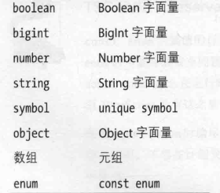
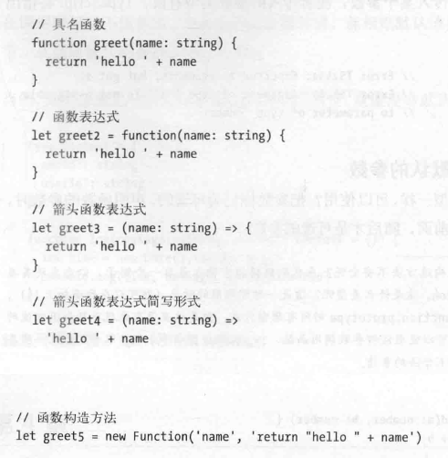
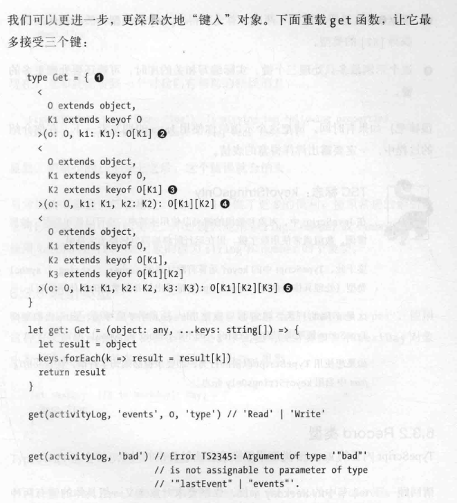
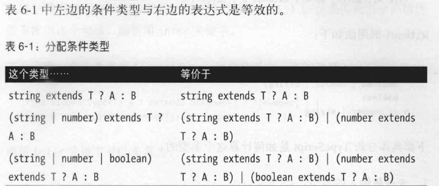
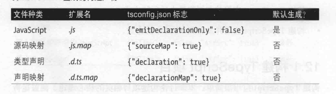
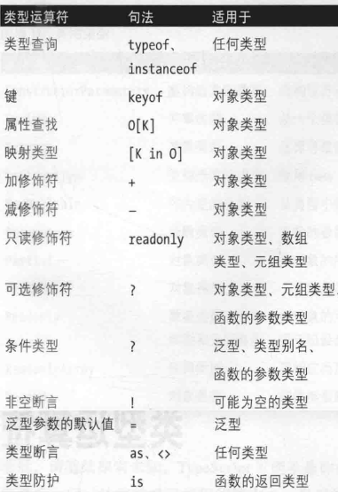
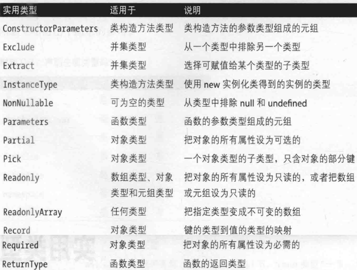
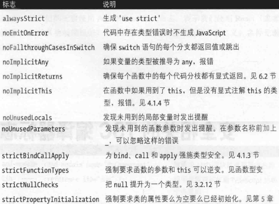

```ts
只在必要时使用分号;
最少的使用any，可以用unknown替代未知的类型
尽量使用展开操作符  ... , 保持数据结构不可变
尽量用TS的来推导类型，不要滥用显式类型， 让类型错误暴露出来；
保证代码简洁，增加安全
保证代码的可用性和普适性
没有特殊原因，不要把数字显式的注解为number， number最大值2**53
可以显式声明 unique symbol,只能够const   const e: unique symbol= Symbol('f')

索引签名  [key:T]:U 句法就是索引签名， T的类型只能是number / string
```

<<<<<<< HEAD

=======

>>>>>>> 2dbe6afe41c3398aafb46770f1b0f5d9a4081b4e


```tsx
Unkown类型可以进行比较，但不能进行更改，
Typescript中声明对象类型有四种方式：

1.对象字面量表示法（例如{a:string}），也称对象的结构。如果知道对象有哪些字段，或者对象的值都为相同的类型，使用这种方式。
2.空对象字面量表示法（{}）。尽量避免使用这种方式。
3.object类型。如果需要一个对象，但对对象的字段没有要求，使用这种方式。
4.0bject类型。尽量避免使用这种方式。
坚持使用第一种和第三种


声明只读的数组和元组
type A =readonly string[]//readonly string[]
type B=ReadonlyArray<string>//readonly string[]
type C=Readonly<string[]>//readonly string[]
type D=readonly [number,string]//readonly [number,string]typeE=Readonly<[number,string]>//readonly [number,string]

nul1缺少值
undefined尚未赋值的变量
void没有return语句的函数
never永不返回的函数

```


```ts
避免使用arguments，类型不安全， 而建议使用 ...args 剩余参数保证类型安全
function temp(msg:string,...args:number[]):number{
    return args[0]
}
一个函数最多只能有一个剩余参数，而且必须位于参数列表的最后。
如果函数使用this，请在函数的第一个参数中声明this的类型（放在其他参数之前）
function fancyDate(this: Date){return ${ this. getDate()}/${ this. getMonth()}/${ this. getFullYear()}
```

<<<<<<< HEAD
=======


```tsx
最好不要再enum中设置值为数字，会导致不良后果。
const enum Flippable {
Burger,
Chair,
Cup,
Skateboard,
Table}

function flip(f: Flippable) {
return'flipped it'
}
flip (Flippable.Chair)
flip (Flippable.Cup)
flip (12) //也会打印出‘flipped it ’


我们要额外小心，只在枚举中使用字符串值!

```








```tsx
函数构造法基本不用，也最好不要用
参数中： 
必要的参数放在前面，随后才是可选的参数：
当然，如果愿意也可以显式注解默认参数的类型，就像没有默认值的参数一样：
type Context={
appId?: string userId?: string
}
function log(message: string, context: Context={}){
let time=new Date(). torsoString()
console. log(time, message, context. userId)
    
    
arguments 是个类似数组的对象， 在调用内置的． reduce 方法之前要把它转换成数组：
但使用arguments 有个比较大的问题：根本不安全！any类型
function sumVariadic()：number{
return Array.from(arguments).reduce((total，n)=>total+n,0)
sumVariadic（1，2，3）//求值结果为6


使用剩余参数保证类型安全 ...args : number[]
一个函数最多只能有一个剩余参数，而且必须位于参数列表的最后。
```


```tsx
函数的调用签名只包含类型层面的代码，即只有类型，没有值。
this 的类型、返回值的类型剩余参数的类型和可选参数的类型，
调用签名没有函数的定义体，无法推导出返回类型，所以必须显式注解。

例如
type Log= (message: string, userId?: string) => void
```


Type的两种写法

```tsx
Type的两种写法
//简写型调用签名
type Log= (message: string, userld?: string)=> void

//完整型调用签名, 重载更清楚
type Log= {
    (message: string, userld?: string): void
}

type State= {
[key: string] : string
}
重载，有多个调用签名的函数。
! 注意，类型声明中没有组合后的签名：不能用 | 进行并集，是在使用的时候才可以进行并集操作。
type Reserve= {
(from: Date, to: Date, destination: string): Reservation
(from: Date, destination: string): Reservation
}

//使用
let reserve: Reserve = (
from: Date,
toOrDestination: Date I string,
de stination?: string
) => {
if ( toOrDestination instanceof Date && destination !== undefined) {
    //预定单程旅行
}
} else if (typeof toOrDestination ==='string') {
//预定往返旅行
}
```


```tsx
但是,声明实现的签名时一般可能会更宽泛一些，保证所有重载的签名都可以赋值给实现的签名。
也可以使用any，unknown,泛型
type Filter = {
(array: unknown, f : unknown)=> unknown []
}
//多态 == 泛型

例如
type Filter<T> = (array: T[], f: (item: T) => boolean) => T[] 
let f ilter: Fil ter<string> = //...
```


```tsx
//泛型推导
有多个约束的受限多态，方法是扩展多个约束的交集（＆）
function call<T extends unknown[], R> (
f: (...args: T) => R,
...args: T //由于f调用有两个参数，所以此处至少是两个参数
) : R {
return f(...args)
}
function fill(length : number, value : string): string[] {
return Array.from({length}, () => value)
}


```


可以使用extends对泛型T进行限制,给上默认类型，确保最少是某个类型

```tsx
为T设置限制，确保T是一个HTML 元素：
type MyEvent<T extends HTMLElement = HTMLElement> = {
target: T
type: string
}

有默认类型的泛型要放在没有默认类型的泛型后面：

type MyEvent2<
Type extends string,
Target extends HTMLElement = HTMLElement,
> = {
target: Target
type: Type
}

```


类型驱动开发
先草拟类型签名，然后填充值的编程风格。


第五章,类和接口


> 类经常当做接口使用
>
> 与类型别名相似，接口是一种命名类型的方式，这样就不用在行内定义了。
>
> type使用 & 进行拓展， interface使用 extends进行拓展
>
> 接口不一定扩展其他接口。其实，接口可以扩展任何结构： 对象类型、类或
> 其他接口。


+ 类使用class 关键字声明。扩展类时使用extends 关键字。
+ 类可以是具体的，也可以是抽象的(abstract ) 。抽象类可以有抽象方法
  和抽象属性。
+ 方法的可见性可以是private 、protected 或public （默认）。方法分实
  例方法和静态方法两种。
+ 类可以有实例属性，可见性也可以是private 、protected 或publi c （默认）。
  实例属性可在构造方法的参数中声明，也可通过属性初始化语句声明。
+ 声明实例属性时可以使用readonly 把属性标记为只读。
+ 如果子类授盖父类中定义的方法，使用super


Super调用的两种方式

> 注意，使用super 只能访问父类的方法，不能访问父类的屈性。

+ 方法调用，例如super.take 。
+ 构造方法调用。此时使用特殊的形式super( ） ，而且只能在构造方法中调用。


```tsx
开胃菜
type Color='Black' | 'White'
type File ='A' | 'B' | 'C'| 'D'| 'E'| 'F'| 'G'|'H'
type Rank= 1| 2|3|4|5|6|7|8
class Position {
constructor(
private file: File,
private rank: Rank
){}
}
class Piece {
protected position: Position 
constructor(
private readonly color: Color,
file: File,
rank: Rank
) {
this.position= new Position(file, rank)
}
}


Types cri pt 类中的属性和方法支持三个访问修饰符：

public        任何地方都可访问。这是默认的访问级别。
protected     可由当前类及其子类的实例访问。
private       只可由当前类的实例访问。


//如果想拓展类，可以直接abstract
//abstract 关键字表明，我们不能直接初始化该类
//...
abstract class Piece {
constructor(
//...

//...
abstract class Piece {
//...
     //Piece 类为moveTo 方法提供了默认实现（如果子类愿意，也可以覆盖默认实现）。
moveTo{position: Position) {

this.position= position
}
abstract canMoveTo{position: Position): boolean //必须实现
 }
```


Type VS Interface

+ 类型别名更为通用，右边可以是任何类型， 包括类型表达式（ 类型，外加＆或I 等类型运算符）.而在接口声明中，右边必须为结构

  + ```tsx
    type A = number
    type B = A I string
    ```

+ 第二个区别是，扩展接口时， TypeScript 将检查扩展的接口是否可赋值给被扩展的接口。
  + ```tsx
    interface A {
    good (x: number): string
    bad(x: number): string
    }
    interface B extends A {
    good{x: string I number): string
    bad(x: string): string // Error  冲突
    }
    ```

+ 第三个区别是，同一作用域中的多个同名interface将自动合并；同一作用域中的
  多个同名type将导致编译时错误。这个特性称为声明合并。


声明类时，可以使用implements 关键字指明该类满足某个接口或者多个接口。

+ class Cat implements Animal, Feline{}

+ 接口可以声明实例属性，但是不能带有可见性修饰符( private 、protected
  和p ublic) ，也不能使用static 关键字

+ 若果两个不同的class都声明了同样的方法， 那么方法可调用这两个不同的类，因为类型一致，都是class并且都有内部相同函数。

  + ```tsx
    function ambleAround(animal: Zebra) {
    animal.trot() //有这个方法的类都可以被调用，虽然声明了形参，但不影响，因为类型一样
    }
    ```

```tsx
interface Animal {
eat(food: string) : void
sleep(hours: number): void
}
class Cat implements Animal {  //cat 必须实现Animal 声明的每个方法
    //如果需要， 在此基础上还可以实现其他方法和属性。
eat(food: string) {console . i nfo ( 'Ate some' , food, ' . Mmm ! ' )}
sleep(hours: number) {console . info ('Slept for', hours, ' hours')}
}
```


Typeof查看自身类型


```tsx
class MyMap<K, V> { 
constructor(initialKey: K, initialValue: V) { 
}
get(key: K) : V { }
set(key: K, value: V): void {}
merge<K1, V1>(map : MyMap<K1, V1>) : MyMap<K | K1 , V |V1> { }
static of<K, V>(k:K, v:V): MyMap<K, V> { }
}
```

接口也可以绑定泛型：

```tsx
interface MyMap<K, V> {
get (key: K): V
set (key: K, value: V): void
}
```


Mixin

+ 可以有状态（即实例属性）。
+ 只能提供具体方法（与抽象方法相反）。
+ 可以有构造方法，调用的顺序与混入类的顺序一致。


装饰器

不同种类的装饰器（包括类装饰器、方法装饰器、属性装饰器和函数参数装饰器）都是常规的函数，只不过要满足相应的特定签名。

在TypeScript 的装饰器成为稳定特性之前，笔者建议不要使用，而是继续使用常规的函数：


设计模式

+ 工厂模式(factory pattern) 是创建某种类型的对象的一种方式，这种方式把
  创建哪种具体对象留给创建该对象的工厂决定。
+ 建造者模式(builder pattern) 把对象的建造方式与具体的实现方式区分开。


小结

+ 讲了如何声明类、如何继承类和实现接口；
+ 如果把类标记为abstract , 禁止实例化
+ 如何在类中声明静态字段和方法，如何在类中声明实例字段和方法； 
+ 如何使用private、protected 和public 等可见性修饰符控制对字段和方法的访问；
+ 如何使用readonly 修饰符把字段标记为不可写的。


## 类型进阶

+ 不变   只能是T 
+ 协变   可以是<:T  //每个复杂类型的成员都会进行协变
  + 函数返回类型的协变指一个函数的返回类型<:另一个函数的返回类型。
+ 逆变   可以是>:T   //函数的参数类型可以进行逆变
+ 双变   可以是<:T 或>:T 


类型拓宽

+ 拓宽

  +  ```tsx
     canst a='x' // 'x'
     let b = a  //string 拓宽了
     
     const c: 'x'='x' // 'x'  const禁止拓宽
     let d = c //'x' 没有拓宽
     
     ```

    

+ 防止拓宽， const ,   enum  等

  + ```tsx
    const 不仅能阻止拓宽类型，还将递归把成员设为readonly, 不管数据结构的嵌套层级有多深
    let d = [1, {x: 2}] // (number I {x: number})[]
    let e = [1, {x: 2} ] as const / / readonly [1, {reado nly x: 2} ]
    
    ```


类型细化

+  as 
+ if(typeof a==='number'){...}


一个好的标记(用以区分类型)要满足下述条件：

• 在并集类型各组成部分的相同位置上。如果是对象类型的并集，使用相同
的字段；如果是元组类型的并集，使用相同的索引。实际使用中， 带标记
的并集类型通常为对象类型。
• 使用字面最类型（字符串、数字、布尔值等字面址）。可以混用不同的字
面矗类型，不过最好使用同一种类型。通常，使用字符串字面扯类型。
• 不要使用泛型。标记不应该有任何泛型参数。
• 要互斥（即在并集类型中是独一无二的）。

```tsx
type UserTextEvent = {type:'Text Event', value: string, target:HTMLinputElement}
type UserMouseEvent = {type:'MouseEvent', value : [number, number],target: HTMLElement}

type UserEvent = UserTextEvent | UserMouseEvent
function handle (event : UserEvent) {
if (event.type==='TextEvent ' ) {
event.value // string
event. target // HTMLinputElement
return
 } 
event .value // [number, number]
event .target // HTMLElement
}
    
```


对象类型进阶

+ ”键入＂的句法与在JavaScript 对象中查找字段的句法类似， 这是故意为之的：
  既然可以在对象中查找值，那么也能在结构中查找类型。但是要注意，通过“键
  入“查找属性的类型时， 只能使用方括号表示法，不能使用点号表示法。

+ ```tsx
  type APIResponse = {
  	user: {
  		userId: string
  		friendList: {
  			count: number
  			friends: {
  				firstName: string
  				lastName: string
  			}[]
  		}
  	}
  }
  type FriendList = APIResponse['user']['friendList']['friends']
  let a: FriendList
  ```


keyof 运算符

+ keyof 运算符获取对象所有键的类型，合并为一个字符串字面矗类型。

  + 把“键入“和keyof 运算符结合起来，可以实现对类型安全的读值函数， 读
    取对象中指定键的值：

    + ```tsx
      type ResponseKeys = keyof APIResponse //'user'
      type UserKeys = keyof APIResponse['user'] //'userid' | 'friendList'
      type FriendlistKeys =keyof APIResponse ['user']['friend List'] 
      //'count' | 'friends'
      ```


in

+ ```tsx
  type MyMappedType = {
  [Key in UnionType]: ValueType
  }
  
  type Account= {
  
  id: number
  isEmployee: boolean
  notes: string[]
  }
  type OptionalAccount = {
  [K in keyof Account]?: Account[K] //所有字段都是可选的
  }
  
  
  type Account2 = {
  - readonly [K in keyof ReadonlyAccount]: Account [K] //所有字段都是可写的（等同千Account )
  }
  type Account3 = {
  [K in keyof OptionalAccount] -?: Account[K] //所有字段都是必须的（等同千Account )
  }
  ```

深层次键入对象




内置的映射类型

+ Record<Keys, Values>   键的类型为Keys 、值的类型为Values 的对象。
+ Partial<Object>把Object 中的每个字段都标记为可选的。

+ Required<Object> 把Object 中的每个字段都标记为必须的。
+ Readonly<Object> 把Object中的每个字段都标记为只读的。
+ Pick<Object, Keys>返回Object的子类型，只含指定的Keys 。

内置的条件类型

+ Exclude<T, U>    计算在T 中而不在U 中的类型：


伴生对象模式

+ Exclude<T, U>  即把同名的 类型和对象配对在一起，我们也称之为伴生对象模式。

  + ```tsx
    type A = number | string
    type B = string
    type C = Exclude<A, B> // number
    ```

+ Extract<T, U>   计算T 中可赋值给U 的类型

  + ```tsx
    type A = number | string
    type B = string
    type C = Extract<A, B> // string
    ```

+ NonNullable<T>  从T 中排除null 和undefined

  + ```tsx
    type A= {a?: number I null}
    type B = NonNullable<A['a']> // number
    ```

+ ReturnType<F>  计算函数的返回类型（注意，不适用千泛型和重载的函数）

  + ```tsx
    type F = (a: number)=> string
    type R = ReturnType<F> // string
    ```

+ Instance Type<C>  计算类构造方法的实例类型

  + ```tsx
    type A = {new(): B}
    type B = {b: number}
    type I= InstanceType<A> // {b: number}
    ```


条件类型

+ ```tsx
  type IsString<T> = T extends string ? true : false
  ```

+ 


infer 关键字

+ 在条件类型中声明泛型不使用<T>这个句法，而使用infer 关键字。

  + ```tsx
    type ElementType<T> = T extends unknown[] ? T[number ] : T
    type A= ElementType<number[]> // number
    //等同于
    type ElementType2<T> = T extends (infer U)[] ? U : T
    type B = ElementType2<number[]> // number
    ```

  + ```tsx
    type SecondArg<F> = F extends (a: any, b: infer B) =>any? B : never
    ／／ 获取Array. slice 的类型
    type F = typeof Array ['prototype'] [ ' slice']
    type A= SecondArg<F> // number |undefined
    ```

  + 


类型断言

> 显然，类型断言不安全，应尽量避免使用。

+ as 

  + ```tsx
    //断定input 是字符串
    formatlnput(input as string) 
    //等于
    formatlnput(<string>input) 
    //类型断言的旧句法使用尖括号。尖括号 可能和TSX冲突， 尽量用as
            
    不确定时可以用 as any
    ```

+ !  确定不为null|undefined

+ 明确赋值断言

  + ```tsx
    let userld!: string
    fetchUser () 
    //我们可以使用明确赋值断言告诉Type Script , 在读取userid 时， 肯定已经为它赋值了
    ```

  + 


扩展原型

```tsx
举个例子，为Array 原型添加zip 方法。
//全局声明，这样就不用单独导入导出了
declare global {
interface Array<T> {
zip<U>(list: U[]): [T, U][ ]
}}
    
//实现． zi p 方法
Array.prototype.zip= function<T, U>(
this: T[],
list: U[]
): [T, U][] {
return this.map((v, k) =>tuple(v, list[k]))
}
//global 是一个特殊的命名空间，包含所有全局定义的值

```


处理错误

> • 返回null 。
>
>    //考虑到类型安全，返回null 是处理错误最为轻量的方式，返回null 也不利千程序的编写，每次操作都检查结果是否为null 太烦琐，不利于嵌套和串联操作。
>
> • 抛出异常。
>
> //throw new RangeError('...'), 使用try catch
>
> • 返回异常。
>
> //返回自己定义的错误类型，进行下一步处理，
>
> class InvalidDateFormatError extends RangeError {}
> class DateisinTheFutureError extends RangeError {}
>
> 使用 if(e instanceof InvalidDateformatError){}
>
> //这种方式的缺点是串联和嵌套可能出错的操作时容易让人觉得烦琐,这样传来传去，
> 使用方要处理的错误将越来越多：
>
> • Option 类型。  //需要自己手动写错误信息


重载

```tsx
function Option<T> (value: null I undefined): None
function Option<T>(value: T): Some<T> 
function Option<T> (value: T): Option<T> {
if (value == null) {return new None }
return new Some( value)
}
```


使用时要考虑

+ 你只想表示有操作失败了( null 、Option ) ，还是想进一步指出失败的原
  因（抛出异常和返回异常）。
+ 你想强制要求使用方显式处理每一个可能出现的异常（返回异常），还是
  尽批少编写处理错误的样板代码（抛出异常）。
+ 你想深入分析错误( Option ) ，还是在遇到错误时做简单的处理(null 、
  异常）。


使用Promise注意

+ 对简单的异步任务来说， 使用回调更容易理解。
+ 如果任务较复杂，需要排序和并行，那就使用promise 和async / await 。
+ 如果觉得promise 不够用了（例如多次触发一个事件），可以转用事件发射器或响应式流处理库（如RxJS ) 。
+ 牵涉到多个线程时， 使用事件发射器、类型安全的协议或类型安全的API




类型运算符




实用类型




全局导出

+ 如果在一个模块中只为全局命名空间赋值，而没有导出任何代码，只需创
  建一个脚本模式的文件

  + ```tsx
    // 全局变批
    declare let someGlobal: GlobalType
    //  全局类
    declare class GlobalClass {}
    //  全局函数
    declare function global Function(): string
    // 全局枚举
    enum GlobalEnum {A, B, C}
    // 全局命名空间
    na mespa ce Gl obal Nam es pace {}
    // 全局类型声明
    type GlobalType = number
    // 全局接口
    interface Globallnterface {}
    这些声明在项目中的任何文件里都可以使用，无须显式导入
    
    比如说，在项目中的任何文件里都可以使用someGlobal. 无须事先导入， 不过在运行
    时， someGlobal 要赋值给全局命名空间（浏览器中的window , NodeJS 中的
    global ) 。
    注意，为了保证文件在脚本模式下， 在声明文件中不能使用import 和export 。
    ```


安全相关的TSC 缩译器标志




------------------------


 完结


