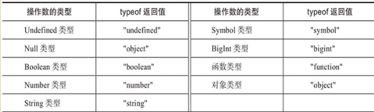
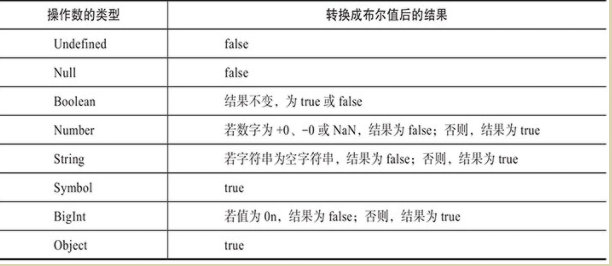

```tsx
Array中有 ReadonlyArray<T>, 
const red:readonly number[]=[255,0,0]
enum有enum和const enum Direactions{}
const enum Direactions{}
Object 与object不同

Object类型的用途是描述“Object.prototype”对象的类型，即所有
对象共享的属性和方法。在描述自定义对象类型时用object即可
在object类型上仅允许访问对象的公共属性和方法，也就是Object类型中定义的属性和方法。
const obj: object = {};
obj.toString();
obj.valueOf();
            
            
readonly ? 默认的any
元组中的元素可选 [T0, T1?, T2?, T3?]
```


```tsx
全局的Object类型用于描述对象公共的属性和方法，它相当于一种专用类型，因此程序中不应该将自定义变量、参数等类型直接声明为Object类型。空对象类型字面量“{}”强调的是不包含属性的对象类型，同时也可以作为Object类型的代理来使用
```


```tsx
弱类型
对象类型中至少包含一个属性。
对象类型中所有属性都是可选属性。
对象类型中不包含字符串索引签名、数值索引签名、调用签名和构造签名
let config: {
    url?: string;
    async?: boolean; 
    timeout?: number;
};


索引签名
const point: {
    x: number;
    [prop: string]: number; // 索引签名 
} = { x: 0, y: 0 };
            
```


```tsx
函数
可选参数? 
默认参数类型
在调用定义了剩余参数的函数时，剩余参数可以接受零个或多个实际参数
function f(...args: number[]) {} //剩余参数的类型也可以定义为元组类型
function f(...args: [boolean, string?]) {} //可选元素的元组类型
function f0(...args: [boolean, ...string[]]) {} //带有剩余元素的元组类型


参数解构
function f0([x, y]) {}
f0([0, 1]);
 
function f0([x, y]: [number, number]) {}
f0([0, 1]);
function f1({ x, y }: { x: number; y: number }) {}
f1({ x: 0, y: 1 });
            
            

void使用，返回undefined或者根本不调用return语句
let f: () => void;
f = function () { /* no-op */ };
参数名称可以不一致
let f: (x: number) => number;
f = function (y: number): number {
   return y;
};
调用带有调用签名的对象类型字面量对f进行描述，
function f(x: number) {
     console.log(x);
 }
f.version = '1.0';

let foo: { (x: number): void; version: string } = f;
const version = foo.version;  // string类型
            
                    
```


```tsx
Error类型
const a = new Error(); 
const b = new Error('Error message.');
构造函数的类型
let ErrorConstructor: new (message?: string) => Error;

构造签名与调用签名
declare const F: {
    new (x: number): Number;  // <- 构造签名
    (x: number): number;      // <- 调用签名
};
// 作为普通函数调用
const a: number = F(1);
// 作为构造函数调用
const b: Number = new F(1);
```


```tsx
函数重载

function add(x: number, y: number): number;
function add(x: any[], y: any[]): any[];
//在各个函数重载语句之间以及函数重载语句与函数实现语句之间不允许出现任何其他语句
// 函数实现必须位于最后
function add(x: number | any[], y: number | any[]): any {
    // 省略了实现代码
}
函数实现需要兼容每个函数重载中的函数签名，函数实现的函数签名类型必须能够赋值给函数重载的函数签名类型。

开发者在编写函数重载代码时一定要将最精确的函数重载定义放在最前面，因为它们定义的顺序将影响函数调用签名的选择


***
可以使用如下对象类型字面量来表示重载函数f的类型
{
    (x: string): 0 | 1;
    (x: any): number;
}

函数实现的函数签名不属于重载函数的调用签名之一。
调用签名的书写顺序是有意义的，它决定了函数重载的解析顺序，一定要确保更精确的调用签名位于更靠前的位置。
```


```tsx
this值的类型

function foo(this: { name: string }|void) {
   this.name = 'Patrick';
   this.name = 0;
//  编译错误！类型 0 不能赋值给类型 'string'
} 
```


```tsx
Interface 
类似于对象类型字面量，接口类型也能够表示任意的对象类型。
不同的是，接口类型能够给对象类型命名以及定义类型参数.
接口类型无法表示原始类型，如boolean类型等。
```


```tsx
Interface五类

属性签名
interface Point {
    x: number;
    y: number;
 }
调用签名
interface ErrorConstructor {
    (message?: string): Error;
}
构造签名
interface ErrorConstructor {
    new (message?: string): Error;
}
方法签名
    interface Document {
       getElementById(elementId: string): HTMLElement | null;
    }
    A==B==C
    interface A {
        f(x: boolean): string;       // 方法签名
    }
    interface B {
        f: { (x: boolean): string }; // 属性签名和对象类型字面量
     }
    interface C {
        f: (x: boolean) => string;   // 属性签名和函数类型字面量
     }
     可计算属性名          
    const f = 'f';
    interface A {
        [f](x: boolean): string;
    }
            
     重载方法
     interface A {
         f(): number;
         f(x: boolean): boolean;
         f(x: string, y: string): string;
     }
            
            

索引签名  -通过下标访问
	一个接口中最多只能定义一个数值索引签名(最终也会被转成字符串进行访问)
    一个接口中最多只能定义一个字符串索引签名
interface A {
     [prop: string]: number;
}
interface B {
     [prop: number]: number;
}

这样也是可以的，因为值都是Number,
interface A {
     [prop: string]: number;
     [prop: number]: 0 | 1;
}
```


```tsx
Interface 可选属性与方法

如果接口中定义了重载方法，那么所有重载方法签名必须同时为必选的或者可选的
// 正确
interface Foo {
    a(): void;
    a(x: boolean): boolean;
    b?(): void;
    b?(x: boolean): boolean;
}

interface A {
    readonly a: string;
    x:string;
    readonly [prop: string]: string;
    readonly [prop: number]: string;
}
x可以被修改，其他都是只读
```


```tsx
Interface继承  extends关键字
    接口
    类
    对象类型的类型别名
    对象类型的交叉类型

    
interface Style {
       name:string
       draw(): { color: string };
}
interface Shape {
   draw(): { x: number; y: number };
}
子接口中的同名成员必须兼容所有父接口中的类型
interface Circle extends Style, Shape {
   draw(): { color: string; x: number; y: number };//权重高，但必须与所有父接口中方法类型兼容
}

```


```tsx
Type 类型别名

type Numeric = number | bigint; 
// string | number | bigint
type StringOrNumber = string | Numeric;

1.以下场景中可以使用递归的类型别名
	1)若类型别名引用的类型为接口类型、对象类型字面量、函数类型字面量和构造函数类型字面量，
     则允许递归引用类型别名
     type T0 = { name: T0 };
	 type T1 = () => T1;
	 type T2 = new () => T2;
            
            
    2)若类型别名引用的是数组类型或元组类型，则允许在元素类型中递归地引用类型别名。
    type T0 = Array<T0>;
    type T1 = T1[];
    type T3 = [number, T3];
            
    3)若类型别名引用的是泛型类或泛型接口，则允许在类型参数中递归的引用类型别名
    interface A<T> {
      name: T;
    }
    type T0 = A<T0>;
    class B<T> {
        name: T | undefined;
    }
    type T1 = B<T1>;
            
            
```


```tsx
Interface与Type区别
1.Type能够表示非对象类型，而interface则只能表示对象类型。
	type NumericType = number | bigint;
2.interface可以继承其他的interface、class等对象类型，而type则不支持继承。
  但能继承object类型的type,
  如果类型别名表示非对象类型，则无法使用该方法。
    type Shape = { name: string };
    type Circle = Shape & { radius: number };
    function foo(circle: Circle) {
      const name = circle.name;
      const radius = circle.radius;
    }
3.Interface总是会显示在编译器的诊断信息（例如，错误提示和警告）和代码编辑器的智能提示信息中，而Type只在特定情况下才会显示出来
4.Interface有声明合并的行为，而类型别名则不会进行声明合并

    interface A {
        x: number;
    }
    interface A {
        y: number;
    }

    //合并为           
    interface A {
        x: number;
        y: number;
    }

            
	
```


## Class

```tsx
类名大写
与函数声明不同的是，类声明不会被提升，因此必须先声明后使用。
不允许声明同名的类

匿名类
const Circle = class {
     radius: number;
};
const Circle1 = class Child {
     radius: number;
};
const a = new Circle();
const b=new Child() // 错误，不能这么用，只能 new Circle1()
类表达式中定义了类名，则该类名只能够在类内部使用，在类外不允许引用该类名
TypeScript提供了“--strictPropertyInitialization”编译选项来帮助严格检查未经初始化的成员变量
class Circle {
    radius: number = 1;
    readonly b:number=2;
    a!:number  //断言，避免无初始值的检查
    area(): number {
        return Math.PI * this.radius * this.radius;
    }
}

如果一个类属性同时定义了get方法和set方法
那么get方法的返回值类型必须与set方法的参数类型一致
必须具有相同的可访问性
            

```

+ readonly 
+ static  只允许通过类名来访问。const v=Circle.version //通过class访问。
+ public  默认值， 可以在当前类的内部、外部以及派生类的内部访问
+ protected  类的受保护成员允许在当前类的内部和派生类的内部访问，但是不允许在当前类的外部访问。例如 const base=new Base() base.s //错误
+ private 仅当前内部使用，在当前类的外部以及派生类的内部都不允许访问
+ ES支持使用 #myVal 设置和访问私有字段。

```tsx
Class 寄存器 get set

class Circle {
    private _radius: number = 0;
    get radius(): number {
        return this._radius;
     }
    set radius(value: number) {
        if (value >= 0) {
            this._radius = value;
        }
    }
}

const circle = new Circle();
circle.radius; // 0
circle.radius = -1;
circle.radius; // 0
circle.radius = 10;
circle.radius; // 10
```


```tsx
构造函数 constructor
可以定义可选参数、默认值参数和剩余参数。不允许定义返回值类型
因为构造函数的返回值类型永远为类的实例类型。
可设置为private constructor(){},只能内部构件

可以重载

class A {
    constructor(x: number, y: number);
    constructor(s: string);
    constructor(xs: number | string, y?: number) {}
}
const a = new A(0, 0);
const b = new A('foo');


在构造函数参数列表中，为形式参数添加任何一个可访问性修饰符或者readonly修饰符，该形式参数就成了参数成员，进而会被声明为类的成员变量   
class A {
   constructor(
      public x: number,
      protected y: number,
      private z: number,
      readonly t: number
   ) {}
}
const a=new A(0,1,2,3)
a.x // 值为0

class B {
    constructor(readonly x: number) {}
}
```


```tsx
继承， 只能继承一个类,
但一个类可以继承多个interface，但必须实现interface里的所有成员。
interface Color {
   color: string;
}

interface Shape {
    area(): number;
}
 
class Circle implements Shape, Color {
   radius: number = 1;

   color: string = 'black';

   area(): number {
        return Math.PI * this.radius * this.radius;
     }
}
            
            

super是为了继承BaseClass的内部非私有成员，外部构造后访问是可以直接访问BaseClass的成员的。
class Shape {
    color: string = 'black';

    switchColor() {
          this.color =
          this.color === 'black' ? 'white' : 'black';
    }
}

class Circle extends Shape {
    switchColor() {
        super.switchColor();
        console.log(`Color is ${this.color}.`);
    }
}

const circle = new Circle();

circle.switchColor();
circle.switchColor(); 

// 打印：
// Color is white.
// Color is black.
            
在实例化派生类时的初始化顺序如下：
1）初始化基类的属性。
2）调用基类的构造函数。
3）初始化派生类的属性。
4）调用派生类的构造函数。


Interface继承一个Class，会继承基类中所有成员的类型
class A {
    x: string = ''; 
    y(): boolean {
        return true;
   }
}

interface B extends A {}
declare const b: B;

b.x;   // 类型为string
b.y(); // 类型为boolean

Interface不但会继承Class的公有成员类型，还会继承class的受保护成员类型和私有成员类型。
如果interface从class继承了非公有成员，那么该接口只能由class或class的子类来实现.

// 正确，A 可以实现接口 I，因为私有属性和受保护属性源自同一个类 A
class A implements I {
    private x: string = '';
    protected y: string = '';
} 
// 接口 I 能够继承 A 的私有属性和受保护属性
interface I extends A {}
// 正确，B 可以实现接口 I，因为私有属性和受保护属性源自同一个类 A
class B extends A implements I {}
// 错误！C 不是 A 的子类，无法实现 A 的有属性和受保护属性
class C implements I {}
            
            
```


抽象类和抽象成员

```tsx
抽象类和抽象成员 抽象类不能被实例化,作用是作为基类使用
抽象类可以继承其他抽象类
如果一个具体类继承了抽象类，那么在具体的派生类中必须实现抽象类基类中的所有抽象成员
 abstract class Base {
    abstract a: string;

   abstract get accessor(): string;
   abstract set accessor(value: string);

   abstract method(): boolean;
}

class Derived extends Base {
   // 实现抽象属性 a
   a: string = '';
   // 实现抽象存取器accessor
    private _accessor: string = '';
    get accessor(): string {
       return this._accessor;
   }
   set accessor(value: string) {
      this._accessor = value;
   }
   // 实现抽象方法 method
   method(): boolean {
       return true;
    }
}
            
            

```


```tsx
Class中的This类型
this可以链式调用，它们返回的是当前实例对象

this类型不允许应用于类的静态成员。

class Counter {
   private count: number = 0;
   public add(): this {
        this.count++;
      return this;
  }
   public subtract(): this {
        this.count--;
       return this;
   }

    public getResult(): number {
      return this.count;
  }
}
const counter = new Counter();
counter.add().add().subtract().getResult(); // 结果为1


B extends A, B中的this跨class使用后this会变成A
class A {
    foo(): this {
        return this;
    }
}

class B extends A {
    bar(): this {
        return this;
   }
}
const b = new B();
const x = b.bar().foo(); //类型为B
            


class Circle {
    radius: number;
   area(): number {
        return Math.PI * this.radius * this.radius;
    }
} 
 interface CircleType {
    radius: number;
   area(): number;
} 
13 // 正确
const a: Circle = new Circle();
16 // 正确
const b: CircleType = new Circle();
            
            
```


类型进阶

+ 带有类型参数的泛型

  具有块级作用域的局部类型

  常用的联合类型和交叉类型

  实用的索引类型、映射对象类型以及条件类型

  TypeScript内置的实用工具类型

  能够获取表达式类型的类型查询

  类型断言与类型细化。

```tsx
泛型
function identity<T>(arg: T): T {
   return arg;
}


//<T = U, U = boolean> // 错误
//<T = boolean, U = T> // 正确

类型约束，至少为约束的类型
interface Point {
    x: number;
    y: number;
}

function identity<T extends Point>(x: T): T {
    return x;
}

// 正确
identity({ x: 0, y: 0 });
identity({ x: 0, y: 0, z: 0 });

identity({ x: 0 });
//       ~~~~~~~~
//       编译错误！类型 '{ x: number; }' 不能赋值给类型 Point


泛型约束引用类型参数
//<T, U extends T>
//<T extends U, U>
//<T extends U>    // 类型参数T的基约束为类型参数U

    
function f3<T, U>(a: T[], f: (x: T) => U): U[] {
    return a.map(f);
}
 
const a: boolean[] = f3<number, boolean>([0, 1, 2], n => !!n);
            
如果没有必要用泛型的时候，最好不要用泛型。


泛型接口
interface MyArray<T> extends Array<T> {
    first: T | undefined;
    last: T | undefined;
}
            
泛型类型别名

type Container<T> = { value: T };
const a: Container<number> = { value: 0 };
const b: Container<string> = { value: 'b' };


泛型类
class Container<T> {
    constructor(private readonly data: T) {}
} 
const a = new Container<boolean>(true); 
const b = new Container<number>(0);
            
            
静态参数static不能使用 class的泛型T
interface A<T> {
    a: T;
} 
class Base<T> {
   b?: T;
} 
class Derived<T> extends Base<T> implements A<T> {
   constructor(public readonly a: T) {
      super();
    }
}
      
```


局部类型

+ 局部枚举类型
  局部类类型
  局部接口类型
  局部类型别名

```tsx
function f(x: boolean) {
   if (x) {
       interface T {
          x: number;
        }
 
        const v: T = { x: 0 };
 
     } else {
        interface T {
             x: string;
       }
 const v: T = { x: 'foo' };
    }
}
            
            
```


联合类型 |, 交叉类型 &

​	交叉类型的顺序会影响重载签名的解析顺序

```tsx
interface T0 {
    new (name: string): Date;
}
interface T1 {
   new (name: string): Error;
} 
type T = T0 | T1;
interface T0T1 {
    new (name: string): Date | Error;
}           
interface Circle {
    area: bigint;
}
interface Rectangle {
    area?: number;
} 
declare const s: Circle | Rectangle;
s.area; // bigint | number | undefined


交叉类型
interface Clickable {
 click(): void;
}
interface Focusable {
   focus(): void;
}
interface Scrollable {
   scroll(): void;
}
type T0 = (Clickable & Focusable) & Scrollable;
type T1 = Clickable & (Focusable & Scrollable);
            
```


```tsx
交叉类型属性

interface A {
     x: boolean;
     y?: string;
}
interface B {
    x?: boolean;
    y?: string;
}
//结果为
{
    x: boolean; //在“A & B”交叉类型中，属性x是必选属性，属性y是可选属性。
    y?: string;
}

索引签名

interface A {
     [prop: string]: string;
}
interface B {
    [prop: number]: string;
}
{
    [prop: string]: string;
    [prop: number]: string;
}

调用签名与构造签名
若交叉类型的成员类型中含有调用签名或构造签名，那么这些调用签名和构造签名将以成员类型的先后顺序合并到交叉类型中
```


Keyof

```tsx
索引类型  keyof是关键字
索引类型查询的结果是由字符串字面量类型构成的联合类型

interface Point {
    x: number;
    y: number;
}

type T = keyof Point; // 'x' | 'y'

索引类型查询的结果类型是联合类型“string | number |symbol”的子类型
interface T {
    [prop: string]: number;
}

// string | number
type KeyofT = keyof T;


interface T {
    0: boolean;
    a: string;
    b(): void;
}
// 0 | 'a' | 'b'
type KeyofT = keyof T;
它们的属性名分别为数字0、字符串“'a'”和字符串“'b'”。因此，KeyofT类型为联合类型“0 | 'a' | 'b'”


interface Boolean {
    valueOf(): boolean;
}
type KeyofT = keyof boolean; // 'valueOf'

联合类型
type A = { a: string; z: boolean };
type B = { b: string; z: boolean };
type KeyofT = keyof (A | B);  // 'z'

交叉类型
type A = { a: string; x: boolean };
type B = { b: string; y: number }; 
type KeyofT = keyof (A & B); // 'a' | 'x' | 'b' | 'y'
            
     
```


```tsx
索引访问类型

const s: unique symbol = Symbol(); 
enum E {
    A = 10,
}
type T = {
    a:true
    0: string;   // 数字字面量属性名
    x: boolean;   // 字符串字面量属性名
    [E.A]: number;     // 枚举成员字面量属性名

    
     [s]: bigint;  // unique symbol
};
type TypeOfNumberLikeName = T[a];     //boolean 
type TypeOfNumberLikeName = T[0];     // string
type TypeOfStringLikeName = T['x'];   // boolean
type TypeOfEnumName = T[E.A];         // number
type TypeOfSymbolName = T[typeof s];  // bigint
            
            
同名属性的类型拥有更高的优先级


索引类型的使用
function getProperty<T, K extends keyof T>(
   obj: T, key: K
 ): T[K] {
   return obj[key];
}

 interface Circle {
    kind: 'circle';
    radius: number;
 }

 function f(circle: Circle) {
     // 正确，能够推断出 radius 的类型为 'circle' 类型
    const kind = getProperty(circle, 'kind');

    // 正确，能够推断出 radius 的类型为 number 类型
     const radius = getProperty(circle, 'radius');
 
     // 错误
    const unknown = getProperty(circle, 'unknown');
    //                                   ~~~~~~~~~
     // 编译错误：'unknown'类型不能赋值给'kind' |'radius'
 }
            
            
```


## 映射对象类型 Keyof


```tsx
映射对象类型
symbol”，因为只有这些类型的值才能作为对象的键；P是类型变量，代表每次遍历出来的成员类型；T是任意类型，表示对象属性的类型，并且在类型T中允许使用类型变量P。

type K = 'x' | 'y';
type T = number;
type MappedObjectType = { readonly [P in K]?: T };


若当前遍历出来的类型成员P为数字字面量类型，则在结果对象类型中创建一个新的属性成员，属性名类型为该数字字面量类型且属性值类型为T
// { [x: number]: boolean }
type MappedObjectType = { [P in number]: boolean };
            
```


## Keyof应用 

```tsx
将映射对象类型、索引类型查询以及索引访问类型三者结合才能够最大限度地体现映射对象类型的威力。

type T = { a: string; b: number };
// { a: string; b: number; } 复制了一份类型给M
type M = { [P in keyof T]: T[P] };
            

实例
type T = { a: string; b: number };
// { a?: string; b?: number; }
type OptionalT = { [P in keyof T]?: T[P] };
            
            
```


同态映射对象类型==> 

​			映射后的对象类型结构与源对象类型T的结构完全一致

​			同态映射对象类型与源对象类型之间有着相同的属性集合。

```tsx
HMOT是同态映射对象类型，它将源对象类型T的所有属性映射到新的对象类型HMOT，同时保留了每个属性的修饰符
// 同态映射对象类型
type T = { a?: string; readonly b: number }; 
type HMOT = { [P in keyof T]: T[P] }; // { a?: string; readonly b: number; }

同态映射对象类型的一个重要性质是，新的对象类型会默认拷贝源对象类型中所有属性的readonly修饰符和“?”修饰符
非同态映射对象类型，那么新的对象类型不会拷贝源对象类型T中属性的readonly修饰符和“?”修饰符。


// 非同态映射对象类型
type T = { a?: string; readonly b: number };
type K = keyof T; 
type MOT = { [P in K]: T[P] }; // { a: string | undefined; b: number; }
```


添加和移除修饰符

```tsx
“+”修饰符，为映射属性添加“?”修饰符或readonly修饰符
“–”修饰符，为映射属性移除“?”修饰符或readonly修饰符
“+”修饰符和“–”修饰符应用在“?”修饰符和readonly修饰符之前

-? 移除可选   -readonly 移除readonly
{ -readonly [P in keyof T]-?: T[P] }
{ +readonly [P in keyof T]+?: T[P] }

若转换所有属性
type Required<T> = { [P in keyof T]-?: T[P] };


编译器在移除属性a的“?”修饰符时，同时会移除属性类型中的undefined类型，但是不会移除null类型，因此RequiredT类型中属性a的类型为“string | null”类型。


若T为原始类型，则不进行任何映射，同态映射对象类型“HMOT<T, X>”等于类型T。

type HMOT<T, X> = { [P in keyof T]: X };
type T = string;
type R = HMOT<T, boolean>  // <- 与boolean类型无关
       = string


//=========================================================

type HMOT<T, X> = { [P in keyof T]: X };

type T = readonly [string, number];

type R = HMOT<T, boolean>;
       = readonly [boolean, boolean];

//=========================================================

type HMOT<T> = { -readonly [P in keyof T]: T[P] };

type T0 = readonly number[];

type R0 = HMOT<T0>;
        = number[];

type T1 = readonly [string];

type R1 = HMOT<T1>;
        = [string];
```


条件类型(三元表达式)

```ts
条件类型
在实际应用中，条件类型通常与类型参数结合使用
T extends U ? X : Y


```

分布式条件类型

过滤联合类型

```tsx
分布式条件类型
T extends U ? X : Y;
如果T=A | B, 则分布式条件类型会被展开

type T0<T> = T extends string ? true : false;
//           ~
//           裸类型参数

type T1<T> = [T] extends [string] ? true : false;
//            ~
//            非裸类型参数,因为它是元组类型的组成部分


过滤联合类型
下例中的“Exclude<T, U>”类型能够从联合类型T中删除符合条件的类型： 
type Exclude<T, U> = T extends U ? never : T;


***
有时候需要避免分布式行为
type CT<T> = T extends string ? true : false;
type T = CT<string | number>; // boolean
            
            
(使用元祖类型避免)
避免分布式行为=>
type CT<T> = [T] extends [string] ? true : false;
type T = CT<string | number>; // false
            
            
```


infer关键字

```tsx
infer关键字
T extends U ? X : Y
在extends语句中类型U的位置上允许使用infer关键字来"定义"可推断的类型变量，
可推断的类型变量只允许在条件类型的true分支中引用，即类型X的位置上使用
T extends infer U ? U : Y;

使用infer声明"定义"了可推断的类型变量U。
当编译器解析该条件类型时，会根据T的实际类型来推断类型变量U的实际类型
type CT<T> = T extends Array<infer U> ? U : never;
type T = CT<Array<number>>;    // number

                             
type ReturnType<
T extends (...args: any) => any
> = T extends (...args: any) => infer R ? R : any;
//使用 “ReturnType<T>”类型接受函数类型的类型参数，并返回函数的返回值类型
type F = (x: number) => string;
type T = ReturnType<F>;    // string


//允许定义多个infer
type CT<T> =T extends { a: infer U; b: infer U } ? U : never;
type T = CT<{ a: string; b: number }>; // string | number

同时，在多个infer声明中也可以定义不同的推断类型变量。
例如，下例中的两个infer声明分别定义了两个推断类型变量M和N：
type CT<T> = T extends { a: infer M; b: infer N } ? [M, N] : never;
type T = CT<{ a: string; b: number }>; // [string, number]
 
```


内置工具类型

▪Partial<T> 所有属性可选

+ ```tsx
  interface A {
      x: number;
      y: number;
   }
  
  type T = Partial<A>; // { x?: number; y?: number; }
  const a: T = { x: 0, y: 0 };
  const b: T = { x: 0 };
  const c: T = { y: 0 };
  const d: T = {};
  ```

  

▪Required<T> 所有属性必选

+ ```tsx
  interface A {
      x?: number;
      y: number;
  }
  type T0 = Required<A>; // { x: number; y: number; }
  ```

  

▪Readonly<T> 所有属性只读

+ ```tsx
  interface A {
      x: number;
      y: number;
  }
  
  // { readonly x: number; readonly y: number; }
  type T = Readonly<A>;
  const a: T = { x: 0, y: 0 };
  a.x = 1;   // 编译错误！不允许修改
  a.y = 1;   // 编译错误！不允许修改
  ```

  

▪Record<K, T>   K为对象属性名联合类型， T为属性的类型，返回一个新建的对象类型。

+ 创建一个新的对象类型
+ K必须能够赋值给“string | number | symbol”类型，因为是对象属性名

+ ```tsx
  type K = 'x' | 'y';
  type T = number;
  type R = Record<K, T>; // { x: number; y: number; }
  const a: R = { x: 0, y: 0 };
  ```

  

▪Pick<T, K>  T为对象类型，K 为待选参数， 返回一个新建的类型

+ ```tsx
  interface A {
     x: number; 
     y: number;
  }
  type T0 = Pick<A, 'x'>;        // { x: number }
  type T1 = Pick<A, 'y'>;        // { y: number }
  type T2 = Pick<A, 'x' | 'y'>;  // { x: number; y: number }
  type T3 = Pick<A, 'z'>;
  //                ~~~
  //                编译错误：类型'A'中不存在属性'z'
  
  ```

  

▪Omit<T, K>  T中删除K ，返回一个新类型

+ ```tsx
  interface A {
      x: number;
      y: number;
  }
  type T0 = Omit<A, 'x'>;       // { y: number }
  type T1 = Omit<A, 'y'>;       // { x: number }
  type T2 = Omit<A, 'x' | 'y'>; // { }
  type T3 = Omit<A, 'z'>;       // { x: number; y: number }
  ```

  

▪Exclude<T, U>  从T中删除所有可以赋值给类型U的类型

+ ```tsx
  type T0 = Exclude<"a" | "b" | "c", "a">; // "b" | "c"
  type T1 = Exclude<"a" | "b" | "c", "a" | "b">; // "c"
  type T2 = Exclude<string | (() => void), Function>; // string
  ```

  

▪Extract<T,U>  从T中获取所有可以赋值给类型U的类型

+ ```tsx
  type T0 = Extract<'a' | 'b' | 'c', 'a' | 'f'>; // 'a'
  type T1 = Extract<string | (() => void), Function>; // () => void
  type T2 = Extract<string | number, boolean>;        // never
  ```

  

▪NonNullable<T>   从T中剔除null类型和undefined类型并构造一个新类型，返回非空

+ ```tsx
  type T0 = NonNullable<string | number | undefined>;  // string | number
  type T1 = NonNullable<string[] | null | undefined>; // string[]
  ```

  

▪Parameters<T> 获取T参数类型，构造一个新的元组类型

+ ```tsx
  type T0 = Parameters<() => string>;        // []
  type T1 = Parameters<(s: string) => void>; // [string]
  type T2 = Parameters<<T>(arg: T) => T>;    // [unknown]
  type T4 = Parameters<
       (x: { a: number; b: string }) => void
  >;                                         // [{ a: number, b: string }]
  type T5 = Parameters<any>;                 // unknown[]
  type T6 = Parameters<never>;               // never
  type T7 = Parameters<string>;
  //                   ~~~~~~~
  //                   编译错误！string类型不符合约束'(...args: any) => any'
  type T8 = Parameters<Function>;
  //                   ~~~~~~~~
  //                   编译错误！Function类型不符合约束'(...args: any) => any'
              
              
  ```

  

▪ConstructorParameters<T> 

+ 用T的参数类型，构造一个元组类型。若类型T不是函数类型，则返回never类型。

+ ```tsx
  // [string, number]
  type T0 = ConstructorParameters<new (x: string, y: number) => object>;
  // [(string | undefined)?]
  type T1 = ConstructorParameters<new (x?: string) => object>;
  type T2 = ConstructorParameters<string>;   // 编译错误
  type T3 = ConstructorParameters<Function>; // 编译错误
  ```

  

▪ReturnType<T> 获取函数类型T的返回值类型

+ ```tsx
  
  type T0 = ReturnType<() => string>; // string
  type T1 = ReturnType<() => { a: string; b: number }>; // { a: string; b: number }
  // voidtype T2 = ReturnType<(s: string) => void>;
  type T3 = ReturnType<<T>() => T>; // {}
  type T4 = ReturnType<<T extends U, U extends number[]>() => T>; // number[]
  type T5 = ReturnType<never>; // any
  type T6 = ReturnType<boolean>;   // 编译错误
  type T7 = ReturnType<Function>;  // 编译错误
              
              
  ```

  

▪InstanceType<T> 获取构造函数的返回值类型， 即实例类型

+ ```tsx
  class C {
     x = 0;
  }
  type T0 = InstanceType<typeof C>;         // C
  type T1 = InstanceType<new () => object>; // object
  type T2 = InstanceType<any>;              // any
  type T3 = InstanceType<never>;            // any
  type T4 = InstanceType<string>;           // 编译错误
  type T5 = InstanceType<Function>;         // 编译错误
  ```

  

▪ThisParameterType<T> 获取this形参的类型，没有返回unknown

+ ```tsx
  /* --strictFunctionTypes=true  */  需要启用“--strict-FunctionTypes”
  function f0(this: object, x: number) {}
  function f1(x: number) {} 
  type T0 = ThisParameterType<typeof f0>;  // object
  type T1 = ThisParameterType<typeof f1>;  // unknown
  type T2 = ThisParameterType<string>;     // unknown
  ```

  

▪OmitThisParameter<T> 剔除this参数类型，并构造一个新类型

+ ```tsx
  /* --strictFunctionTypes=true  */  需要启用“--strict-FunctionTypes”
  function f0(this: object, x: number) {}
  function f1(x: number) {}// 没有this则创建一个同样的返回
  type T0 = OmitThisParameter<typeof f0>; // (x: number) => void
  type T1 = OmitThisParameter<typeof f1>; // (x: number) => void
  type T2 = OmitThisParameter<string>; // string
  ```

  

▪ThisType<T>

+ ```tsx
  /* --noImplicitThis=true */
  let obj: ThisType<{ x: number }> & { getX: () => number };
  obj = {
    getX() {
          this; // { x: number;}
          return this.x;
      },
  };
  ```

  

## 类型查询 typeof


```tsx
const a = { x: 0 };
function b(x: string, y: number): boolean {
    return true;
}
type T0 = typeof a;   // { x: number }
type T1 = typeof a.x; // number
type T2 = typeof b;   // (x: string, y: number) => boolean

只能用const 和readonly 定义unique symbol
查询unique symbol只能用 typeof
```


## 类型断言

+ <T>expr 注意优先级， 加括号
+ expr as unknown as T   强制类型断言 谨慎使用
+ expr as T   主流！
+ ! 类型断言        用于剔除undefined类型和null类型

+ expr as const   或者 <const>expr   转变为字面量类型
  + expr必须是 boolean / string /number / bigint /object /enum / array 

> expr as T   必须满足
>
> + expr表达式的类型能够赋值给T类型。
> + T类型能够赋值给expr表达式的类型。
>
> 当在TypeScript中使用JSX时，仅支持as T类型断言语法。


```tsx
//<T>expr
const username = document.getElementById('username'); 
if (username) {
    (<HTMLInputElement>username).value; // 断言,之后就不再提示value不存在了
    (username as HTMLInputElement).value  //正确
}
```


```tsx
let a1 = true;              // boolean
let a2 = true as const;     // true
let b1 = 'hello';           // string
let b2 = 'hello' as const;  // 'hello'
let c1 = 0;                 // number
let c2 = 0 as const;        // number
let d1 = 1n;                // number
let d2 = 1n as const;       // 1n
enum Foo {
    X,
    Y,
}
let e1 = Foo.X;            // Foo
let e2 = Foo.X as const;   // Foo.X

let a1 = [0, 0];           // number[]
let a2 = [0, 0] as const;  // readonly [0, 0]

let a1 = { x: 0, y: 0 };  // { x: number; y: number; 
let a2 = { x: 0, y: 0 } as const; // { readonly x: 0; readonly y: 0; }


function add(x: number, y: number) {
  return x + y;
}
const nums = [1, 2] as const;
//    ~~~~ 
//    推断出的类型为'readonly [1, 2]'
const total = add(...nums); // 正确
```


```tsx
/* --strictNullChecks=true  */

function getLength(v: string | undefined) {
   if (!isDefined(v)) {
         return 0;
    }
   return v!.length;
} 
function isDefined(value: any) {
   return value !== undefined && value !== null;
}
```


## 类型细化

+ 类型守卫
  + typeof
  + instanceof    
  + in 
  + x is T  配合if语句使用
  + this is T  配合if语句使用
  + 等式类型守卫 “===”“!==”“==”“!=”
  + 逻辑与、或、非类型守卫
  + 判别式属性
    + x.p    !x.p   x.p == v    x.p === v    x.p != v    x.p !== v
    + x代表可辨识联合对象；p为判别式属性名；v若存在，则整体为一个表达式
+ 可辨识联合类型
+ 赋值语句
+ 控制流语句
+ 断言函数


typeof类型守卫

+ undefined , object(Null类型也是object) , boolean, number , string , bigint, symbol, function , object(数组和object都属于object类型)



```tsx
function f(x: number[] | undefined | null) {
   if (typeof x === 'object') {
        x; // number[] | null
   } else {
        x; // undefined
    }
}
```


instanceof     检测实例对象与构造函数之间的关系

+ 若构造函数的prototype属性值存在于实例对象的原型链上，则返回true；否则，返回false。
+ instanceof类型守卫同样适用于自定义构造函数，并对其实例对象进行类型细化

```tsx
function f(x: Date | RegExp) {
    if (x instanceof Date) {
        x; // Date
   }
    if (x instanceof RegExp) {
      x; // RegExp
    }
}


class A {}
class B {}
function f(x: A | B) {
    if (x instanceof A) {
        x; // A
    }
    if (x instanceof B) {
        x; // B
    }
}
            
            
```


in类型守卫    属性名 in  对象

+ 用来判断对象自身或其原型链中是否存在给定的属性

```tsx
interface A {
    x: number;
}
interface B {
    y: string;
}
function f(x: A | B) {
   if ('x' in x) {
         x; // A
    } else {
        x; // B
    }
}
```


逻辑与、或、非类型守卫

+ 布尔值转换



```tsx
function f(x: true | false | 0 | 0n | '' | undefined | null)
{
    if (!x) {
        x; // false | 0 | 0n | '' | undefined | null
    } else {
        x; // true
    }
}


interface Options {
    location?: {
        x?: number;
        y?: number;
    };
}
//如果在对象属性上使用了逻辑与、或、非类型守卫，而后又对该对象属性进行了赋值操作，
//那么类型守卫将失效，不会进行类型细化
function f(options?: Options) {
    if (options && options.location && options.location.x) {
       const x = options.location.x; // number
    }

    const y = options.location.x;
    //        ~~~~~~~~~~~~~~~~
     //        编译错误：对象可能为 'undefined'
    
  if (options && options.location && options.location.x) {
       options.location = { x: 1, y: 1 };      // 重新赋值
        // 无效
       const x = options.location.x;           // number | undefined
   }
  if (options && options.location && options.location.x) {
      options = { location: { x: 1, y: 1 } }; // 重新赋值
       // 无效
     const x = options.location.x;           // 编译错误
   }
}    
```


等式类型守卫 “===”“!==”“==”“!=”

```tsx

function f0(x: string | number, y: string | boolean) {
    if (x === y) {
       x; // string
       y; // string
    } else {
        x; // string | number
        y; // string | boolean
    }
 }
function f1(x: number, y: 1 | 2) {
   if (x === y) {
        x; // 1 | 2
        y; // 1 | 2
   } else {
         x; // number
         y; // 1 | 2
    }
}
            
            
```


x is T  配合if使用

```tsx
type A = { a: string };
type B = { b: string }; 
function isTypeA(x: A | B): x is A {
    return (x as A).a !== undefined;
}
function isTypeB(x: A | B): x is B {
   return (x as B).b !== undefined;
}
function f(x: A | B) {
    if (isTypeA(x)) {  //在if分支中编译器能够将参数x的类型细化为A类型，
        x; // A
    } else {  //同时在else分支中编译器能够将参数x的类型细化为B类型
         x; // B
    }
    if (isTypeB(x)) {
         x; // B
    } else {
        x; // A
    }
}
```


this is T  配合if语句使用

+ this类型守卫主要用于类和接口中，它能够将方法调用对象的类型细化为T类型。

+ 请注意，类型谓词“this is T”只能作为函数和方法的返回值类型，而不能用作属性或存取器的类型。

```tsx
class Teacher {
    isStudent(): this is Student {
        return false;
     }
} 
class Student {
    grade: string;

    isStudent(): this is Student {
         return true;
    }
} 
function f(person: Teacher | Student) {
    if (person.isStudent()) {
         person.grade; // Student
    }
}

isStudent方法是this类型守卫，能够判定this对象是否为Student类的实例对象。第16行，在if语句中使用了this类型守卫后，编译器能够将if分支中person对象的类型细化为Student类型。
```


## 可辨识联合类型

由以下组成

+ 必须有判别式属性， 例如一个对象类型中包含判别式属性

+ 由可辨识对象类型组成的联合类型即可辨识联合，通常我们会使用类型别名为可辨识联合类型命名。

+ 判别式属性类型守卫。
+ 

```tsx
 interface Square {
     kind: 'square';
     size: number;
 }
//包含了共同的判别式属性kind
interface Circle {
    kind: 'circle';
    radius: number;
} 
type Shape = Square | Circle;
function f(shape: Shape) {
   if (shape.kind === 'square') {
        shape; // Square
    }
    if (shape.kind === 'circle') {
        shape; // Circle
     }
}
```


```tsx
interface Square {
    kind: 'square';
    size: number;
}
interface Rectangle {
    kind: 'rectangle';
    width: number;
    height: number;
}
interface Circle {
   kind: 'circle';
   radius: number;
} 
type Shape = Square | Rectangle | Circle; 
function f(shape: Shape) {
     if (shape.kind === 'square') {
         shape; // Square
     } else {
         shape; // Circle
     }
 
    if (shape.kind !== 'square') {
         shape; // Rectangle | Circle
    } else {
       shape; // Square
    }
    if (shape.kind === 'square' || shape.kind === 'rectangle') {
        shape; // Square | Rectangle
    } else {
       shape; // Circle
    }
}
            
            
```


利用switch进行完整性检查

```tsx
interface Circle {
     kind: 'circle';
     radius: number;
}
interface Square {
    kind: 'square';
    size: number;
}
type Shape = Circle | Square; 
function area(s: Shape) {
    switch (s.kind) {
        case 'square':
            return s.size * s.size;
       default:
            assertNever(s);
        //  ~
        //   编译错误！类型'Circle'不能赋值给类型'never'
    }
 }

function assertNever(x: never): never {
   throw new Error('Unexpected object: ' + x);
}
            
            
```


基于控制流的类型分析

```tsx
function f0(x: string | number | boolean) {
   if (typeof x === 'string') {
        x;  // string
     }
    x;   // number | boolean
}

function f1(x: string | number) {
   if (typeof x === 'number') {
        x;  // number
        return;
   }

   x;   // string
}

function f(check: boolean) {
    let x: number;
     x;         // 编译错误！变量 'x' 在赋值之前使用

   if (check) {
       x = 1;
       x;     // number
   }
  x;         // 编译错误！变量 'x' 在赋值之前使用
    x = 2;
    x;         // number
}
```

断言函数

1. asserts x is T

+ 断言表示一种判定。如果对断言求值后的结果为false，则意味着程序出错


```tsx
断言函数两种形式
function assert(x: unknown): asserts x is T { }
function assert(x: unknown): asserts x { }
```

+ 对于“asserts x is T”形式的断言函数，它只有在实际参数x的类型为T时才会正常返回，否则将抛出异常。


```tsx
function assertIsBoolean(x: unknown): asserts x is boolean {
    if (typeof x !== 'boolean') {
        throw new TypeError('Boolean type expected.');
    }
 }
```


2. asserts x

+ 对于“asserts x”形式的断言函数，它只有在实际参数x的值为真时才会正常返回，否则将抛出异常。

```tsx
function assertTruthy(x: unknown): asserts x {
     if (!x) {
        throw new TypeError(
             `${x} should be a truthy value.`
         );
    }
}
```

在assertTruthy断言函数的函数体中，开发者需要按照约定的断言函数语义去实现断言函数。第2行使用了类型守卫，当参数x是假值时，函数抛出一个异常。


断言函数的返回值

+ 断言函数的返回值类型是void及其兼容类型。

```tsx
function f0(x: unknown): asserts x {
    if (!x) {
         // 相当于返回 never 类型，与 void 类型兼容
        throw new TypeError(
             `${x} should be a truthy value.`
        );
    }
 
     // 正确，隐式地返回 undefined 类型，与 void 类型兼容
}
 
function f1(x: unknown): asserts x {
     if (!x) {
        throw new TypeError(
            `${x} should be a truthy value.`
        );
    }
 
    // 正确
     return undefined;  // 返回 undefined 类型，与 void 类型兼容
 }

function f2(x: unknown): asserts x {
     if (!x) {
         throw new TypeError(
             `${x} should be a truthy value.`
         );
     }

     return false;  // 编译错误！类型 false 不能赋值给类型 void
 }

function f3(x: unknown): asserts x {
     if (!x) {
         throw new TypeError(
             `${x} should be a truthy value.`
        );
    }
 
     return null; // 编译错误！类型 null 不能赋值给类型 void
 }
            
            
```


断言函数的应用

+ 当程序中调用了断言函数后，其结果一定为以下两种情况之一：
  + 断言判定失败，程序抛出异常并停止继续向后执行代码。
  + 断言判定成功，程序继续向后执行代码

```tsx
function assertIsNumber(x: unknown): asserts x is number {
     if (typeof x !== 'number') {
        throw new TypeError(`${x} should be a number.`);
     }
 }

function f(x: any, y: any) {
     x; // any
     y; // any
 
     assertIsNumber(x);
     assertIsNumber(y);
 
     x; // number
     y; // number
}
此例中，assertIsNumber断言函数用于确保传入的参数是number类型。f函数的两个参数x和y都是any类型。第8、9行还没有执行断言函数，这时参数x和y都是any类型。第14、15行，在执行了assertIsNumber断言函数后，编译器能够分析出当前位置上参数x和y的类型一定是number类型。因为如果不是number类型，那么意味着断言函数已经抛出异常并退出了f函数，不可能执行到第14和15行位置。  


function neverReturns(): never {
    throw new Error();
}
function f(x: string | undefined) {
    if (x === undefined) {
        neverReturns();  如果x的类型为undefined类型，那么函数将“终止”
    }
    x; // string
}
            
            
```


## Impletements VS extends


**implements**
实现，一个新的类，从父类或者接口实现所有的属性和方法，同时可以重写属性和方法，包含一些新的功能

**extends**
继承，一个新的接口或者类，从父类或者接口继承所有的属性和方法，不可以重写属性，但可以重写方法

**interface:接口只声明成员方法，不做实现。**

**class:类声明并实现方法。**


# TypeScript类型深入

+ TypeScript中的两种兼容性，即子类型兼容性和赋值兼容性。
+ TypeScript中的类型推断功能以及类型放宽行为。
+ 能够帮助组织代码的命名空间与模块。
+ TypeScript声明文件的书写与应用。
+ TypeScript模块解析流程。
+ TypeScript特有的声明合并功能


着重阅读命名空间、模块、模块解析、外部声明和使用声明文件这几部分的内容。


子系统可靠性

```tsx
const a: string = (1 as unknown) as string;
```

顶端类型与尾端类型

+ 两种顶端，即any类型和unknown类型

+ 尾端类型，即never类型，never类型是所有类型的子类型

```tsx
never <: boolean
never <: string
never <: number
never <: {}
never <: () => void
```

原始类型

+ number、bigint、boolean、string、symbol、void、null、unde-fined、枚举类型以及字面量类型

```tsx
enum E {
     A = 0,
     B = 1,
}
E <: number   //即子类型  
```

函数类型

```tsx
type S = (a: number, b: number) => void;
type T = (...x: number[]) => void;

//
type S = (a: boolean, ...b: boolean[]) => void;
type T = (x: boolean) => void;
            
            
```


B是A的子类型，意味着A的类型包含B，


赋值兼容性

```tsx
type T = { x: number };
type S = { x: number; y: number };
let t: T = { x: 0 };
let s: S = { x: 0, y: 0 };
t = s;
function f(t: T) {}
f(t);
f(s);
//S是T的子类型，那么S可以赋值给T，同时可以使用S来调用接收T类型参数的函数   


在绝大多数情况下，如果类型S能够赋值给类型T，那么也意味着类型S是类型T的子类型。
针对这个规律只有以下几种例外情况。
▪any类型。在赋值兼容性中，any类型能够赋值给任何其他类型，但any类型不是其他类型的子类型，因为any类型是顶端类型。
▪数值型枚举与number类型。number类型可以赋值给数值型枚举类型，但number类型不是数值型枚举的子类型，反而数值型枚举是number类型的子类型。

enum E {
     A,
     B,
}  
const s: number = 0;
const t: E = s;
            
            

▪带有可选属性的对象类型。如果对象类型T中有可选属性M，那么对象类型S也可以赋值给对象类型T，即使S中没有属性M。

type T = { x: number; y?: number };
type S = { x: number };
const s: S = { x: 0 };
const t: T = s;
//类型S能够赋值给类型T，但是类型S不是类型T的子类型，因为类型T中的属性y不能够在类型S中找到对应的属性定义。


```


Namespace

```tsx
 namespace Utils {
     //namespace可以嵌套
    namespace Inner {
        const a = 0;
        type Nullable<T> = T | undefined | null;

        interface Point {
             x: number;
             y: number;
       }
       class Cat {
            name: string;
         }
      //导出
     export function isString(value: any) {
     return typeof value === 'string';
      }

        function f(p: Point) {
            console.log(p.x);
        }
     }
}
     
// 正确  外部访问
Utils.isString('yes');
            
            
```


不同namespace 导入，重命名和使用

interface ,type也可以导入

```tsx
namespace Utils {
    export function isString(value: any) {
       return typeof value === 'string';
    }
     export interface Point {
       x: number;
       y: number;
    }
}

namespace App {
    //导入和使用
    import isString = Utils.isString;
    import Point = Utils.Point;
    const p: Point = { x: 0, y: 0 };
    isString('yes'); //直接用
   Utils.isString('yes'); //就不用这样写了
}
            
```


不同文件的namespace会自动合并，但使用时需要注意加载顺序，因为有些可能定义和使用是分开的。 需要指定顺序

▪使用tsconfig.json文件。

▪使用三斜线指令。


▪使用tsconfig.json文件。

```tsx
{
    "compilerOptions": {
       "strict": true,
       "target": "ESNext",
       "outFile": "main.js"
  },
  "files": ["a.ts", "b.ts"]
 }


outFile选项指定了编译后输出的文件名。在指定了该选项后，编译后的“a.ts”和“b.ts”文件将被合并成一个“main.js”文件。
其次，files选项指定了工程中包含的所有源文件。files文件列表是有序列表，我们正是通过它来保证“a.ts”先于“b.ts”被加载。最终编译后输出的“main.js”
```


▪使用三斜线指令  常用！

a.ts

```tsx
namespace App {
    export function isString(value: any) {
         return typeof value === 'string';
    }
}
```

b.ts 依赖a.ts，

```tsx
/// <reference path="a.ts" />
namespace App {
    const a = isString('foo');
}
```

+ 就算在tsconfig.json配置文件的files选项中将“b.ts”放在了“a.ts”之前，编译器也能够识别出正确的依赖顺序


推荐使用module代替namespace


模块

+ ▪CommonJS模块▪AMD模块▪UMD模块


模块导出

```tsx
export var a = 0;
export let b = 0;
export const c = 0;
export function f() {}       
export class C {}  
export interface I {}
export type Numeric = number | bigint;
命名模块导出
function f0() {}
function f1() {}
export { f0, f1 };

//文件中
function f() {}
export { f as default };
等同于
export default function f() {}
```


聚合模块


```tsx
//从模块mod中选择部分模块导出作为当前模块的模块导出
export { a, b, c } from 'mod';

//从模块mod中选择默认模块导出作为当前模块的默认模块导出。默认模块导出相当于名为“default”的命名模块导出
export { default } from 'mod';
//▪从模块mod中选择某个非默认模块导出作为当前模块的默认模块导出。默认模块导出相当于名为“default”的命名模块导出
export { a as default } from 'mod';
export * from 'mod';
export * as ns from "mod";
//从模块mod中选择所有非默认模块导出，并以ns为名作为当前模块的模块导出


//需要注意的是，在聚合模块时不会引入任何本地声明。例如，下例从模块mod中重新导出了声明a，但是在当前模块中是不允许使用声明a的，因为没有导入声明a。

export { a } from 'mod'; 
console.log(a);
//          ~
//          编译错误！找不到名字 "a"


```


模块引入

```tsx
import { a, b, c } from 'mod';
将整个模块一次性地导入
import * as ns from 'mod';

导入默认模块导出
import modDefault from 'mod';

空导入,它只是执行模块内的代码
import 'mod';

//例如，有文件设定了全局的值
//utils.ts
globalThis.mode = 'dev';

// index.ts
import './utils';
console.log(globalThis.mode);//可以直接使用了

此例中，使用空导入语句导入了“utils.ts”模块，这会执行“utils.ts”文件中的代码并设置全局作用域中mode属性的值。因此，在“index.ts”模块中能够读取并打印全局作用域中mode属性的值。
            
```


重命名模块导入和导出

```tsx
export { oldName as newName }; //重命名模块导出
export { oldName as newName } from "mod"; //重命名聚合模块

```


* 如果想保留未使用的变量
  * “--importsNot-UsedAsValues”编译选项来帮助缓解上述问题

导入与导出type


```tsx
export default type BBB {}
export type { Type }
export type { Type } from 'mod';

//默认导入
import type AAA from 'mod';//随意命名，比如AAA
//导入命名类型的type
import type { Type } from 'mod';
import type * as TypeNS from 'mod';//从模块中导入所有导出的命名类型
```


```tsx
//导出
import type { Point } from './utils';
const p = new Point();
//            ~~~~~
//            编译错误：'Point' 不能作为值来使用，
//            因为它使用了'import type'导入语句
//使用
import { Point } from './utils';
const p = new Point();
//            ~~~~~
//            编译错误：'Point' 不能作为值来使用，
//            因为它是由'export type'语句导出的
            
            
```

有些import 和export type会被编译器删除，可以调整config使用

对于常规的import语句，编译器提供了“--importsNotUsedAsValues”编译选项来精确控制

+ "remove"（默认值）。该选项是编译器的默认行为，它自动删除只和类型相关的import语句。
+ "preserve"。该选项会保留所有import语句。
+ "error"。该选项会保留所有import语句，发现可以改写为“import type”的import语句时会报错。


动态模块导入

+ 动态模块导入通过调用特殊的“import()”函数来实现。该函数接受一个模块路径作为参数，并返回Promise对象。如果能够成功加载模块，那么Promise对象的完成值为模块对象。动态模块导入语句不必出现在模块的顶层代码中，它可以被用在任意位置，甚至可以在非模块中使用


```tsx
//utils.ts中
export function add(x: number, y: number) {
    return x + y;
}

//index.ts使用
setTimeout(() => {
    import('./utils')
        .then(utils => {
            console.log(utils.add(1, 2));
        })
        .catch(error => {
           console.log(error);
        });
}, 1000);
            
            
```


--module    Config的一个选项

+ ▪None（非模块代码）▪CommonJS▪AMD▪System▪UMD▪ES6▪ES2015▪ES2020▪ESNext

```tsx
tsc index.ts --module CommonJS  //以 commonJS格式输出
```


外部声明 .d.ts

TypeScript语言主要有两种类型的源文件：

▪文件扩展名为“.ts”或“.tsx”的文件。

▪文件扩展名为“.d.ts”的文件。


```tsx
“.d.ts”文件是类型声明文件，其中字母“d”表示“declaration”，即声明的意思。“.d.ts”文件只提供类型声明，不提供任何值，如字符串和函数实现等。因此，在编译TypeScript程序的过程中，“.d.ts”文件不会生成对应的“.js”文件。


我们可以将“.d.ts”文件称作外部声明文件或简称为声明文件。声明文件中的内容是外部声明。外部声明用于为已有代码提供静态类型信息以供TypeScript编译器使用。例如，知名代码库jQuery[插图]的外部声明文件提供了jQuery API的类型信息。TypeScript编译器能够利用该类型信息进行代码静态类型检查以及代码自动补全等操作。


外部声明是TypeScript语言规范中使用的术语。我们不必纠结于如何划分外部和内部，它是一个相对概念。外部声明也可以出现在“.ts”文件中，我们只需明确外部声明是类型声明而不是具体实现，外部声明在编译后不会输出任何可执行代码即可。

外部声明包含以下两类：▪外部类型声明。▪外部模块声明。


```


